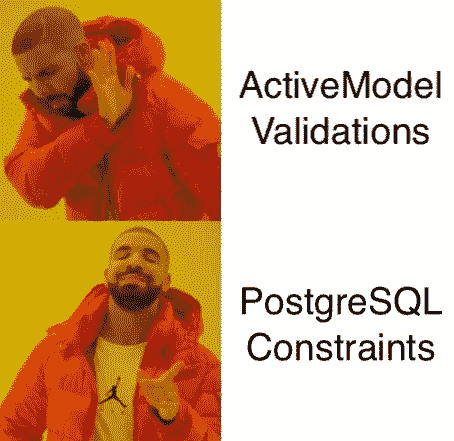

# 为什么应该停止在 Ruby on Rails 中使用 ActiveModel 验证

> 原文：<https://betterprogramming.pub/why-you-should-stop-using-activemodel-validations-in-ruby-on-rails-6099047776e4>

## 关于交换优势的深入指南



图片来自 imgflip

Ruby on Rails 在很多方面都很棒，正如你们中的很多人所知道的，模型中的验证很酷，因为它们简单、实现快速、易于测试。

但是他们也很差劲。

*注意:只有在使用 PostgreSQL 的情况下，本文才是可行的。如果你正在使用 SQLite 或 MySQL，停止。*

# 它们是什么？

验证是像`[validates](https://guides.rubyonrails.org/active_record_validations.html#validations-overview)`、`[validates_associated](https://guides.rubyonrails.org/active_record_validations.html#validates-associated)`这样的方法，它将根据一些逻辑(可以是惟一性、字符串格式或您自己的定制逻辑)检查实例，并允许或不允许它插入数据库。

使用模型验证有很多缺点。让我们一起来看看他们吧！

# 它只在 Rails 层可行

假设您的数据库由几个团队共享。您的数据团队直接插入到您的主数据库中，或者其他系统可以不通过您的 API 与数据库进行交互。因此，您的验证和回调将被绕过，您的数据库中的数据可能对 RDBMS(例如 Postgresql)有效，但对 rails 应用程序无效。它会“悄悄地”瘫痪你的系统。

# 一旦实现了验证规则，就改变它们是不安全的

如果开发人员添加或更改任何验证规则，可能会在新旧数据库规则之间产生差异。以前认为有效的记录现在会被认为是无效的，没有任何警告！这可能会使整个数据库失效，如果数据库进入生产环境，则需要紧急回滚。

“好吧，我看这事可麻烦了。你建议我们做些什么来解决这个问题？”

当然是 PostgreSQL 的约束！

# 一个基本的例子——让我们把手弄脏吧！

## 它们是什么？

应用于数据库模式以插入值的“规则”(如验证)。

让我们看一个简单的例子，看看如何将一个简单的验证规则转换成一个约束。

*   让我们建立一个快速项目来使用这段代码:

```
rails new constraint_example --database=postgresql
```

*   光盘放入其中:

```
cd constraint_example
```

*   对于这个例子，我们需要一个模型。姑且称之为`User`(我知道，多么原创)。

```
bin/rails generate model User email:string age:integer
```

上面的命令应该会创建一个如下所示的迁移文件:

现在发射`bin/rails db:create db:migrate`。这将从迁移中创建数据库和用户表。

让我们来参观一下用户模型！

默认情况下，它应该几乎为空:

```
class User < ApplicationRecord
end
```

我们需要改变它，所以我们所有的用户都有独特的电子邮件。对于 rails 验证，它看起来像这样:

```
class User < ApplicationRecord
  validates :email, uniqueness: true
end
```

这将告诉 rails 在创建或更新一个`User`记录之前检查整个`users`表中的所有电子邮件，看看它是否已经存在。

让我们创造我们的第一个`User`记录吧！

1.启动一个 rails 控制台:`bin/rails c`

2.创建一个简单的用户:`User.create(email: ‘simple@example.com', age: 42)`

3.看看 rails 控制台日志告诉你什么。我们应该有如下所示的日志:

看到第二行了吗？由于我们在`app/models/user.rb`中的验证规则，Rails 将执行一个查询来检查 DB 中是否存在记录。

Rails 发现没有记录被返回，所以它创建一个记录并返回新创建的实例！很好，我们可以说。

当然，这样一个结果的这么少的代码是令人敬畏的！那么，有什么问题呢？

我们有一个查询，每次在没有索引的列上创建或更新新用户时都会启动这个查询。如果您的数据库扩展并接受数百万条`User`记录，这可能会导致`INSERTS`比它们需要的慢很多，因为它们总是在没有索引的列上加上一个`SELECT`。这是第一个问题。

第二个问题是，只有当您试图通过 rails 应用程序创建/更新记录时，才会执行这个查询。如果有其他应用程序会在同一个数据库上创建数据，它们会忽略 rails 验证，因为它们不知道。假设我们直接从数据库中用同一封电子邮件创建第二条记录:

1.  访问您的数据库:`psql -d constraint_example_development`
2.  创建另一个记录:

```
INSERT INTO users (id, email, age, created_at, updated_at) VALUES (2, '[simple@example.com](mailto:simple@example.com)', 25, '2022-09-10 11:19:20.755912', '2022-09-10 11:19:20.755912');
```

由于是在数据库级别，Postgres 绕过了 Rails 层，跳过了 Rails 验证。第二条记录已成功创建。

3.现在，回到 rails 控制台:`bin/rails c`

4.让我们更新我们的第一个用户的年龄！`User.first.update!(age: 53)`

看最后一行:

```
/Users/yorick/.rvm/gems/ruby-2.7.4/gems/activerecord-7.0.3.1/lib/active_record/validations.rb:80:in `raise_validation_error': Validation failed: Email has already been taken (ActiveRecord::RecordInvalid)
```

我们有一个错误告诉我们，该电子邮件是无效的，但我们没有改变它的电子邮件！

Rails 不在乎。

如果只有 rails 拥有数据库的键，并且您从未打算通过 rails 之外的其他方式操作数据，那么 rails 验证是一种“可接受的”方式。

让我们换一种方式尝试一下——使用 PostgreSQL 的约束和索引！

1.  让我们创建一个迁移:`bin/rails g migration AddEmailConstraintToUsers`
2.  对于这样一个简单的例子，我们可以用 rails 的方式:

我知道，我一直在说约束，但是为什么我们在这里用`add_index`？创建一个`unique_constraint`和创建一个`unique_index`是一样的。基于[官方 PostgreSQL 文档](https://www.postgresql.org/docs/current/indexes-unique.html#:~:text=PostgreSQL%20automatically%20creates%20a%20unique,mechanism%20that%20enforces%20the%20constraint.):

> 当为表定义唯一约束或主键时，PostgreSQL 会自动创建唯一索引。索引覆盖了构成主键或唯一约束的列(如果合适，可以是多列索引)，并且是实施约束的机制。

因此，创建唯一约束与创建唯一索引是一样的。

还记得每次我们想要创建或更新记录时，Rails 是如何查询的吗？Postgres 现在也将自己做同样的事情，但由于有了索引，速度会更快。

好了，现在让我们运行迁移！

`bin/rails db:migrate`

看起来我们有一个错误，如下所示:

```
Caused by:
PG::UniqueViolation: ERROR:  could not create unique index "index_users_on_email"
DETAIL:  Key (email)=([simple@example.com](mailto:simple@example.com)) is duplicated.
/Users/yorick/Work/constraint_ecample/db/migrate/20220910115344_add_email_constraint_to_users.rb:3:in `change'
Tasks: TOP => db:migrate
(See full trace by running task with --trace)
```

正如文件[所说:](https://www.postgresql.org/docs/current/indexes-unique.html#:~:text=PostgreSQL%20automatically%20creates%20a%20unique,mechanism%20that%20enforces%20the%20constraint.)

> 当索引被声明为 unique 时，不允许多个表行具有相同的索引值

这意味着我们必须在添加约束之前进行清理。当您希望将来迁移到 PG 约束时，这是您必须考虑的事情

让我们用下面的代码进行清理:

现在，使用`bin/rails db:migrate`启动迁移。

让我们回到`app/models/user.rb`，删除我们添加的验证:

```
class User < ApplicationRecordend
```

现在，让我们回到 Rails 控制台，添加以下代码:

“创建前选择”已消失。

Rails 不再独立进行查询，因为它不再知道这个约束。验证记录创建的工作留给了 Postgres。

为了方便起见，让我们试着验证一下，我们不能用同一个电子邮件创建第二个用户。代码如下:

它仍然引发 ActiveRecord::RecordNotUnique，因为 ActiveRecord 将捕获 PG 的 PG::UniqueViolation

现在，让我们尝试在 PostgreSQL 级别创建一个副本。

1.  启动 psql 控制台:

```
psql -d test_app_development
```

2.尝试创建重复记录:

```
INSERT INTO users (id, email, age, created_at, updated_at) VALUES (1, '[simple@example.com](mailto:simple@example.com)', 42, '2022-09-10 11:19:20.755912', '2022-09-10 11:19:20.755912');
ERROR:  duplicate key value violates unique constraint "index_users_on_email"
DETAIL:  Key (email)=([simple@example.com](mailto:simple@example.com)) already exists.
```

有用！您已经创建了一个简单的约束，它比 Rails 的验证更快、更安全！

# 使用 PG 约束的缺点——以及如何应对它们

我在本文开头提到了 Rails 验证的缺点。现在让我们尝试对 PostgreSQL 约束做同样的事情。

## 它混淆了数据模型的一些关键逻辑概念

要知道一个模型的约束，您必须深入到`schema.rb`中，看看它是否有任何验证。对于大型应用程序，有一个长达一千行并且不太容易理解的`schema.rb`文件是很正常的。

为了补救这一点，我建议将令人敬畏的`[annotate](https://github.com/ctran/annotate_models)`宝石添加到您的宝石档案中的`development`组:

```
group :development do...
  gem 'annotate'
  ...
end
```

然后，跑`bundle install`，紧随其后

```
bin/rails g annotate:install
```

最后运行`bundle exec annotate`，如下图所示:

annotate 有关于模型的注释，非常有用！

`annotate` gem 将跟踪对表的更改，并在表模型的顶部打印一个列、索引和约束的列表。

## 更改约束需要迁移

因为它在您的数据库模式中，所以您不能再通过简单的提交来更改规则，就是这样。您必须创建一个迁移；如果某些数据不符合约束，迁移将会失败。有些人会认为这是使用 PG 约束的一个陷阱，但我会说这甚至更好。

本文以唯一约束为例，但是也可以添加其他约束，比如检查约束、非空约束等等。您可以在官方的 [PostgreSQL 文档中了解更多关于约束](https://www.postgresql.org/docs/current/ddl-constraints.html)的信息。基本上所有可以用 ActiveRecord 验证完成的事情都可以通过 PostgreSQL 约束来完成！

**接下来的**:为什么以及如何在 Ruby on Rails 中去掉`ActiveRecord`回调！敬请期待😁。