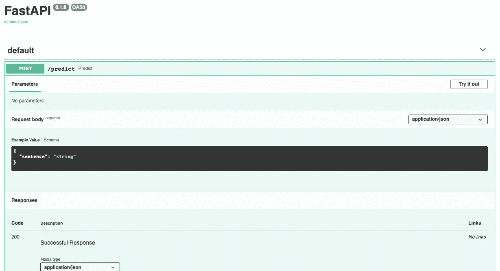
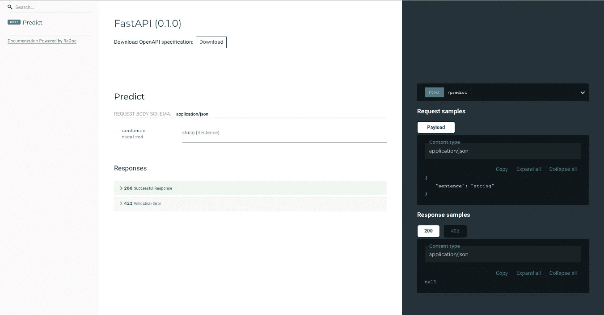
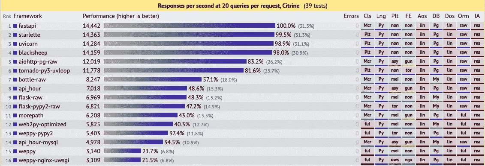

# 为什么应该停止使用 Flask 而开始使用 FastAPI

> 原文：<https://betterprogramming.pub/why-you-should-stop-using-flask-and-start-using-fastapi-1a091bfc2fbf>

## 我发誓你不会后悔的

由[潘卡杰·帕特尔](https://unsplash.com/@pankajpatel?utm_source=medium&utm_medium=referral)在 [Unsplash](https://unsplash.com?utm_source=medium&utm_medium=referral) 拍摄的照片

当谈到机器学习产品时，通常我们会将模型包装到 rest API 中。因为制作机器学习 API 并不真的需要复杂的东西——只需要`predict()`函数——我们通常只用一个简单的框架。而我们通常使用的框架是 Flask。

不要误会:Flask 是好的，但是已经过去了。Flask 被广泛使用的一个原因是，在过去，没有多少人将模型部署为实时生产 API。对于一些人来说，Flask 已经足够好了，因为它很流行，很简洁，而且是用 Python 编写的。

随着时间的推移，机器学习作为一个领域的产生已经成熟。然而，随着这个领域的成熟，原本只是好看的特性已经变得必不可少。而这是 Flask 没有的特性，所以有时候我们不得不使用第三方依赖，有时候文档也不太清楚。

这促使我寻找其他替代方法来创建实时生产 API。最终我找到了一个叫 FastAPI 的 web 框架。FastAPI 对于 Python 来说是一个相对较新的 web 框架，但是功能强大，使用起来也很愉快。以下是一些你应该开始使用 FastAPI 的理由。

# 证明文件

FastAPI 有非常广泛的文档和丰富的例子，这使得事情变得更容易。如果你需要寻找与 FastAPI 有关的东西，你通常不需要去别的地方找。

此外，FastAPI 将从我们正在运行的程序中自动生成交互式 API 文档，因此我们不需要编写我们自己创建的 API 文档。

众所周知，编写 API 文档是很烦人的，不仅因为有很多细节要处理，还因为没有什么比最终用户实现但不符合文档更令人沮丧的了。所以 API 文档的自动生成很有帮助。

下面是 API 文档的显示示例(由 [Swagger UI](https://github.com/swagger-api/swagger-ui) 提供):

还提供了替代的自动文件(由 [ReDoc](https://github.com/Rebilly/ReDoc) 提供)

# 表演

顾名思义，这确实是一个 FastAPI。根据来自 [TechEmpower benchmarks](https://www.techempower.com/benchmarks/#section=test&runid=7464e520-0dc2-473d-bd34-dbdfd7e85911&hw=ph&test=query&l=zijzen-7) 的数据，FastAPI 在性能方面击败了所有框架，而最常用的框架，如 Flask 和 Django，则落后了。

框架性能—T [echEmpower](https://www.techempower.com/benchmarks/#section=test&runid=7464e520-0dc2-473d-bd34-dbdfd7e85911&hw=ph&test=query&l=zijzen-7)

是啊，非常快。

# 异步的

Flask 的缺点之一是缺乏异步 I/O 支持。异步对于 HTTP 端点非常重要，因为 HTTP 端点往往需要等待大量的 I/O 和网络聊天，这使得它成为使用异步的并发的一个很好的候选对象。

与 Flask 不同，FastAPI 使用`async` / `await` Python 关键字支持开箱即用的异步代码。FastAPI 默认支持异步，这意味着我们不需要使用第三方框架来做异步。

你所要做的就是用`async`关键字声明端点，就像这样:

异步代码

# 完全

Flask 的另一个缺点是提供的功能不完整，所以我们经常要安装互不合作的社区的第三方扩展。通常，我们必须手动添加定制代码。

我在使用 FastAPI 的时候没有这种感觉，因为所有东西都是默认安装的。但是如果你不同意我的观点，可以分享一下你的经验。

# 确认

除了已经提到的特性，还有另一个很好的特性，即验证。为了定义创建的模式，它使用了 [pydantic](https://pydantic-docs.helpmanual.io/) ，这是另一个用于数据验证的很棒的 Python 库。它的目的是验证进入 FastAPI 的输入。如果输入/请求不正确，则将返回相应的错误代码。

[https://gist . github . com/fahmisalman/EC 5b 6 e 6 e 20 df 68 e 17 a 365 c 9428 a 66d](https://gist.github.com/fahmisalman/ec5b6e6a6e20df68e17a365c9428a66d)

# 结论

总之，FastAPI 是一个快速的 web 框架，支持异步代码。此外，它还配有非常完整的文档和集成的验证系统，使其更易于使用。

你对使用 FastAPI 感兴趣吗？如果你想开始使用 FastAPI，这里有一些很好的资源。这里有一些你可以探索。

 [## 第一步- FastAPI

### 最简单的 FastAPI 文件可能是这样的:将它复制到 main.py 文件中

fastapi.tiangolo.com](https://fastapi.tiangolo.com/tutorial/first-steps/)  [## FastAPI 简介

### FastAPI 是一个现代、快速(高性能)的 web 框架，用于基于标准 Python 使用 Python 3.6+构建 APIs

medium.com](https://medium.com/@tiangolo/introducing-fastapi-fdc1206d453f)