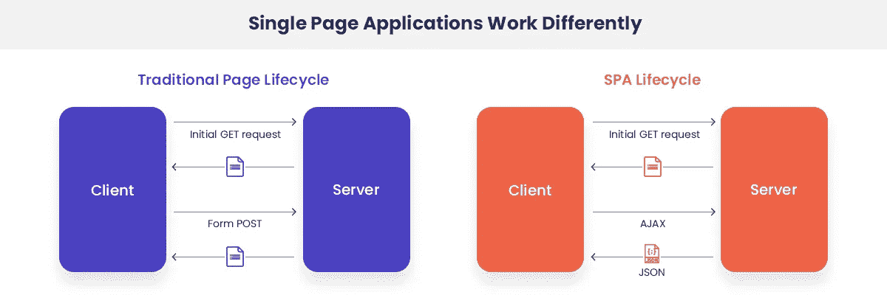
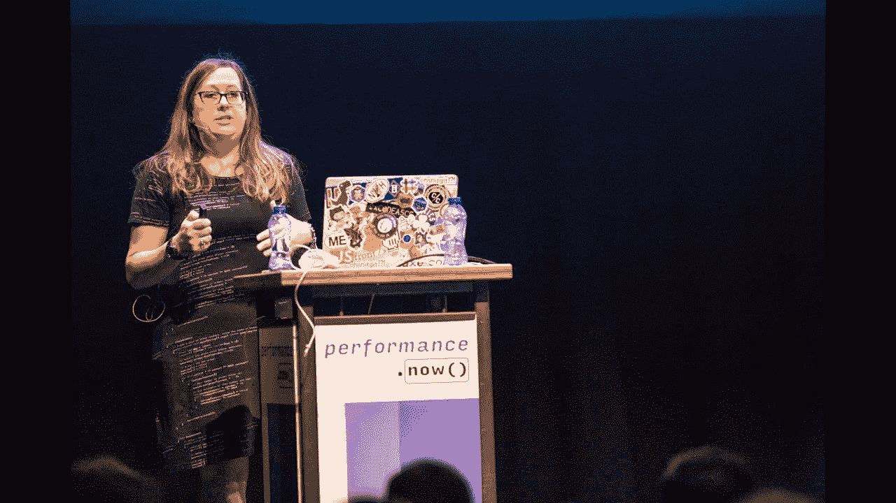
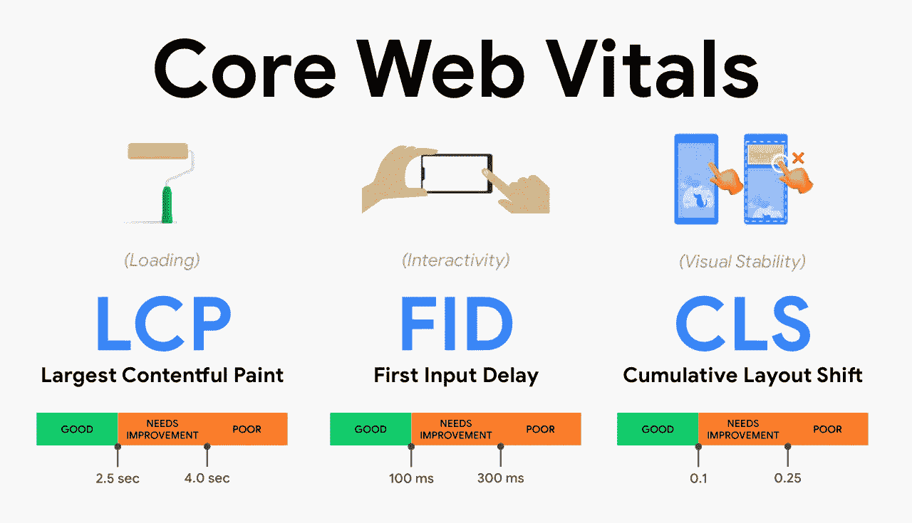
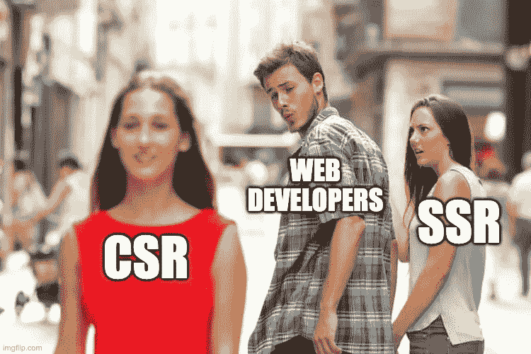
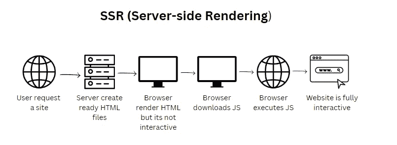
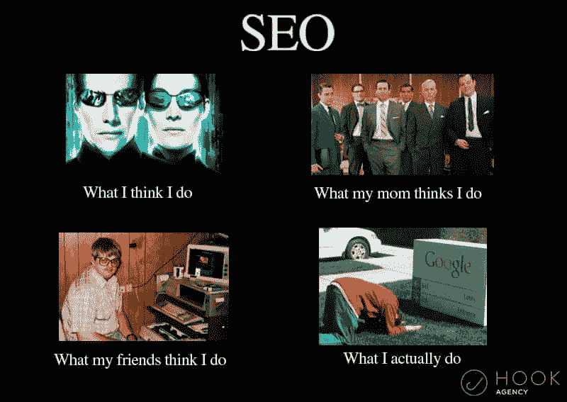
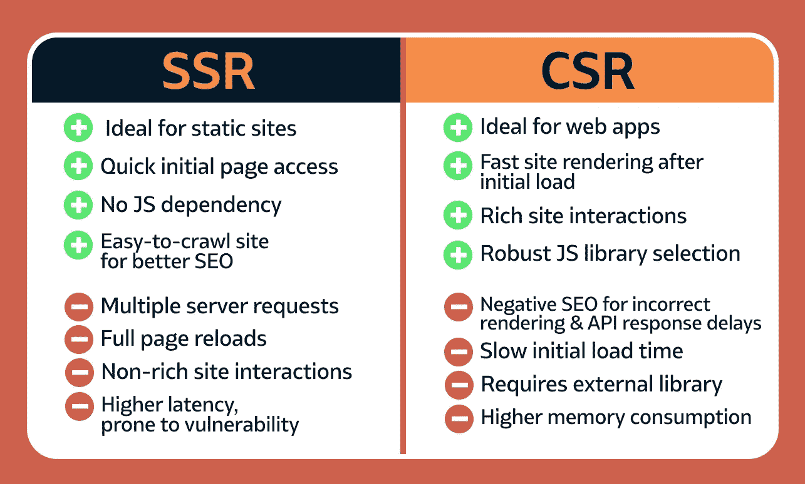
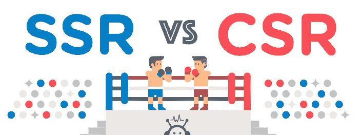
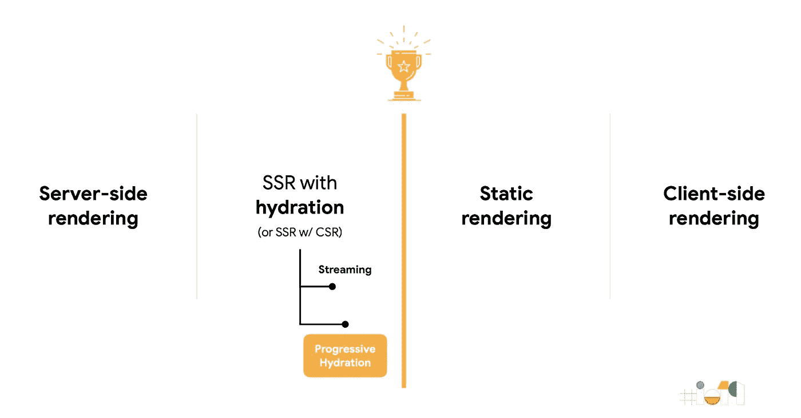
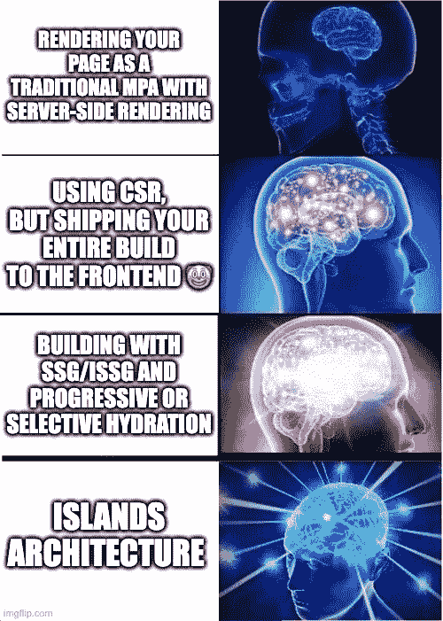

# 为什么你应该使用岛屿架构

> 原文：<https://betterprogramming.pub/why-you-should-use-islands-architecture-b4f291708a02>

## 对前端开发未来的一瞥


静态 HTML 海洋中的动态 JS 岛。[原始来源](https://www.fodors.com/news/photos/11-philippines-islands-that-should-be-on-your-bucket-list)

2013 年，脸书支持的 React 进入了 web 开发领域，改变了我们呈现 web 应用程序的方式。开发人员可以使用 React 创建单页面应用程序(spa)并在客户端呈现它们，而不是在服务器上呈现页面并将它们发送到客户端。随着像 React 这样的工具越来越受欢迎，客户机呈现的 SPAs 很快取代了它们的老亲戚，服务器呈现的多页面应用程序。

这种方法革新了现代前端设计。然而，它并不是没有性能缺陷。当像 React、Vue 和 Angular 这样的 SPA 框架开始统治 web 时，狡猾的小 bug-as-features 和糟糕的做法溜进了大多数新应用程序，并变得更糟。



spa 推翻了传统的服务器渲染的 MPAs。[来源](https://www.excellentwebworld.com/what-is-a-single-page-application/)

在 2019 年的一次会议上，Etsy 前端建筑师凯蒂·西勒-米勒提出了岛屿建筑的想法。Islands Architecture 通过将静态内容加载到服务器上的 HTML 中，同时利用服务器和客户端来呈现应用程序，但是为交互式区域创建占位符，稍后由客户端使用 JavaScript 进行补充。作为一名开发人员，我确信这个想法将催生下一代前端框架。



凯蒂·塞勒-米勒在演出上讲话。[来源](https://www.youtube.com/watch?v=qts9gPYoANU)

## 先决条件

在我们深入研究 web 架构之前，让我们先来看看一些重要的关键术语。

1.  最大内容绘画(LCP) —这是加载页面主要内容所需的时间。
2.  首字节时间(TTFB) —这是加载时响应的首字节从服务器到达浏览器所需的时间。
3.  第一个内容绘制(FCP) —这是第*个*内容呈现在页面上所花费的时间。
4.  第一次输入延迟(FID)——这是当用户*第一次*与网页交互时，网页响应所需的时间。
5.  互动时间(TTI) —这是网页在其主要资源加载后变得可靠互动所需的时间。



核心网站是 LCP、FID 和 CLS。[来源](https://akshayranganath.github.io/Understanding-And-Using-Core-Web-Vitals/)

最有内容的绘画和第一次输入延迟都被认为是核心网站的要害(第三个是 [CLS](https://web.dev/vitals/) )。如果网页的主要内容加载时间少于 2.5 秒(LCP)，则认为该网页是高性能的。第一个内容的加载时间(FCP)和第一个字节从服务器到达的时间(TTFB)与 LCP 直接相关。

网页的第一次输入延迟应该保持在 100 毫秒以下，以保持良好的用户体验。这一指标直接受到主要资源中的交互性加载和可靠工作所需时间的影响(TTI)。

本文中讨论的关于架构的决策涉及权衡。一个页面可能加载得更快(更好的 FCP/TTFB/LCP)，但需要更长的时间才能变成交互式的(更高的 TTI/FID)，反之亦然。

# 我们是如何来到这里的

从根本上说，这一 SPA 收购是由早期 web 服务器端呈现(SSR)模式中预先存在的问题促成的。SSR 在 web 开发的早期风靡一时。老实说，当时没有太多选择。有了 React 和其他 SPA 框架，客户端呈现(CSR)成为处理网页中 JavaScript 的新的主导方式。



服务器端渲染被搁置了。

我们正在走出一个神奇药丸解决方案的时代，在这个时代，每个人都希望答案是坚定、明确和简单的。CSR 提供了一种避免不断向服务器发送 pings 和整页重载的方法，但它也带来了一系列问题。现实和网络架构往往需要比我们所希望的更多的细微差别。让我们来看看 SSR、CSR，看看我们能否解开每种方法中隐藏的问题。

## 服务器端呈现(SSR)

在我们深入客户端渲染之前，让我们先来看看 SSR。服务器端呈现是交付 web 内容的久经考验的版本。使用 SSR，整个 HTML 网页在服务器上生成，然后发送到请求页面的客户端。这意味着呈现视图的逻辑在服务器上执行。如果需要来自数据库或第三方 API 的数据，则在交付页面之前，会在服务器上处理这些数据。



在 SSR 中，服务器处理构建前端的逻辑。[来源](https://www.tothenew.com/blog/server-side-rendering-vs-static-site-generation-in-next-js/)

这意味着在从服务器收到响应后，客户端浏览器只需处理很少或不需要处理 JavaScript。应用程序逻辑的繁重工作已经完成——服务器为客户端完成了这项工作。

## 客户端渲染(CSR)

客户端呈现采用了不同的方法。有了 CSR，服务器在网页渲染中就退居二线了。呈现应用程序的逻辑(包括获取或路由)被委托给前端。如果您曾经使用 ReactDOM 将整个 React App 组件附加到单个`<div>`或`<main>`标签，那么您已经使用 CSR 构建了应用程序。

```
// Forcing the browser to do all the work, huh?
const root = ReactDOM.createRoot(document.getElementById('root'));
root.render(<App />); 
```

在 CSR 中，大量的 JavaScript 可以被运送到客户端。将整个应用程序的逻辑放到浏览器中并不少见。这在前端教程视频中也很常见，这些视频没有突出 CSR 的优化技术。

# SSR 与 CSR

那么，SSR vs CSR，哪个更好呢？尽管这两种方法在一些比较点上显示了它们不同的优势，但两者都有权衡。

## 搜索引擎优化

构建 web 应用程序时，搜索引擎优化是一个重要的考虑因素。毕竟，你不会为了让代码看起来漂亮而建立一个网站，并在 Github repo 中收集灰尘。你建立了一个工具供其他人使用，人们找到你的工具的一个主要途径是通过搜索引擎。



不优先考虑 SEO，就没有用户。[来源](https://hookagency.com/blog/seo-content-marketing-memes/)

如果你的网站没有进行搜索引擎优化，你会发现用户流量比其他情况下少得多。默认情况下，通过 SSR 呈现的应用程序是搜索引擎优化的；服务器呈现的网站很容易被搜索引擎解读。而 CSR 则不然。客户端呈现的应用程序不会从服务器呈现的应用程序加载发送。浏览器在处理页面时会加载页面的各个部分。有时，这会导致内容被网络爬虫遗漏。虽然有变通办法，但大多数 CSR 应用程序并没有针对搜索引擎进行高度优化。

## 装货

在 SSR 和 CSR 之间有一个明显的负载权衡。每一个都在特定领域胜过另一个。

SSR 在呈现初始页面方面非常出色。当用户请求您的站点时，服务器将构建 HTML 表示，然后将其发送回客户端浏览器。如果您有一个包含大量逻辑和元素的复杂应用程序，SSR 会大放异彩。在这种情况下，FCP 和 TTI 的下载量大幅下降(初始内容加载和初始交互性都达到得更快)。

然而，当用户决定继续与网页交互时，SSR 就没有了。最初的负荷是它的决定性时刻。当用户浏览您的站点时，将会出现对下一个页面的服务器执行 ping 操作的相同过程，这意味着加载任何页面都和加载第一个页面一样痛苦。



CSR 和 SSR 有不同的优势——这不是一个非此即彼的决定。[来源](https://www.growth-rocket.com/blog/a-closer-look-at-client-side-server-side-rendering/)

CSR 颠倒了这个脚本:由于 CSR 将大量 JavaScript 加载到浏览器中，特别是在没有尝试优化的情况下，网页的初始加载在计算时间上可能会非常慢。然而，因为整个网站被发送到客户端，包括网站的可导航路线(这是使其成为“单个页面”)的原因，所以当用户在网站的各个页面之间移动时，将享受更平滑的体验。

此外，在服务器过载或网络运行缓慢的情况下，SSR 也可能增加包含 HTML 页面的初始响应的时间(更高的 TTFB)。这可能会抵消其从下 FCP/TTI 的收益。

## 交互性

因为服务器处理 SSR 中的应用程序逻辑，所以交互可能是昂贵的。每当用户希望与纯粹由服务器提供的应用程序进行交互时，浏览器就必须与服务器进行通信。不断向后端发送 pings 命令并重新加载整个页面来处理交互性，尤其是在基础设施已经超负荷的情况下，会导致处理用户请求的延迟。毕竟，页面是由服务器构建的。如果内容发生变化，网页需要重建，整个页面可能需要重建。

另一方面，CSR 很好地处理了大多数交互性。应用程序逻辑在前端处理——服务器不需要 ping 来处理每一个用户交互。然而，这种模式也有缺点。最初可能不会将数据加载到页面中，而是在用户与页面交互时请求数据。这需要 pings 服务器，这可能会增加用户交互的加载时间。

# 增加渲染的独创性

真正的问题不是“SSR 还是 CSR？”相反，我们应该问“为什么不两者都要呢？”如果这两种方法都有优点，我们可以找到一种方法来结合它们的优点，创造出全新的、改进的工具。



不一定要吵架。[来源](https://medium.com/walmartglobaltech/the-benefits-of-server-side-rendering-over-client-side-rendering-5d07ff2cefe8)

显然，用纯 JavaScript 或 JSX 将整个前端交付给浏览器是不明智的做法，尤其是对于大型应用程序。将所有的代码和所有的依赖打包并把这些逻辑推到浏览器上是没有效率的，浏览器必须构建一个实际的 HTML 网页。

让服务器构建整个页面显然也不是最高效的。当每次用户交互都需要返回到服务器时，你就没有充分利用现代浏览器的全部功能，而且不耐烦的用户也不太可能在每次想要切换页面时等待响应。

那么，为什么不把这两种方法结合起来呢？如果我们充分利用 SSR 和 CSR 的优势，通过用一方的优势覆盖另一方的弱点来最小化各自的缺点，我们就可以找到一种同时战胜两者的方法。



通过结合 SSR 和 CSR 获得两个世界的最佳效果。[来源](https://www.patterns.dev/posts/rendering-patterns/)

开发者就是这么做的。水疗出现后，涌现出多种新方法，试图利用每种方法的最佳部分。静态生成在构建站点时创建一个预定义的 HTML 页面，并根据请求立即提供该页面。流式 SSR 允许服务器构建网站，但将其响应流式传输到浏览器，以获得更快的 FCP 和 TTFB。选择性水合(如 React 18 中)允许服务器构建整个页面，然后让客户端回溯以选择性水合交互性节点。然而，最新和最具创新性的方法是岛屿建筑。

# 岛屿建筑

Islands 架构背后的想法很简单——在服务器上呈现 HTML 页面及其静态内容，并在页面内为动态内容创建占位符。这些占位符(或“岛”)然后可以由客户选择性地水合。更好的是，客户机可以使用服务器在这些占位符中呈现的初始 HTML。HTML 主干与随岛屿一起发送的脚本混合在一起。



我不是说有正确的方法，但是…

如果您没有意识到这一点，这意味着实际上只有很少的 JavaScript 被发送到客户端。您避免了 CSR 的一个常见陷阱——您不需要将整个前端逻辑都传送到浏览器。服务器能构造什么——它就构造什么——剩下的留给 HTML 框架和脚本。这意味着您可以从服务器端渲染获得更低的 LCP 和更低的 TTI，从使用 CSR 构建的 spa 获得更快的交互性和导航。

所有这些动态区域都是独立的。一个地区的性能问题不会影响其他地区的性能。这样，这些岛屿就像是它们自己的应用程序。这是看待应用程序的一种全新方式，性能优势几乎还没有被发现。只有少数框架已经开始采用这种思想。


Astro 提供了利用岛屿架构的现成方法。[来源](https://blog.logrocket.com/understanding-astro-islands-architecture/)

有 Marko，一个由易贝开发的框架，一旦准备好就将静态内容流式传输到浏览器，并且只提供带有动态岛的水合代码。或者您可以探索 Astro，它是框架不可知的——您可以将它与 React、Vue、Svelte 等等一起使用。Astro islands 允许您使用如下简单的代码片段来指示哪些组件是客户端加载的:

```
<MyComponent client:load />
```

对于其他运行时环境，也有其他的框架。一个很好的例子是 Fresh，它是 Deno 的一个前端框架，专门针对孤岛架构而构建。我真的相信这些框架，以及它们的性能优势，将会迅速改变前端开发生态系统。

如果您想了解更多关于前端架构的知识，我强烈推荐您浏览一下 [patterns.dev](https://www.patterns.dev/) ，它会更深入地探讨这些主题。