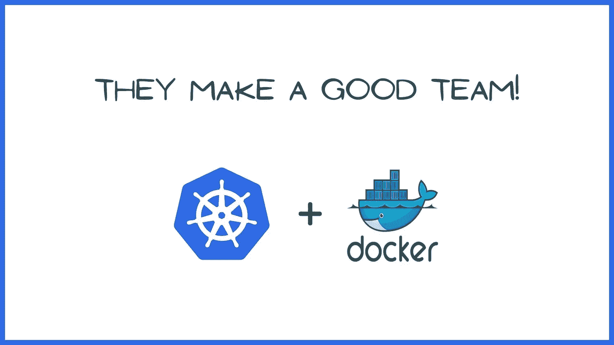
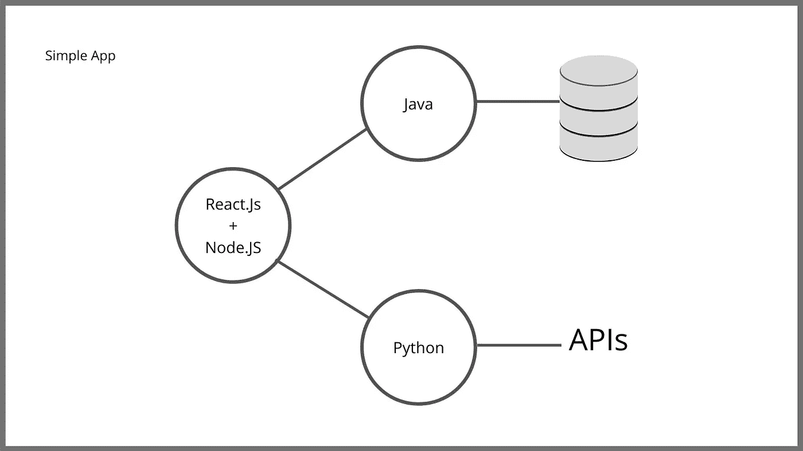
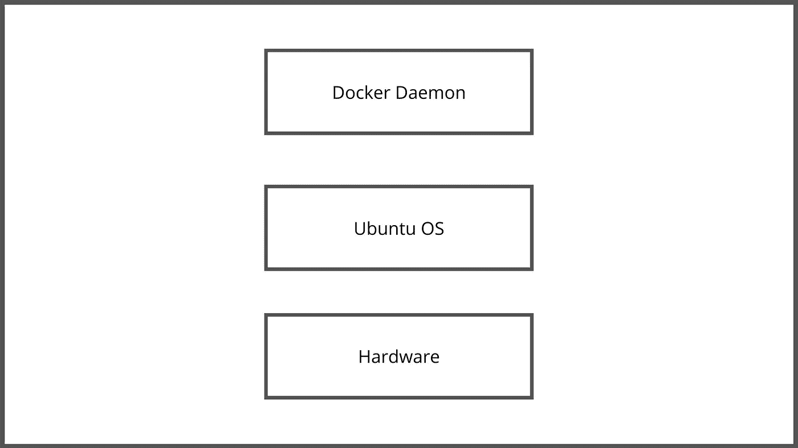
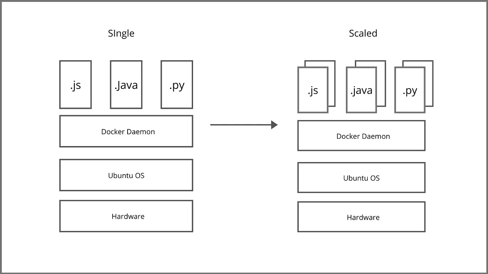
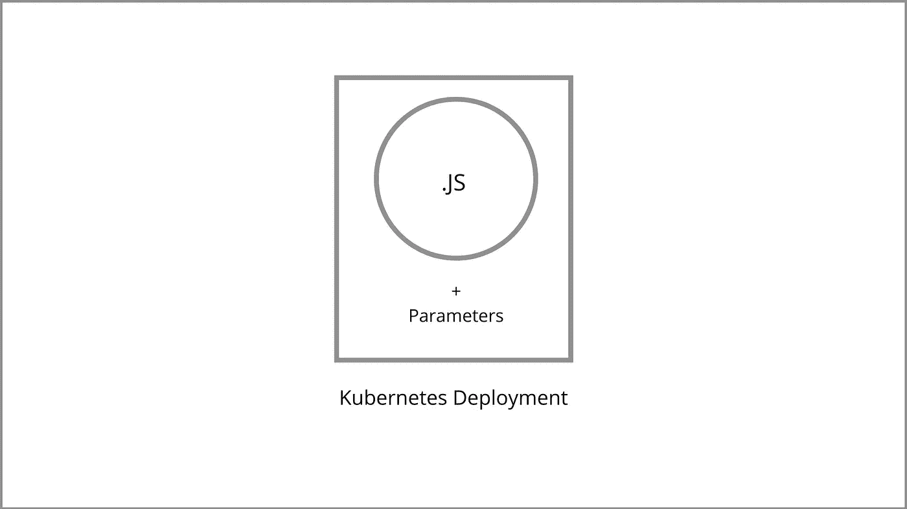
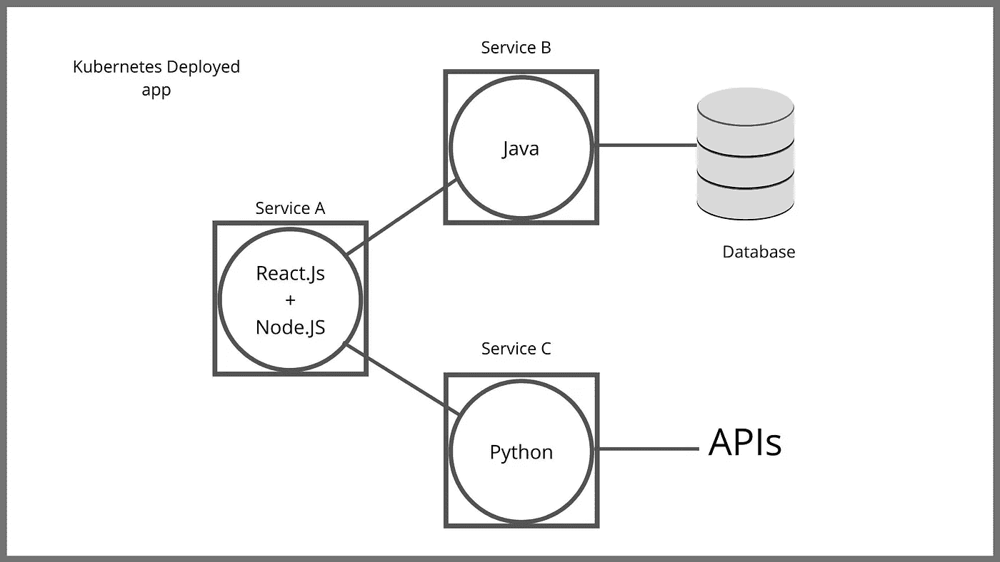

# 为什么你应该一起使用 Kubernetes 和 Docker

> 原文：<https://betterprogramming.pub/why-you-should-use-kubernetes-and-docker-together-4e43c13b2e26>

## 这不是选择一个而不是另一个

作者照片。

我似乎总是遇到的一个问题是应该使用 Docker 还是 Kubernetes。我认为有一个小小的误解，你必须使用其中一个。为什么不两个都用？我的意思是，Kubernetes 不仅允许您使用现有的 Docker 容器和工作负载，而且还使您能够解决在扩展时遇到的一些复杂问题。

为了更好地回答这个问题，我们将从一个简单的云原生应用程序开始。让我们假设这个应用程序的前端是用 Node.js 支持的 React 编写的，我们使用 Java 进行数据库访问。对于访问外部 API，也许我们将使用 Python 来允许我们服务 rest 端点。

作者照片。

部署此应用程序的纯 Docker 方法需要将应用程序移动到某个服务器堆栈。这个服务器堆栈将有硬件、操作系统(Ubuntu)和安装在该操作系统之上的 Docker 守护进程。这将使我们能够旋转集装箱。Docker 提供了几个很棒的工具来处理我们的容器化应用程序。

作者照片。

因此，一旦我们使用这些应用程序并从中创建 Docker 容器，我们将进入命令部分。我们将执行`docker build`、`docker push`到注册表，SSH 到堆栈，然后最后执行`docker run`甚至`docker-compose`来启动我们的容器。通过使用 Docker 和它提供的工具，简单的部署变得非常容易。

现在，让我们继续扩展各个部分，以利用 Docker 提供的所有资源。我们可以根据需要将它们向外扩展任意多次，但是在本文中，我们假设我们向外扩展了两次。

作者照片。

想象一下，我们的应用程序开始获得更多的负载。越来越多的人点击它，我们最终需要扩大规模，以便能够提供更好的用户体验。DevOps 工程师的第一反应将是创建新的硬件，并多次进行相同的部署，因为他们已经有了构建该堆栈的脚本。

这可能会因为许多原因而失败。当您开始进行扩展时，DevOps 工程师将不得不编写脚本来单独扩展组件(因为这是基于微服务的应用程序的优势之一)，并找到最有效的方式来响应负载。他们还必须尽可能高效地识别和解决用户体验问题。

一个很好的例子可能是当你的开发团队必须创建一个新的微服务来支持一个新的需求。DevOps 工程师将不得不找出在哪里将它们组合起来——特别是如果你已经有效地利用了硬件的话。

这就是像 Kubernetes 这样的编排工具的用武之地。Kubernetes 将允许您使用现有的 Dockerized 应用程序，但也编排它们，更有效地利用您的服务器和空间。在下图中，方框代表一个服务器堆栈。但是在 Kubernetes 的土地上，它们是工蜂节点:

作者照片。

我们将在这些工作节点的每一个上安装 Kubernetes，中心节点是主节点。这个主节点连接到所有工作节点，并决定在哪里托管 Docker 容器，如何将它们组合在一起，甚至管理编排(即启动、停止、更新等)。).

我想简单介绍一下 Kubernetes 提供的三个主要优势。它们是部署，使开发更容易，并提供监控工具。正如所料，第一步将是部署。回到我们的应用程序架构，假设我们要部署 React 应用程序大约十次。所以我们会说我们需要十个实例，每个实例预计消耗大约 128 兆字节。当我们把它打包时，我们得到的是一个 Kubernetes 部署。请记住，您可以在部署之前向 Docker 容器添加更多参数。

作者照片。

Kubernetes 部署不是一次性的事情。它是与应用程序一起成长、一起生活、一起呼吸的东西——整个堆栈。如果 React 应用程序发生崩溃，Kubernetes 将自动重启它，返回到我们第一次创建该部署时确定的状态。因此，部署总是在增长，并且总是与我们的应用程序共存。我相信您会同意我的观点，除了可伸缩性之外，这种部署更容易。

Kubernetes 如何处理开发？一旦我们为每个单独的服务创建了部署并将其全部横向扩展，您会注意到我们有许多不同的微服务，它们具有不同的端点。例如，如果我们的前端需要访问数据库，可能会有十个不同的 Java 应用程序实例与数据库进行对话。在这种情况下，Kubernetes 为我们横向扩展的所有微服务部署负载平衡。此外，它利用服务注册和发现功能，允许我们的应用程序使用称为 Kubernetes 服务的东西相互通信。因此，对于每一个部署，Kubernetes 还将创建一个服务(比如服务 A、B 和 C)。简而言之，这些应用程序现在只需使用这些服务名就可以相互通信。

作者照片。

我最后想谈的是监控。Kubernetes 有很多内置功能，允许您在简洁的 UI 中查看日志和 CPU 负载。这些都很酷，但事实是您可能希望在您的应用程序中看到这一点。开源社区已经开发了几个工具，让您对正在运行的应用程序进行自省。我考虑的主要是 Istio。Istio 本身是一个很大的主题，我将在以后的文章中讨论，但是现在，值得注意的是，当涉及到监控时，它很方便。

# 结论

这不是在 Kubernetes 和 Docker 之间选择的问题。这是其中一个互相补充的例子。Kubernetes 允许您利用现有的 Docker 工作负载，大规模运行它们，并处理真正的复杂性。

Kubernetes 是一个很好的入门工具，即使你正在开发一个小的应用程序，并打算在未来进行扩展。如果您已经在应用程序中利用了 Docker 和 containers，那么将它们迁移到 Kubernetes 可以帮助您解决几乎每个应用程序在扩展时都会遇到的一些操作开销。