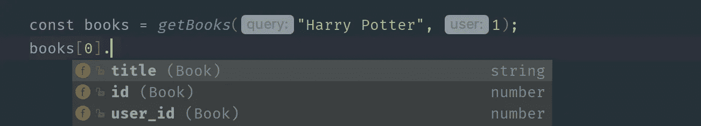
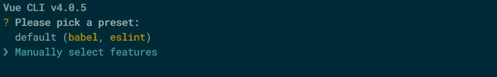
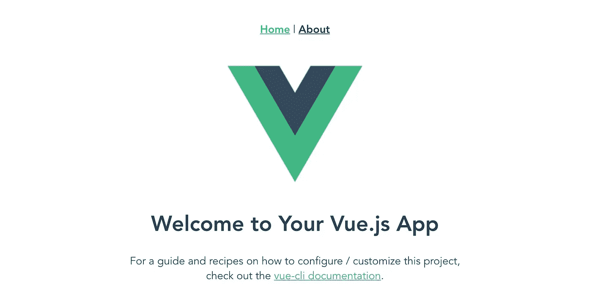

# 为什么应该在 Vue 中使用 TypeScript

> 原文：<https://betterprogramming.pub/why-you-should-use-typescript-with-vue-33f4942e03c9>

## 编写好的类型脚本代码比编写好的 JavaScript 代码更容易


Matthew Fournier 在 [Unsplash](https://unsplash.com/s/photos/coding?utm_source=unsplash&utm_medium=referral&utm_content=creditCopyText) 上拍摄的照片

# 为什么使用 TypeScript

静态类型语言很棒。考虑下面这个普通 JavaScript 的例子。

这段代码很难理解，原因如下。

*   没有办法知道`query`和`user`参数需要是什么类型。`user`参数可以是一个用户对象或者一个表示用户名的字符串——或者其他什么东西。
*   没有办法知道函数返回什么数据类型。它返回一个数组，但它是字符串、对象还是图书 id 的数组呢？

用普通 JavaScript 表达这一点的唯一方式是通过注释。

让我们使用 TypeScript 重写这段代码。

首先，我定义一个类`Book`，每本书都有一个`id`、一个`user_id`和一个`title`。

接下来，我指定`query`参数是一个字符串，而`user`参数是一个数字。该函数返回书籍数组。

因为我指定了这一点，所以我的 IDE 可以完成一些惊人的自动完成功能。



希望你相信 TypeScript 是令人惊奇的。让我们深入了解如何设置 Vue TypeScript 项目！

# 创建 Vue 项目

为了创建项目，我将使用 Vue CLI。这是官方的命令行界面，使得创建一个新的 Vue 项目更加容易。

```
npm install -g @vue/cli
```

我现在可以用一个简单的命令创建项目。

```
vue create my-project-name
```

确保在提示中选择“手动选择功能”。



对于这个项目，我将只使用 TypeScript 和 Router 特性。

## 类样式组件语法

当询问我是否想使用`class-style component syntax`时，我选择是。

通常每个 Vue 组件都会导出一个 JavaScript 对象，如下所示:

然而，当使用类样式组件语法时，每个 Vue 组件将导出一个类而不是一个对象。`HelloWorld`组件看起来应该是这样的:

就个人而言，我觉得这种语法更简洁。

# 查看您的 Vue 应用

为所有其他设置选择默认值。安装向导完成后，运行`npm run serve`启动开发服务器。前往`localhost:8080`查看 Vue 应用程序！



这就是全部了。多亏了 Vue CLI，一切都开箱即用。我仍然做着调试我的 Webpack 配置文件的噩梦，所以 CLI 是一个真正的救命稻草。