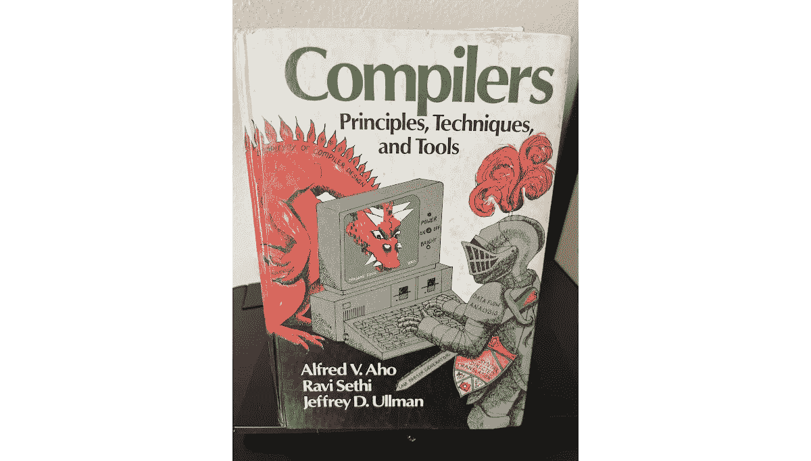

# 为什么应该编写上下文驱动的脚本语言

> 原文：<https://betterprogramming.pub/why-you-should-write-a-context-driven-scripting-language-6714581e98b4>

## 有时候，摆脱代码复杂性的最佳方式是深入研究。


阿诺·弗朗西斯卡在 [Unsplash](https://unsplash.com?utm_source=medium&utm_medium=referral) 上的照片

亲爱的读者，你是否曾陷入定制陷阱？

**示例 0:** 您向数据库中定义了范围的输入字段添加自定义范围检查。人们很高兴。直到他们想要由另一个字段有条件地定义输入的范围。

**示例 1:** 您创建了一个设置页面，为免费和高级帐户加载不同的设置。“太好了，这正是我们想要的。”当然，有些设置需要根据用户拥有活动会话的设备类型来显示。

我可以无限地继续下去。关键是你或你的团队让你的前端越灵活，就需要越多的灵活性。特征产生更多的特征。也许儿童读物《如果你给一只老鼠一块饼干》实际上是关于功能蠕变和软件膨胀的。


这张图片是**从出版商的网站上拉过来的**，而**把**放在这里。(哈哈 Vim 笑话)。反正链接到它的所有者是[在这里。](https://www.mousecookiebooks.com)

这就是你曾经简单优雅的代码库:膨胀。你也许可以写一堆不同的 UI 组件，并在它们之间切换。或者，您可以在单个 UI 中填充如此多的特殊情况，以至于无法工作。无论你选择什么毒药，都是你自己要吞下去的。

# 上下文驱动的脚本语言

如果你读了标题，我假设你已经推导出了这个论点:上下文驱动的脚本语言可以让你的代码更加灵活，同时减少代码膨胀和复杂性。

但是什么是上下文驱动的脚本语言(CDSL)？嗯，是我自己编的一个术语(编术语是所有软件工程师的神圣权利)。其定义如下:

> 上下文驱动脚本语言(CDSL)是一种小型语言，通常不是 Turing complete，它可以访问一组预定义的值(上下文)以生成输出。


图片由[gandalfurchard](https://www.fiverr.com/gandalfhardcore)提供。版权所有马库斯·哈伯林 2022。机器人是脚本引擎，驱动和绑定它的上下文是插件。我的隐喻超越了文字。

# 使用 CDSL 的示例 0

因此，CDSL 可以访问设置页面上每个字段的值，它使用这些值来输出范围检查错误消息，或者如果当前字段有效，则输出空字符串。CDSL 将这些格式化代码放在其他地方，这些代码之前已经融入了用户界面的其他部分。可能是数据库。让我们来看看这给你带来的好处。

1.  **代码可读性:**通过将这种验证逻辑从您的前端代码中去掉，您可以消除许多困扰前端开发的特殊情况。
2.  **灵活性:**记住，在例 0 中，我们之前已经添加了代码来进行范围检查验证，当我们的新需求到来时，我们将不得不重写旧系统或者创建一个并行系统。对于 CDSL，唯一更改的代码直接对应于您正在更改的字段行为。
3.  **代码可重用性:**一旦 CDSL 的解释器就位，它执行的代码就可以在你支持的多个平台上使用。更改我们领域的验证代码会改变我们支持的不同前端:移动、Web 等。我们也可以使用相同的代码在后端进行二次验证。在 UI 和 API 层提供验证是一个常见的需求。
4.  **快速部署:**因为验证逻辑不再是您代码库的一部分，所以您可以在版本化部署之外更新应用程序的行为。对于手机应用，这意味着绕过苹果和安卓的审批程序。

# 编写上下文驱动的脚本语言

一般来说，谈论编写脚本语言几乎是不可能的。那更适合作为教科书而不是文章。然后让我们特别讨论一个 CDSL。要写这个 CDSL，我们需要坚持几个原则。

# 我们 CDSL 的原则

**前缀表示法:**有时称为波兰语表示法，前缀表示法处理起来非常简单。在前缀表示法中，运算符位于操作数之前。

```
Eg: 3+4/5 turns into +3/45.
```

注意前缀符号没有运算顺序。这是它带给我们的最大简化之一。前缀表示法也可以认为是*函数*表示法。



不，我们不是在写编译器，这毕竟是一种脚本语言。但是这篇课文还是有用的。在撰写本文时，你仍然可以在亚马逊上花 11 美元买到一本二手的经典编译器教科书。

**没有空格:**我们的脚本应该能够在没有空格和最少数量的控制字符的情况下编写。这将有助于我们编写小脚本，尤其是当只需要一个条件语句时。

**纯功能:**我们的脚本不应该修改任何状态。因此，我们应该使语言成为纯粹的函数式语言。

# 我们 CDSL 的语法

我们需要为我们的语言建立一个语法，稍后我们将需要解析这个语法并标记我们的脚本。人们已经将词汇化这个术语涂抹到了计算机科学的其他部分，所以称之为[词法分析](https://en.wikipedia.org/wiki/Lexical_analysis#:~:text=In%20computer%20science%2C%20lexical%20analysis,assigned%20and%20thus%20identified%20meaning).)可能更好。无论哪种方式，我们都将完成使用正则表达式定义和标记的任务。**警告:**如果你对正则表达式有困难，(别再骗自己了，你*确实*对正则表达式有困难)那么请查看 Regex101。我写了一篇关于它的文章[在这里](/meet-regex101-the-vital-software-tool-youre-not-using-24aa93518db4)。


照片由 [Shubham Dhage](https://unsplash.com/@theshubhamdhage?utm_source=medium&utm_medium=referral) 在 [Unsplash](https://unsplash.com?utm_source=medium&utm_medium=referral) 上拍摄

## 经营者

```
? <condition> <true return> <false return> | If-Else Statement
= <left hand side> <right hand side>       | Equality
! <argument>                               | Not
> <left hand side> <right hand side>       | Greater Than
< <left hand side> <right hand side>       | Less Than
+ <left hand side> <right hand side>       | Addition
- <left hand side> <right hand side>       | Subtraction
* <left hand side> <right hand side>       | Multiplication
/ <left hand side> <right hand side>       | Division
% <left hand side> <right hand side>       | Modulus (Remainder)
| <left hand side> <right hand side>       | Logical Or
& <left hand side> <right hand side>       | Logical AndNote: Logical operators will treat any non-zero number as zero, there is no boolean number type.
```

## 数据类型

**整数:**这个 CDSL 只有整数值。如果您在实现自己的浮点数时需要浮点数，那就这样吧。现在，整数就可以了。我们将在所有的整数前面加上#字符来表示它们。

```
#[-]?[0-9]+
```

**Strings:** 如果我们要解决示例 0 中的问题，我们将需要输出字符串值。简单的双引号符号就可以了。我们可以用反斜杠来转义双引号。

```
"((\\[\\,"])|[^",\\])*"
```

**插值字符串:**如果我们想用我们的脚本来制作字符串，插值可以让这样做的代码更加简洁。因此，我们将使用以下语法进行字符串插值。

```
"String with arguments {1}, {2}, {1} and {3}" #1 "insertMe" #-1Produces: String with arguments 1, insertMe, 1 and -1
```

这些数字不必遵循严格的自然数序列，而是从最小到最大作为参数。如果我们把它添加到正则表达式中，我们会得到这样的结果:

```
"((\\[\\,",{,}])|[^",{,},\\]|({[0-9]+}))*"
```

## 功能

我们不需要在 CDSL 内部定义函数的能力，但这并不意味着我们不希望在我们的操作符之外有预定义的函数。让我们在字母字符前用“~”来表示它们。

```
~[A-Za-z]+
```

## 上下文值

我们说过这是一种上下文驱动的语言，不是吗？当然，我们需要一种方法来访问脚本代码中的上下文。这也是该语言中最具定制性的部分。

假设您有一个想要访问字段的设置对象。我会用符号 s.fieldName 来访问它，具体取决于你的 CDSL 想要完成什么。

我们将保持我们的定义的灵活性。一个小写字符，后跟一个点和我们试图访问的“上下文”的字母名称。

```
[a-z]\.[a-zA-Z]+
```

上面的正则表达式有问题。它既贪婪地捕捉字母字符，又从一个字母字符开始。这意味着如果我们将两个上下文放在一起，我们将使用第一个上下文的名称捕获第二个上下文的前缀。这违反了我们的无空白原则。

我们需要添加一个负的前瞻，以避免捕捉到一个后跟句号的字符。出于同样的目的，必须将它添加到我们的函数 regex 中。

```
([a-z]\.[a-zA-Z]+(?!\.)) - Context Values
(~[A-Za-z]+(?!\.))       - Functions
```

## 将这一切结合在一起

现在我们只需要结合来自操作符、值类型、函数和上下文的正则表达式语句。我们最终得到了一个非常长的正则表达式，但是它可以在一次传递中把我们的脚本分割成标记字符串。

```
([\?,\=,!,<,>,\+,\-,\*,\/,%,\|,\&])|(#[-]?[0-9]+)|("((\\[\\,",{,}])|[^",{,},\\]|({[0-9]+}))*")|(~[A-Za-z]+(?!\.))|([a-z]\.[a-zA-Z]+(?!\.))
```

# 制造发动机

现在我们有了一个定义良好的语法，我们需要一种方法将语法转化为输出。让我们称之为脚本引擎。我不知道其他人是否这么叫，但他们应该这么叫。

请注意，这将是一个非常粗略的引擎描述。这是让我们的 CDSL 起飞的最低限度。我想你会看到我们到目前为止所做的一些决定是如何使这个过程变得比它本来应该的要容易得多。


[李·艾德伍德](https://unsplash.com/@lee2d2?utm_source=medium&utm_medium=referral)在 [Unsplash](https://unsplash.com?utm_source=medium&utm_medium=referral) 上的照片

## 从语法上分析

首先，我们需要将我们的脚本转换成一个令牌字符串列表。这很简单，只需使用我们上面创建的强大而可怕的正则表达式提取它们。

## 标记化

一旦有了令牌串，就要把它们变成令牌(很震撼，我知道)。请注意，每个标记字符串实际上都以不同的字符开头！我可能事先就计划好了。使用这个字符，我们将把每个令牌字符串转换成一个令牌对象。这里有一点伪代码。

```
function Tokenize(string tokenString) returns token {
    if tokenString[0] in listOfOperators:
        return CreateOperatorToken(tokenString)
    if tokenString[0] == " :
        return CreateStringToken(tokenString)
    if tokenString[0] == # :
        return CreateIntegerToken(tokenString)
    if tokenString[0] == ~ :
        return CreateFunctionToken(tokenString)
    if tokenString[0] in lowerCaseLetters :
        return CreateContextToken(tokenString)
    throw TokenizationException
}
```

事情当然不一定非要这样一分为二。但是无论您使用什么方法，我们都需要用一些数据创建令牌对象。

```
Token {
    TokenType,
    IntegerValue,
    StringValue,
    NumberOfArguments
}
```

`NumberOfArguments`揭示了我们 CDSL 的行刑结构。把每一个令牌想象成一个函数，如果它没有参数，那么它返回它的值，如果它有一个或多个参数，在你得到这个值之前，必须执行一些操作。

## 叠起来

我们已经从一个字符串到一系列的记号字符串，再到一系列的记号。下一步是为执行做准备。为此，我们需要把我们的列表变成一个栈，第 0 个元素放在上面。这甚至不意味着我们必须将令牌转换成另一种数据结构。这只意味着从现在开始，我们将至少以这种方式使用这个列表。这里有一个低效的方法，只是为了演示。

```
function StackTokens(listOfTokens) returns Stack<Tokens> {
    let tempStack = new Stack<Tokens>
    let returnStack = new Stack<Tokens>

    for each token in listOfTokens:
        tempStack.Push(token) while tempStack is not empty:
        returnStack.Push(tempStack.Pop())
}
```

现在很明显为什么坚持前缀表示法很重要。通过将我们的程序放入一个栈中，最左边的令牌放在栈顶，我们将令牌按完美的顺序放置，以便递归执行。

## 递归执行

就我应该给出的解释而言，我真的是在黑暗中飞行。太具体，你的眼睛会呆滞。太少的话，a 可能无法与部分观众沟通。但不管怎样，我们已经走到了最后一步；运行脚本并生成输出。这可以迭代地完成，但是递归地演示(和编码)更容易。

```
recursiveExec(tokenStack){
    if tokenStack is empty:
        throw EmptyStackException let token = tokenStack.Pop()
    if token.NumberOfArguments is 0:
        return executeWithNoArguments(token) let args = list of type Token size token.NumberOfArguments
    for i in range 0 to token.NumberOfArguments:
        let arg = recursiveExec(tokenStack)
        args[i] = arg return executeWithArguments(token, args)}
```

如果这看起来有点*太*简单，那是因为我在作弊。函数*不带参数执行*和*带参数执行*在这里做了一些繁重的工作。显然，像字符串插值和函数调用这样的事情会占用一些代码。

这也是很基本的执行。我们不做错误检查，除了当我们不能执行脚本时抛出一个异常。我们可以在执行结束时确保堆栈为空，或者在出现故障时提供堆栈跟踪。

我将把这些细节留给您自己的实现。

## 示例代码

假设您允许用户在其计划中使用一定量的数据后向自己发送提醒。不允许他们将此警报的数据量设置为高于其计划的`MaxMb`。如果他们的计划是无限制的，那么`MaxMb`被设置为零，他们可以设置任何级别的警告。我们希望我们的脚本输出一个错误消息，或者如果输入有效，输出一个空字符串。我们的上下文*计划*在我们的 CDSL 中用 p 前缀表示。我们的上下文设置用前缀 s 表示。

```
?|=p.MaxMb#0<s.MaxMbWarnp.MaxMb"""You cannot set your warning level greater than your data limit of {1}Gb(s)"/p.MaxMb#1000
```

如果我们的标记之间有空格，可读性会更好一点:

```
? | = p.MaxMb #0 < s.MaxMbWarn p.MaxMb 
  "" 
  "You cannot set your warning level greater than your data limit of {1}Gb(s)" / p.MaxMb #1000
```

如果您将这两者与我们为标记化创建的正则表达式一起放入 Regex101，您会看到它们创建了相同的匹配。当你不习惯时，前缀符号可能会有点奇怪，但是很容易掌握。

# 结论

我想我已经列举了一个很好的例子来说明为什么 CDSL 对你的项目有好处，同时也很好地描述了如何着手制作一个。如果你认为我做错了什么，请在评论中告诉我。这变成了一个相当长的作品，但我希望你觉得有趣。如果你想要更多这样的文章，可以考虑订阅我的媒体。