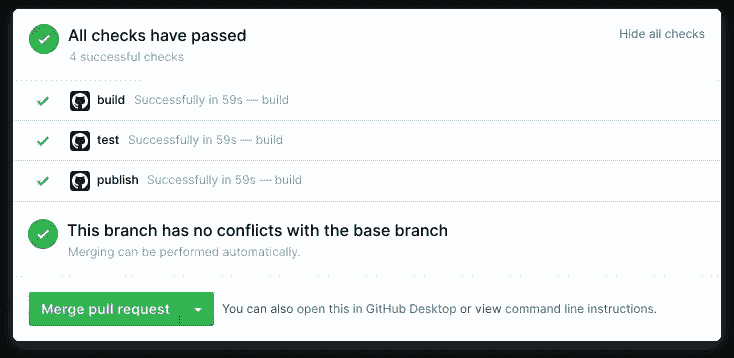
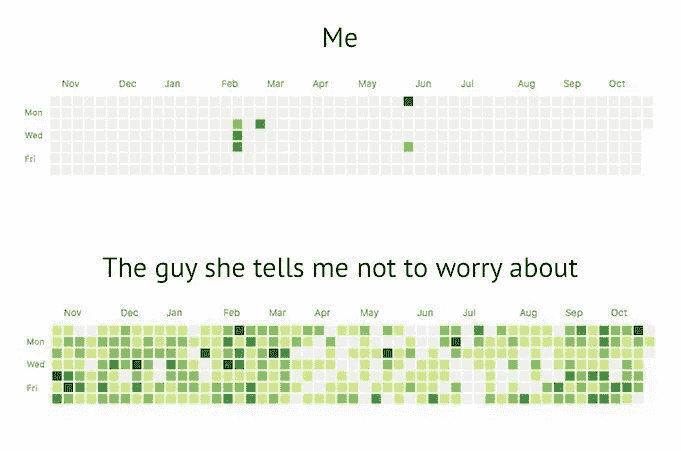

# 为什么应该编写小的 Git 提交

> 原文：<https://betterprogramming.pub/why-you-should-write-small-git-commits-c9a042737aa6>

## 易于理解的小提交是伟大软件开发的支柱


Vlad Tchompalov 在 [Unsplash](https://unsplash.com/s/photos/small?utm_source=unsplash&utm_medium=referral&utm_content=creditCopyText) 上拍摄的照片

大多数参与软件工程和编程的人应该熟悉像 [Git](https://git-scm.com/) 这样的版本控制系统。

通常，您暂存您所做的更改，编写提交消息，并将更改推送到存储库。下面是一个使用示例:

```
git add .
git commit -m "[#2313213] Fix XSS vulnerability in tooltips"
git push# pushed 2 changed files to the repository
```

但是，您可能已经看到过由于涉及各种主题而包含大量已更改文件的提交:

```
git commit -m "[issue-id] Fix XSS vulnerability in tooltips + Improve Accessibility in dropdowns + Add unit test for user-dropdown.component + Update dependencies"# pushed 20 changed files to the repository
```

也有提交消息没有充分告诉您该提交的意图的提交:

```
git commit -m "Did some changes"# pushed 13 changed files to the repository
```

在使用 Scrum 或其他相关敏捷方法的敏捷环境中，人们期望它能快速地、定期地交付客户价值。

受一位同事的影响，我试着采纳他的小承诺和持续改进的风格。作为一个对商业及其背后的技术都感兴趣的人，这种方法引起了我的共鸣。



持续集成有助于我们尽早发现错误和问题

在这篇文章中，我想简单总结一下为什么我喜欢这种方法。我们将看看小提交在软件项目中的优势。

# 小承诺和持续改进的优势

*   从工具(例如 CI 服务器上的单元测试)和其他人(开发人员、测试人员、产品经理)那里获得早期反馈，这鼓励了持续改进的想法，并有助于避免将来的大的变化。
*   如果出现问题，可以轻松地恢复提交。大型提交更难恢复，因为您可能不想恢复所有的更改，而只想恢复一个子集。
*   在查看拉请求时，小提交更容易理解。
*   编写更好的提交消息。因为小提交通常比大提交更集中，范围更广，所以陈述小提交的目的通常更容易。
*   提高你的统计数据(不要把这个看得太重)。



# 使用合适的工具完成工作

有时，小的提交是不可能或不合理的:

*   将代码变更分割成太多的小提交实际上会增加评审的难度。如果您更改了在 12 个文件中使用的变量的名称，那么您不应该创建 12 个单独的提交。因为这些变化是一起的，所以它们应该一起进行，而不是分开进行。
*   如果你做了很多小的提交，那么很容易以大的拉请求结束，这可能很难审查，即使每个提交本身可能相对容易理解。因此，您应该避免长期运行的分支，这违背了持续改进的理念

# 结论

感谢您阅读这篇关于我对 Git 中的小提交的想法的短文。

正如你所看到的，在软件项目中有很多支持小提交的理由。在我看来，最重要的方面是尽早获得反馈。你如何处理这个话题？请在评论中告诉我。