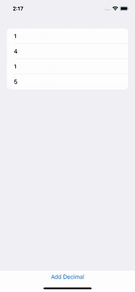
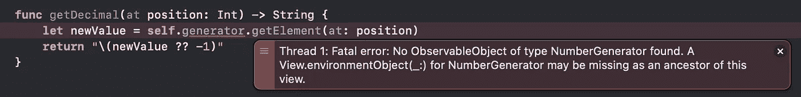
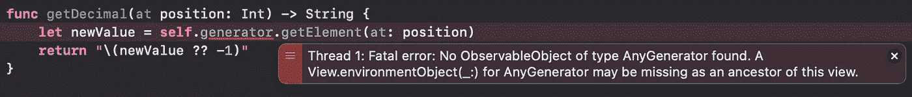

# 为什么不应该在 SwiftUI 中使用@EnvironmentObject

> 原文：<https://betterprogramming.pub/why-you-shouldnt-use-environmentobject-in-swiftui-a527d5c2bd>

## 默认 SwiftUI 依赖注入机制的缺点


照片由[阿贡·拉哈尔贾](https://unsplash.com/@agungraharja?utm_source=medium&utm_medium=referral)在 [Unsplash](https://unsplash.com?utm_source=medium&utm_medium=referral) 上拍摄

创建可伸缩和可维护的应用程序需要掌握的主要主题之一是[依赖注入](https://en.wikipedia.org/wiki/Dependency_injection)。SwiftUI 附带了一个用于注入依赖项的舒适 API:`[EnvironmentObject](https://developer.apple.com/documentation/swiftui/environmentobject)`API，由一个属性包装器和一个视图修改器组成。

尽管这些 API 非常舒适，但它们有几个限制，使它们不适合大型应用程序。主要缺点是:

*   它们使得针对接口编程变得困难。
*   它们使得编写测试变得困难。

在今天的文章中，我们将探索什么是`EnvironmentObject`，我们将深入探究其局限性，并尝试探索如何克服它们。

# 实践中的环境目标

当我们必须在视图之间共享对象时，使用`@EnvironmentObject`属性包装器是 Apple 建议的基本方法。通常，我们希望共享依赖关系:执行应用程序多个部分所需操作的对象。

让我们创建一个基本的设置来使用`EnvironmentObject` API。对于本文，我创建了一个简单的`PIDecimalGenerator`，它生成`PI`的第一个十进制数字。这是我们想要注入到我们的层次结构中的对象。

发电机必须符合`ObservableObject`，并且必须是`class`。当它被创建时，我们将`PI`的数字存储在一个数组中，而不是每次都重新计算它们。

生成器提供了一个名为`getElement(at:)`的方法来检索给定`position`中的数字。

一旦我们有了目标，我们就开始注射。让我们转到`App.swift`文件，然后:

1.  添加一个属性来存储生成器。
2.  使用`.environmentObject`视图修改器将其注入。

代码如下所示:

在第 3 行，我们创建了生成器；在第 7 行，我们注入它。

最后，我们在`ContentView`中消费注入的对象。代码很简单:我们创建一个相同类型的变量，并用`@EnvironmentObject`属性包装器对其进行注释。

在这个玩具示例中，我们希望呈现列表中的数字。我们定义想要呈现的位数和生成器，将其标注为`@EnvironmentObject`。

在`body`属性中，我们创建了一个`List`，其中每个元素都是一个数字。在屏幕底部，我们添加了一个按钮来添加额外的数字。当生成器停止返回有效数字时，我们开始追加`-1`。

下面的 GIF 说明了应用程序的行为。



# 交换实现

**依赖注入**的好处之一就是[后期绑定](https://en.wikipedia.org/wiki/Late_binding)。后期绑定让我们可以推迟决定使用哪个实现作为依赖项。

例如，一个应用程序可以从配置文件中选择要使用的存储类型。如果有内存存储、文件存储和 SQL 存储的实现，应用程序可以等到启动后才知道必须使用哪个实现。使用依赖关系的组件并不关心实际使用的是哪个存储。正是注入依赖关系的组合根决定了实现。

在我们这个简单的例子中，这意味着我们的`ContentView`不应该关心我们是为`PI`、为`e`传递一个生成器，一个 RNG 还是一个常量生成器。它必须和所有人一起工作。

如果我们查看视图的代码，我们可以看到它被绑定到了`PIDecimalGenerator`类型。这将`ContentView`与生成器的具体实现结合起来。

在 Swift 中解决这个问题的典型方法是定义一个描述我们对象行为的协议:

`PIDecimalGenerator`必须符合它。在编写协议一致性时，我们还可以添加一个`ConstantGenerator`，这样我们就有两个不同的生成器可以使用。

如果我们试图使用`NumberGenerator`协议作为`ContentView`中的类型，我们会得到一个糟糕的惊喜:


错误说`NumberGenerator`不符合`ObservableObject`。这是一个简单的解决方法:让我们使`NumberGenerator`协议符合`ObservableObject`。这让我们从特定的生成器中删除了`ObservableObject`一致性:此时对`ObservableObject`的一致性变得多余，因为它被对`NumberGenerator`的一致性所隐含。

但是，如果我们再次尝试构建，我们会得到一个不同的错误:


这是我们在处理带有关联值的协议时遇到的典型错误。事实上，ObservableObject 协议有一个关联的类型`ObjectWillChangePublisher`，它也在使用`Self`。

有两种方法可以解决这个问题:使用继承和使用类型擦除。

## **继承**

这是最直观的解决方法。我们不能使用协议，但是我们可以使用类。所以我们可以创建一个抽象的`NumberGenerator`类，让我们的生成器成为它们的具体实现。

然后我们以这段代码结束:

我们将`protocol`转换成了一个抽象类。Swift 没有它们的语法，所以我们使用了一个`fatalError`来强制子类实现所需的方法。

我们必须在`init()`和两个`getElement(at:)`方法之前添加`override`关键字。

现在应用程序构建完毕，让我们试着运行它。



如果我们现在运行应用程序，它会构建，但我们会得到这个致命的错误。问题是 SwiftUI 试图获得一个类型完全是`NumberGenerator`的`EnvironmentObject`。

我们所有的生成器，特别是我们传递给视图的`PIDecimalGenerator`，都是`NumberGenerator`。由于 [**利斯科夫替代原理**](https://en.wikipedia.org/wiki/Liskov_substitution_principle) ，我们期望这段代码能够正常工作，但事实并非如此。SwiftUI 和`@EnvironmentObject`违反了这一原则，因为属性包装器正在搜索一个类型正好是`NumberGenerator`的对象，并且它的一个子类不允许。

这是因为属性包装和视图修饰符实际上使用通用包装改变了属性和视图的类型。具体来说，使用`.environmentObject`视图修饰符的视图变成了`ModifiedView<OriginalViewType, _>`，而使用`@EnvironmentObject`属性包装的属性注释变成了类型`EnvironmentObject<PropertyType>`的属性。

在 Swift 中，泛型不享受[协方差属性](/generics-and-subtypes-in-swift-7f27638e1b99) : `GenericWrapper<Subclass>`不是`GenericWrapper<ParentClass>`的子类。在 Swift 不支持通用参数的协方差之前，我们无法拥有与子类无缝协作的属性包装器。

然而，这是一个容易解决的问题。我们必须确保`App`通过使用父类型来声明生成器。当这种情况发生时，SwiftUI 使用父类创建树:如果所有组件都使用父类，一切都正常。

通过在第 2 行中指定`generator`类型，我们放弃了类型推断的能力，但是现在我们可以用`ConstantGenerator`替换`PIDecimalGenerator`，应用程序可以工作了。

## 类型擦除

前一个解决方案迫使我们使用继承，并使我们在如何指定应用程序中的类型上妥协。我们可以使用另一个解决方案来避免这种情况:我们可以定义一个类型擦除来定义任何生成器的行为。

这个解决方案使用组合而不是继承:我们将生成器包装成它的类型擦除版本。这是苹果很多框架中常用的解决方案:`Combine`有`AnyPublisher`，SwiftUI 有`AnyView`。

因此，让我们创建我们的`AnyGenerator`:

首先，我们需要重新创建`NumberGenerator`协议:所有的生成器都遵循相同的接口。`protocol`不再需要延伸`ObservableObject`就可以作为普通类型使用。

`AnyGenerator`型符合`ObservableObject`和`NumberGenerator`协议。该类型将生成器作为参数，并将对`getElement(at:)`的调用转发给生成器的等效方法。

其他生成器必须符合`NumberGenerator`协议:它们不需要成为`ObservableObject`。

现在，让我们更新应用程序，使用`AnyGenerator`类型。

这里可以看到生成器类型声明可以省略。我们正在创建`AnyGenerator`对象，传递其他生成器之一。

我们也必须更新`ContentView`。

我们现在可以运行应用程序，它工作了。我们可以将`PIDecimalGenerator`与`ConstantGenerator`互换，应用程序继续工作。

这里的权衡是代码的复杂性。我们正在针对一个接口进行编程，即`NumberGenerator`协议，但是我们必须将其具体化为另一种类型，即`AnyGenerator`。为了创建一个`AnyGenerator`，我们需要传递期望的生成器，因此对象图变得更加复杂。

# 易测性

依赖注入的另一个好处是你的代码很容易被测试。我们可以为我们所有的依赖项创建测试副本，并且我们可以根据需要模拟它们、窥探它们或者截掉它们。

原则上，`EnvironmentObject`也应该允许我们这么做。我们可以准备一个单元测试，如下所示:

如果我们用`⌘+U`运行它，它会崩溃并出现致命错误:



这是意料之中的:我们没有以任何方式注入发生器。我们可以想到的第一个想法是使用`.environmentObject`视图修改器将一个生成器注入到测试中。代码将如下所示:

但是，这样做的话，我们最终会得到这个错误:


我们的`sut`的型号从`ContentView`变成了`some View`。如果我们实际尝试打印`sut`类型，它的具体值是:

```
**ModifiedContent<ContentView, _EnvironmentKeyWritingModifier<Optional<AnyGenerator>>>**
```

这是因为`environmentObject`修饰符实际上通过使用一个通用的包装器来改变视图的类型。并且包装器没有`getDecimal`方法。

编写这个测试的另一个尝试是设置备份属性包装器的`_generator`属性。但是，这个财产是私有的，我们不能操纵。

## 如何检验这个观点

遗憾的是，无法使用普通的 SwiftUI 方法测试视图。至少，我找不到一种简单的方法。为了实现这个目标，我们可以依靠像`[ViewInspector](https://github.com/nalexn/ViewInspector/)`这样的库。

我们可以[将这个库添加到我们的测试目标](/how-to-test-swiftui-views-smartly-6c6b13f9edb1)中，然后我们可以检查 SwiftUI 层次结构并访问内容视图。还有其他与属性包装器相关的可测试性问题，这使得测试 SwiftUI 视图变得很困难:来自`ViewInspector`的人创建了一个[指南](https://github.com/nalexn/ViewInspector/blob/master/guide.md#views-using-state-environment-or-environmentobject)，其中有一章专门介绍如何测试使用它们的`Views`。

通过使用这个库，我们需要修改生产代码，这样`ViewInspector`库就可以施展它的魔法了。这些必需的更改是为了支持测试而添加的，我们不会在生产中使用它们。

# 结论

在今天的文章中，我们探索了`EnvironmentObject`属性包装器和相关的视图修饰符。我们实现了它们，并在一些类似真实世界的环境中使用它们。

我们发现这项技术打破了利斯科夫替代原理，否定了后期绑定。尽管如此，我们讨论了如何利用继承或类型擦除来解决这个问题。

然后，我们看到他们很难测试我们的观点。我们试图了解问题的根本原因，如果不使用外部库，我们无法找到简单的解决方案。

失去后期绑定和可测试性是完全避免环境对象 API 的足够大的理由。一个更好的方法是显式定义依赖项，并在`View`初始化器中传递它们。