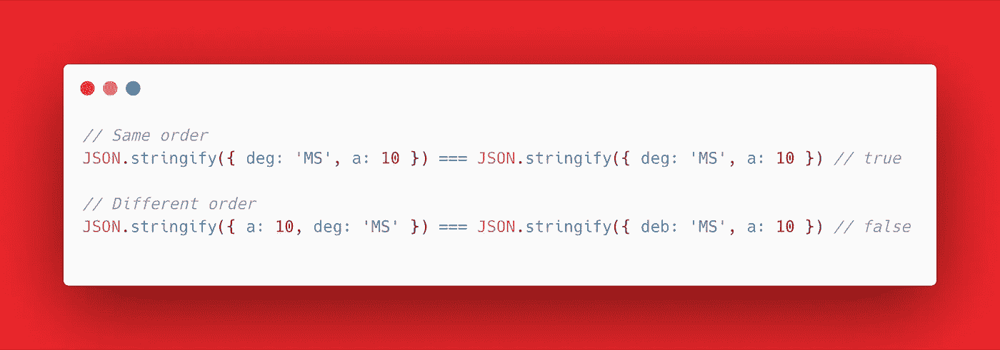

# 为什么不应该使用 JSON.stringify 来比较 JavaScript 中的对象

> 原文：<https://betterprogramming.pub/why-you-shouldnt-use-json-stringify-to-compare-objects-in-javascript-c9a16b7331e>

## 不要忘记你钥匙的顺序

[Adeolu Eletu](https://unsplash.com/@adeolueletu?utm_source=unsplash&utm_medium=referral&utm_content=creditCopyText) 在 [Unsplash](https://unsplash.com/s/photos/javascript?utm_source=unsplash&utm_medium=referral&utm_content=creditCopyText) 上拍摄的照片

JavaScript 中的等式是最令人困惑的方面之一，会让你抓耳挠腮。不像其他语言，你会认为相等操作符`**==**`或`**===**`会有它们应有的行为，但令你惊讶的是，它们并没有。

因为对象是引用类型，所以不能使用普通的等式运算符，即`**==**` 或`**===**`。

那么如何检查对象的相等性呢？有几个方法你可以采用(查看文章末尾)，但是这篇文章的重点是为什么你不应该使用`JSON.stringify`。

# **为什么不是** `**JSON.stringify**` **？**

`JSON.stringify`似乎是最明显和最容易的比较选择，因为不需要外部依赖。

但是等等！顾名思义，这种方法首先将对象转换成字符串，然后再进行比较。

JavaScript 不保证键的顺序。示例:

查看代码:https://gist . github . com/zainzafar 90/919 FD 3088 a 912860847 CDC 2d 33159 a 24

因此，如果要比较的对象具有以相同顺序输入的属性，比较将正常工作，但是在后一种情况下，如果顺序发生了变化，则相等失败。

# 结论

尽管它不需要安装来自 [npm](https://www.npmjs.com/) 的库或包，但`JSON.stringify`肯定不是比较对象的最佳选择。

# 可供比较的备选方案

JavaScript 社区有一些其他的对象比较方法:

*   深渊的`[Equal](https://www.npmjs.com/package/deep-equal)`。
*   洛达什的`[isEqual](https://lodash.com/docs/4.17.15#isEqual)`。
*   快速的`[Equals](https://www.npmjs.com/package/fast-equals)`。

# 资源

 [## 如何比较 JavaScript | SamanthaMing.com 中的两个对象

### 对象是引用类型，所以不能只使用===或==来比较两个对象。一种快速比较两个对象的方法…

www.samanthaming.com](https://www.samanthaming.com/tidbits/33-how-to-compare-2-objects)  [## JavaScript 中的对象相等性

### 相等性是 JavaScript 最容易混淆的方面之一。==对===的行为，类型的顺序…

adripofjavascript.com](http://adripofjavascript.com/blog/drips/object-equality-in-javascript.html)