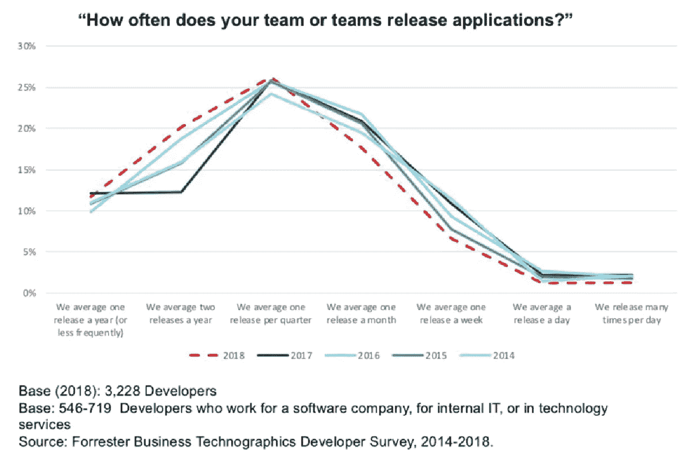

# 为什么你的软件上市速度不够快

> 原文：<https://betterprogramming.pub/why-your-software-isnt-getting-to-market-fast-enough-b55ad7c190f3>

## 以及如何识别流程中的瓶颈

Marc Sendra Martorell 在 [Unsplash](http://unsplash.com) 上拍摄的照片

在过去的 20 年里，我们看到了敏捷方法的采用激增。2018 年【Forrester 研究显示，超过 60%的大公司采用了敏捷软件开发实践，超过 80%的公司计划在 2019 年采用。

然而，尽管敏捷承诺更快的软件交付，但同一项研究显示，这些公司的发布频率自 2014 年以来一直保持平稳。超过一半的公司每季度发布软件少于一次，12%的企业雇主每年发布软件少于一次。

这些发布周期与敏捷的承诺相差甚远，敏捷承诺团队将在每个 sprint 结束时[发布。这里发生了什么？为什么我们不能更快地将软件送到客户手中？](https://pm.stackexchange.com/questions/7937/how-frequently-can-a-release-happen-within-a-scrum-sprint)

# 识别您的交付渠道中的堵塞

Forrester 副总裁兼首席分析师 Jeffrey Hammond 将这个问题比作厨房水槽堵塞:

> “不管你往水槽里注入多少水，不管你在上游增加多少速度，如果有堵塞，那都没关系。没有水会通过水槽。”— [杰弗里·哈蒙德](https://register.gotowebinar.com/register/7842047180049955596)

这些阻碍团队交付的障碍有多种形式。让我们来看看敏捷发布周期在企业软件团队中不能更快的五个最常见的原因。

# 1.人工批准和移交

曾为汤森路透(Thomson Reuters)和美国航空(American Airlines)等企业客户工作过的敏捷顾问 Allison Pollard 表示，她的客户在试图加快交付周期时面临的最大挑战之一是，随着时间的推移，手动审批越来越多。

“通常有十个或更多不同的批准试图减轻不同的风险，”波拉德声称。"试图解决这个问题相当困难，而且感觉风险很大."

虽然开发团队不能忽视安全和质量检查，但是如果他们想要更快的交付，他们必须找到一种方法来加速和自动化其中的一些过程。而且，即使实现了 CI/CD 之类的实践，团队仍然经常需要手工走查以获得部署批准。

正如 Hammond 指出的，“当我们试图变得更加敏捷时，我们看到的首要问题是许多组织仍然在使用手工实践…自动化这些发布活动在很大程度上仍然是一项正在进行的工作。”

*Forrester Business Technographics 开发者调查—2014–2018*

# 2.单一的遗留代码库

旧的代码库是发布周期缓慢的第二个常见原因。虽然使用[微服务](https://rollbar.com/blog/monolith-to-microservices-is-your-organization-ready/)、[无服务器计算](https://rollbar.com/blog/monitoring-serverless-lambda/)或 [Docker 容器](https://www.docker.com/)构建的现代架构支持持续集成(CI)和持续交付(CD)，这可以加快发布周期，但许多企业仍然使用可能已有几十年历史的代码库。当使用设计为作为单一单元发布的复杂遗留代码库时，很难使用 CI/CD 实现自动化部署。

即使有了一些自动化，被指派处理旧代码的团队成员可能不是最初构建它的人。如果技术债务没有得到解决，将会有部分代码没有被很好地记录或理解，从而减慢修复和发布的速度。再加上缓慢或缺失的测试，问题就更复杂了。

# 3.开发周期长

长开发周期是不经常发布的另一个常见原因。虽然敏捷现在是首选的方法，但是组织通常很难完全理解和采用敏捷交付实践。因此，一些组织采用了哈蒙德所谓的" [Water-Scrum-Fall](https://modernanalyst.com/Careers/InterviewQuestions/tabid/128/ID/5296/What-is-Water-Scrum-Fall.aspx#:~:text=The%20term%20Water%2DScrum%2DFall,middle%20of%20a%20Waterfall%20Environment.) "方法，或者在预先设计阶段和手动部署阶段之间紧缩 Scrum 方法。类似于人们在[大爆炸](https://rollbar.com/blog/deployment-strategies/)战略中看到的效果，坚持长开发周期的公司将总是与部署频率作斗争。

让软件更快地进入市场是敏捷的核心优势之一。“带着(客户)参观实体模型和问‘你觉得怎么样？’是有区别的把它们放在手中，看着它们实际使用，”波拉德说。不幸的是，她看到许多组织非常强调“完整的特性交付”，而不是采取 [MVP 方法](https://www.agilealliance.org/glossary/mvp/)。

# 4.对缺陷的恐惧

软件交付速度在许多组织中停滞不前的另一个原因是对缺陷的恐惧。组织可能对他们的发布缺乏信心，阻止他们在高峰时间发布，或者导致他们依赖冗长的手工测试周期。现代云原生技术和日益复杂的生产环境只会增加信心的下降。

对于不容易在本地运行的无服务器微服务，很难编写端到端的测试，因此开发人员变得谨慎。除非公司利用工具[来监控他们的开发和阶段环境](https://rollbar.com/blog/exception-monitoring-across-environments/)，否则缺陷很容易被忽略，信心会下降，发布频率会下降。

# 5.修补程序

最后，哈蒙德指出，“缺乏对从生产到开发的上游管道的关注。”换句话说，大多数组织坚持认为他们可以多快地发布新特性，但没有关注他们在问题出现时识别和解决问题的速度。

“所有这些组织都专注于生产交付，但这只是问题的一半，”Hammond 说。“从您发布第一版的时间点开始，您将需要处理各种事件。”[快速发现并修复错误](https://rollbar.com/blog/5-ways-errors-affect-business/)需要全面的监控解决方案和强大的事件管理流程。“只有三分之一的组织拥有处理事故管理的流程，”Hammond 继续说道。

如果没有快速理解和修复产品缺陷的能力，后续的发布将会被延迟，交付过程将会更加缓慢。

# 我们如何加快发布速度？

实现更频繁的发布需要文化的改变，这可能很可怕。“当你去那个发布管理小组并试图改变事情时，他们中的一些人可能会害怕，”Pollard 说。然而，作为领导者，我们的工作就是面对这一挑战。

以下是我们加快发布速度的三种方法:

1.  精益创业——首先，采取“[精益创业](http://theleanstartup.com/principles)”的心态。试着把每一次发布都看作是构建-测量-学习周期的一部分，并建立一种拥抱迭代的文化。放弃水-scrum-fall 方法论和“大爆炸”发布策略。最终的目标应该是让用户尽快掌握主要功能。
2.  质量文化—第二，建立质量文化。表扬解决技术债务、自动化手动过程、实现更好的测试实践和减少缺陷的团队。优先考虑正常运行时间和自动化测试覆盖，并告诉整个公司你的新努力。
3.  错误监控——最后，在您的所有环境中实施[全面监控](https://rollbar.com/blog/exception-monitoring-across-environments/),在错误进入生产之前很久就捕捉到它们，并帮助您的团队定义自动化测试覆盖的目标。错误监控工具，例如[滚动条](http://www.rollbar.com/)，不仅可以在所有环境中提供错误的即时通知，而且还包括关于这些错误的上下文信息，例如堆栈跟踪、代码版本、用户详细信息等等。这可以帮助您快速诊断和分类缺陷，允许您更快地发现和修复缺陷，增加团队的信心，并更频繁地发布。

# 结论

仅仅采用一些敏捷的最佳实践不会神奇地永远加速交付。正如我们所看到的，许多“走向敏捷”的组织仍然不能每季度发布一次以上的更新。

然而，通过识别瓶颈，努力改变公司的文化，并实施正确的工具，领导者可以实现更快的发布周期，并让他们的软件更快地到达客户手中。