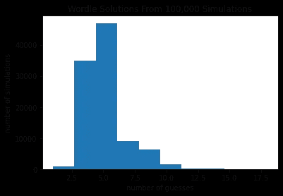

# 为什么你可能解决 Wordle(根据 100，000 次模拟)

> 原文：<https://betterprogramming.pub/why-youre-likely-to-solve-wordle-according-to-100-000-simulations-7725b462e533>

## *TL；博士:如果你遵循每个提示，在第六次猜测时，你几乎总是只剩下一个单词…基于我的 10 万次计算机模拟*


来自 Wordle 的屏幕截图

有一天，我开始注意到彩色方块出现在我的社交媒体时间线上。像许多人一样，我很好奇“wordle”是什么，并很快陷入了每天早上完成日常“wordle”的例行公事。他们甚至考虑得足够周到，为像我这样的人做了一个色盲友好的布局。

如果你没玩过，[这里是](https://www.powerlanguage.co.uk/wordle/)。

Wordle 让我想起了游戏策划，你试图在最短的时间内猜出颜色的顺序。然而，它给你的重要信息，摄魂师没有:哪些字母猜测是错误的。

在你的第一个五个字母的单词之后，我猜你得到了重要的信息。字母点亮不同的颜色表示:

*   信不在字里
*   单词中的字母却放错了地方
*   字母在单词中，并且在正确的位置

如果我知道这个单词中没有“e ”,那肯定排除了很多可能的单词。“E”是英语中最常见的字母。如果你得到其他信息，比如第三个字母必须是“k ”,那就必须进一步缩小单词的范围。

[Tyler Glaiel](https://medium.com/@tglaiel) 最近写了一篇[有趣的文章](https://medium.com/@tglaiel/the-mathematically-optimal-first-guess-in-wordle-cbcb03c19b0a)关于快速求解 Wordle 的数学最佳首字。

然而，我想知道如果你只是随机猜测，解决它的概率是多少。我的意思是，当我第六次尝试时，问题往往是试图根据前五次尝试中关于字母和位置的所有提示来想出一个词。

# 一点代码

(如果您想跳过代码，结果如下)

我认为最简单的测试方法是用 Python 构建 Wordle，让我的电脑玩 100，000 个游戏，并跟踪统计数据。我在求解之前跟踪了猜对的次数，猜对了单词还剩下多少个单词。下面是基本的逻辑流程:

*   获取有效单词的列表(12，972 个单词来自 Glaiel 的文章，参见他的 GitHub)。

```
import numpy as np
with open("wordlist_guesses.txt", 'r') as f:
    all_words = f.readlines()
```

*   做一个函数给一个猜测打分。我没有用颜色，而是用了数字(对电脑更友好，就像我之前说的，我是色盲。-1 表示字母不在单词中，0 表示字母在单词中但位置错误，1 表示字母和位置正确。

```
def score_word(chosen, guess):
    score = [-1, -1, -1, -1, -1]
    for i, w in enumerate(guess):
        if w in chosen:
            if w == chosen[i]:
                score[i] = 1
            else:
                score[i] = 0
    return score
```

*   创建一个函数，根据分数删除所有单词。(例如，如果没有“e”字母，则删除所有带“e”的单词)

```
def remove_words(score, guess, word_list):
    to_remove = []
    for i, word in enumerate(word_list):
        for s, w1, w2 in zip(score, word, guess):
            if s == 1:
                if w1 != w2:
                    to_remove.append(word)
                    break
            elif s == -1:
                if w2 in word:
                    to_remove.append(word)
                    break
            elif s == 0:
                if w1 == w2:
                    to_remove.append(word)
                    break
                elif w2 not in word:
                    to_remove.append(word)
                    break
    word_list = list(set(word_list) - set(to_remove))
    return word_list
```

*   玩沃尔多！(从随机选择的单词开始)

```
def wordle(word_list):
    count = 0
    chosen_word = np.random.choice(word_list)
    score = [-1, -1, -1, -1, -1]
    left = None
    while score != [1, 1, 1, 1, 1]:
        count += 1
        guess = np.random.choice(word_list)

        score = score_word(chosen_word, guess)
        if score == [1, 1, 1, 1, 1]:
            left = len(word_list)
        else:
            word_list = remove_words(score, guess, word_list)
    return count, left
```

# 结果

*   经过 100，000 次模拟后，平均每 5.21 次猜测就解决了这个难题。正确的单词猜对了 8 次，最差的 18 分，出现了两次。这是分布图:



*   当做出正确的猜测时，剩余单词的中位数是 1，而平均数是 5.28。最终的猜测是 100，000 次模拟中 54，073 次的唯一选项，占 54%。
*   这里有一个具体的例子来说明如何快速缩小选择范围。我选择了“房子”这个词，每猜一次都大大降低了可能性:

```
**Selected word: house (chosen from 12,972 words)****Guess**    **Score**              **Words left**
stent   [0, -1, 0, -1, -1]  941
hexes   [1, 0, -1, 0, 0]    6
horse   [1, 1, -1, 1, 1]    2
hoise   [1, 1, -1, 1, 1]    1
house   [1, 1, 1, 1, 1]     (it was the only option!)
```

# 更多的文字供思考

单词列表包括像“xylol”和“aalii”这样的单词，这让我想知道 Wordle 的创造者是真的随机选择了一个单词，还是他们选择了一个更常见的单词。

假设他们真的从一个 5000 字的“心智列表”中选择。由于成年人大约认识 42，000 个单词，普通人认识的 5 个字母的单词数量可能比 12，972 个单词的完整列表少得多。如果是这样的话，要解决的猜测的平均数量是 4.55，而最终猜测是唯一选项的情况上升到几乎 60%。

像任何优秀的游戏设计师一样，Wordle 的开发者知道如何平衡猜测正确单词的可能性，让玩家在太容易和令人沮丧之间“流动”——这很有趣……以及在社交媒体上分享神秘的彩色立方体并每天只发布一个的绝妙想法。

所以，你(很可能，几乎)总会去解决它。而且总是会很有趣。

另外，你的单词直方图和我的相似吗？你的统计数据比计算机随机猜测的要好吗？

P.P.S .我很快就写好了代码和这个帖子。一如既往，我欢迎任何人让我知道你发现的任何错误或建议。