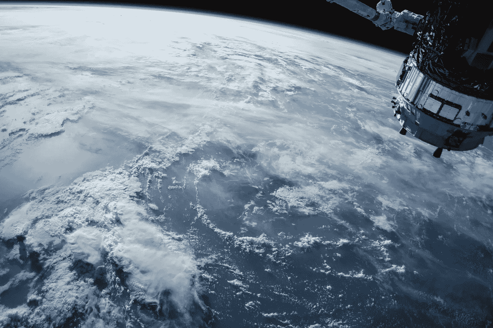
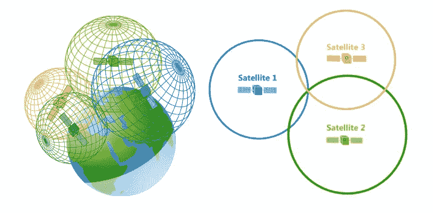

# 使用 Node.js 的 Wi-Fi 三边测量

> 原文：<https://betterprogramming.pub/wi-fi-trilateration-using-node-js-74996a3f3d1>

## 它不同于三角测量



美国宇航局在 [Unsplash](https://unsplash.com/s/photos/satellite?utm_source=unsplash&utm_medium=referral&utm_content=creditCopyText) 拍摄的[照片](https://unsplash.com/@nasa?utm_source=unsplash&utm_medium=referral&utm_content=creditCopyText)

Wi-Fi **三边测量**(也称为多边测量)是一种技术，用于根据与可用 Wi-Fi 接入点位置的相对**距离** 来估计客户设备的位置。这与 Wi-Fi **三角测量**形成对比，后者根据接入点天线接收到的信号的**角度** 来确定定位。



来自 [GISGeography](https://gisgeography.com/trilateration-triangulation-gps/) 的 GPS 三边测量图像

在上图中，你可以看到三颗具有一定半径的 GPS 卫星。假设你的位置在这三颗卫星的范围内。根据这三个接入点的位置和半径，您的潜在位置可以使用三边测量法通过找到它们的交点来确定。

对于 Wi-Fi 三边测量，您可以将这些卫星想象为无线接入点，并且您能够到达所有这些卫星。这意味着您的设备在所有这些接入点的覆盖范围内。这些接入点相交的空间就是您的设备所在的空间。

想象一下这个场景。您正在尝试编写一个脚本，该脚本将获取用户的地理位置(纬度和经度)，并使用这些坐标来推荐附近的餐馆。要在浏览器中做到这一点，您可以使用`[Location](https://developer.mozilla.org/en-US/docs/Web/API/Location)`对象。但是，您不能通过命令行访问浏览器的位置。

如何在不使用浏览器的情况下，使用 JavaScript 获取用户的设备坐标？如果我们可以收集用户设备周围的各种无线接入点，我们可以使用 Wi-Fi 三边测量来获得设备坐标。

这是我们需要的。

`**node-wifiscanner**` —这个 [npm 包](https://www.npmjs.com/package/node-wifiscanner)将用于收集您附近的无线接入点。你可以通过做`npm install node-wifiscanner`来安装它。

`**node-fetch**` —一旦我们获得了无线接入点，我们将使用 fetch 发出 POST 请求。由于在 Node.js 中没有实现 fetch API，我们将需要运行`npm install node-fetch`来下载 [npm 包](https://www.npmjs.com/package/node-fetch)。一旦你完成了，我们就可以向[谷歌地理定位 API](https://developers.google.com/maps/documentation/geolocation/intro) 发出请求。

# 谷歌地理定位 API

一旦我们收集了 Wi-Fi 接入点，我们将使用谷歌地理定位 API 来查找我们的坐标。在 POST 请求的主体中，有一个名为`wifiAccessPoints`的属性，它接受一个对象数组。这些对象只需要一个参数:`macAddress`。这将是收集的无线接入点的 MAC 地址。

要使用地理定位 API，你需要去谷歌云平台的[凭证部分](https://console.cloud.google.com/apis/credentials)。在那里，单击 Create Credentials 按钮，然后选择 API Key。

现在我们有了依赖项，接下来是代码。创建一个`trilateration.js`文件，并将下面的代码粘贴到其中。

来自`wifi-scanner`的响应可能如下所示:

为了获得 MAC 地址，我们需要获得键`mac`的值。这种格式不同于地理定位 API 的格式。参见下面的介绍页面。

```
{
  "macAddress": "00:25:9c:cf:1c:ac", <-- DIFFERENT KEY FORMAT
  "signalStrength": -43,
  "age": 0,
  "channel": 11,
  "signalToNoiseRatio": 0
}
```

在我们发出请求之前，我们需要返回一个新的 MAC 地址对象集合，其中包含一个指向该地址的键`macAddress`。

```
var macs = data.map(x=>{
  var obj = {}
  obj['macAddress'] = x.mac
  return obj
})
```

一旦我们重新格式化了我们的 mac 地址，我们现在就可以向地理定位 API 发起请求了。

上面是一个非常标准的 Google API 调用，它返回一个包含`location`属性的对象。这个属性指向一个包含`lat`和`lng`的对象。这些对应于设备的纬度和经度(坐标)。该响应还包含一个`accuracy`属性，该属性表示以米为单位的计算精度。

注意:虽然 150 米不是很准确，但我已经在几个不同的地方尝试过这个脚本，每次请求都会返回与我当时所在的建筑相对应的坐标。您的结果可能会有所不同。

# 摘要

**三边测量**是一种定位技术，利用无线接入点和可达设备之间的距离。

三边测量不同于**三角测量，**利用无线接入点接收的信号的到达角(AoA)。

您不能在命令行脚本中访问浏览器的位置。因此，我们需要找到设备周围无线接入点的 MAC 地址。这些地址可以使用包`node-wifiscanner`找到。

一旦你有了 MAC 地址，把它们格式化，这样它们就可以被谷歌的地理定位 API 消化。

使用`node-fetch`向 API 发送 POST 请求，在请求体中使用格式化的 MAC 地址作为`wifiAccessPoints`的值。

通过 Wi-Fi 三边测量，我们能够以足够的精度确定设备的地理位置。

上面所有的[代码](https://github.com/macro6461/trilateration)都可以在 GitHub 上找到。感谢阅读！

[*在此处将您的免费媒体会员升级为付费会员*](https://matt-croak.medium.com/membership) *，每月只需 5 美元，您就可以收到各种出版物上数千名作家的无限量无广告故事。这是一个附属链接，你的会员资格的一部分帮助我为我创造的内容获得奖励。谢谢大家！*

# 参考

[](https://github.com/macro6461/trilateration) [## macro 6461/三边测量

### 三边测量节点脚本。在 GitHub 上创建帐户，为 macro 6461/三边测量开发做出贡献。

github.com](https://github.com/macro6461/trilateration) [](https://gisgeography.com/trilateration-triangulation-gps/) [## GPS 接收器如何工作-三边测量与三角测量- GIS 地理

### 你有没有想过你的 GPS 接收器是如何工作的？他们使用一种叫做三边测量的技术。尽管 GPS……

gisgeography.com](https://gisgeography.com/trilateration-triangulation-gps/) [](https://developer.mozilla.org/en-US/docs/Web/API/Location) [## 位置

### 位置接口表示它所链接的对象的位置(URL)。对它所做的更改反映在…

developer.mozilla.org](https://developer.mozilla.org/en-US/docs/Web/API/Location) [](https://www.npmjs.com/package/node-wifiscanner) [## 节点-wifi 扫描器

### npm 安装 node-wifiscanner 使用 NodeJS 扫描周围的 WiFi 接入点。在 Mac 上，它将使用 airport 命令…

www.npmjs.com](https://www.npmjs.com/package/node-wifiscanner) [](https://www.npmjs.com/package/node-fetch) [## 节点提取

### 一个轻量级模块，将 window.fetch 带到 Node.js(我们正在寻找 v2 维护者和合作者)而不是…

www.npmjs.com](https://www.npmjs.com/package/node-fetch) [](https://developers.google.com/maps/documentation/geolocation/intro) [## 概述|地理定位 API | Google 开发者

### 开始之前:在您开始使用地理定位 API 之前，您需要一个带有计费帐户和…

developers.google.com](https://developers.google.com/maps/documentation/geolocation/intro) [](https://console.cloud.google.com/apis/credentials) [## 谷歌云平台

### Google 云平台让您可以在同一基础设施上构建、部署和扩展应用程序、网站和服务…

console.cloud.google.com](https://console.cloud.google.com/apis/credentials)