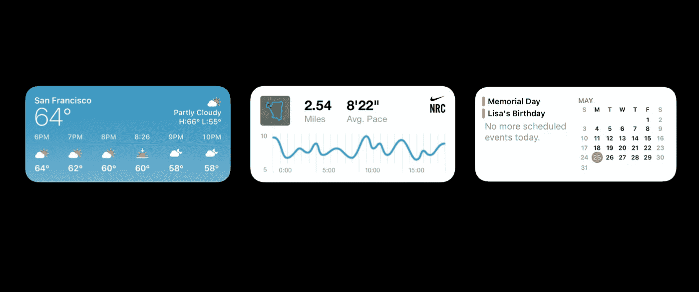
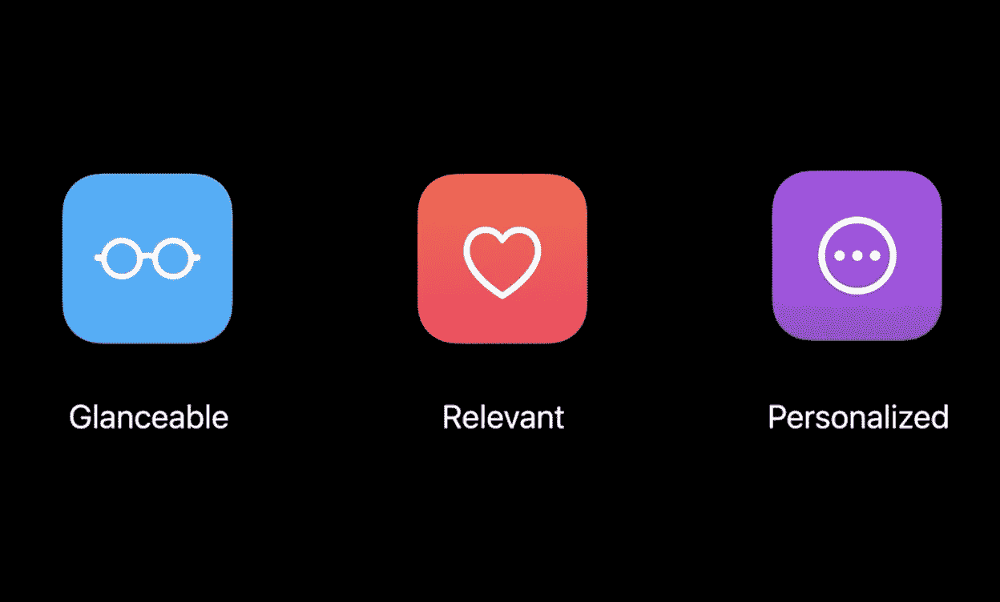
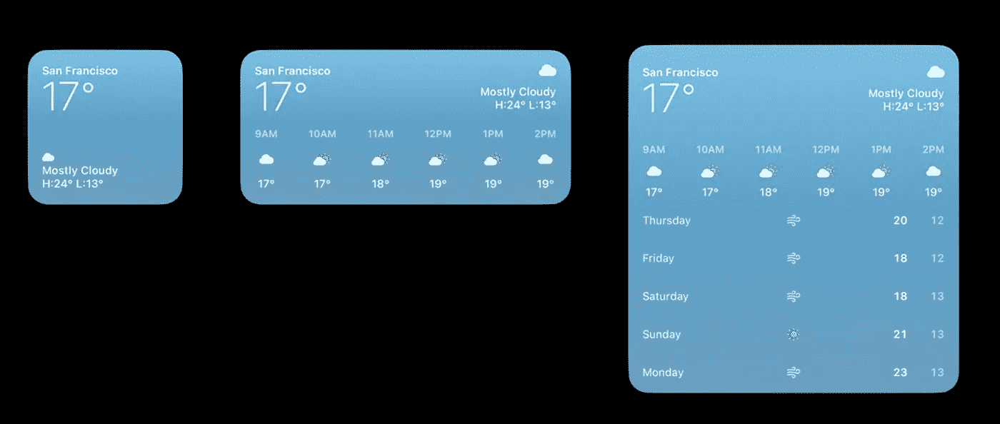
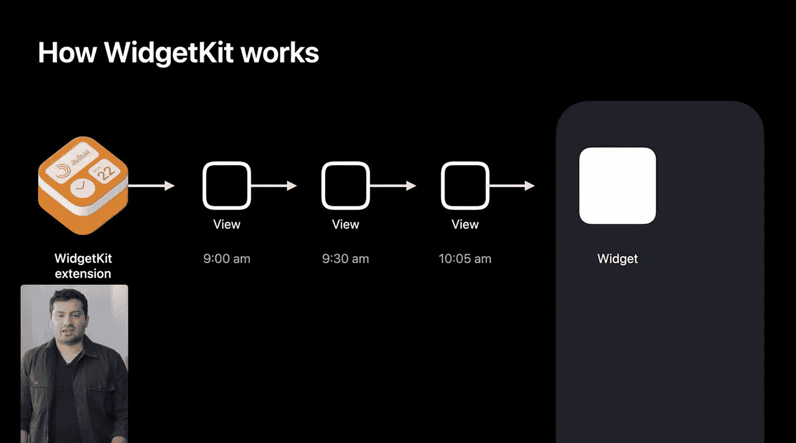
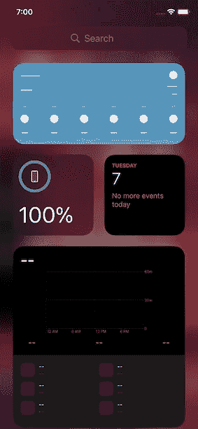

# 带有 WidgetKit 的 iOS 14 中的 Widgets

> 原文：<https://betterprogramming.pub/widgetkit-in-ios-14-wwdc20-81cf10f51af9>

## WWDC 2020 Swift 会议摘要

图片来自[苹果开发者](https://developer.apple.com/videos/play/wwdc2020/10028/)。

*注:本文为* [*WWDC20 届*](https://developer.apple.com/videos/play/wwdc2020/10028/) *的简短文字总结。*

WidgetKit 是 WWDC20 中引入的新 Swift 框架，允许您在主屏幕上显示应用程序中最重要的数据！

# 设计

iOS 中的小工具在设计时需要牢记三点:易浏览性、相关性和个性化。

图片来自[苹果开发者](https://developer.apple.com/videos/play/wwdc2020/10028/)。

*   可浏览性——数据应该以有意义的方式呈现。
*   相关性——基于使用模式，iOS14 会自动显示相关的小部件。在帮助 iOS 了解用户希望看到您的 widget 的频率方面，您确实有一定程度的控制，尤其是当多个 widget 在同一个智能堆栈中时。
*   个性化—显示的数据可以根据用户的偏好进行调整和个性化(例如，天气窗口可以显示用户地理位置的天气，或者日历窗口可以显示基于当前日期和时间的事件)。

图片来自[苹果开发者](https://developer.apple.com/videos/play/wwdc2020/10028/)。

# 表演

小工具放在主屏幕上，所以它们需要快速加载。因此，小部件不是迷你应用程序，而是应用程序扩展在特定时间之前提供的视图。这是通过 WidgetKit 扩展(Swift 后台扩展)完成的，方法是在时间线中返回一堆视图，并将它们发送到主屏幕上的小部件，该小部件将根据当前时间呈现适当的视图。

图片来自[苹果开发者](https://developer.apple.com/videos/play/wwdc2020/10028/)。

可以从主应用程序刷新时间线。时间线是视图和日期的组合，表示特定视图显示的时间。通常，需要从扩展返回几天的内容，然后序列化到磁盘，并根据当前时间显示其中一个视图。但是，对于要返回最新信息的小部件，需要使用重载。系统会唤醒扩展，并询问放置在设备上的每个小部件的时间线。`ReloadPolicy`可由您的应用程序定义，以便系统知道何时询问下一个时间线。配置选项包括现有时间线的`atEnd`、`after(date: Date)`和`never`。

当收到后台通知或用户对应用程序进行更改时，小部件内容也可以更新。在后台通知或用户编辑您的应用程序的情况下，您可以通过 WidgetCenter 使用基于 Swift 的 WidgetKit API 来重新加载时间线，从而唤醒扩展。然而，小部件并不意味着每秒更新一次，即使你这样设置了重新加载策略，iOS 也会根据用户与小部件的交互来限制更新。

小工具不是迷你应用。它们只是在主屏幕上显示你的应用程序的内容。小部件有三种不同的尺寸:小正方形、长方形和大正方形。没有必要为所有尺寸设计，但越多越好。

小部件配置选项是使用意图构建的。配置 UI 是使用意图自动生成的。

小部件完全是用 SwiftUI 构建的。虽然从 iOS 13 开始支持 SwiftUI，但是从 iOS 14 开始支持 widgets。

主屏幕上显示的智能堆栈只是一堆小部件。出现在顶部的小部件由设备上的智能决定，但可以通过 Siri 快捷方式捐赠和 WidgetKit API 来控制(以帮助系统决定哪个小部件将是相关的)。

# 定义小部件

*   kind——通过定义配置来支持多种类型的小部件的单个扩展。
*   配置-意图类型
*   `supportedFamilies` —微件尺寸
*   占位符—默认内容

当没有数据显示时，在 iOS14 小部件中显示占位符数据—来自 [Akashlal](http://akashlal.com)

种类:`StaticConfiguration`，`IntentConfiguration`

支持的家族:`systemSmall`，`systemMedium`，`systemLarge`。

占位符:表示小部件的内容。它不应该有任何用户数据。这个用户界面很少被检索，尤其是在没有数据显示的时候。

可以使用 widgetURL API 将整个小部件与一个 URL 链接相关联。虽然`systemSmall`只能与一个链接相关联，但是可以使用 SwiftUI 中的新链接 API 将子链接添加到`systemMedium`和`systemLarge`。

# 最后的想法

把 widgets 想象成显示在主屏幕上的应用程序的一部分。通过漂亮的圆形边缘，你可以显示应用程序中的简略数据，当用户点击小工具时，可以通过深层链接直接打开特定页面。使用 SwiftUI 构建的小部件可以支持黑暗模式，并且是动态类型，确保那些喜欢大字体的人可以访问。

准备好构建您的第一个小部件了吗？我写了另一篇关于[用 widget 从头开始构建你的第一个小部件](https://akashlal.com/widgets-in-ios-14-with-widgetkit/)到工作原型，点击链接查看！