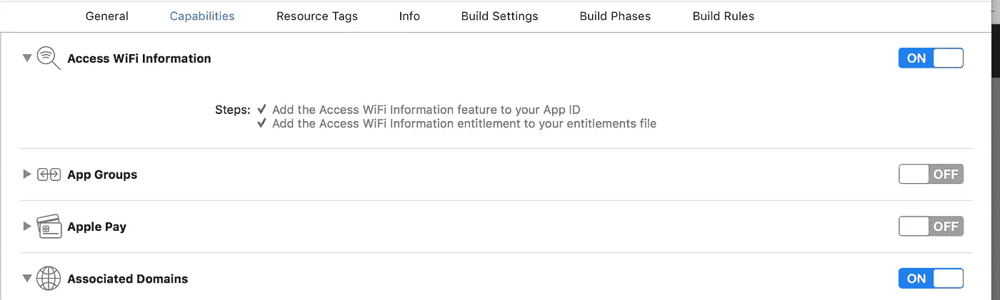
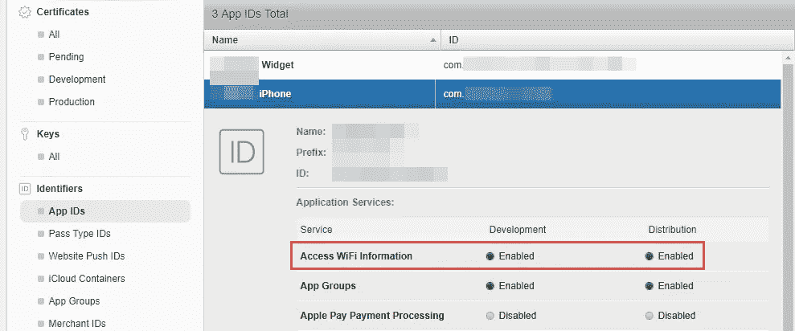
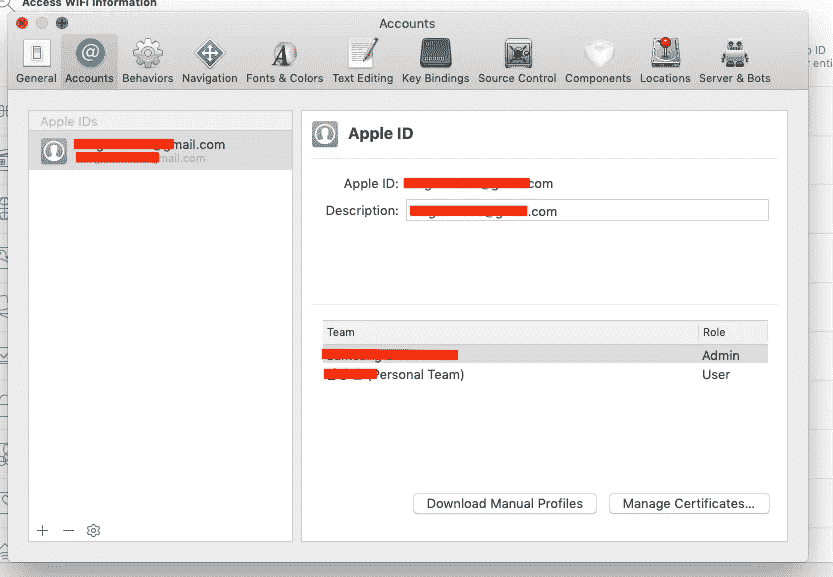
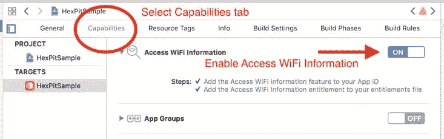
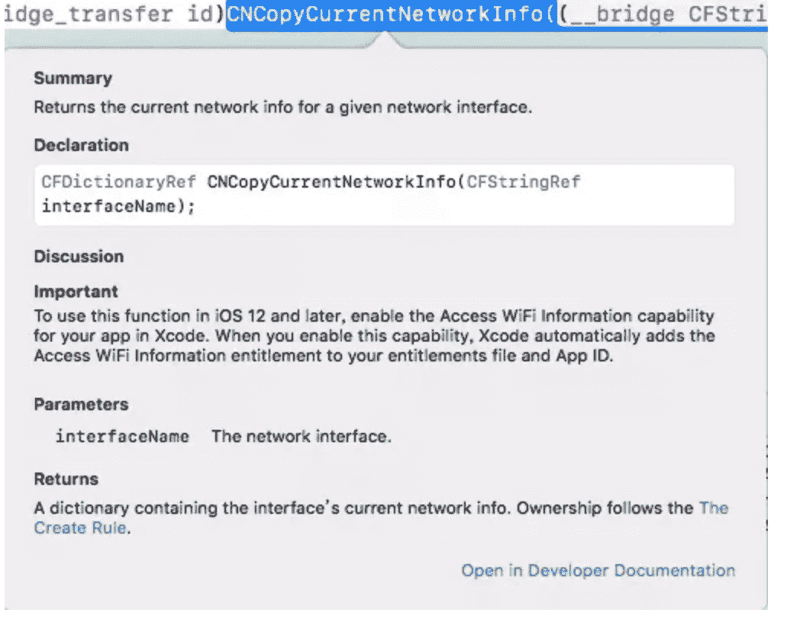

# 如何在 iOS 13 中启用 WiFi 信息权限

> 原文：<https://betterprogramming.pub/wifi-permission-changes-for-ios-12-1-iphone-x-and-other-devices-c313e24f90ae>

## 更新你的应用以利用 WiFi 权限更改

随着 iOS 13 的推出和 iPhone X 的发布，增加了一个新功能，称为访问 WiFi 信息权限。升级到 iOS 13 及以上版本后，许多应用程序都面临着检测不到 WiFi 或许多与 WiFi 模块相关的功能无法工作的问题。

所以我们需要在 Xcode 中启用访问 WiFi 信息权限功能，这是一个布尔值，表示您的应用程序是否可以访问连接的 WiFi 网络的信息。要将此授权添加到您的应用程序，我们需要在 Xcode 中启用访问 WiFi 信息功能。

启用此功能需要遵循几个步骤。访问 WiFi 信息是启用网络功能所需的全部内容。

以下是启用访问 Wifi 权限所需的步骤:

1.  登录您在 https://developer.apple.com[的苹果开发者账户](https://developer.apple.com/)，并为 App ID 启用访问 WiFi 信息。

2.转到“预配概要文件”选项卡，并重新生成它们。我们需要重新生成预配概要文件，因为它被标记为无效。下载最新的预置描述文件(请参阅下一步)。

3.再次在 Xcode 中，您会想要跟随以下导航:前往>偏好设置> Apple IDs >团队。选择合适的团队，然后单击下载手动配置文件以获取最新的配置文件。

4.在 Xcode 中，打开项目，并前往`Entitlements.plist`。添加属性`com.apple.developer.networking.wifi-info`，类型为 Boolean，值为 YES。

5.现在，进入项目设置>选择你的应用目标>功能标签。有一个开关可以打开访问 WiFi 信息。具体可以参考下图。

6.根据您的要求，重新构建应用程序或进行调试，并部署到设备上进行测试。

建议:我也建议我们检查一下版本。具有协同设计的应用程序权限。在 Mac 上打开您的终端，并尝试下面的 codesign 命令。指向你的应用。应用程序文件:

`codesign -display --entitlements :- /Users/Username/Downloads/MyApp.app`

有一个键指示您的应用程序是否将使用`[CNCopyCurrentNetworkInfo](https://developer.apple.com/documentation/systemconfiguration/1614126-cncopycurrentnetworkinfo)`功能来获取关于当前 WiFi 网络的信息。你可以在你的列表中检查这个。

务必阅读并分享！！