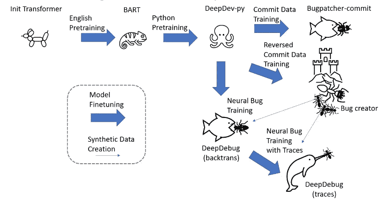
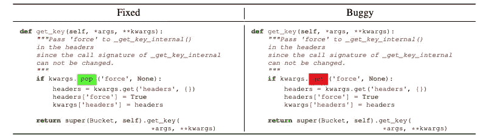

# 自动修复 Bug 能在你的代码库上工作吗？

> 原文：<https://betterprogramming.pub/will-automatic-bug-fixing-work-on-your-codebases-d56cdad4fa78>

## 如果 DeepDebug 正在修复您的工作，那么您的项目会有更大的问题

凯利·西克玛在 [Unsplash](https://unsplash.com?utm_source=medium&utm_medium=referral) 上的照片

## 每个程序员都会写 bug

当我十年前开始学习编码时，我对错误非常敏感——当我的程序不工作时，它们让我发疯，尤其是当我和同事展示我的项目时。不知何故，展示我的作品是臭虫决定宣布它们存在的最频繁的场合。在过去的日子里，我在心理上很容易受到虫子的攻击。

然而，在编写了更多的代码之后，我意识到我们的编码工作基本上是修复程序中的各种错误。因此，当程序员的代码有错误时，他们不应该感到羞耻。我现在敢说，如果你不写 bug，你就不是一个真正的程序员。因为我们作为程序员的部分日常职责就是把 bug 引入到我们的项目中，这是我们工作保障的根本基础。

> “如果调试是去除软件 bug 的过程，那么编程一定是把 bug 放进去的过程。”― **埃德格·沃克·迪杰斯特拉**

玩笑归玩笑，我们可能应该同意我们的目标不是写 bug。然而，bug 是我们正在开发的代码库不可避免的副产品。网上的一些讨论(比如 [Quora:一行代码中 bug 的平均比例是多少？](https://www.quora.com/What-is-the-average-ratio-of-bugs-to-a-line-of-code))揭示了每 1000 行代码中有 15 到 50 个错误，这取决于您何时/如何检查代码(例如，代码第一次键入时的打字错误)。

# 修复 bug 既繁琐又昂贵

鉴于错误在任何软件开发过程中的普遍存在，定位和修复错误是程序员工作的关键部分。不幸的是，这需要大量的时间和成本。以下是我在网上找到的一些事实([来源](https://www.openrefactory.com/intelligent-code-repair-icr/))。

> *修复一个 bug 比写一行代码要多花 30 倍的时间。*
> 
> *一个开发者 75%的时间花在调试上(一年 1500 小时！).*
> 
> *仅在美国，每年就有 1130 亿美元花费在识别和修复产品缺陷上。*

为了检测和修复 bug，传统的方法主要是手动过程。我们编写测试代码来检查我们能想到的所有可能的用例。然后我们祈祷所有的 bug 都自己弹出来，这样我们就可以相应地修复它们。虽然我们尽了最大的努力去去除 bug，但是在生产过程中，当出现了超出我们最初想法和计划的罕见用例时，总会有一些 bug 冒出来。

我必须说调试不是编码中最有趣的事情——通常，它是许多程序员不喜欢做的最乏味的过程之一。编写代码是有趣的，因为你正在向一个现有的项目添加新的东西，看着它从一无所有变成一个工作系统。

相比之下，修复 bug 是“无聊”的，因为你在处理一堆有病的代码。在许多情况下，您必须删除您之前编写的大量代码，并重写更多代码来修复 bug。对现有代码库的这种破坏有时真的令人沮丧。我知道——没有人喜欢自我否定——修复一个 bug 基本上就是证明你做的是错的。

# 什么是 DeepDebug？

在最近的一篇论文中，来自微软的研究人员开发并报告了 DeepDebug，这是一个使用大型预训练转换器自动检测并修复 Python 错误的框架。

DeepDebug 的训练模型(来源:【https://arxiv.org/abs/2105.09352】T2，许可:抄送)

这些研究人员从 200，000 个公共 Python 库中获取 Python 代码作为他们的训练数据。使用这些数据，他们开发了他们的初始基线 bugpatcher 模型(图中的 Bugpatcher-commit)和 bug creator(图中的 Bug creator)，后者使用反向提交数据。bug creator 用于创建合成 bug，这极大地丰富了训练数据量。

使用 Bug Creator 创建的合成 Bug(来源:【https://arxiv.org/abs/2105.09352】T4，授权:CC BY)

研究人员建立了一个相当复杂的调试框架，它集成了反向翻译(即从目标数据到源数据的翻译)、堆栈跟踪(使用 Pytest 来跟踪 bug)和代码骨架(bug 的上下文，如函数、类和导入的模块)。他们的框架优于几个现有的工具，具有更高比例的错误修复(53%)和更少的误报(DeepDebug 为 1，而现有的同类工具为 7 和 9)。

# Deepdebug 能在现实项目中工作吗？

当许多人第一次听说这个工具时，它听起来很新奇，因为它将消除大量的人工工作，否则这些工作将需要修复我们代码中的错误。然而，当我更多地考虑它的实际应用时，我的怀疑程度增加了。

由他们的框架创建和修复的错误本来就不应该存在于我们的项目中。下面是一些例子:

*   使用所需方法的错误名称:get_key -> get_value。
*   不相关方法的随机互换:get_key reverse_list。
*   反向比较评价:“≥”—>“
*   Truncate chained function calls
*   Delete return values
*   Misname variables: self.result ->自我。_ 结果
*   还有更多

为了让 DeepDebug 正常工作，您的项目应该包含大量的 bug，如示例中所示。具体来说，我的意思是 DeepDebug 可以极大地帮助检测和修复代码库中的错误。然而，正如你所看到的，几乎没有一个错误会发生在任何有经验的程序员身上。我明白程序员确实会犯错误，但是这些错误，对不起？

不管你的项目是你自己的还是团队的，对项目有贡献的每个人都应该负责。如果你不想让别人污染项目，请你自己也不要这么做。因此，我们需要尽最大努力防止 DeepDebug“工作”——通过将尽可能少的错误引入到我们自己或共享的项目中。

# 在开发过程中最大限度地减少错误

有些人写代码比别人快。然而，这并不意味着他们的代码质量更好。当人们不小心时，可能会有更多的错误被嵌入到代码中。以下是我发现的一些有助于保持 bug 数量最少的方法:

1.  **迈小步。**你不会想渐渐地写一堆没有测试的代码。更大的步骤意味着代码复杂性的显著增加，这掩盖了可能的错误，使调试更加困难。
2.  **经常休息。没有人能全天保持 100%的注意力。如果你能连续几个小时全神贯注地工作，你就是一个比我更好的程序员。对我来说，我经常每隔一个小时左右休息一下，这可以让我保持精力充沛。如果你不休息，很可能你会因为精神疲劳而在没有意识到的情况下犯错。**
3.  经常检查你的代码。写代码本质上就是写一篇短文。如果你曾经编辑过文章，你可能会同意，审查过程帮助你纠正了一些语法错误，提高了文章的逻辑流。审查你的代码是非常相似的。你可能会发现一些最初没有注意到的错误。
4.  **看大局。当你试图修复一个 bug 时，你应该在头脑中有一个大的蓝图。我们不想要局部的和临时的修正——你必须彻底地思考:这种改变会给项目的其他部分带来问题吗？**

# 最后的想法

我们应该感谢这些计算机科学研究人员所做的工作。最终，我们可能会有一个更好的框架来检测基本错误之外的复杂错误。

然而，不管这些自动缺陷检测框架会变得多好，我们程序员应该尽量减少代码库中的缺陷数量。

就好像这些框架是治疗疾病的有效药物。它们是很好的尝试——除非你的健康受到损害，并且这些药物总是有一些副作用。为什么我们不定期锻炼，并及时完成年度检查，以保持健康呢？

更聪明地编码，而不是更难。