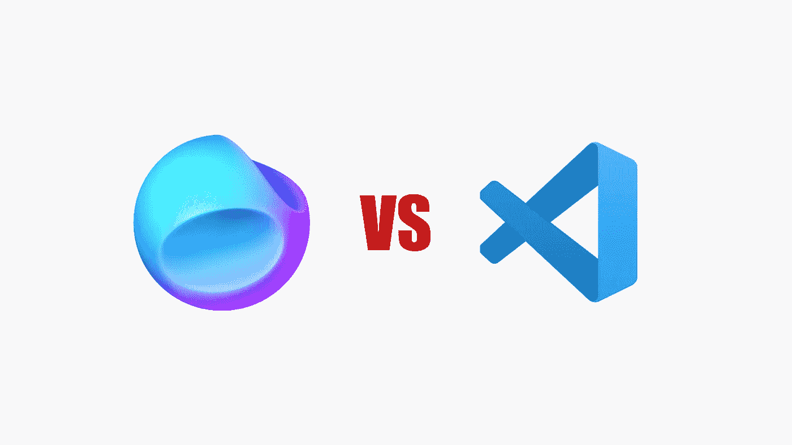
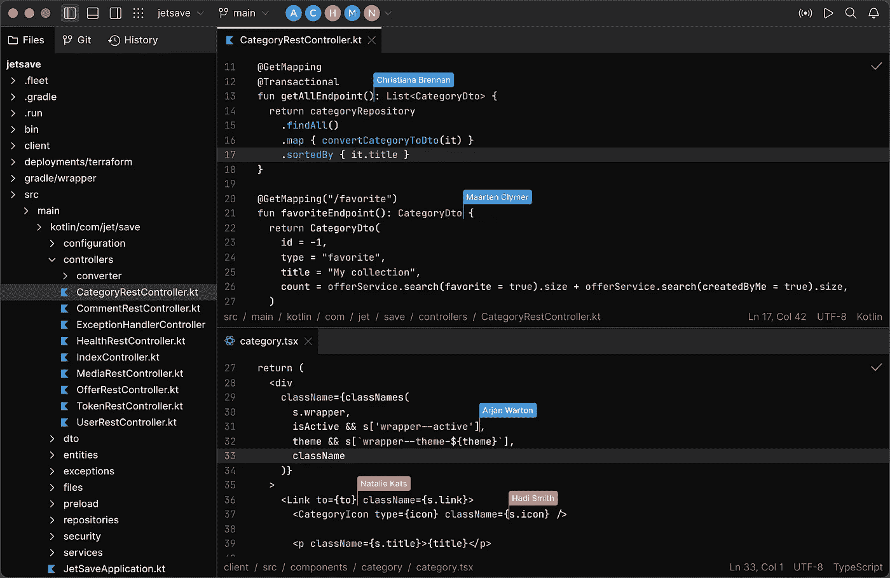
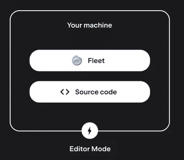
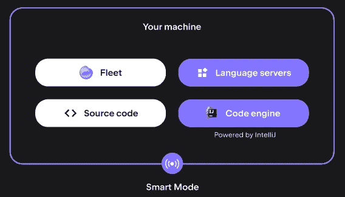
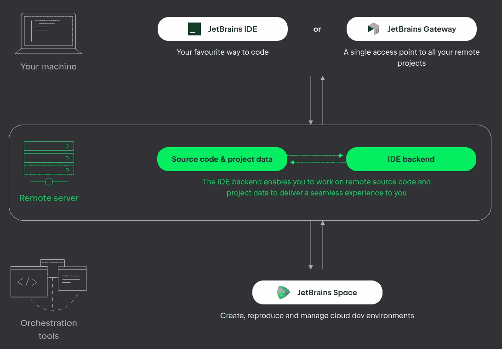

# JetBrains 舰队会成为 VSCode 黑仔吗？

> 原文：<https://betterprogramming.pub/will-jetbrains-fleet-be-a-vscode-killer-89554d1096ae>

## 我对新的 JetBrains 工具的第一印象

作者图片

自 2015 年推出以来，VSCode 编辑器已被广泛采用。为什么？因为它是轻量级的，易于使用，并允许大量的定制。它的插件是其生态系统的重要组成部分，这也是为什么许多开发者迷上了它。它的本机 Typescript 支持非常出色，并促使许多 Typescript 社区使用它。

它有几个竞争对手。过去曾有许多人试图窃取它的王位。尤其是在 web 开发方面，它真正大放异彩。

长期以来，JetBrains 一直是 IDE 业务的重要参与者。到目前为止，他在 VSCode 上最大的竞争对手是 IntelliJ IDEA 和 WebStorm。这些 VSCode 竞争对手最大的缺点是什么？

*   不免费，需要许可证
*   相比之下，启动时间较长
*   占用大量内存和磁盘空间
*   更小的插件生态系统
*   UI 不直观
*   初学者的复杂
*   常数变址
*   无法在浏览器中运行

JetBrains 计划如何重返游戏？通过发布新的 IDE: JetBrains Fleet。

# 从头开始重写

前面提到的 CONS 是如此的根深蒂固，如果他们想回到 Web 开发的竞赛中，他们需要重新开始。

车队 IDE 已经从头开始重新构建。没有旧的 UI 元素。他们把他们 20 年来在这一领域的全部经验都用在了这上面。他们只是重新使用了他们以前的工作，并使他们脱颖而出:他们的代码处理引擎。这个特性使得他们当前的 IDE 在代码重构方面大放异彩。这是人们使用 IntelliJ Idea 或 Webstorm 而不是 VSCode 的主要原因之一。

让我们看看这个新界面是什么样子的:

图片来自 jetbrains.com

这种布局看起来熟悉而直观。他们放弃了许多 UI 元素，使得整个体验变得繁琐。他们选择了像 VSCode 这样的极简主义。所有这些将使从一个到另一个的过渡变得平稳。也会减少第一次使用这个工具时与新手和新人的摩擦。

它支持哪些语言？它的配置怎么样？首次发布仅支持`Java`、`Kotlin`、`Python`、`Go`、`Javascript`、`Typescript`、`Rust`和`Json`。还有很多像`PHP`、`C++`这样的也快了。该工具将自动检测语言并提供智能支持，通过在所有语言中提供代码处理引擎来最大化其价值。

# 不同的性能模式

VSCode 最大的优点是它可以快速启动进行快速编辑。考虑到这一点，Jetbrains 在其编辑器中添加了两种模式:

*   编辑器灯:在这种模式下，编辑器将快速启动，没有延迟。当我们想要快速编辑或偷偷选择一个文件时，这很方便。我们正在用最复杂的功能换取速度。在这种模式下，我们将主要获得基本的语法高亮功能。

图片来自 Jetbrains.com

*   **IDE-smart:** 在这种模式下，我们牺牲速度来获得一个更有能力的编辑器。我们将获得所有的 IntelliJ 好东西:代码完成、定义和用法导航、动态代码质量检查和快速修复。

这为什么令人兴奋？因为我们现在处于主动地位，可以对 IDE 的内部行为进行微调。我们可以在方便的时候在这些模式之间切换。

# 远程工作

编程工作流程不断变化，以适应新技术。如今，我们的机器中甚至不再需要代码。长期以来，VSCode 一直通过远程 SSH 扩展、实时共享或通过 Web 浏览器执行来支持这一点。

舰队编辑器现在支持本地连接到我们代码所在的远程机器。然而，这并不是舰队独有的功能。这个特性将被移植到他们的其他编辑器中。如果我们已经在使用任何 JetBrains IDE，仅仅这一点可能不会成为我们转换的理由。

图片来自 Jetbrains.com

我们还不如开始研究位于分布式 JetBrain 空间的代码。那到底是什么？这是 JetBrain 对 GitHub 代码空间的接管。

我们将能够在几秒钟内启动一个全新的开发环境，并开始编码。我们的开发团队将不再需要处理配置环境的压力。车队编辑器将访问远程代码实例，并使体验无缝。所有更改和编辑都将保存在该远程实例上。

在我看来，JetBrains Space/GitHub code spaces 应该是未来的工作流。出于安全原因，我们不应该再持有和运行任何公司代码。我们应该把所有的开发人员从任何不编码的混乱中解放出来。他们将获得一个快速高效的开发环境，在这里他们可以专注于代码质量。

# 分布的

上述工作流仍然有一个共同的缺点:编辑器仍然以这样或那样的方式在我们的机器上执行。我们的机器仍然负责相当多的计算。

如果我们的机器跟不上怎么办？JetBrain 团队甚至更进一步。在不久的将来，我们将能够选择在别处运行一些 IDE 后端进程。我们可以在云中运行它们。我们可以选择在 docker 容器中的实例中运行它。

那是什么意思？这将把任何不那么强大的机器变成一台速度极快的编程机器。我们将不得不不再依赖我们的开发机器的性能来编辑或执行代码。我们的机器将只是客户端。

JetBrains 空间将依靠这些功能来提供最佳的编码体验。我们将得到一个简单的行动号召，让一个新的远程机器为我们托管和运行编辑器。他们的 JetBrains 空间结合 Fleet 将提供任何开发者可能需要的任何东西。

# 合作的

无论我们是在本地还是分布式执行 JetBrain 的实例，我们都可以邀请其他同行与我们一起进行现场编码。与 VSCode Live 编码扩展非常相似，Fleet 将生成一个邀请链接，我们可以与他人共享。一旦他们接受邀请，我们就可以开始现场编码会话。

为什么这很有用？我们可以设计新的编码工作流程，远程工作不会妨碍我们的协作。我们可以用它来进行结对编程会话、调试，甚至是代码审查。

# 结论

这个产品真的很令人兴奋。但问题是什么？为了充分发挥这一工具的潜力，我们必须购买 Jetbrains 生态系统。它将会是一个免费还是免费增值的产品还没有透露。

你将把自己锁定在一个供应商身上。此外，它的代码不是开源的。使用 VSCode，我们不会遇到这种严重的供应商锁定。我们只是为微软相关的插件获得了更高的质量。随时欢迎任何第三方在生态系统内创建自己的扩展。

JetBrain 舰队插件怎么样？他们现有的插件不太可能在这个新编辑器中可用。因此，将会有一段追赶时间，在这段时间里，中国仍将落后。

所以最终的决定将取决于你。这种权衡值得吗？你喜欢 JetBrains 生态系统吗？你愿意试一试吗？

我为什么兴奋？即使那个编辑器看起来不适合你，有新产品总是令人兴奋的。竞争是推动进步和获得更好工具的关键。