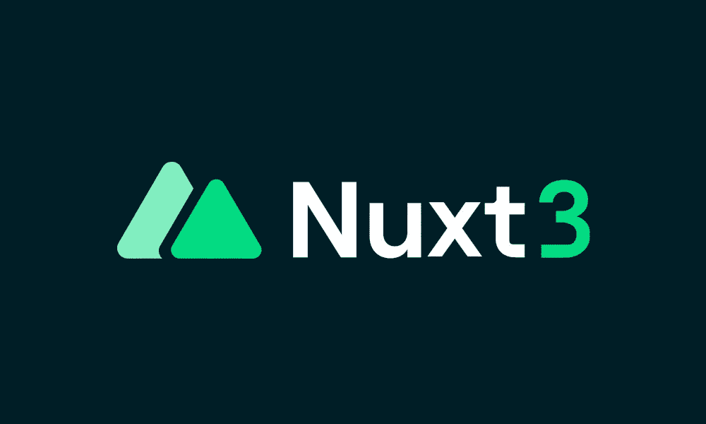
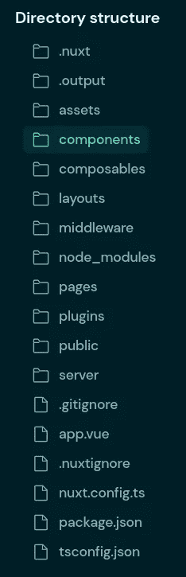
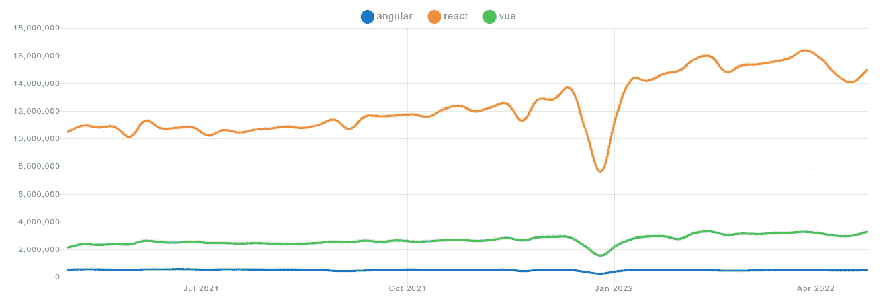

# Nuxt 3 会让 Vue.js 再次伟大吗？

> 原文：<https://betterprogramming.pub/will-nuxt-3-make-vue-js-great-again-122672de31ed>

## 更轻、更快、自动导入、出色的开发人员体验



作者图片

最近，我们发布了令人兴奋的 React 生态系统。先是`Next.js`，然后是`Remix`，后来是`React 18`。这些都抢了任何`JavaScript`框架的风头。他们推动了所有的前端讨论，增加了 React 的发展势头。

幸运的是，`Nuxt`团队凭借其最新的`Nuxt 3`版本卷土重来。它目前在`RC`中，稳定版将于六月发布。尽管一个`Vue.js`很伟大，但是如果它在框架特性上落后，它将无法获得牵引力。这个版本可能会在增加其受欢迎程度方面发挥很大作用🚀。

`Nuxt`到底是什么？你可以把它看成是`Vue.js`里写的`Remix/Next.js`的等价物。这是一个同构的`JavaScript`框架，它使我们能够编写在客户端和服务器上都可以执行的代码。它抽象了所有的复杂性和配置。

新的`Nuxt 3`版本包含许多功能。不仅要创建高性能的 web 应用程序，还要将开发人员的体验提升到一个全新的水平。它有内置的 TypeScript 支持，这是真棒。唯一明显的警告是，它非常固执己见。这是一个高我们需要支付。但是，看到这种进化有多神奇，我会很乐意为此买单。

在这篇文章中，我将总结一些最伟大的特性，这些特性有望引导许多开发者从`React`转向。

# 1.Nitro —服务器引擎

这个新版本的`Nuxt`由一个新的服务器引擎驱动，这个引擎的昵称是`Nitro`。它是从头开始构建的，这意味着没有遗留代码。

它有什么特点？

*   **对 Node.js、浏览器、服务工作者等的跨平台支持**:它使得引擎与平台无关
*   **无服务器支持**
*   **API 路由**:内部由 [unjs/h3](https://github.com/unjs/h3) 项目供电。
*   **自动代码分割**
*   **热模块重装**
*   **混合模式:**精细地控制页面的呈现方式。下一节将详细介绍这一点。

总之，我们得到了一个伟大的引擎，它不仅能够驱动`SSR`。我们可以创建`static`、`spa`或事件`api`应用程序。它的平台无关性和轻量级使得它非常强大。这不仅意味着更快的响应时间，还意味着在我们喜欢的地方托管应用程序的自由。我们现在可以直接在边缘部署我们的代码。这意味着`SSR`代码在尽可能靠近最终用户的地方执行。

# 2.灵活渲染

目前`Nuxt`框架支持两种渲染模式:

*   客户端:浏览器下载所有的`JavaScript`文件，然后生成 HTML 元素
*   **服务器端:**服务器生成 HTML 页面并返回给客户端。然后给客户补充水分以增加互动性。

这些方法各有利弊。例如，`server-side`渲染更昂贵，因为我们在主机中计算视图。然而`client-side`和`SEO`玩的并不好。

在以前的版本中，我们必须为整个应用程序选择一种或另一种方法。在这个新版本中，我们有一个`Hybrid Rendering`。我们可以在每条路由的基础上定制行为。

总之，我们可以更精确地控制哪些路线需要使用`SSR`而哪些不需要。它让我们享受每种方法的优点，并相应地设计我们的 web 应用程序。

⚠️这可能不是第一个稳定版本的一部分，但不久之后就会出现。

# 3.汽车进口

导入是一项微不足道的任务。这是如此枯燥的工作，以至于我们通常依赖工具来处理这些(VSCode 扩展)和订购这些(ESLint)。如果不需要它们呢？

这正是发生在`Nuxt 3`的事情。我们不再需要添加任何导入语句。它将由引擎自动计算出来。`Nuxt`如何知道如何解决这些问题？它们基于目录和命名结构。

*   `components/` —这是应该放置`Vue`组件的地方。
*   `composables/` —这是应该放置堆肥的地方。

## 成分

假设我们创建了一个`components/Foo.vue`:

```
<template>
  Foo
</template>
```

要使用这个组件，我们所要做的就是在我们的`.vue`模板文件中使用它，匹配组件文件名。

```
<template>
  <div>
    **<Foo />**
  </div>
</template>
```

这是怎么发生的？在内部，引擎在`.nuxt`文件夹中创建所有内容。我们可以检查`.nuxt/components.d.ts`并在那里找到我们的组件定义。

## 动态导入

如果我们想以一种懒惰的方式导入那个组件呢？这可以通过在组件名前加上前缀`Lazy`来轻松实现。

```
<template>
  <div>
    **<LazyFoo />** // component will be lazy loaded
  </div>
</template>
```

## 嵌套组件

如果组件在嵌套目录中会怎样？我们只需将路径目录修改为组件的名称。比如`components/**bar**/**foo**.vue`。

```
<template>
  <div>
    **<BarFoo />**
  </div>
</template>
```

*💁‍♂️但是为了一致，建议将组件命名为* `*components/bar/****BarFoo****.vue*` *。*

## 客户端特定组件

如果我们只想让组件成为客户端，该怎么办？我们可以使用`ClientOnly`包装。

```
<template>
  <div>
    **<****ClientOnly>**
      **<LazyFoo />
    </ClientOnly>
**  </div>
</template>
```

## 显式导入

在这个场景中，如果需要，我们可以通过使用`#components`来使用显式导入。

```
import { Foo } from **'#components'**;
```

# 4.证明文件

文档很棒。有传统的`API`这里可以找到。

然而，这里有一个有趣而直观的入门指南。它仍然是一个过程中的工作，但帮助我们以一种简单的方式理解`Nuxt`项目。由于`Nuxt`有很多文件夹范围的特性，一开始可能很难理解。一些目录参与一些基于文件的路由。

以下是我们可能找到的一些文件夹示例:

*   **页面:**基于文件的路由通过`Vue Router`在你的 web 应用内创建路由。
*   **服务器:**扫描文件夹以向 HMR 支持注册 API 和服务器处理程序。
*   公共部门:我们需要把我们的资产放在哪里
*   **组件:**可从任何页面导出的所有组件。
*   **插件:**我们需要放置导入插件的目录。

为了快速掌握这一点，您可以在本指南中找到任何`Nuxt`项目的完整树。



https://v3.nuxtjs.org/guide/directory-structure/components 的字幕

还有一些互动的例子可以在[这里](https://v3.nuxtjs.org/examples/essentials/hello-world)找到。这些链接指向`CodeSandBox`或`StackBlitz`。

# 5.开发者体验

目前，JavaScript 框架确实考虑到了开发人员的体验。对打字稿有很大支持的是`Nuxt 3`。我们可以将`API`类型与我们的`components`结合起来，后者将整个事情很好地包装在一起。

此外，我们现在可以使用最新的花哨的构建工具来构建我们的项目。这让整个体验更加爽快。

开箱即用`Nuxt 3`支持:

*   `Vite`
*   `webpack 5` + `esbuild`
*   PostCSS

默认的构建器是`Vite`，但是切换到`Webpack5`很容易，但是可以简化对`nuxt.config.ts`文件的调整:

```
export default defineNuxtConfig({
  **vite: false**
})
```

您可以使用以下命令来扩展任何配置

*   `extendWebpackConfig(callback, options?)`
*   `extendViteConfig(callback, options?)`
*   `addWebpackPlugin(webpackPlugin, options?)`
*   `addVitePlugin(vitePlugin, options?)`

多亏了现代 JavaScript 编译器，我们可以期待更快的构建时间和更好的开发者体验。

# 包裹

我们已经看到这个版本是多么的伟大和重要。希望这将有助于增加`Vue.js`的兴趣。多样化是很棒的，因为竞争会带来很多好主意。这就是推动创新的方式。

我们可以看到 React 是如何统治 JavaScript 的视图生态系统的。



图片来自 www.npmtrends.com。

React 的社区更大，也更容易找到工作。然而，像`Nuxt 3`这样的工具也许能够平衡这两者。

然而，这是一个网站开发者的大好时机。我们有很多很好的选择。我们是去`Remix`、`Next.js`还是`Nuxt.js`？这些我们都不可能出错。这将归结为我们的个人喜好。

[](/next-js-vs-remix-analyzing-key-aspects-and-differences-8674beaba695) [## Next.js vs. Remix:分析关键方面和差异

### 通过比较 Remix 和 Next.js 的最新版本，知道哪一个适合你

better 编程. pub](/next-js-vs-remix-analyzing-key-aspects-and-differences-8674beaba695)