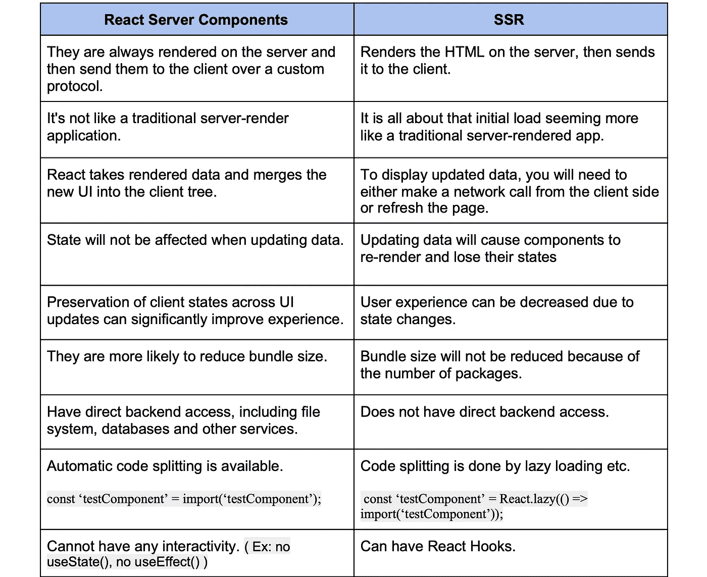

# React 服务器组件会取代 SSR 吗？

> 原文：<https://betterprogramming.pub/will-react-server-components-replace-ssr-f2f772347109>

## React 服务器组件的诞生及其对 SSR 的影响


作者照片。

[React 服务器组件](https://reactjs.org/blog/2020/12/21/data-fetching-with-react-server-components.html)是 React 最近推出的一个全新特性。这是人们最期待的特性之一，它允许你和谐地使用客户机和服务器组件。

尽管它仍处于实验阶段，但它的功能还有很多值得借鉴的地方。

然而，你们中的一些人可能会想，“我们已经有了服务器端渲染(SSR)，现在又有了另一种选择。”

# SSR 呢？

了解 React 服务器端渲染和服务器组件有不同的用途是很重要的。

React SSR 是为了加速 React 应用程序的初始加载。为了实现这一点，SSR 提供了一种机制来定义当最终用户访问应用程序 URL 时，您需要向他们显示什么。

根据应用程序的 UX(用户体验)需求，它可以是加载图标，也可以是内容填充页面。但是在引导 React 应用程序之后，交互就变得活跃了。

尽管如此，您可能想知道为什么我们需要服务器组件。在回答这个问题之前，让我们了解一下他们。

# React 服务器组件

React 的新服务器组件呈现在服务器端。

您甚至可以编写一个服务器组件来从数据库中获取数据，并使用 Node.js 呈现其内容。这多酷啊！

您还可以在一个 React 应用程序中同时使用服务器组件和客户端组件。


使服务器组件和客户端组件协同工作

让我们看看 React 服务器组件带来的其他一些优势。

## 控制 JavaScript 包的大小

有了服务器组件，您可以更好地控制包的大小。我们举个例子。假设您的项目中有十个依赖项。如果你只需要将其中的五个下载到浏览器中，其余的留在服务器中，那该怎么办？

考虑到它们的大小，您可以选择通过将它们移动到服务器组件来减少一些依赖项。

## 零束尺寸组件是可能的

最令人兴奋的是，在某些应用程序中，您可能不需要在浏览器中保留任何依赖关系。包的大小将比以往任何时候都小。

## 增加代码重用

因为您可以选择客户机和服务器组件，所以您可以为正确的工作选择正确的组件。

例如，您可以选择一个服务器组件在服务器端呈现发票并显示预览，同时使用相同的输出生成 PDF。

对于特定的用例，您还可以与 SSR 和服务器组件共享 JavaScript 库。

## 兼容许多 JavaScript 框架

服务器组件从一开始就被开发用于任何 JavaScript 元框架，比如 Next.js 和 Gatsby。

它们允许开发人员使用单一语言和单一框架来编写应用程序。最重要的是，开发人员可以在服务器和客户端共享代码。

## 跨项目重用客户端和服务器组件

您还可以使用[位](https://bit.dev/)开源平台跨多个项目共享客户端和服务器组件。这将有助于最大化代码重用，并在整个产品组合中保持一致的设计。

但是，如果已经在使用 Bit 集合，可以为支持 Node.js 的服务器组件创建单独的集合。

这样，您可以将它们分开，并定义将它们注入到任何项目的服务器组件树中的位置。

## 已知限制

尽管服务器组件是全新的，但 React 团队在优先考虑这个急需的特性方面做得非常出色。但是，您应该知道一些限制。

在某些情况下，不可能将所有组件都作为服务器专用组件。此外，缺乏对 React 挂钩(`useState()`，`useEffect()`)的支持将限制它们在特定用例中的应用。

由于该特性是新的，因此服务器组件需要进行一些优化。

例如，当前，相同的代码被重新运行，并且组件将在每个请求时重新呈现。

此外，服务器组件需要相当多的关注，包括路由和重新获取。因此，考虑如何将“当前 SPA”移植到他们身上还为时过早。它们对建筑有着重要的影响，并不是偶然出现的。

# 服务器组件，SSR，还是两者都有？

如您所知，服务器组件和 SSR 是相辅相成的。

如果我们仔细观察 SSR，我们可以指示 web 服务器在加载单个页面时呈现一个组件。例如，如果我们使用 Node.js，我们可以安装`‘react-dom/server’` NPM 库，并使用它来呈现`App`组件:

```
ReactDOMServer.renderToString(<App />);
```

如您所见，这是一次性操作。在应用程序的初始加载之后，我们没有多余的时间从服务器端呈现任何其他组件。

因此，正如我之前解释的那样，SSR 改善了初始页面加载时间，并向用户显示了早期输出——甚至在 JavaScript 包加载之前。

另一方面，服务器组件与 React 客户端组件协同工作(识别客户端组件树和服务器组件树)。这发生在 JavaScript 包被加载之后。

此外，它们呈现内容的方式也有所不同。例如，服务器组件不呈现 HTML。它们以类似于 JSON 的特定格式呈现。

```
J0:{"$","div","null",{"className":"main-class"}}
```

所以，让我们来回答这个棘手的问题:服务器组件会取代 SSR 吗？

简而言之，没有！我希望你已经明白为什么了。

让我们看看您可以考虑使用 React 服务器组件的几个地方:

*   如果我们需要的某个特定组件的库很大，但是没有在其他地方使用。
*   在移动设备上渲染复杂的组件需要时间。
*   代码可在前端和后端重用的地方(例如 PDF 预览和下载)。

另一方面，您仍然需要依靠 SSR 来完成以下工作:

*   在 React 应用程序加载之前，用户可以看到初始加载、布局甚至丰富的内容。
*   SEO 友好的内容。
*   为 React 应用程序提供任何种子数据，以便在不调用服务器的情况下即时呈现(例如登录用户的详细信息)。

因此，通过使用 SSR 和 React 服务器组件来获得两个世界的最佳效果是很重要的。



服务器组件和 SSR 之间的比较

然而，在实践中，您仍然会在您的项目中主要使用客户端组件和 SSR。您将只在重要的地方考虑 React 服务器组件。

感谢阅读！干杯！