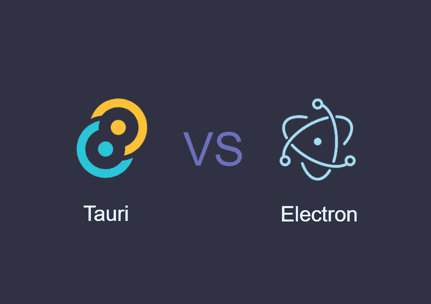
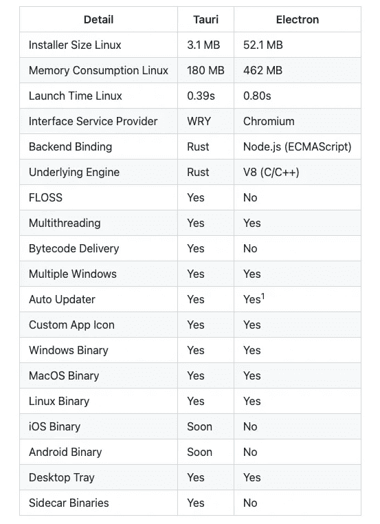
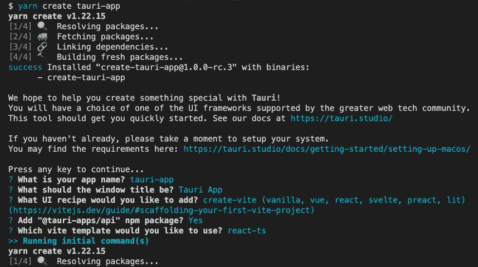
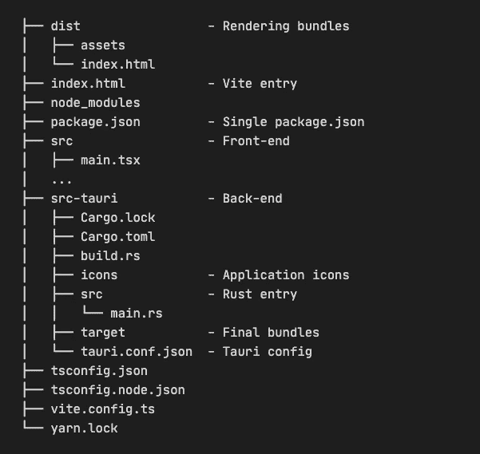
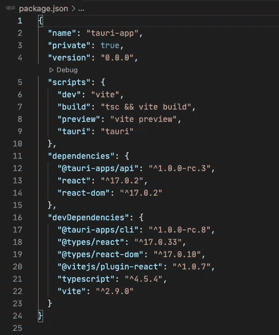
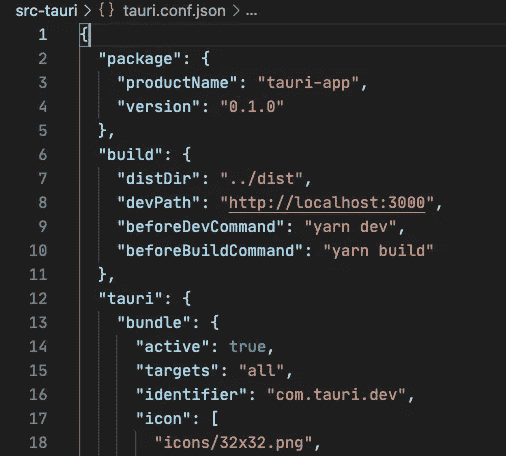
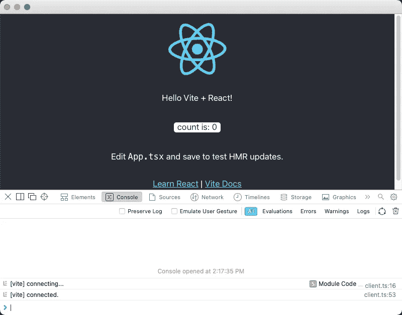
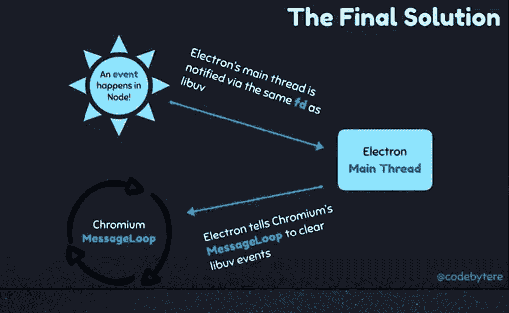

# Tauri 会成为电子黑仔吗？

> 原文：<https://betterprogramming.pub/will-tauri-be-an-electron-killer-38fd6478004>

## 你知道 Tauri 吗？



作为一个前端开发人员，我相信你应该了解电子。它使用 JavaScript 开发跨平台的桌面应用，但是你听说过 Tauri 吗？

# Tauri 是什么？

> Tauri 是一个为所有主流桌面平台构建微小、速度惊人的二进制文件的框架。开发人员可以集成任何编译成 HTML、JS 和 CSS 的前端框架来构建他们的用户界面。应用程序的后端是一个来源于 rust 的二进制文件，带有一个前端可以与之交互的 API。

以上介绍来自官方 [Github 库](https://github.com/tauri-apps/tauri#introduction)。简短的几句话概括了 Tauri 的特点:

*   小型建筑
*   良好的性能
*   二进制文件
*   跨平台
*   用户界面可以使用 web 前端技术堆栈
*   程序后端使用 Rust

看起来太好了！那么它会是电子杀手吗？

# Tauri 对电子



图片来自 [Github](https://github.com/tauri-apps/tauri#comparison-between-tauri-and-electron)

上图是现在 Tauri 和 Electron 的对比。

你可以看到它比电子有一些优势，比如包装尺寸和发射时间。它还有一些电子不支持的特性。

但是**锈**最吸引我的注意。近几年频频出现在前端圈，还有 SWC，德诺等。都在用。它是一种静态类型安全的语言，没有运行时和垃圾收集机制。它特别擅长于高性能、可靠性和高生产率。编译器足够严格以保证内存安全和线程安全。

在这里，它被用作后端绑定和底层引擎。我将在下面与电子的比较中描述它是如何工作的。

接下来，我将从几个角度比较这两者:开发、构建、自动更新和架构。

# 发展

要创建 Tauri 应用程序，您必须首先在本地计算机上准备好 [Rust 环境](https://www.rust-lang.org/tools/install)和 [Node.js 环境](https://nodejs.org/en/)。你可以去他们官网按照步骤安装。让我们关注如何创建一个 Tauri 项目。

```
yarn create tauri-app
#OR
npx create-tauri-app
```

Tauri 内置了很多模板，所以我们可以自由选择:



我在这里选择了 Vite + react-ts，下面是生成的目录:



可以看到项目结构非常清晰。如果选择另一个模板，整个项目结构大致相同。主要变化是前端项目结构。

我们来看看默认生成的`package.json`:



太棒了。Tauri 已经为我们做了一切。我们可以用`yarn tauri dev`开始开发，用`yarn tauri build`包装最终产品。

web 前端命令可以在`src-tauri/tauri.conf.json`中定制:



Tauri 也可以有选择地集成到现有的前端项目中。相比之下，电子官方不提供模板创建功能。只能根据文档逐步配置。

所以在开发体验方面， **Tauri 开箱即用，给我们一个清晰的项目配置，绝对节省了我们很多时间。**

# 建筑物

Rust 现阶段的编译时间饱受诟病，这是 Tauri 打包时间过长的直接结果。但是好消息是下一次编译将使用缓存来减少时间。此外，最终产品将以二进制形式存在，为破解增加了一层安全保障。

默认情况下，Electron 不会打包主程序代码，它甚至会将巨大的`node_modules`打包到最终程序中。这进一步增加了制造产品的尺寸。这也导致源代码没有加密机制。即使它把源代码包装在 asar 里，也很容易被破解。

当然，我们可以使用构建工具对源代码进行打包和模糊处理，这显然是费时费力的。

同样值得注意的是，电子可以跨平台构建。例如，它可以在 Mac 平台上为 Windows 平台构建软件包。而 Tauri 目前只能搭建在相应的平台上。这对于自动打包和分发的系统来说是一个麻烦。

# 自动更新

为了在三大桌面平台上支持自动更新，Electron 需要第三方库，如`electron-builder`或`electron-packager`。Tauri 可以原生支持它。

# 体系结构

在架构上，Tauri 没有包装铬。**它使用自主开发的** [**WRY**](https://github.com/tauri-apps/wry) **连接各种平台的 Web 引擎，提供统一的界面来呈现 WebView。**它所使用的每个平台的底层 Web 引擎:

*在 Windows 平台上使用微软 Edge Chromium 的 WebView2Mac 上的 WebKit 在 Linux 平台上使用 WebKitGTK。*

这意味着**它与铬**无关。如果在 Mac 平台上打开 DevTools，可以看到其内部 UI 与 Safari 一致。如果你在 Windows 平台上打开 DevTools，你会发现它的内部 UI 和微软 Edge 是一致的。



也就是说，它只做**粘合层**，所以它的体积很小。

除此之外，他们还开发了 [TAO](https://github.com/tauri-apps/tao) ，一个用于跨平台应用窗口创建的库，并在 WRY 中重新导出，用于事件循环和窗口创建。

电子包裹整个铬进行前端渲染。在事件循环中，它启动了一个单独的线程，该线程持续轮询 Node.js 中的`backend_fd`以获取来自 [libuv](https://github.com/libuv/libuv) 的新事件。当发现新事件时，它们被转发到 Chromium 的事件循环(MessageLoop)。详见下图。



图片来自 [Shelley Vohr | JSHeroes 2019](https://www.youtube.com/watch?v=OPhb5GoV8Xk)

通过以上方式，Electron 将 Node.js 的事件循环整合到 Chromium 的事件循环中，保证了应用的性能。

两相比较，我的感性认识是:

电子更像是一种融合技术，将 Node.js 集成到 Chromium 中。

Tauri 更像是胶水，把 WebView 的渲染交给各个平台的内置 Web 引擎。Tauri 是可以通过 WRY 和 TAO 控制 GUI 的顶层。

# 结论

Tauri 性能好，前景好。它解决了电子存在的许多问题，带来了简单方便的开发体验。但仍有一些问题需要改进，Rust 的学习曲线是曲折的，有一定的学习成本。

今天电子发展得很好。而且它依托的是欣欣向荣的 Node.js 社区，周边生态非常好。它前后端都用 JavaScript，所以学习成本更小。

你觉得 Tauri 怎么样？

*感谢阅读。如果你喜欢这样的故事，想支持我，请考虑成为* [*中会员*](https://medium.com/@islizeqiang/membership) *。每月 5 美元，你可以无限制地访问媒体内容。如果你通过* [*我的链接*](https://medium.com/@islizeqiang/membership) *报名，我会得到一点佣金。*

你的支持对我很重要——谢谢。