# 你的电影会成功还是失败？

> 原文：<https://betterprogramming.pub/will-your-movie-be-a-hit-or-flop-linear-regression-will-tell-912dcd5c5b3d>

## 线性回归会告诉你

幻灯片演示模板 go

当一部新电影上映时，除了观看预告片，在线电影评级和推荐已经成为人们在决定是否应该观看这部电影之前首先检查的事情之一。

好吧——你们中的一些星战迷可能不敢苟同，但仍然会观看新的星战电影，即使评级最终是垃圾。然而，让我们现实一点——你最有可能仍然会检查评级。

Slidesgo 的演示模板| Freepik 的信息图表

这可能会对票房产生严重影响，特别是当它在美国每年产生 110 亿美元的收入时。尽管一个负面评论不会成就或破坏一部电影，但数千或数百万个负面评论肯定会造成一些损害。

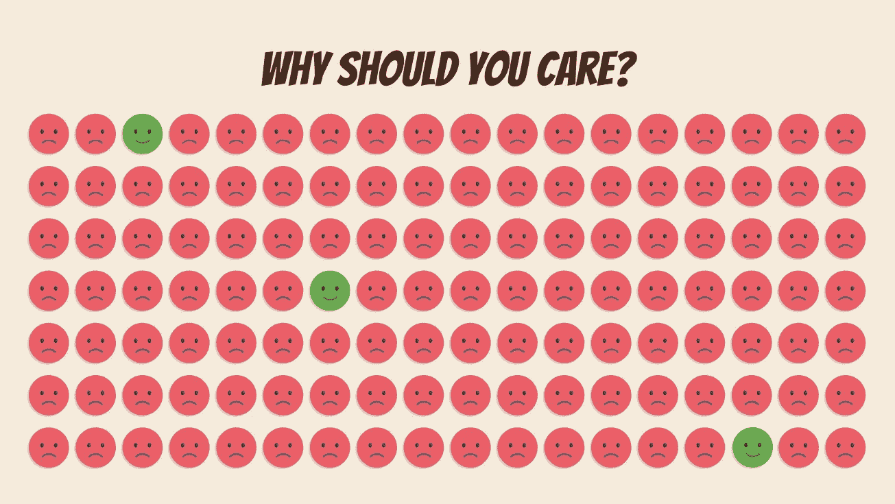

Slidesgo 的演示模板| Freepik 的信息图表

# 目标

如果你正在制作你的下一部电影，有哪些特质是你希望重点关注或不太强调的？为了找到答案，我们将使用线性回归来预测是什么推动了 IMDb 的用户评级。

# 方法

## 数据析取

通过抓取 [IMDb 网站](https://www.imdb.com/)，我收集了 IMDb 上 1000 多部电影的数据，按 IMDb 人气排名，于 2018 年上映。我选择 2018 年是因为它是最新的数据，同时允许全年收集最低评级。

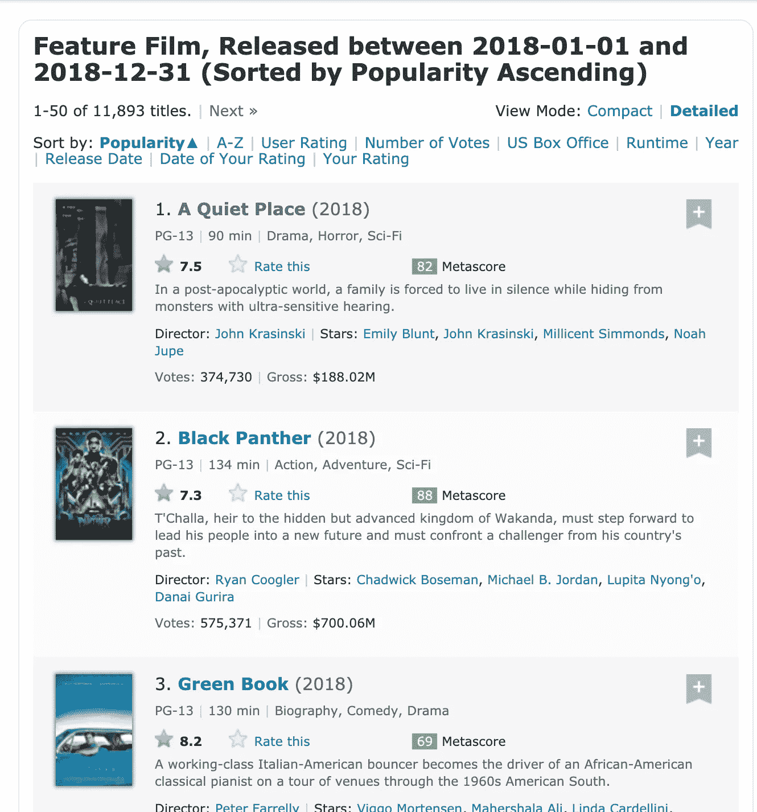

**1。在 Python 中导入所有必需的库。**

**2。为 Chrome 设置网络驱动和选项。**

**3。在每次请求之间设置一个睡眠计时器，以避免被网站阻止。**

**4。创建定制的函数，以便在以后的抓取中使用。**

**5。收集电影 id(特定于 IMDb)和电影名称。**

**6。搜集电影信息。**

**7。合并两个数据框并将其保存为 csv 文件。**

## 数据清理

对于这一节，我不会将代码放在这里—这是正常的数据清理，例如确保每一列都转换为有用的数据类型，即 object、int64 和 dummy 变量。

继续下一节，看看我对异常值和空值做了什么。

# 数据探索

## 极端值

有三个异常值被删除。

*   “La Flor”——13 小时运行时间

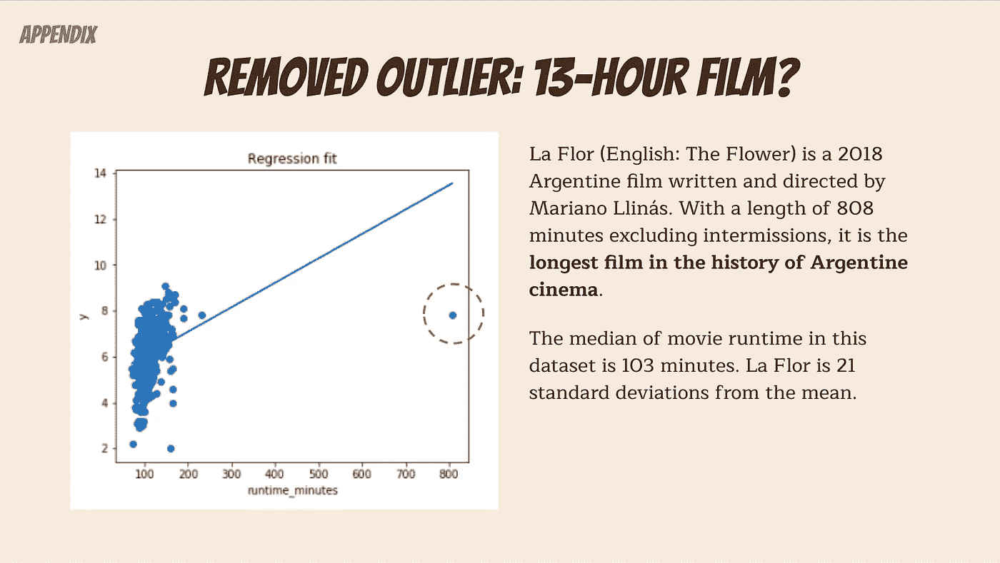

Slidesgo 的演示模板| Freepik 的信息图表

*   “黑豹”——评论数量极高。
*   “复仇者联盟 3：无限战争”——评论数量极高

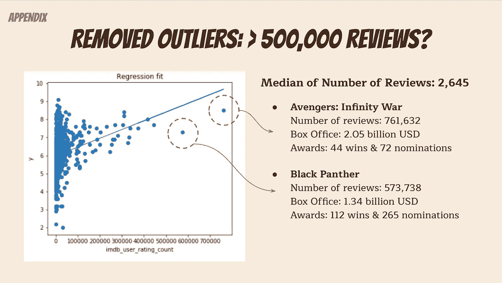

Slidesgo 的演示模板| Freepik 的信息图表

## 缺失数据

有四部电影没有任何运行时间信息，因此被删除。

## 目标和功能

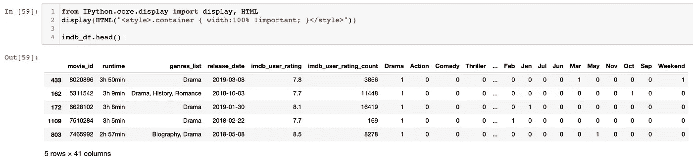

**目标:** `imdb_user_rating`

请注意，IMDb 用户的评分是 10 分制。例如，“复仇者联盟 3：无限战争”的用户评级是 8.5。

**我开始使用的功能:**

*流派*

*   为电影列出的所有类型。请注意，一部电影可能会列出多种类型。然后，我选择了下面的热门类型，并将其包含在模型中。其余归入`other_genre`。
*   `genre_count` -列出的电影类型数量
*   `Drama` -在`genre_list`中列出的带有“剧情”的电影
*   `Comedy` -在`genre_list`中列出“喜剧”的电影
*   `Thriller` -在`genre_list`中列出的带有“惊悚片”的电影
*   `Action` -在`genre_list`中列出的带有“动作”的电影
*   `Horror` -在`genre_list`中列出“恐怖”的电影
*   `Crime` -在`genre_list`中列出“犯罪”的电影
*   `Romance` -在`genre_list`中列出的带有“浪漫”的电影
*   `other_genre` -没有足够电影的电影类型

*IMDb 用户评分统计*

*   `imdb_user_rating_count` -电影的评论数量
*   `imdb_user_rating_count_squared` - `imdb_user_rating_count`平方
*   `imdb_user_rating_count_log`-`imdb_user_rating_count`的日志转换

*运行时间*

*   `runtime_minutes` -电影开始到演职员表场景结束之间的时间
*   `runtime_minutes_squared` - `runtime_minutes`平方
*   `runtime_minutes_log`-`runtime_minutes`的测井转换
*   `runtime_minutes_loglog`-`runtime_minutes`的双对数变换

*发布日期*

*   `Weekend` -周末上映的电影的虚拟变量。请注意，周五包括在内，因为周五通常包括在“开幕周末”中。
*   月份——电影上映的月份，如`Jan`、`Feb`、`Mar`等。注意`Apr`被删除，因为它们是虚拟变量。
*   季节——电影上映的季节，如`Spring`、`Summer`和`Winte` r。注意`Fall`被删除了，因为这些是虚拟变量。

**流派为特色**

当我为电影类型创建虚拟变量时，我意识到这些实际上是特征。由于每部电影都可以列出多种类型，而且每种类型都不相互排斥，“戏剧”不再是一个虚拟变量。由于有如此多的类型，并且所有类型都有足够的电影在模型中，我决定选择前七种类型(每种类型 150 部电影)，并将其余的分成`other_genre`。

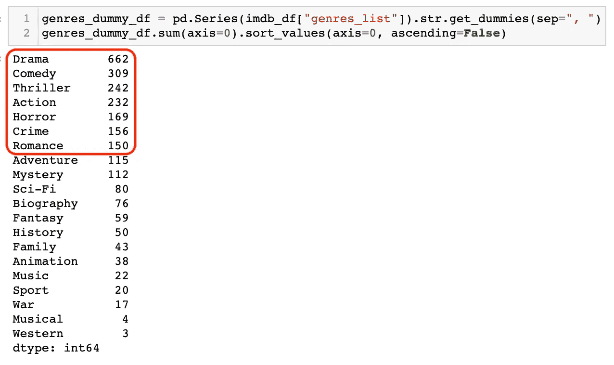

## 特征转换

您可能已经注意到，我对其中两个特性进行了对数转换。下面你就知道为什么了！

**评论数量**

在`imdb_user_rating_count`上执行对数转换不仅返回最佳的 R^2(它加倍了它！)，回归线也拟合得更好。另一方面，对变量求平方实际上会返回更低的 R^2 和更高的 p 值。因此，我将在模型中使用`imdb_user_rating_count_log`。

1.  **没有转换**

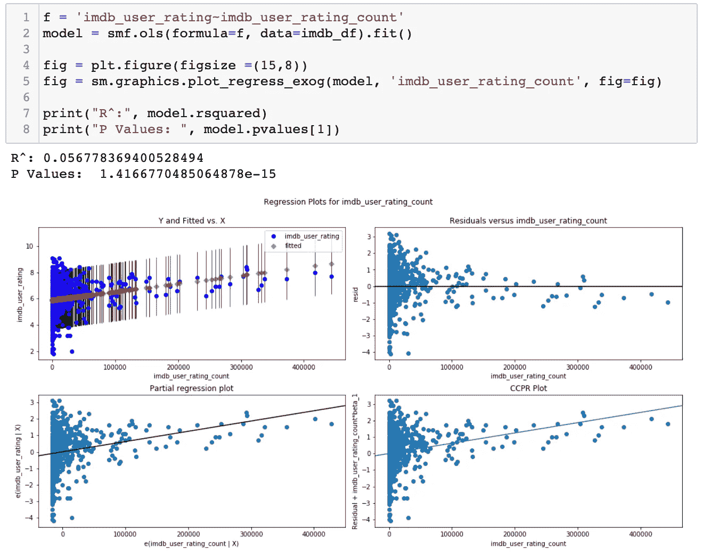

**2。日志转换**

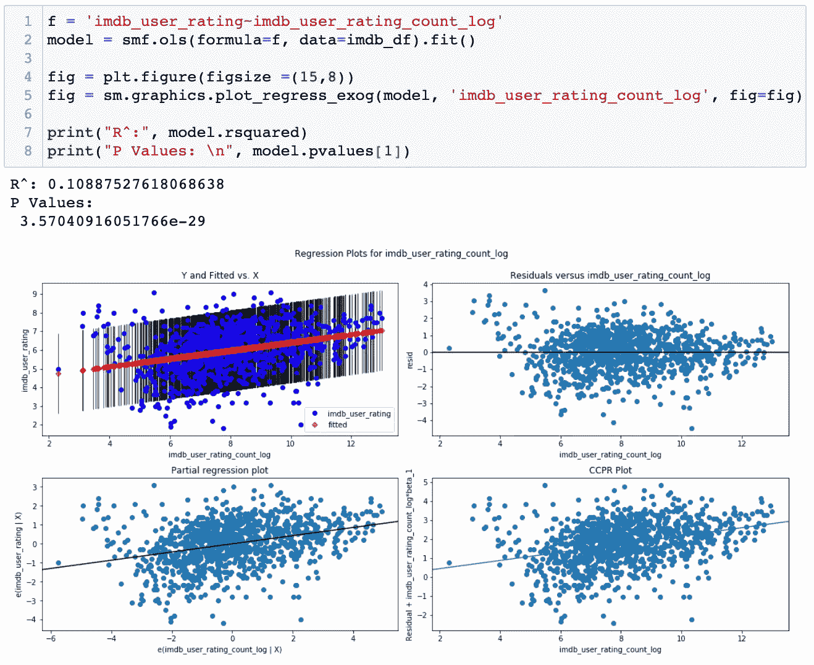

**3。多项式(二次)变换**

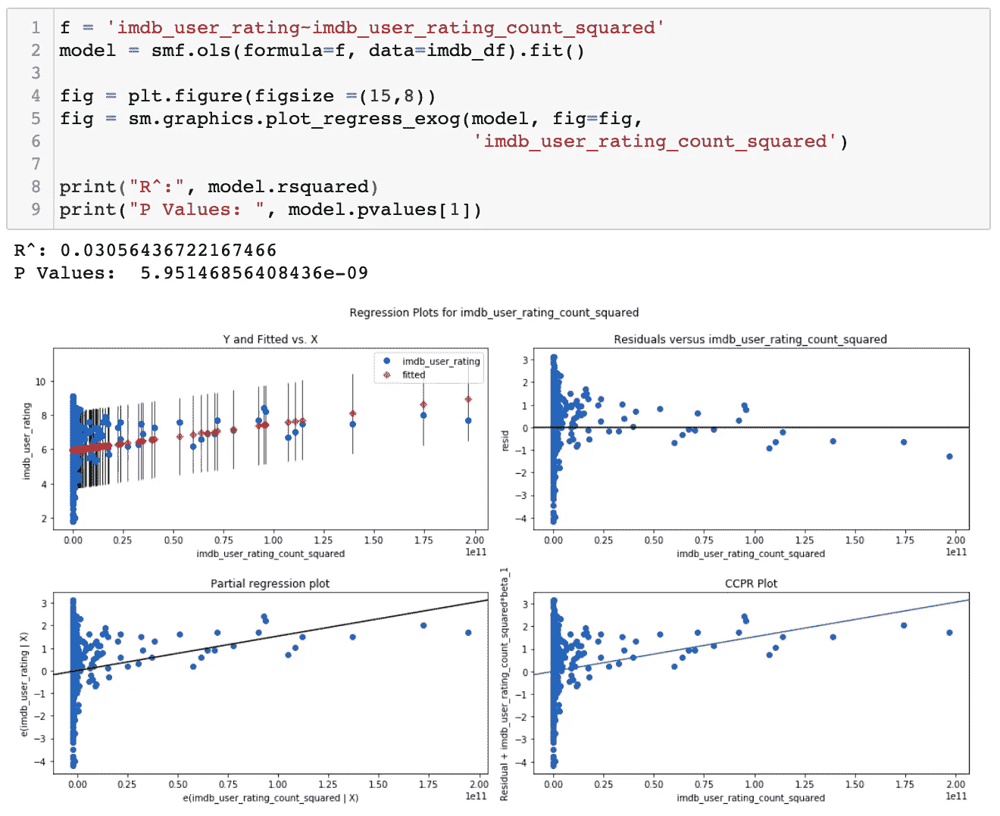

**电影运行时**

情况也类似，除了在`runtime_minutes`上的日志转换并没有像日志转换后的`imdb_user_rating_count`那样改善它。然而，它仍然返回一个稍微好一点的 R^2.因此，我将在模型中使用`runtime_minutes_log`。

1.  **没有转换**

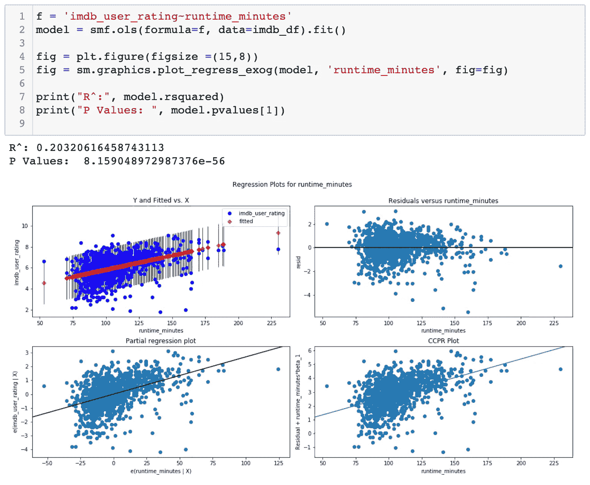

**2。日志转换**

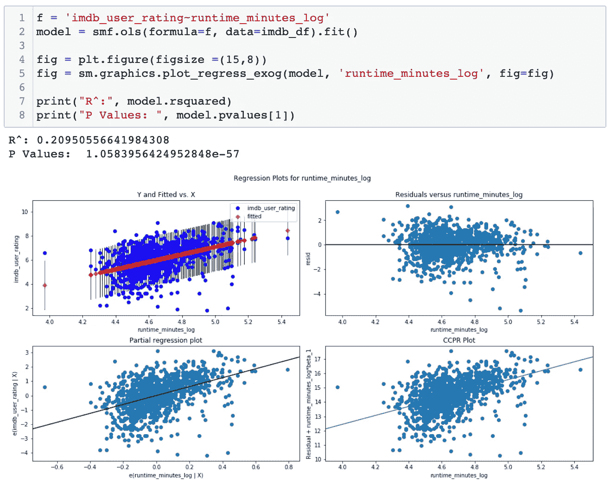

**3。多项式(二次)变换**

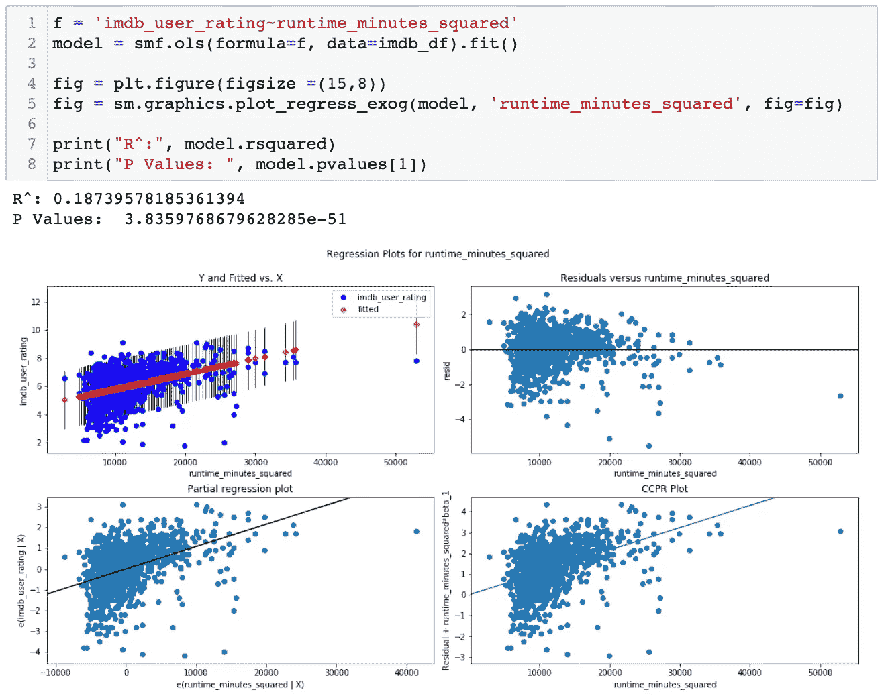

# 数据建模

## 型号和功能

使用普通最小二乘法，下面是对模型最有预测能力的特征。

*   `imdb_user_rating_count_log`p 值为 0.000
*   `runtime_minutes_log`p 值为 0.000
*   `Weekend`p 值为 0.000
*   `Drama`p 值为 0.000
*   `Action`p 值为 0.000
*   `Thriller`p 值为 0.001
*   `Horror` p 值为 0.000

## 测试 R 和条件编号

我的模型使用训练和测试分割(80%和 20%)，条件数为 282，R 为 0.37。

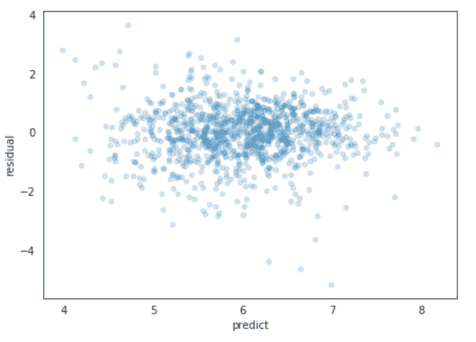

残差图

# 结果

幻灯片演示模板 go

0.37 的 R 表明该模型具有一定的 T2 预测能力。总的来说，流派是最重要的特征。具体地说，“动作”、“惊悚片”或“恐怖片”的类型与用户评级成负相关，而其他类型则成正相关。

*   IMDb 评论数量每增加 1%，IMDb 用户评分就会变化 0.09%。
*   电影播放时间每增加 1%，IMDb 用户评分就会变化 14.12%。
*   如果这部电影包括“戏剧”作为流派之一，IMDb 用户评级变化 94.75%。
*   如果这部电影包括“动作”作为类型之一，则 IMDb 用户评级改变-70.28%。
*   如果这部电影包括“惊悚片”作为其中一种类型，IMDb 用户评级变化了-45.6%。
*   如果这部电影包括“恐怖”作为类型之一，IMDb 用户评级变化为-72.17%。

# 未来的工作

如果有更多的时间，我想在模型中包括以下数据集，看看它是否会提高模型的准确性:

*   **人口统计:**随着社会越来越关注多样性和包容性，看看人口统计对模型是否有影响会很有趣。
*   **演员们在上映后一年内获得的提名和奖项:**由于奖项和提名总是会引起很多关注，并可能导致更多评论被在线提交，因此评级可能会受到很大影响。
*   国内总收入:我假设随着收入的增加，更多的人在看电影，这意味着会有更多的评论被提交。这也应该导致对用户评级的更大影响。