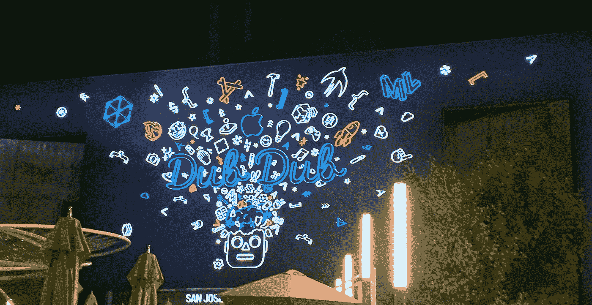
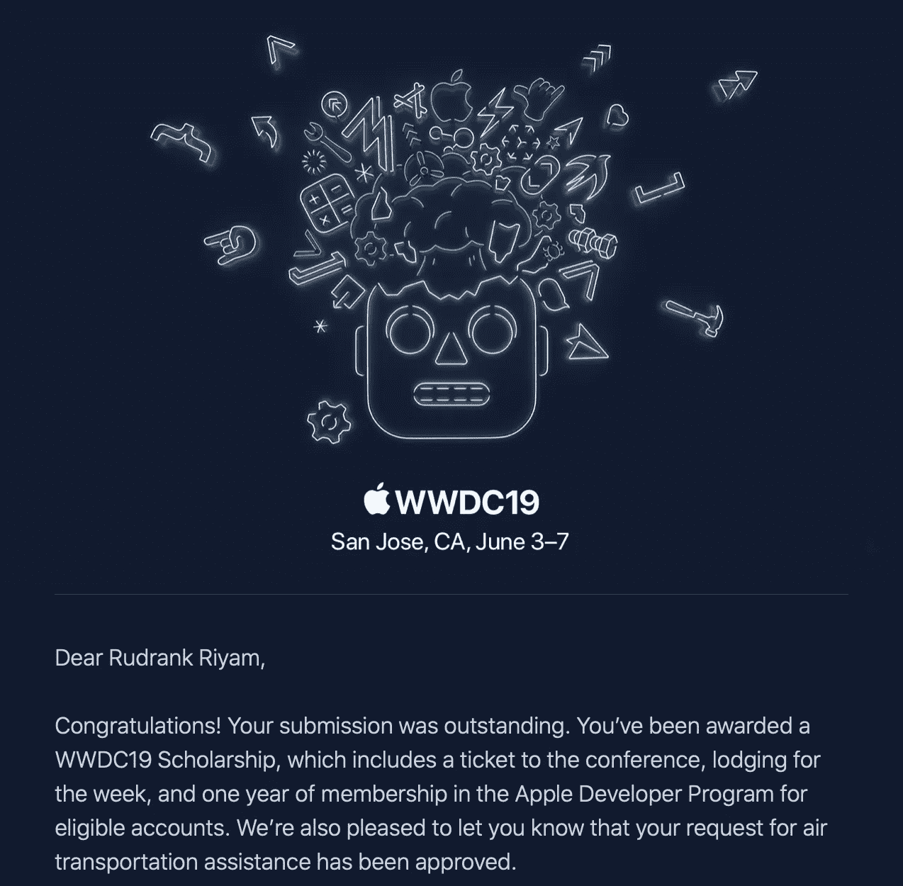
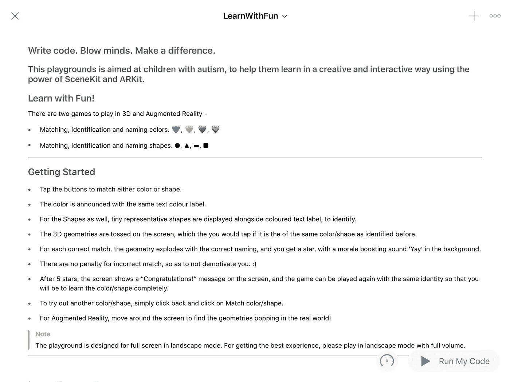
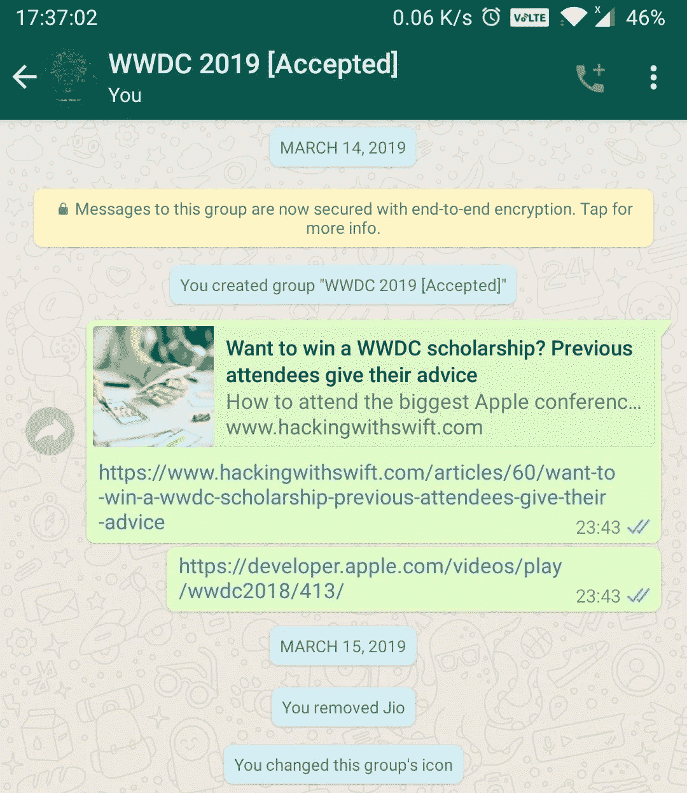
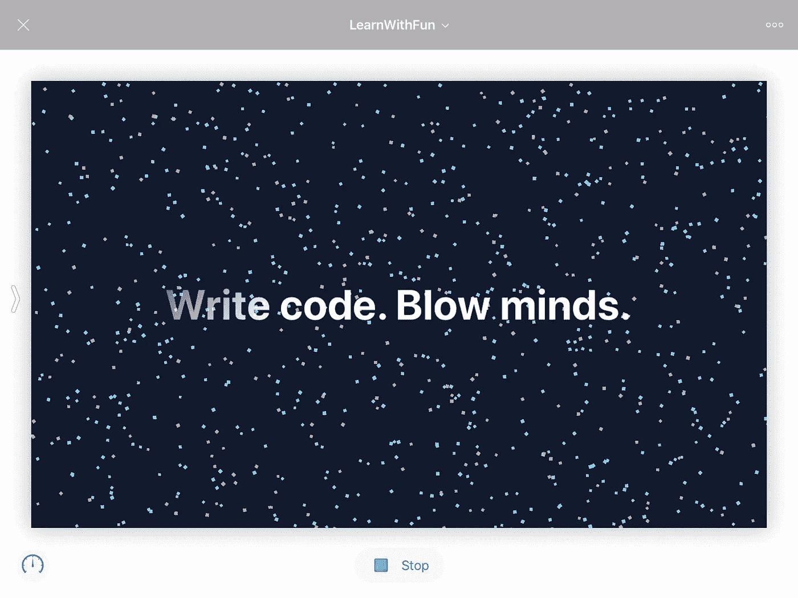
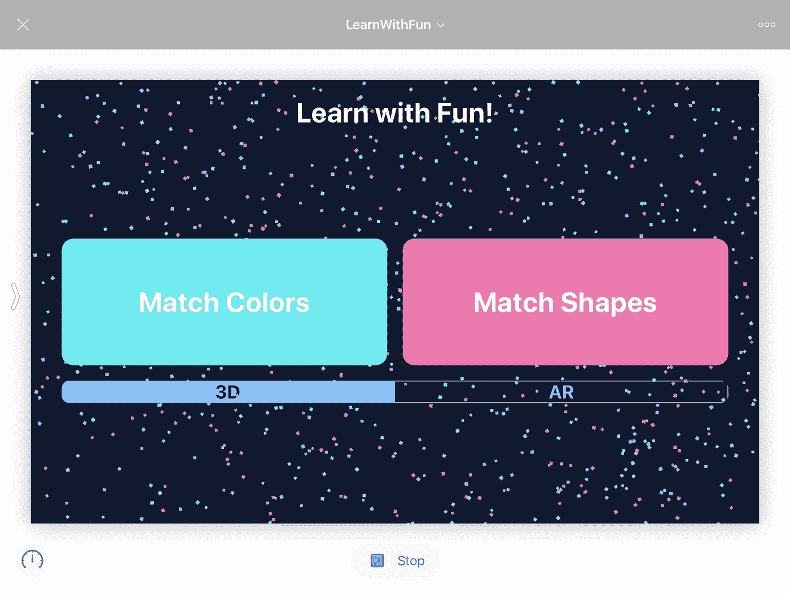

# 2019 年赢得苹果 WWDC 奖学金是什么感觉

> 原文：<https://betterprogramming.pub/winning-the-apple-wwdc-scholarship-2019-f694d603d626>

## 记录创建提交项目的过程

WWDC 2019

# **2018 年 6 月 4 日**

我记得浏览 WWDC 网站，观看我的 MacBook Air 上的主题演讲。

我希望有一天能现场观看。因此，在介绍音乐中，我开始探索这个网站，以了解开发者是如何获得门票的。根据抽签制度，开发商的出价是**1600 美元**。嗯，没有。我向下滚动，在主页上找到了这个。

"**奖学金—** *学生和 STEM 组织成员可以申请获得一张会议门票、住宿和一年的苹果开发者计划会员资格。"*

啊，这就是我要找的东西！

但是现在我要等一年才能申请。我浏览了需求，一个关于 Xcode Playgrounds/Swift Playgrounds 的完整项目，还有一些随笔。我刚刚开始 iOS 开发，我对 Playgrounds 的经验仅限于声明几个变量。而且只有 350 名学生是从世界各地挑选出来的，从在校生到博士都有。这似乎很难，所以我放弃了。

# **快进到 2019 年 4 月 16 日**

凌晨 4 点 25 分

**主题:你获得了 WWDC19 奖学金。**

让我来介绍一下我是如何获得这项奖学金的，你可以从中获得一些明年的价值！

# **倒回 2019 年 3 月 14 日**

我的期中假开始了，我不想再浪费了。

我意识到提交期很快就要开始了！在这一点上，我对 iOS 有一些经验，但对制作游戏毫无经验。

苹果要求你*使用*[*Swift Playgrounds 2.2*](https://itunes.apple.com/us/app/swift-playgrounds/id908519492?mt=8)*或*[*Xcode 10.1*](https://itunes.apple.com/us/app/xcode/id497799835?ls=1&mt=12)*在 Swift Playgrounds 中创建一个可以在三分钟内体验的互动场景。要有创意。*

还有几篇随笔。

提交时间为 10 天，从 2019 年 3 月 14 日至 2019 年 3 月 24 日。

我会每天写一份详细的分解我的思考过程，以及我是如何用成长的心态和我所使用的资源来获得奖学金的。

我还将对我的提交进行介绍，这样我们就可以了解创建它的过程。

# 介绍

我的 Swift 游乐场是为患有自闭症谱系障碍的儿童创建的。它的目的是通过辅助游戏，提供匹配、识别和命名颜色和形状的基础教育。

为了实现这一点，我为孩子创建了两个游戏，让他们在 3D 和增强现实中玩:

1.  匹配、识别和命名颜色。
2.  匹配、识别和命名形状。

这种循序渐进的教学策略是特殊教育者使用的。

使用文本到语音转换时，颜色会以相同的文本颜色标签显示。对于形状，微小的代表形式显示在彩色文本标签旁边以供识别。

3D 几何图形被扔在屏幕上，如果与之前识别的颜色/形状相同，孩子可以轻击屏幕。

对于每个正确的匹配，几何图形会以正确的命名方式展开。孩子得到一颗星星，背景中有鼓舞士气的“耶”声。为了不打击孩子的积极性，不正确的匹配没有惩罚。

五星之后，屏幕显示“恭喜！”消息，游戏可以用相同的身份再次玩，这样你就可以学习颜色/形状。

要尝试另一种颜色/形状，只需点击左上角的后退按钮，然后点击“匹配颜色/形状”

我喜欢 2019 年 WWDC 奥运会官方标志中的颜色，并试图将它们融入互动场景的每个角落。

这是我第一次体验`SceneKit`和`ARKit`，因为我之前所有的生产应用都与`UIKit`和网络相关。通过几个小时的努力工作和浏览文档，我完成了这个完整的游戏。

我最初用`SpriteKit`创建 2D 匹配图像。但是我转而和`SceneKit`和`ARKit`一起工作，因为可视化 3D 物体更有趣。

我在这个游乐场背后的目的是通过游戏和增强现实使学习互动。按钮和形状在视觉上变得更大，以便于识别。学龄前儿童也可以玩。

使用的技术:

1.  对于介绍屏幕，我使用了`CAEmitterCell`作为背景效果，`CAGradientLayer`作为文本的闪烁效果，并且我在标语中添加了“编写代码”。震撼心灵。有所作为。”为了放大，我使用了`CoreGraphics`。
2.  `AVFoundation`播放背景音乐，以及`AVSynthesizer`从文本话语产生合成语音
3.  为了让场景更吸引人，我更喜欢使用`CoreAnimation`淡入/淡出。
4.  为创建 3D 几何图形，`SceneKit`与`physicsBody`一起用于真实力。使用`SCNParticleSystem`产生爆炸。

# 想法的来源

在特殊学校，课程设置是通过传统的黑板教学方式进行的，这对于我妈妈和她的学生来说是有问题的。

1.  她花时间在黑板上写字来教学，她使用的教学材料(TLM)需要时间来创作，而且也很贵。
2.  如果某个学生落后了，她不能根据他的教学水平给予特别的关注。

有一天，我母亲回到家，厌倦了试图把全部注意力放在每一个学生身上。我觉得我应该努力解决这个问题，于是我想到了为自闭症儿童设计一个游戏来帮助他们学习的想法。我开始致力于此，全心投入设计解决方案。随着这项奖学金的推出，展示我作品的机会也随之而来。

我以前没有使用 SceneKit 和 ARKit 的知识。在开始阶段，学习使用新的库似乎很困难。我每天在一个“现实扭曲场中”工作 10 到 15 个小时，致力于让我的代码与众不同。

特殊学校得到了很多资助——足够给每个学生买一台 iPad。由于注意力不足，学生们不能坐在一个地方，为 iPad 创造一个互动的场景似乎是一个更好的选择。

我很高兴能提出这样一个想法来思考。

在继续之前，我应该提一下，我获得奖学金完全是因为我的母亲和她的支持。没有她，我不会提交申请。

# 3 月 14 日

首先，我决定我**想成为 350 名学生中的一员。我**想要被接受。****

积极的开始。

我花了一天时间阅读文章"[想获得 WWDC 奖学金？之前的与会者给出了他们的建议](https://www.hackingwithswift.com/articles/60/want-to-win-a-wwdc-scholarship-previous-attendees-give-their-advice)，并幻想着赢得奖学金会是多么令人惊奇。在这一点上，我不知道我要创造什么。完全不知道。

那时候我有一部安卓手机。

此外，我创建了一个私有的 GitHub 存储库来记录每天的过程。一年半后，我就是这样写这篇文章的。

# 3 月 15 日

这一天的目标是了解提交看起来像什么，以及如何创建一个快速游乐场。对于后者，我从保罗·哈德森的《如何在 Xcode 中创建 live playgrounds》开始。

 [## 如何在 Xcode 中创建现场游乐场

### 斯威夫特版本:5.2 保罗·哈德森@twostraws 一位读者发邮件给我，说他们喜欢我的书，并正在考虑…

www.hackingwithswift.com](https://www.hackingwithswift.com/example-code/uikit/how-to-create-live-playgrounds-in-xcode) 

下一步是查看 2017 年和 2018 年上一年的提交材料。尼克提交的[作品](https://www.youtube.com/channel/UCnGJ8_TXxdTdRmrQ10If1Sg)让我着迷和敬畏，我想创作一些动画，就像它的 10%。

当我开始的时候，我的目标是用 [SpriteKit](https://www.appcoda.com/spritekit-introduction/) 创建一个简单的游戏。我在一张纸上做了这个想法的原型，只有一些场景和节点。

# 3 月 16 日

到前一天结束时，我意识到我想做得更好，于是选择使用 SceneKit。

到那天结束时，我已经准备好了一个原型，它可以做以下事情:

*   三个你可以射击的箱子消失了。
*   创建介绍屏幕并添加音乐。

介绍屏幕只是来自 WWDC 贴纸和文字的不同颜色的小颗粒。

写代码。震撼心灵。

我花了很长时间来选择最好的介绍音乐，但最终结果是值得的。

# 3 月 17 日

我总是以积极的动机开始新的一天，比如“今天会是美好的一天！我会像粉碎任何东西一样粉碎我的目标。”

即使在这个时候，我只完成了项目的 20%。我也决定在我的项目中使用 ARKit。

今天的目标是创建由四个活动组成的第二个屏幕。点击它们将启动游戏并增加语音支持。但是我一个球都没进。我很失望，但我知道我已经走了很长的路，没有回头路。我需要做的就是在接下来的一周里尽我所能。

# 3 月 18 日

在这个时候，我只完成了 20%,非常恐慌。我莫名其妙地冷静下来，开始用清晰的头脑思考。

我用线框标出了游戏中的关卡。

**1 级** —只有一种颜色【两种几何图形】

**第二级** —两种颜色【三种几何形状】

**第三级** —三种颜色【四种几何图形】

**第四级** —四种颜色【五种几何图形】

介绍屏幕→游戏菜单屏幕→游戏屏幕→3D 或 AR。这是我这个项目的最终目标。

我还有一个雄心勃勃的目标，就是实现眼球追踪(在苹果的语音控制中实现)。但由于缺乏真正深度的 iPad，我放弃了这个想法。

# **3 月 19 日**

此时，我已经完成了 40%。介绍屏幕非常完美。主屏幕完成了。我添加了形状和颜色游戏的基本功能。但是那天因为要上大学，又要拿到旅行援助信，所以没办法做太多。而我最后也没有得到。

# 3 月 20 日

我筋疲力尽。我工作了 10-15 个小时，进展不大。那天睡了 14 个小时。

引用我自己的话:

> 我不确定我将如何做任何事情。我现在卡住了。我不知道该从哪里进步。

在剩下的几个小时里，我给游戏添加了更多的功能。

# 3 月 21 日

我没睡。到早上 7 点，我已经让整个游戏在增强现实中运行了。我做了很多东西，包括添加一个分段控制，用于在游戏的 3D 和 AR 版本之间切换。

就增强我破碎的信心而言，这是关键的一天。我意识到是行动导致了信仰。

我还制作了几何节点爆炸和一个愉快的爆炸声音。还剩 72 个多小时，我的项目已经完成了 50%。

但是这个设计有硬编码的边界，只能在风景模式下工作。

# 3 月 22 日

我在游戏中实现了一个爆炸和两个关卡。现在越来越难了，我需要极大的动力继续前进。

只需要坚持接下来的 50 个小时。

# 3 月 23 日

倒数第二天。还剩 52 小时。大约只完成了 60%的工作。我必须在 52 小时内完成剩下的 40%。这可能吗？对于一个普通人来说，没有。

那是我一生中最有弹性的 52 个小时。我总会挺过来的。

> 无论如何，我总能找到做这件事的方法。

# 3 月 24 日

最后一天是提交时间表中最忙碌的一天。我实现了“再次播放”和“再次尝试”按钮。我还添加了返回按钮和分数的星星。每一个正确的匹配之后，都有同样的匹配让孩子开心。

在提交之前大约 7 个小时，我发现了一个严重的错误，它破坏了整个游戏。我太累了，修不好，甚至不想提交投稿。

我的母亲给了我动力，让我一步一步地走完所有的边缘案例。

最后都成功了。

这是我第一次每周工作 110 多个小时，我相信这一切都是值得的。我的想法很强大，实现也很简洁。我只是告诉自己我应该赢。

在截止时间为早上 5:30 的凌晨两点左右提交后，我筋疲力尽，但我知道我已经尽了最大努力，即使没有赢也不会后悔。

虽然听起来很老套，但对你来说最重要的是相信自己，即使一切看起来都不可能。