# 使用 Terraform 创建一个亚马逊 EKS Fargate 集群和受管节点组

> 原文：<https://betterprogramming.pub/with-latest-updates-create-amazon-eks-fargate-cluster-and-managed-node-group-using-terraform-bc5cfefd5773>

## AWS 上的无服务器集群和 HashiCorp 平台

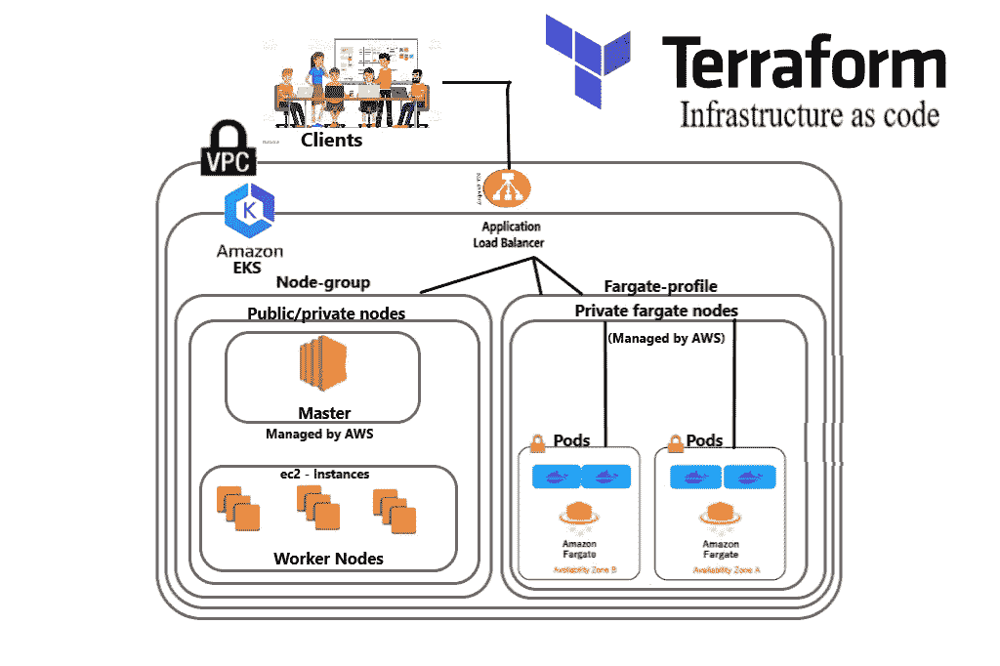

图片来源:哈什特·贾恩

让我们讨论一个很棒的设置——使用服务 EKS 在 AWS 上创建一个 Kubernetes 集群。我们还增加了 [Fargate](https://aws.amazon.com/fargate/) (无服务器)集群。这是一个完整的解决方案，解决了我在上次[T4 设置中遇到的所有问题。我们将使用 Terraform 创建整个结构。所以最后，我们只需要运行一个命令来创建和销毁整个基础设施。](https://medium.com/swlh/how-companies-manages-the-same-code-of-terraform-to-switch-from-testing-to-production-6787e7b6fde9)

在继续下一步之前，有一些先决条件:

1.  [了解基本地形](https://medium.com/swlh/how-companies-manages-the-same-code-of-terraform-to-switch-from-testing-to-production-6787e7b6fde9)。
2.  [了解 EKS](https://docs.aws.amazon.com/eks/latest/userguide/what-is-eks.html) 和[法盖特星团](https://docs.aws.amazon.com/eks/latest/userguide/fargate.html)的基本术语
3.  [熟悉Kubernetes](https://aws.amazon.com/kubernetes/)

# Agenda

我们建立了一个高度管理、自动扩展和自动部署的 web 应用程序，Fargate pods 应该在私有子网中运行，通过放置在公共子网中的负载平衡器与外界通信。在幕后，所有数据都存储在一个只有管理员才能访问的私人实验室的数据库中。

## 涉及的步骤

*   建立工作关系网
*   EKS、Fargate 节点和受管节点
*   库伯内特斯
*   数据库ˌ资料库
*   代码管理

# 1.**首先，我们创建一个 VPC，并在其中配置连接**

我不会在这里过多描述这个步骤，因为它实际上与我之前的设置非常相似。你可以在这里看到。

我们创建一个 VPC、公共和私有子网、internet 和 NAT 网关，以及一个路由表，方法与我在上一篇文章中所做的完全相同。

我们只需向子网添加特殊的标记，以便 Kubernetes 知道子网应该用于什么:

*   需要将`kubernetes.io/cluster/{clustername}: shared`标记添加到集群应该能够使用的所有子网中
*   需要将`kubernetes.io/role/elb: 1`标记添加到公共子网中，这样 Kubernetes 就知道只将这些子网用于公共负载平衡器
*   需要将`kubernetes.io/role/internal-elb: 1`标记添加到私有子网中，这样 Kubernetes 就知道将这些子网用于内部负载平衡器

VPC 网络的完整平台代码可以在[这里](https://github.com/Harshetjain666/Hybrid-cloud-task-6/blob/main/vpc/main.tf)看到。

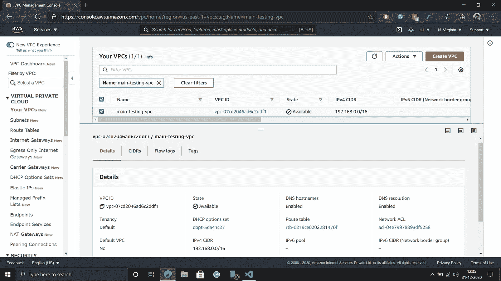

VPC 网络

# **2。创建 EKS 集群**

Terraform 需要以下设置:

```
resource "aws_eks_cluster" "eks_cluster" {
  name     = "${var.cluster_name}-${var.environment}"

  role_arn = aws_iam_role.eks_cluster_role.arn
  enabled_cluster_log_types = ["api", "audit", "authenticator", "controllerManager", "scheduler"]

   vpc_config {
    subnet_ids =  concat(var.public_subnets, var.private_subnets)
  }

   timeouts {
     delete    = "30m"
   }
}
```

如您所见，我们还需要为集群附加一个角色，这将为集群提供与节点交互的必要权限。设置如下所示:

集群 IAM 角色

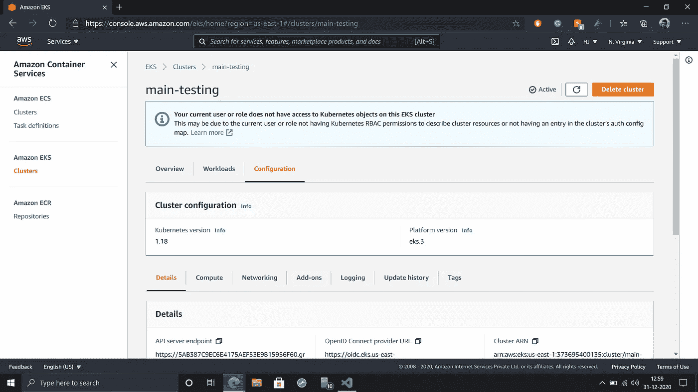

EKS 集群

我们还将向该集群添加 CloudWatch 指标。为此，我们需要添加 CloudWatch 日志组，其设置如下:

云观察

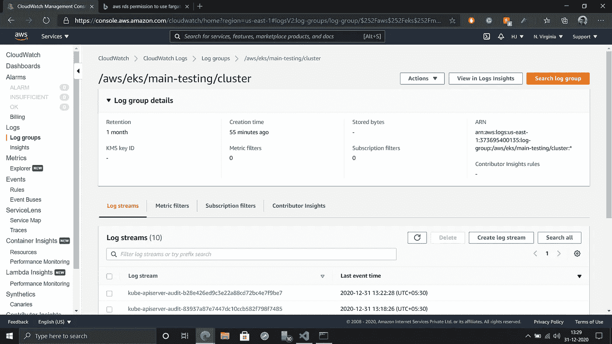

CloudWatch 日志

## **创建节点组**

现在我们已经设置好了集群，但是我们还没有任何节点来运行我们的 pod。没有任何节点也可以运行你的 pod。但是您需要对 CoreDNS 部署做一些调整(更多信息请点击这里的**和这里的)。**

**因此，我们将为`kube-system`名称空间创建一个节点组，用于运行 Kubernetes 集群所需的任何 pod。我们可以在公共/私有子网中启动节点组。设置如下所示:**

```
resource "aws_eks_node_group" "eks_node_group" {
  cluster_name    = aws_eks_cluster.eks_cluster.name
  node_group_name = "${var.cluster_name}-${var.environment}-  node_group"
  node_role_arn   = aws_iam_role.eks_node_group_role.arn
  subnet_ids      = var.public_subnets

  scaling_config {
    desired_size = 2
    max_size     = 3
    min_size     = 2
  }

  instance_types  = ["${var.eks_node_group_instance_types}"]
}
```

**在这里，你可以看到对于`desired size`，我放置了`2`，因为我要求在启动时至少有两个节点，并且在一个节点内，你只能启动有限数量的 pod——就像在 t2.micro 中，你只能在一个节点中启动两个 pod，因为 [ENI](https://docs.aws.amazon.com/AWSEC2/latest/UserGuide/using-eni.html) 。**

**这同样适用于 EKS 集群。节点组还需要一个附加角色，以便与在其上运行的 pod 进行通信，其设置如下:**

**节点组 IAM 角色**

**在 AWS 中，在幕后，在 EC2 服务中启动一个节点组。**

**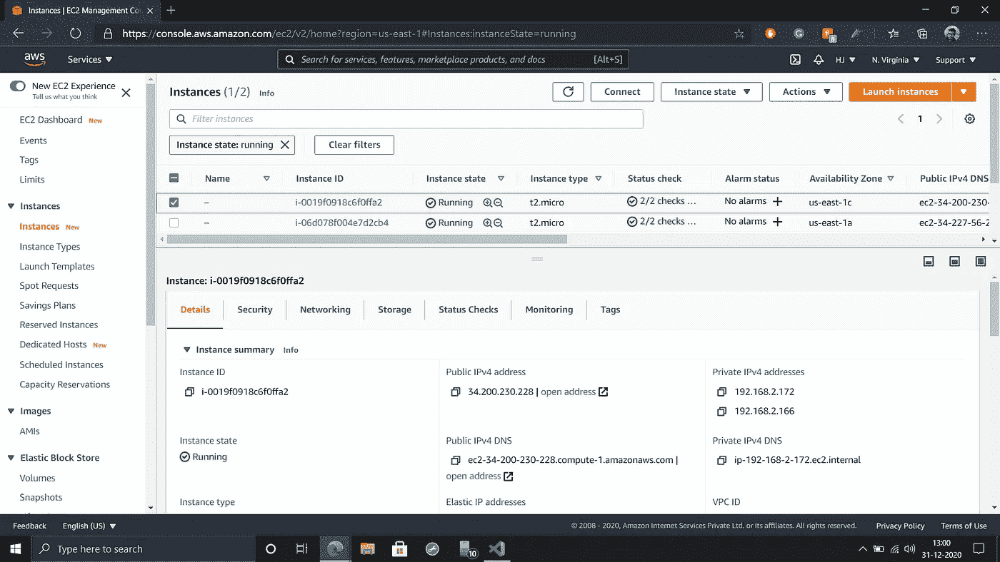**

**EKS —节点**

## ****最后，我们设置了一个 Fargate 概要文件****

**为了在 Fargate(无服务器)配置中运行 pods，我们首先需要创建一个 Fargate 概要文件。这个概要文件定义了名称空间和选择器，它们用于识别哪些 pod 应该在 Fargate 节点上运行。确保 Fargate pods 只能在私有子网中运行。设置如下所示:**

```
resource "aws_eks_fargate_profile" "eks_fargate" {
  cluster_name           = aws_eks_cluster.eks_cluster.name
  fargate_profile_name   = "${var.cluster_name}-${var.environment}-fargate-profile"
  pod_execution_role_arn = aws_iam_role.eks_fargate_role.arn
  subnet_ids             = var.private_subnets

  selector {
    namespace = "${var.fargate_namespace}"
  }

  timeouts {
    create   = "30m"
    delete   = "30m"
  }
}
```

**同上—Fargate 配置文件还需要一个附加角色，让 Fargate 控制器代表您调用 AWS API，设置如下:**

**Fargate IAM 角色**

**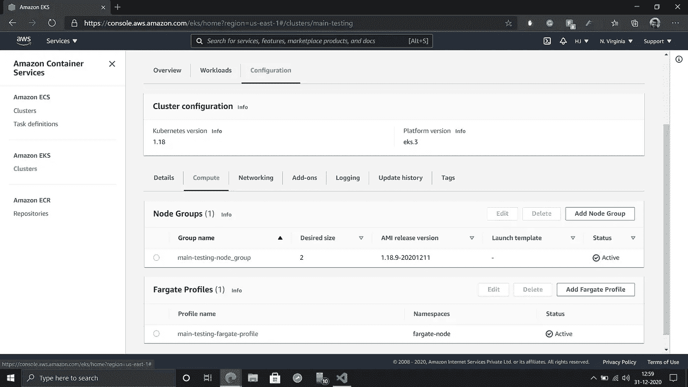**

**法盖特剖面图**

# **3.**使用 Terraform 设置 Kubernetes】****

**首先，我们告诉 Terraform 我们的 Kubernetes 集群在哪里运行。为此，我们需要添加一个`kubernetes`提供者，如下所示:**

**Kubernetes 提供商**

**现在为我们的应用程序创建一个名称空间、部署和服务。**

## **[命名空间](https://registry.terraform.io/providers/hashicorp/kubernetes/latest/docs/resources/namespace)**

```
resource "kubernetes_namespace" "fargate" {
  metadata {
    labels = {
      app = "my-app"
    }
    name = "fargate-node"
  }
}
```

**然后，我们在 Docker 映像的帮助下为我们的应用程序创建一个部署来运行 pod。**

## **[部署](https://registry.terraform.io/providers/hashicorp/kubernetes/latest/docs/resources/deployment)**

```
resource "kubernetes_deployment" "app" {
  metadata {
    name      = "owncloud-server"
    namespace = "fargate-node"
    labels    = {
      app = "owncloud"
    }
  }

  spec {
    replicas = 2

    selector {
      match_labels = {
        app = "owncloud"
      }
    }

    template {
      metadata {
        labels = {
          app = "owncloud"
        }
      }

      spec {
        container {
          image = "owncloud"
          name  = "owncloud-server"

          port {
            container_port = 80
          }
        }
      }
    }
  }
   depends_on = [kubernetes_namespace.fargate]

}
```

**此外，创建一个负载平衡服务。**

## **[服务](https://registry.terraform.io/providers/hashicorp/kubernetes/latest/docs/resources/service)**

```
resource "kubernetes_service" "app" {
  metadata {
    name      = "owncloud-service"
    namespace = "fargate-node"
  }
  spec {
    selector = {
      app = "owncloud"
    }

    port {
      port        = 80
      target_port = 80
      protocol    = "TCP"
    }

    type = "NodePort"
  }

  depends_on = [kubernetes_deployment.app]
}
```

****注意**:这里有个转折。如果你想从公共领域访问这个 web 应用，有三个负载平衡器可用:CLB、NLB 和 ALB **。你可以选择其中任何一个。你可以很容易地创造一个 CLB 或 NLB。但是在这种设置中，创建 ALB 是非常典型的选择。我将指导您完成所有的负载平衡器。****

**如果您想创建一个 CLB，要使用的服务是`LoadBalancer`，要创建一个 NLB，使用:**

**NLB 服务**

**创建 ALB 有点复杂。我们需要一个 ALB 将我们连接到任何正在运行的 pod，并向 ALB 注册可用的目标 pod。为此我们需要一个[入口控制器](https://kubernetes.io/docs/concepts/services-networking/ingress-controllers/)。**

**为了让入口控制器拥有创建 ALB 和在 ALB 上注册目标 pod 的访问权限，我们需要创建一个允许这样做的策略。**

**入口策略**

**现在创建一个角色，并将该策略与该角色相关联。**

**Kubernetes 入口角色**

**现在，我们还需要一个用于入口控制器的集群角色，一个绑定到该角色的服务帐户，该角色附加了之前创建的 IAM 角色。**

**Kubernetes 集群角色**

**我们现在可以将入口控制器部署到我们的集群中。**

**Kubernetes 入口控制器**

**随着入口控制器的部署，现在我们可以使用 Kubernetes Ingress 为 web 应用程序创建 ALB。**

```
resource "kubernetes_ingress" "app" {
  metadata {
    name      = "owncloud-lb"
    namespace = "fargate-node"
    annotations = {
      "kubernetes.io/ingress.class"           = "alb"
      "alb.ingress.kubernetes.io/scheme"      = "internet-facing"
      "alb.ingress.kubernetes.io/target-type" = "ip"
    }
    labels = {
        "app" = "owncloud"
    }
  }

  spec {
      backend {
        service_name = "owncloud-service"
        service_port = 80
      }
    rule {
      http {
        path {
          path = "/"
          backend {
            service_name = "owncloud-service"
            service_port = 80
          }
        }
      }
    }
  }

  depends_on = [kubernetes_service.app]
}
```

**之后，您还可以手动检查它是否已创建。**

**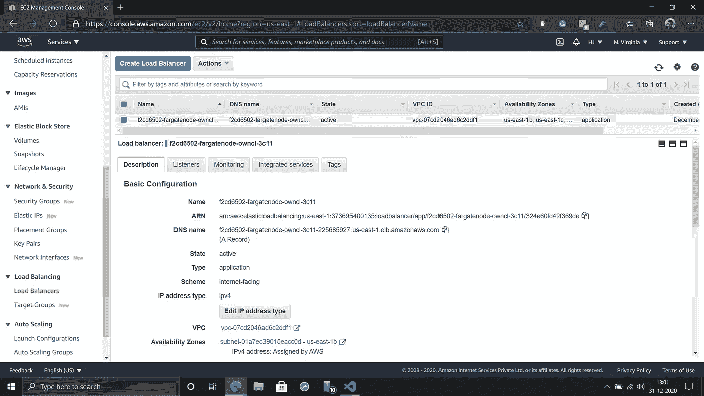**

**应用负载平衡器**

**在您的浏览器中打开 DNS 名称，您会看到您的 web 应用程序正在那里完美地运行。**

**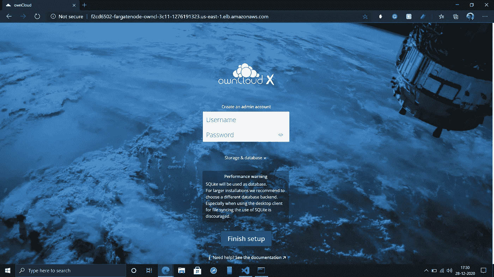**

**自有云**

# ****4。使用 AWS 中的 RDS 实例创建一个数据库****

**我不会在这里过多描述这个步骤，因为它实际上与我之前的设置非常相似。你可以看到这里的[和](https://medium.com/swlh/how-companies-manages-the-same-code-of-terraform-to-switch-from-testing-to-production-6787e7b6fde9)。**

**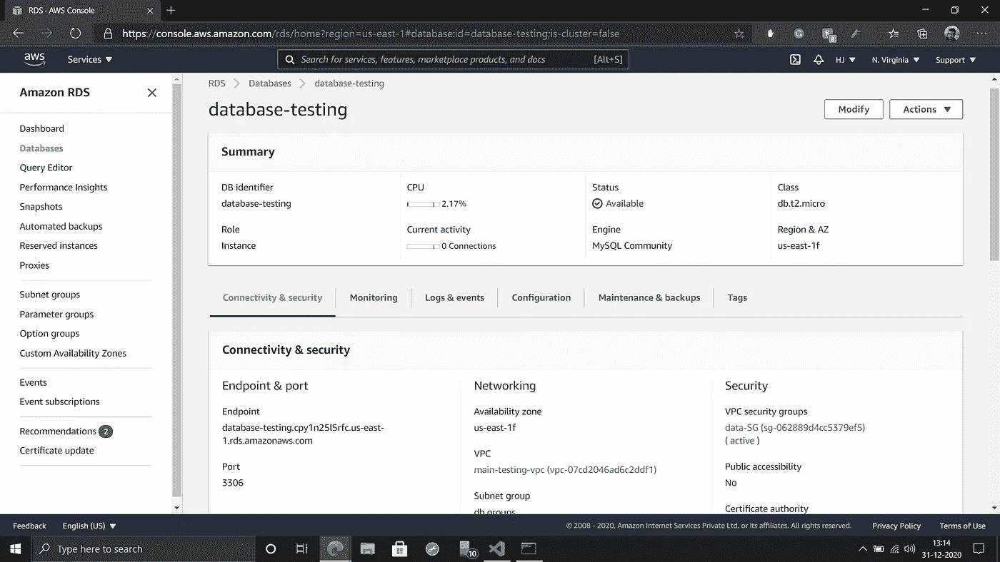**

**数据库ˌ资料库**

**之后，您获得了数据库的端点和端口号，只需将数据库与您的 web 应用程序连接起来。**

# **5.**代码管理****

**这是最重要的一步，因为最重要的是代码的管理。为了更好的管理，我在 Terraform 中使用`[module](https://www.terraform.io/docs/modules/sources.html#local-paths)`,并为每个服务创建一个单独的文件夹。就像我们在[最后一次设置](https://medium.com/swlh/how-companies-manages-the-same-code-of-terraform-to-switch-from-testing-to-production-6787e7b6fde9)中所做的一样，我们将使用`.tfvars`文件来获取变量值。**

**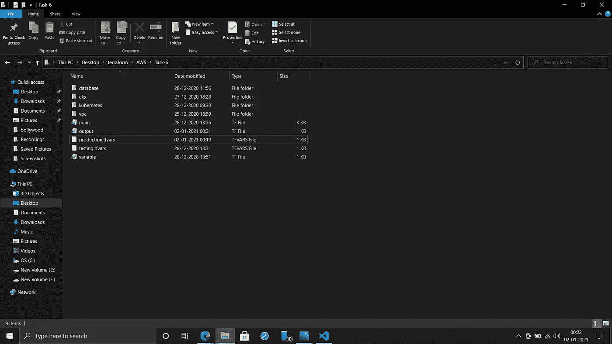**

**代码管理**

**现在只需运行一个命令来创建整个设置:**

**`**terraform apply -var-file={variable file name}**`**

**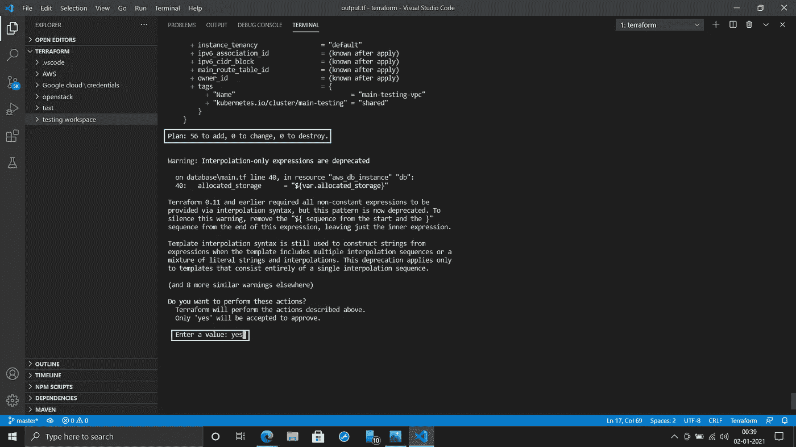**

**整个设置**

**毫无疑问，这是一个伟大的设置。但是公司主要在他们自己的地方存储数据，或者使用像 OpenStack 这样的私有云。以后我会试着写一篇关于这个的文章。**

**供您参考，我将我的代码上传到了我的 GitHub 库:**

**[](https://github.com/Harshetjain666/Hybrid-cloud-task-6) [## harshetjain 666/混合云任务 6

### 带有 fargate 集群设置的我的 AWS EKS 的源代码-harshetjain 666/Hybrid-cloud-task-6

github.com](https://github.com/Harshetjain666/Hybrid-cloud-task-6) 

感谢您的阅读！**