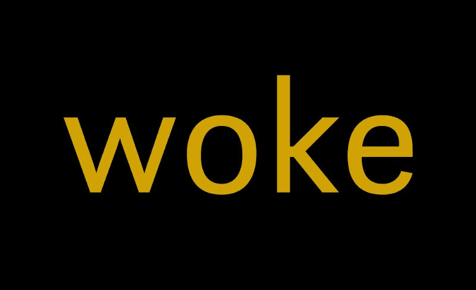
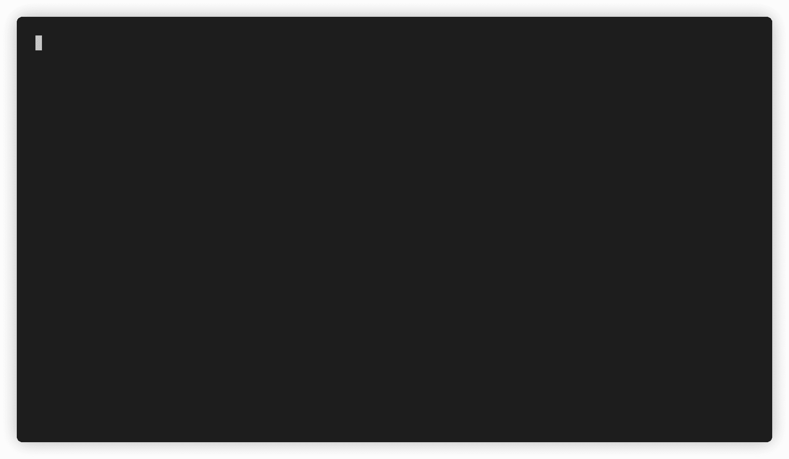

# 介绍 Woke:检测源代码中不敏感的语言

> 原文：<https://betterprogramming.pub/woke-437880c3de64>

## 一个开源项目，帮助你找到可以在你的代码库中改变的单词，让世界变得更好一点

作者照片。

# 在技术领域采用包容性语言

现在是 2020 年，科技行业似乎终于开始接受过时的、对种族不敏感的语言，这些语言在我们的日常生活中已经变得司空见惯。看到这方面的实际行动令人难以置信。

仅举几个例子，像 [GitHub](https://github.com/github/renaming) 、 [Apple](https://developer.apple.com/news/?id=1o9zxsxl) 和 [Twitter](https://twitter.com/TwitterEng/status/1278733303508418560) 这样的公司已经承诺并开始推出改变，删除不敏感的语言，代之以更具包容性的替代语言。

描述数据库架构时常见的术语`master/slave`正在被`primary/secondary`所取代。`Whitelist/blacklist`正被非彩色的替代物所取代，如`allowlist/denylist`来描述访问模式。

当我看到这一切时，我受到了启发！当我的同事法比亚娜·斯卡拉提出在代码库和对话中采用有意识语言的主题时，我开始研究如何帮助开发人员保持对构建包容性代码的承诺。当我手头拮据时，我决定自己开发一个工具——并且作为一个开源项目来开发。

# 词语很重要

查看[我在《出租跑道》的技术博客上的文章](https://dresscode.renttherunway.com/blog/woke),了解为什么这对我个人以及 RTR 的工程很重要。

# 介绍沃克

 [## 醒来

### woke 是一个文本文件分析工具，可以检测源代码中的非包容性语言。

github.com](https://github.com/get-woke/woke) 

`woke`是我创建的工具，它可以检测你源代码中的非包容性语言。它是一个开源项目，欢迎[投稿](https://github.com/get-woke/woke/blob/main/CONTRIBUTING.md)！

唤醒示例

# 这是什么？

`woke`是一个文本文件分析器。它搜索文本行，并将其与一组规则进行匹配，以找到不敏感的单词，然后建议包容性的替代词。

## 特征

`woke`与我们日常使用的棉绒非常相似:

*   内置的默认规则集。
*   您可以通过配置文件定义自己的规则或禁用默认规则，该配置文件可以提交到您的 repos 以在 CI 管道中使用。
*   您可以定义应该总是被忽略的文件(即预编译资源或`package-lock.json`)或用注释忽略文件中的特定行。
*   您可以针对整个目录或特定文件运行`woke`。这可以是类似于`**/*.go`或空格分隔的文件名或目录列表。
*   你也可以让`woke`读`stdin`。
*   如果`woke`发现任何违规，它将以不同的格式输出，并返回一个退出代码`0`。如果你想让它返回退出代码`1`，它可以这样做。
*   这在作为拉/合并请求检查运行时很有用，在这种情况下，您希望让作者知道存在违规，但您可能不想阻止代码被合并。

# 使用沃克

目前有两个官方支持的集成(通过 GitHub 操作):

*   [https://github.com/marketplace/actions/run-woke](https://github.com/marketplace/actions/run-woke)
*   [https://github . com/market place/actions/run-wake-with-review dog](https://github.com/marketplace/actions/run-woke-with-reviewdog)

由于`woke`被编译成静态二进制文件，所以可以很容易地构建其他集成！例如，`woke`可以作为 [VSCode 扩展](https://marketplace.visualstudio.com/items?itemName=get-woke.vscode-woke)或 Atom 包运行，一个 Jenkins 插件，用于任何其他 CI 平台(例如 GitLab、CircleCI、TravisCI)，你说吧！如果它能运行静态二进制，它就能运行`woke`。您的代码将因此变得更具包容性！

# 现在怎么办？

开始对所有源代码运行`woke`！将它添加到您的开源项目中，向潜在贡献者展示您对包容性的关注！说服你的领导在你的组织内整合`woke`!虽然这看起来是一小步，但它有可能对建立和维护包容性文化产生巨大的长期影响。

 [## 醒来

### woke 是一个文本文件分析工具，可以检测源代码中的非包容性语言。

github.com](https://github.com/get-woke/woke) 

# 资源

以下是一些优秀的文章，它们更深入地阐述了包容性语言在科技领域的重要性:

*   https://medium . com/pm 101/inclusive-language-guide-for-tech-companies-and-startups-F5 b 254d 4 a5b 7
*   https://buffer.com/resources/inclusive-language-tech/
*   [https://www . market place . org/2020/06/17/tech-companies-update-language-to-避免冒犯-terms/](https://www.marketplace.org/2020/06/17/tech-companies-update-language-to-avoid-offensive-terms/)