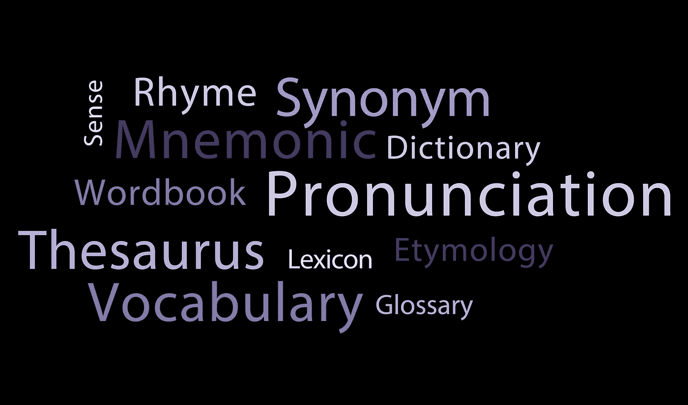
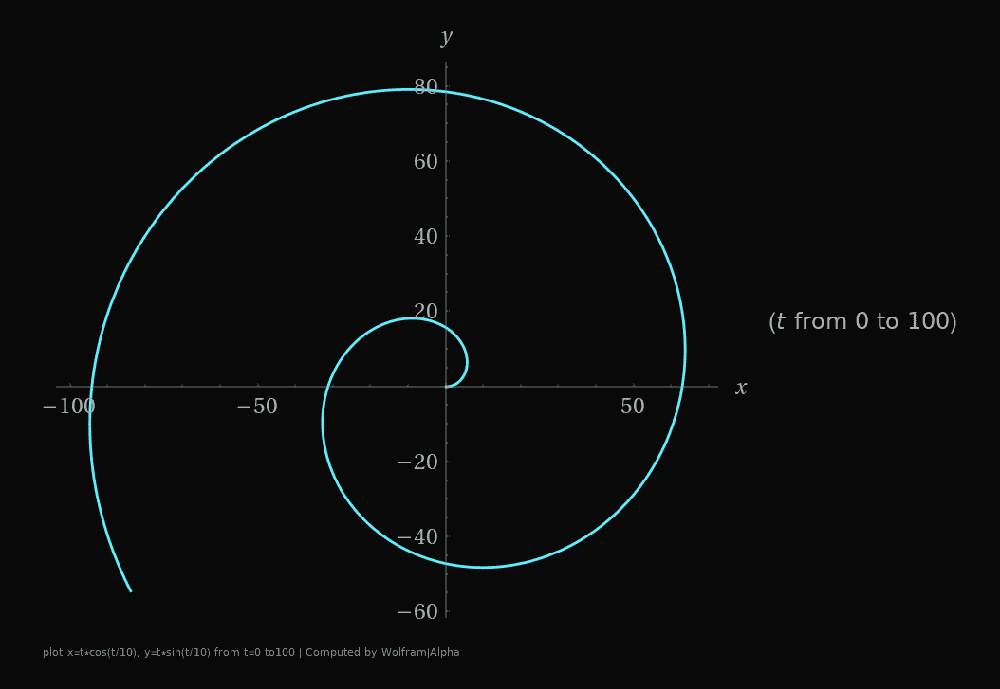

# 在 SwiftUI 中构建单词云

> 原文：<https://betterprogramming.pub/word-cloud-in-swiftui-eee3d69f7d22>

## 在 SwiftUI 界面中调整单词的大小和位置

词云(也称为文本云或标签云)是以不同大小描绘的词的集合或集群。最理想的是提取出文本数据中最相关的部分。

有相当多的 GitHub 资源库展示了如何使用 JavaScript、Python 等生成 word cloud。但是当我玩 SwiftUI 的时候。我发现没有多少有用的信息。

# 基本思想

*   词云是由词串的集合构成的。
*   每个单词可能有不同的字体，不同的字体大小，甚至不同的颜色。
*   每个单词不能与其他单词重叠。
*   他们倾向于彼此靠近。

一般的方法是从中心开始，放入第一个单词，然后开始将下一个单词放在它周围，尽可能靠近，不要与前面的所有单词重叠。这一节中棘手的部分是如何有效地找到单词的正确位置，我将在后面介绍。

# 不令人满意的方法

几年前，我在做我的业余爱好项目的时候有了第一次尝试。我的方法是生成一个单词云图像，然后将其放入 SwiftUI 视图中。

我使用`(NSString).size(withAttributes attrs:)`来估计字符串的图形大小，在画布中找到一个安全的位置，然后使用`String.draw(in rect:, withAttributes attrs:)`将每个字符串渲染到基于位图的`UIGraphic`的`UIImage`。

最后使用 SwiftUI 的`Image(uiImage: )`来实现它。源代码有点像这样:

你可能已经注意到了，这并不是一个快捷的方法。我对结果不满意，因为这是一张普通的图片，我不能添加像`.onTapGesture`或`NavigationLink`这样的 SwiftUI 事件处理程序来允许用户与每个单词进行交互。

# 以斯威夫特的名义

我试了几次才最终得到它。

## **估算尺寸**

起初，我试图在放置它们之前估计每个字符串的大小。但是，这并不像听起来那么简单。SwiftUI 不断地重新计算每个元素的大小，使它们能够组合在一起，有时甚至会按下、截断、扩展或收缩一点。所以每个元素的精确大小是不可预测的。

此外，`(NSString).size(withAttributes attrs:)`估计大小也有一个性能损失，我觉得放在我的代码中并不完美。

解决这个问题的一个方法是把`GeometryReader`放在每个单词的外面。但我也发现它带来的问题比解决的问题还多。而且，代码看起来很恶心。

感谢我不知道是谁，有一个 SwiftUI hack 可以通过使用透明视图作为背景来获得元素的大小。

它的高效、出色的性能、清晰的代码，解决了构建 SwiftUI word cloud 的第一个障碍。

## **更少的状态变量和** `**WordSizeGetter**`

在我早期的 SwiftUI 实验中，我倾向于将所有的变化放入一个状态变量中。一般不管怎样都管用。但是当我再次尝试编写纯 SwiftUI 版本的`WordCloudView`时，我终于注意到了性能损失。由于每次状态值改变时，视图都会使其外观无效并重新计算所有内容，因此我们必须小心不要放置可能与视图外观无关的变量。

为了抽象出哪些输入对于计算所有单词的位置是必要的，我发现只需要 2 个状态变量来生成单词云。

一个是画布的大小，或者换句话说，是`WordCloudView`的整个区域。另一个是每个字的大小。只是渲染的大小。每个单词的其他属性，甚至单词本身都不应该是状态变量，因为它们是预先确定的，一旦给定就不会改变。

使用与`RectGetter`类似的方法，我们可以得到每个单词的大小。你可能还会注意到，如果这是 SwiftUI 第一次尝试渲染视图，由于`canvasRect`仍然是一个空的 CGRect，`calcPositions`将跳过计算，将所有内容放在零点，这似乎每个单词都将在默认中心重叠。但是由于`RectGetter`和我们新的`WordSizeGetter`将设置状态变量所需的大小信息，所有的东西都将在下一个渲染帧中就位。

## **计算仓位—野蛮强行**

有几种方法可以计算每个单词的位置。最简单的方法是尝试随机放置每个单词，检查它是否与所有已经放置的单词重叠，直到找到一个有效的位置。

你可以看出这是简单的暴力。不用说，这不是一个最优解。

## **计算位置—螺旋**

更好的解决方法，也是常见的一种，就是从第一个单词开始，用这个公式慢慢旋出或者遵循一个螺旋路径:`[**x=t*cos(t/10), y=t*sin(t/10)**](https://www.wolframalpha.com/input/?i=plot+x%3Dt*cos%28t%2F10%29%2C+y%3Dt*sin%28t%2F10%29+from+t%3D0+to100)`**。**

在这个公式中，t 是到中心的长度，或者在我们的例子中，是离第一个单词的中心有多远。

我们还可以对公式进行更多的调整。例如，添加一个比例因子，使其更加椭圆，以便在水平方向上容纳更多的单词。

## **缓存结果**

当然，我们不应该每次重新渲染视图时都重新计算。因此，我在视图中添加了缓存存储。

在当前视图中`WordCloudPositionCache`必须是类而不是结构或成员变量的原因是因为 SwiftUI 视图是不可变的。我们不想在这里使用状态变量，因为我们也不想触发 rerender。

## **最后的陷阱**

就像我之前说的，SwiftUI 可能会按下、截断、扩展和收缩一个元素。这是因为 SwiftUI 不断地在每个元素和约束之间协商位置和大小。其中一个缺陷是，每一个的大小会在没有明显原因的情况下发生微小的变化。大多数时候，它可能只会移动不到 0.01 磅，但它会导致视图出现毛刺，并重新计算所有单词的位置，这是不必要的。

这是最后一点:

基本上，正如函数名所示，如果单词的大小变化小于 0.01 磅，我们将认为它们是相似的，跳过重新计算单词位置的过程并返回缓存的结果。

## **进一步优化**

当然，还有很多可以优化的地方。比如使用二分搜索法算法来查找每个单词的下一个可用位置，而不是像演示代码那样只是线性搜索。但是在 SwiftUI 中生成 word cloud 的所有有趣的部分都已经在这里了。

我还把完整的演示回购放在了 Github。[https://github.com/tomasen/WordCloudDemo](https://github.com/tomasen/WordCloudDemo)。玩得开心。