# 沃尔多被卖了。现在是不是更难解决了？

> 原文：<https://betterprogramming.pub/wordle-sold-is-it-harder-now-1ca497cace15>

## 使用 Data Studio 改进后的数据混合功能来探索 NYT 收购后 Wordle 发生了怎样的变化

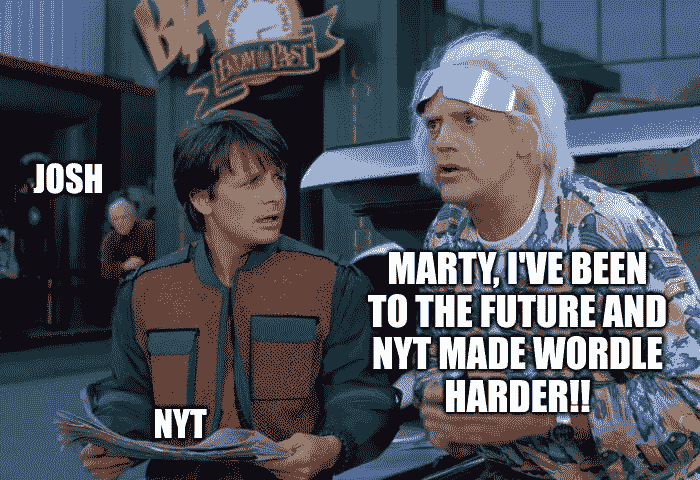

作者用 [Pixlr E](https://pixlr.com/e/) 创建的图像

最近，网络红人 Wordle[的作者乔希·沃德尔(Josh Wardle)将他的作品](https://www.nytimes.com/2022/01/31/business/media/new-york-times-wordle.html)以七位数的价格卖给了《纽约时报》。第一个明显的变化是，Wordle 在 NYT 的游戏中心找到了新家。

然而，人们想知道在引擎盖下是否有更微妙的变化:

1.  有没有词被去掉了？➖
2.  有没有增加新单词？➕
3.  哪些词保持不变？🟰
4.  游戏现在变得更难玩了吗？

几乎与此同时，谷歌的数据工作室以一种完全不相关的方式推出了[新的数据混合](https://support.google.com/datastudio/answer/11542817)改进。

我的脑海中立即闪现出一些东西:有没有可能将这两者结合起来回答那些紧迫的文字问题？

令人惊讶的是…答案是肯定的！

# 沃尔多是如何工作的？

正如我在之前的[故事](/forget-luck-optimized-wordle-strategy-using-bigquery-c676771e316f)中解释的，讨论了如何通过使用三个特定的单词来提高你的胜算，Wordle 使用了两个不同的精选单词列表:

*   **解决方法:**解决日常游戏的话，最常见的。比如:新鲜的，结皮的，大便的…
*   **猜测**:你可以用来解决游戏问题的单词，但这些单词本身并不是解决问题的答案，其中很多(相当)晦涩难懂。比如:考鲁，塞科特，扎曾…

Wordle 被编码为基于今天的日期从解决方案列表中选择一个单词:这使得每个人每天都可以玩同一个单词。让我们假设解决方案列表如下所示:

```
word_1, word_2, word_3, word_4, word_5, word_6, word_7, ... word_n
```

假设沃尔多选择了`word_3`作为 2 月 1 日的解决方案，那么`word_4`将是 2 月 2 日的解决方案，`word_5`将是 2 月 3 日的解决方案，以此类推。这一事实将在以后确定 Wordle 的困难是否已经改变时派上用场。

# Data Studio 中的数据混合是如何工作的？

自 2018 年以来，数据混合在 Data Studio 中已成为可能。然而，它仅限于左外连接。通过最新的改进，现在可以使用以下连接运算符:

*   **左外部连接**:返回右表中匹配的行，加上左表中不匹配的行。
*   **右外连接**:返回左表中匹配的行，加上右表中不匹配的行。
*   **内部连接**:只返回左表和右表中匹配的行。
*   **全外连接**:返回左表或右表中所有匹配的行。
*   **Cross join** :返回左表和右表中所有可能的行组合。


连接的图形表示—作者使用 [Pixlr E](https://pixlr.com/e/) 创建的图像

如果我们将原始的单词列表看作蓝色集合，将 NYT 单词列表看作黄色集合，然后将它们相交，我们得到这个图表:

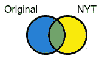

完整外部连接的图形表示—由作者使用 [Pixlr E](https://pixlr.com/e/) 创建的图像

不同的颜色可以解释为:

*   蓝色:NYT 版游戏中的文字被删除
*   绿色:两个版本共有的单词
*   黄色:NYT 版游戏添加的文字

不过有一个小问题:如果你检查上面的图像，你会注意到没有类似蓝色或黄色形状的连接。幸运的是，有一个简单的解决方法:使用一个完整的外部连接和一个过滤器。

让我们先看看一个简单的例子中完整的外部连接是如何工作的。考虑以下两个表:

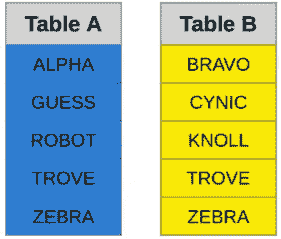

示例表格—作者使用 [Pixlr E](https://pixlr.com/e/) 创建的图像

这两个表的完整外部连接如下所示:

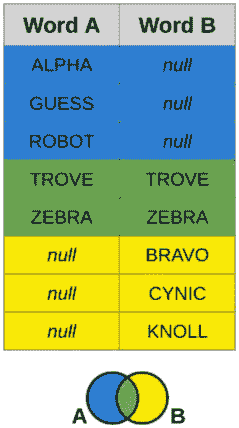

完整外部连接示例—作者使用 [Pixlr E](https://pixlr.com/e/) 创建的图像

不同的颜色可以解释为:

*   蓝色:仅在表 A 中找到的单词
*   绿色:表 A 和表 B 共有的单词
*   黄色:仅在表 B 中找到的单词

注意所有蓝色的行都有单词 B 等于 NULL。同样地，所有黄色的行都必须将 A 表示为空。这是我们创建过滤器的提示，该过滤器将排除组成蓝色或黄色形状的行。

让我们在 Data Studio 中复制这些步骤来合成蓝色形状:

1.  创建一个名为“经典与 NYT”的新混合，它将原始表和 NYT 表组合在一起，并从这两个表中选择所有字段:

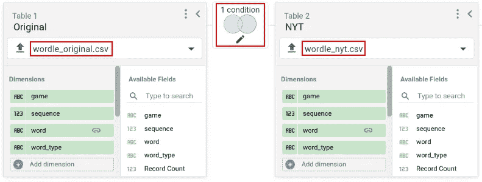

混合数据源-按作者分类的图像

2.从每个表的**字**字段中选择完整的外部连接运算符和连接条件:

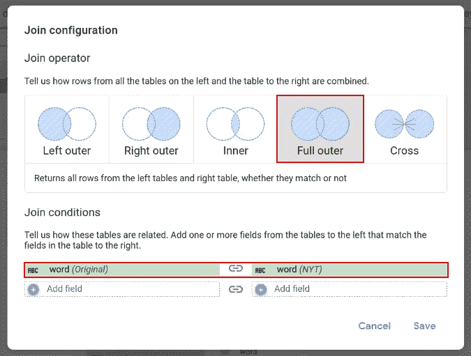

混合数据源联接配置-按作者分类的图像

3.创建一个使用混合的图表(例如表格),并从 Wordle original 中选择单词:

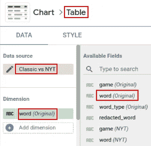

图表表格配置—按作者分类的图像

4.对之前创建的混合创建一个过滤器，只包括 NYT 表中单词为空的行:

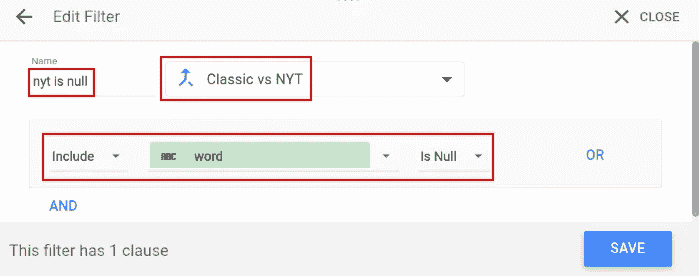

过滤器配置—按作者分类的图像

5.最后，将过滤器应用于使用混合的图表:

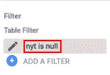

应用于图表的过滤器—按作者分类的图像

请注意，图表显示的是 Wordle original 中的单词，过滤器删除了没有 NYT 匹配的行:Wordle NYT 中不存在的单词(已删除)

相反，如果我需要重新创建黄色形状，我只需要遵循相同的步骤，只是在步骤 4 中，我需要创建一个过滤器，只包括原始表中单词为 Null 的行:

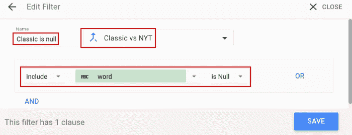

过滤器配置—按作者分类的图像

既然我们已经了解了 Wordle 的工作原理、我们可以使用的不同类型的连接，以及我们需要的配置 Data Studio 的方式，下一步的工作就是从两个游戏中提取单词列表。

# 提取单词列表

由于原来的 Wordle 网页不再存在，而是重定向到纽约时报游戏中心，我需要求助于它的缓存版本。我还将使用新 Wordle 的缓存版本，这样如果 NYT 决定改变游戏代码，我在这里发布的代码也可以为你所用。

每当我需要网页的缓存版本时，我会立即想到互联网档案馆。他们是一个非盈利性组织，以数字形式建立一个包含互联网网站和其他文化遗产的数字图书馆。今天，他们有超过 25 年的网络历史，可以通过[的回溯机](https://archive.org/web/)访问。让我们好好利用它:

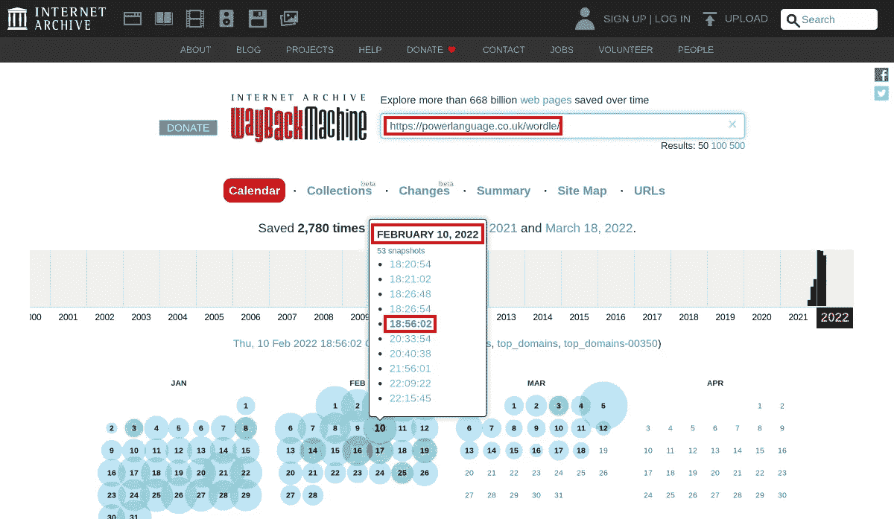

互联网档案馆 Wayback 机器原始 Wordle 快照-作者图片

搜索原始网址(【https://powerlanguage.co.uk/wordle/】)，Wayback 机器显示页面被缓存了好几次，甚至一天好几次。

> 有趣的事实:根据 Wayback 机器的快照，Wordle 在 2022 年 2 月 10 日格林威治时间 18:56:02 到 20:33:54 之间被转移到纽约时报游戏中心。

像往常一样，我将使用 Google Cloud Shell 作为我的无服务器环境来提取单词:


谷歌云外壳，我的首选外壳😀—作者图片

从原始单词中提取单词的脚本非常简单，只需获取由 Wayback Machine 在 2022 年 2 月 10 日 03:43:40 缓存的 JavaScript 游戏文件，如下所示:

运行脚本时，输出如下所示:

```
Fetching game file...
Extracting words...
Number of words extracted from Wordle original:
12972
```

类似地，为了从 NYT 单词中提取单词，我只需要获取由 Wayback Machine 在 2022 年 2 月 10 日 18:56:02 缓存的 JavaScript 游戏文件，并将其保存到不同的 CSV 文件中:

运行该脚本会产生以下输出:

```
Fetching game file...
Extracting words...
Number of words extracted from Wordle NYT:
12947
```

啊哈！数字不匹配。大家来找答案吧！

# 将数据上传到 Data Studio

Data Studio 能够连接到多个数据源:Google Analytics、Google Ads、BigQuery、Google Sheet、MySQL、Microsoft SQL Server 等等。

在本练习中，我将使用文件上传连接器，它接收 CSV 文件，就像从 Wordle 中提取单词时生成的文件一样:

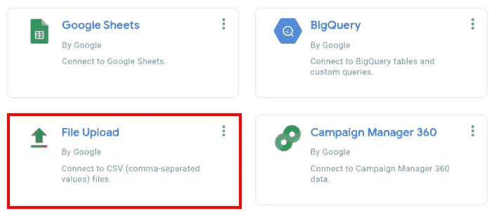

Data Studio 连接器—作者图片

因此，让我们通过上传`wordle_original.csv`和`wordle_nyt.csv` ***:*** 来创建几个数据源

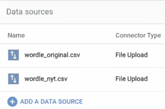

Data Studio 数据源—按作者分类的图片

> **Pro Tip** :如果几个 CSV 文件具有相同的模式，那么**文件上传**连接器能够组合它们。

让我们通过创建一个合并了两个 CSV 文件的新数据源来尝试这个特性:

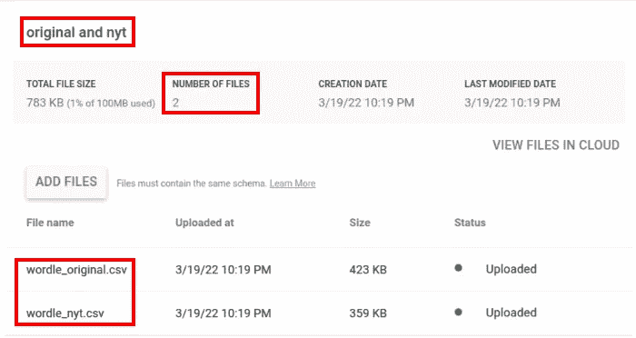

几个文件上传到一个文件上传数据连接器-作者图片

现在数据源已经就绪，让我们构建一个快速聊天来检查所有数据是否已经正确上传:

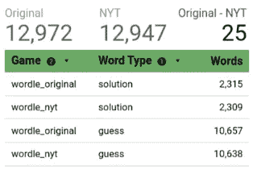

上传的数据-作者图片

完美，一切看起来都很好。通过查看载入的数据，我们可以看到 NYT 版本的游戏少了 25 个单词:6 个答案和 19 次猜测。

我们需要的东西都有了，让我们开始回答沃尔多的问题吧！

# 有没有词被去掉了？➖

使用完整的外部连接运算符加上一个 NYT 单词是一个空过滤器，下表显示了所有删除的单词:

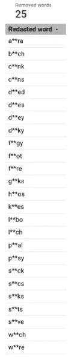

删除的单词(修订)-按作者排序的图像

NYT 从最初的 Wordle 游戏中删除了 25 个晦涩、不敏感和攻击性的单词。我已经编辑了它们，但是如果你真的很好奇的话，你可以很容易地填写缺失的字母…

# 有没有增加新单词？➕

同样，使用完整的外部连接运算符加上一个原始单词是一个空过滤器，下表显示了所有添加的单词:

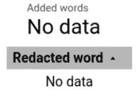

添加的单词-作者图片

事实证明，NYT 没有添加任何新词。至少在我从互联网档案中获取的缓存页面中没有。

# 哪些词保持不变？🟰

现在让我们来看看在 NYT 保持不变的单词。它们有什么变化吗？有没有猜词被提升为解词的？反过来，有没有解字被降格为猜字？

比较原著和 NYT 作品中的“单词类型”可以得出这些答案。Word 的类型也没有改变:

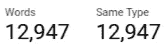

总字数和同类型字数-按作者分类的图片

# 游戏现在变得更难玩了吗？

好的，让我们回顾一下:到目前为止，我们知道 NYT 删除了一些单词，没有添加任何单词，也没有改变任何类型。

那么……如果 NYT 删除了 25 个单词，他们有什么办法让游戏变得更难玩吗？

其实…是的！

时不时地，Wordle 玩家会抱怨今天的单词太难了。也许这是一个不常使用的单词。不管什么原因，人们都一致认为:今天很艰难！

在这一点上，NYT 可能改变游戏的唯一方法是重新排序，把最困难的放在第一位。我们如何检验这个理论？

当我从两个游戏中提取单词时，我花时间给每个单词加了一个数字，以表明它们在完整列表中的顺序。

来自原始 Wordle ( `wordle_original.csv`)的解单词看起来像这样:

```
game,sequence,word,word_type
wordle_original,1,cigar,solution
wordle_original,2,rebut,solution
wordle_original,3,sissy,solution
wordle_original,4,humph,solution
wordle_original,5,awake,solution
...
wordle_original,2311,*****,solution
wordle_original,2312,*****,solution
wordle_original,2313,*****,solution
wordle_original,2314,*****,solution
wordle_original,2315,*****,solution
...
```

类似地，来自 NYT ( `wordle_nyt.csv`)的解决词看起来像这样:

```
game,sequence,word,word_type
wordle_nyt,1,cigar,solution
wordle_nyt,2,rebut,solution
wordle_nyt,3,sissy,solution
wordle_nyt,4,humph,solution
wordle_nyt,5,awake,solution
...
wordle_nyt,2305,*****,solution
wordle_nyt,2306,*****,solution
wordle_nyt,2307,*****,solution
wordle_nyt,2308,*****,solution
wordle_nyt,2309,*****,solution
```

为了防止剧透，我编辑了还没有播放的词… 🫣

比较原始列表和 NYT 列表中的序号，很容易看出哪些单词(如果有的话)被重新排序了。此外，计算两个序列号之间的差值真的会泄露。

让我们看看这将如何与 30 个单词的小集合一起工作，以更好地理解我们是否可以使用 delta 来检查单词是否被重新排序。

为了计算增量，我们需要用 NYT 序列减去原始的沃尔多序列。这是在 Data Studio 中创建新的计算字段:

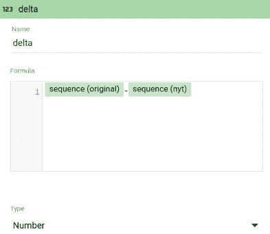

将 delta 创建为其他两个字段的差值-图片由作者提供

> **注意** : Data Studio 还不支持基于来自不同数据源的字段在混合中创建计算字段。要解决这一问题，请将这些字段添加到混合中它们各自的表中，然后创建一个特定于图表的计算字段。

**的第一种情况**是什么都没有改变:没有删除任何单词，并且保留了顺序。

包含 30 个随机单词的表格如下所示:

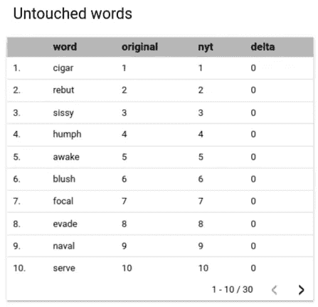

未接触的单词表—作者图片

绘制 delta 的图表清楚地显示没有任何东西被重新排序:delta 总是 0。让我们看看这个是什么样子的:

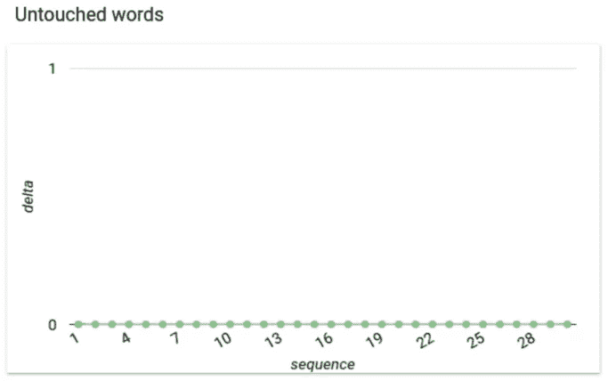

未接触的单词图表—作者图片

**第二种情况**是删除了一些单词，但保留了顺序。在这种情况下，“focal”、“naval”和其他词已被删除，因此 delta 不再总是 0:


删除的单词表-按作者排序的图像

图表 delta 现在显示了一些跳跃，与删除的单词相关。在任何情况下，该函数都是单调递增的:

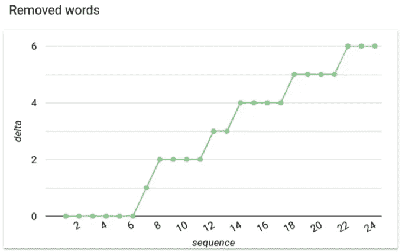

已删除单词图表-按作者分类的图像

第三种情况是单词被重新排序。为了简单起见，我只是对单词进行了重新排序，没有删除任何单词。

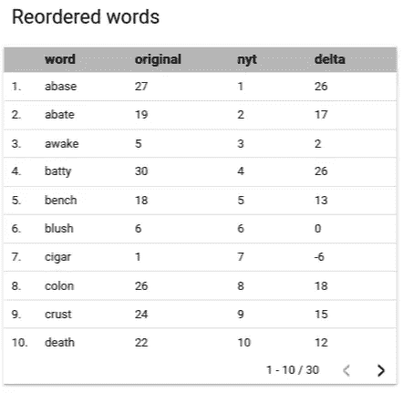

重新排序的单词表-按作者排序的图像

在这种情况下，随着单词的移动，delta 会剧烈波动:

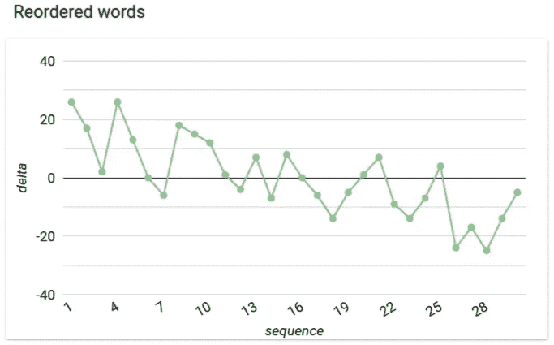

重新排序的单词图表—按作者排序的图像

完美！由于图表产生了易于识别的独特模式，所以用图表表示 delta 似乎是快速识别单词是否被重新排序的有效方法。

因此，让我们再一次使用完整的外部连接混合数据源来绘制 delta，并确定产生的模式:

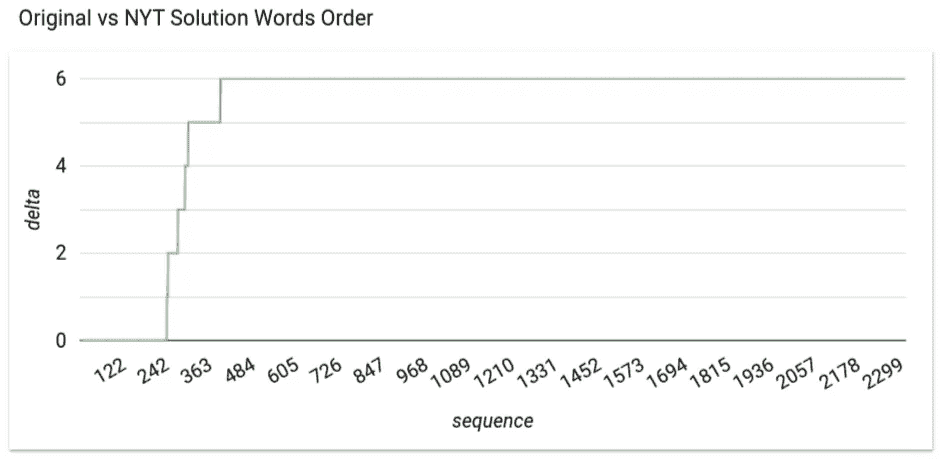

该图表清楚地显示了 6 个解决方案单词被删除，同时保留了它们的顺序——图片由作者提供

这个图表类似于第二种情况:删除单词但保留顺序。

所以你有它！新款 NYT 沃尔得和经典沃尔得一样坚硬。然而，一些玩家抱怨自从 NYT 买下它后，游戏变得越来越难玩了…🤷🏻‍♂