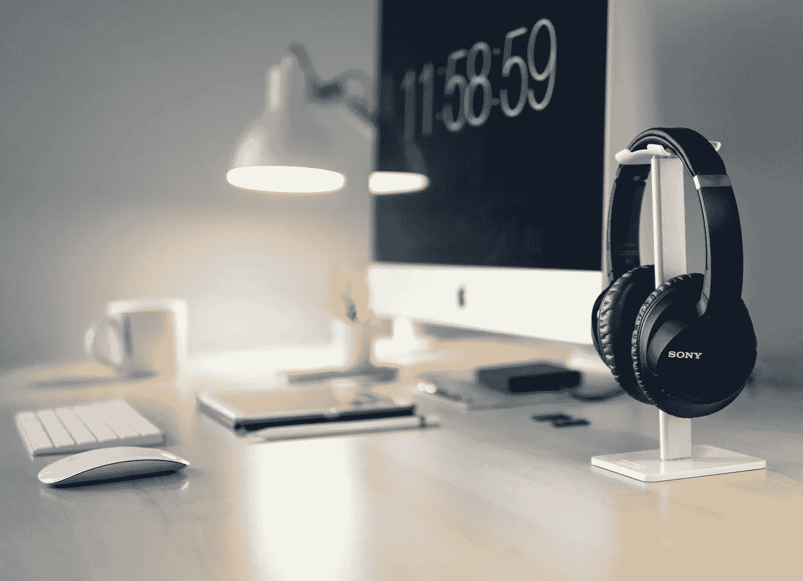

# 习惯在办公室工作的人在家工作的小贴士

> 原文：<https://betterprogramming.pub/work-from-home-tips-for-people-used-to-offices-55e9b0675809>

## 在家工作并不是每个人都自然而然的事情

迈克尔·索莱达在 [Unsplash](https://unsplash.com/s/photos/desk?utm_source=unsplash&utm_medium=referral&utm_content=creditCopyText) 上的照片。

对一些人来说，在家工作很自然，但对另一些人来说，这可能是一场真正的斗争。由于新冠肺炎席卷全球，改变了每个人的生活，我们不得不寻找新的工作和合作方式。

对于那些为办公室、社交活动和免费咖啡而生活的人来说，这种新的转变令人不快。集中精力是非常困难的，保持锁定前的生产力水平几乎是不可能的。

让我们来看看一些简单的方法来减少我们中的一些人现在感觉到的效率流失。虽然我们不能完全复制我们习惯的办公室，但我们可以更接近生产力禅。

# 持续时间

尽量保持一致的作息时间。这将复制办公室的相同时间结构。到了开始工作的时候，出现在你的办公桌前，手里拿着咖啡，开始工作。当五点钟(或者你决定的任何时间)到来时，站起来“打卡下班”

在家的时候将工作和生活完全融合似乎很诱人，但是要忍住这种冲动。它会让你精疲力尽，损害你的整体生产力。到了下班时间，就是*下班时间*。

保持规律的时间表会让你的时间保持一致。即使你只是从床上走到办公桌前，你也会建立一个常规。你的日常工作很重要，因为它让你的大脑与工作-生活-工作等正常节奏保持同步。

# 常规室外时间

我相信现在已经有人告诉你了，但是试着到外面去。你在同一个房间里呆的时间越长，你就越会慢慢变得疯狂。定期散步，跑步，在你的门廊上伸展身体。为了得到阳光和新鲜空气，尽你所能。

有许多研究表明，即使只是 10 分钟的步行也能改善你的精神状态。就我个人而言，如果我发现自己压力太大或者正在处理一个特别棘手的问题，我会起身去散步减压。十有八九，我想出了解决问题的办法或者只是走了之后觉得不那么焦虑了。

记住，你就像一株植物。你需要阳光和新鲜空气。

# 专用办公桌

你可能暂时躺在沙发上，膝上放着笔记本电脑，但从长远来看，这很糟糕。躺在床上或坐在沙发上是非正式的。这会让你的思维进入“我们正在放松”的模式，让你更加难以集中注意力。

这样工作还会影响你的姿势，过一会儿会让你的背受伤。这和用某种桌子工作根本没法比。你可以坐着、站着、在健身球上保持平衡，无论什么——只要你专注于办公桌。

你可能会想，“但是我坐在办公室的沙发上？”那是一个非常不同的环境。你在办公室穿着更正式的衣服，周围有专业的同事，你的大脑处于“工作模式”，因为你不在家。

这是关于近似你习惯的办公室环境。你不会穿着睡衣在办公室躺在床上工作吧？

# 尽量减少分心

这个很简单，但是很棘手。关掉电视。关掉你的手机。静音松弛。关上门。在分心开始之前停止它们。

这对每个人来说可能都不容易，尤其是那些家里有孩子的人，但是你必须尝试设定界限。如果一个朋友想和你视频聊天，或者你接到一个电话，这将会破坏你的注意力，你将不得不从零开始。

有时候，只需要一副像样的耳机。放一些轻音乐(最好没有歌词)或白噪音真的能让你进入工作状态。尝试 TraxLab 的这个 [Spotify 播放列表](https://open.spotify.com/album/0kO2MXVsJDoYd9yrLnPRm0)以获得更多想法。

如果你发现你的手机是一个很大的分散注意力的来源，我敦促你看看来自[蔻驰·托尼](https://medium.com/u/adeddd83f452?source=post_page-----55e9b0675809--------------------------------)的一篇名为[如何配置你的 iPhone 为你工作，而不是反对你](https://medium.com/better-humans/how-to-set-up-your-iphone-for-productivity-focus-and-your-own-longevity-bb27a68cc3d8)。列表上的第一项是——你猜对了——通知*。*

# 减少视频聊天

这听起来可能与一些人告诉你的相反，但这是真的。一天中视频聊天越多，就越累。与同一个地方的人持续的“面对面时间”会分散你的注意力，让你脱离任何表面上的深度工作。

一开始，从家里“接到电话”似乎很容易。听的时候把它放在“背景”里也没那么糟糕，对吧？不对。

在《快公司》最近的一篇文章中，他们概述了一个接一个的会议是如何创造出一个令人疲惫的“不停”的日程表的。你不必亲自从一个会议走到另一个会议。你坐在椅子上接一个又一个电话。将你所有的精力长时间集中在一个屏幕上并保持专注是令人疲惫的。

只要有可能，尽量减少视频通话的次数，或者将签到转移到 Slack 这样的异步交流形式。

# 结论

感谢你阅读并花时间了解这些减少分心的在家工作小贴士。希望，当我们都在这个充满挑战的时代，我们可以学会在家更有效地工作，让我们的环境像曾经的办公室一样有益。