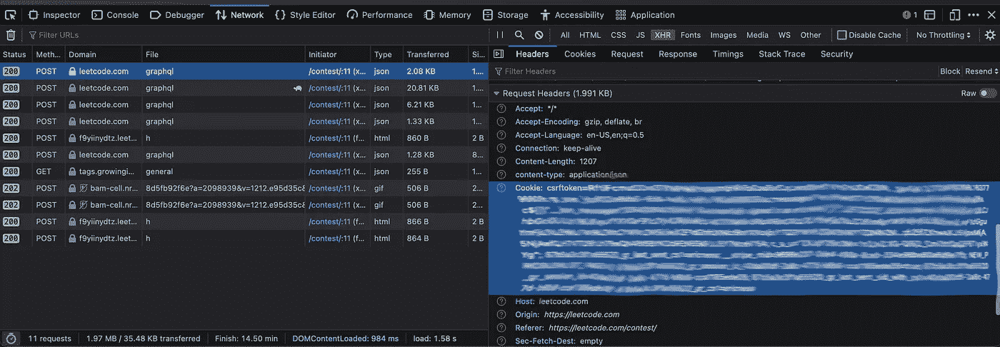

# 在 VS 代码中处理 LeetCode 问题

> 原文：<https://betterprogramming.pub/work-on-leetcode-problems-in-vs-code-5fedf1a06ca1>

## 使用 VS 代码而不是浏览器中的完整 IDE 支持解决 LeetCode 问题。


作者图片

2022 年打算用 LeetCode 学习更多的数据结构和算法。LeetCode 是一个很好的资源，因为它有大量的问题和一个很好的社区。

缺点是解决问题的默认方式是在 LeetCode 网站上编辑代码。我习惯了拥有自动完成、vim 仿真、括号着色等等的 ide。我真的不想为了解决 LeetCode 问题而降低我的编码体验。

幸运的是，有一个很棒的 VS 代码插件，可以让您在编辑器中解决问题。我建立工作空间的目标是:

*   在 VS 代码中编辑并提交
*   没有 leetcode.com 和 VS 代码之间的剪切和粘贴
*   在 Github 上保存工作

我使用的环境和工具是:

*   大苏尔马科斯
*   VS 代码(2021 年 11 月 1.63 版)
*   火狐 95.0

# LeetCode 扩展

VS 代码有一个很棒的 [LeetCode 扩展，它为我的设置完成了大部分繁重的工作。扩展的要求是:](https://marketplace.visualstudio.com/items?itemName=LeetCode.vscode-leetcode&ssr=false)

*   [VS 代码 1.30.1+](https://code.visualstudio.com/)
*   [Node.js 10+](https://nodejs.org)

我安装了 VS 代码，但没有安装 Node。在 macOS 上安装 Node 最简单的方法就是使用[自制](https://brew.sh/)。

```
brew install node
```

扩展本身可以使用在 VS 代码中安装扩展的[正常过程进行安装。](https://code.visualstudio.com/docs/editor/extension-marketplace)

现在到了棘手的部分。运行`LeetCode: Sign In`命令登录 LeetCode。然而，使用[用户和密码登录并不起作用](https://github.com/LeetCode-OpenSource/vscode-leetcode/issues/478#issue-527518451)。

## 使用 cookie 登录

为了登录你的 LeetCode 账户，你需要使用`LeetCode: Sign In`命令的`LeetCode Cookie`选项。这里有一些[资源](https://developpaper.com/the-tutorial-of-configuring-leetcode-plug-in-in-vscode/)和[资源](https://github.com/LeetCode-OpenSource/vscode-leetcode/issues/478)可以帮助你弄清楚这里该做什么。这些步骤是:

1.  打开浏览器，导航至 leetcode.com
2.  右键单击页面并选择“检查”
3.  在开发者工具中，转到网络选项卡，然后选择 XHR
4.  点击 leetcode.com 页面上的任何链接
5.  在网络选项卡中选择任何 http 呼叫
6.  在请求头中找到 Cookie 属性
7.  复制 Cookie 值(不包括“Cookie:”字符串)
8.  在 VS 代码中运行`LeetCode: Sign In`命令
9.  选择`LeetCode Cookie`选项
10.  输入用户名并粘贴 Cookie 属性的值



Firefox 的“开发者”标签中的“Cookie”字段

## 设置 Github

在 Github 中创建一个[新 repo 来存储你的问题解决方案。现在我们需要](https://github.com/ericness/leetcode)[配置 LeetCode 扩展](https://github.com/LeetCode-OpenSource/vscode-leetcode#settings)来保存到 git 目录中。

1.  在本地克隆 Github repo。我把我的克隆到了`/Users/ericness/github/leetcode`。
2.  将您的 VS 代码`settings.json`文件更新为[，将该文件夹指定为工作区](https://github.com/LeetCode-OpenSource/vscode-leetcode/wiki/Customize-the-Relative-Folder-and-the-File-Name-of-the-Problem-File)。不幸的是，LeetCode 扩展不允许用零填充问题 id 号，这样文件才能正确排序。问题有一个[未解决的问题，但是已经一年多没有解决了。](https://github.com/LeetCode-OpenSource/vscode-leetcode/pull/582)

3.右键单击 LeetCode 扩展浏览器中的任何问题，然后选择“显示问题”。

4.在您的 Github repo 中创建了一个问题文件。像其他代码文件一样，用 git 编辑并提交这个文件。

5.使用 LeetCode 扩展命令测试并提交您的解决方案。

# 包裹

这种设置在处理 LeetCode 问题的同时启用了 VS Code 的所有工具，同时避免了浏览器和 IDE 之间的剪切和粘贴问题。它提供了现代化的开发经验，加快了解决 LeetCode 问题的进程。祝你在 LeetCode 之旅中好运！