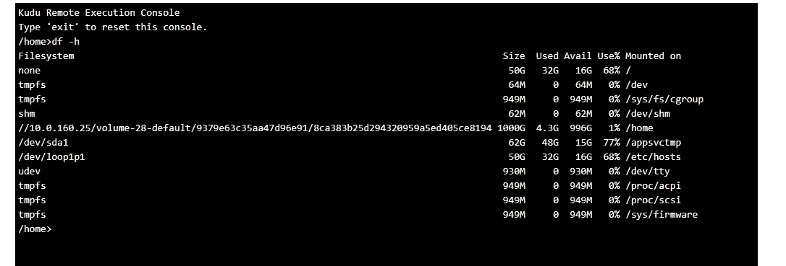

# 在 Azure Webapps 和 Docker 中使用持久卷

> 原文：<https://betterprogramming.pub/work-with-persistent-volumes-in-azure-webapps-and-docker-6a977a951052>

## azure web 应用程序现在提供了持久卷


我在 Azure 网络应用上工作过一段时间。现在我发现了 Azure Web 应用程序中的 docker 支持。这是一个很好的特性，但是有一些设置没有很好地记录下来(在我看来)。其中之一是为持久存储安装卷

我将向你展示，如何用持久卷在 Azure 中创建一个 WordPress 应用程序。

# 什么是卷？

docker 中的卷允许您持久化容器外部的数据。因此，卷就像 docker 的外部共享

因此，让我们在浏览器中运行 azure 命令外壳


# docker-compose.yml

我将使用 docker-compose 这将在 azure web 应用程序中得到支持，并且非常容易处理。

要在 azure shell 中创建 docker-compose.yml，只需输入

```
nano docker-compose-wordpress.yml
```

之后，你可以复制下面的 yml 内容

```
version: '3.3'services:
   db:
     image: mysql:5.7
     volumes:
       - db_data:/var/lib/mysql
     restart: always
     environment:
       MYSQL_ROOT_PASSWORD: somewordpress
       MYSQL_DATABASE: wordpress
       MYSQL_USER: wordpress
       MYSQL_PASSWORD: wordpresswordpress:
     depends_on:
       - db
     image: wordpress:latest
     ports:
       - "8000:80"
     restart: always
     environment:
       WORDPRESS_DB_HOST: db:3306
       WORDPRESS_DB_USER: wordpress
       WORDPRESS_DB_PASSWORD: wordpress
volumes:
    db_data:
```

这是你的基本设置。它定义了 MySQL 数据库和 WordPress 实例。WordPress 将等待数据库启动，然后启动 web 实例。现在是时候生成 web 应用程序了

# 创建 Web 应用程序

要从 YAML 模板创建一个 web 应用程序，您将首先创建一个资源组，将它们命名为`myResourceGroup`:

```
az group create — name myResourceGroup — location “West Europe” 
```

之后，您必须创建一个稍后将托管网页的应用服务计划

```
az appservice plan create — name myAppServicePlan — resource-group myResourceGroup — sku S1 — is-linux
```

现在是时候启动由 docker-compose 编写的多 docker 图片托管的 WordPress 了

```
az webapp create — resource-group myResourceGroup — plan myAppServicePlan — name myWebApplication — multicontainer-config-type compose — multicontainer-config-file docker-compose-wordpress.yml
```

之后，你可以导航到你的页面，你会看到安装 WordPress 安装向导出现。到目前为止一切顺利。

# 问题是

如果您的 web 应用程序现在进入睡眠状态，或者您重新启动它或重新部署它，那么您上次所做的配置将会丢失。为了防止这种情况，需要将数据存储在容器之外。持续出版的书来拯救我们了。

# 持久卷

最初，web 应用程序没有启用持久存储卷功能。您可以通过 shell 中的以下 az 命令来实现这一点

```
az webapp config appsettings set --resource-group myResourceGroup --name myWebApplication--settings WEBSITES_ENABLE_APP_SERVICE_STORAGE=TRUE
```

这将设置`WEBSITES_ENABLE_APP_SERVICE_STORAGE`为真，告诉 web 应用程序必须使用共享存储。通常它会被挂载到/home 目录中。你可以通过使用`df -h`命令看到这一点



之后，您现在必须使用`${WEBAPP_STORAGE_HOME}`变量来引用`/home`目录。所以现在可以像这样修改组合定义，将数据(MySQL 和 WordPress)存储到持久存储中

```
version: '3.3'services:
   db:
     image: mysql:5.7
     volumes:
       - ${WEBAPP_STORAGE_HOME}/site/db:/var/lib/mysql
     restart: always
     environment:
       MYSQL_ROOT_PASSWORD: somewordpress
       MYSQL_DATABASE: wordpress
       MYSQL_USER: wordpress
       MYSQL_PASSWORD: wordpress
   wordpress:
     image: wordpress:latest
     volumes:
       - ${WEBAPP_STORAGE_HOME}/site/wwwroot:/var/www/html
     ports:
       - "8000:80"
     restart: always
     environment:
       WORDPRESS_DB_HOST: db:3306
       WORDPRESS_DB_USER: wordpress
       WORDPRESS_DB_PASSWORD: wordpress
```

从现在开始，数据库数据将存储在`/home/db`中，任何基于应用程序的数据将存储在`/home/site/wwwroot`中。如果您将服务扩展到使用 2 个或更多节点，这没有关系，因为每个实例都将共享`/home`目录。

# 最后的话

我喜欢 azure 中的 docker 支持，有了持久化卷，你将能够在容器之外存储数据。因此，手动输入的数据将以安全的方式存储，以便容器的重新创建不会破坏整个工作。如何看待这种支持？

```
**Want to Connect?**Say Hello on: [LinkedIn](https://www.linkedin.com/in/sascha-peter-bajonczak-32a17a2a/), [GitHub](https://github.com/sbajonczak), and [Blog](https://blog.bajonczak.com/).
```