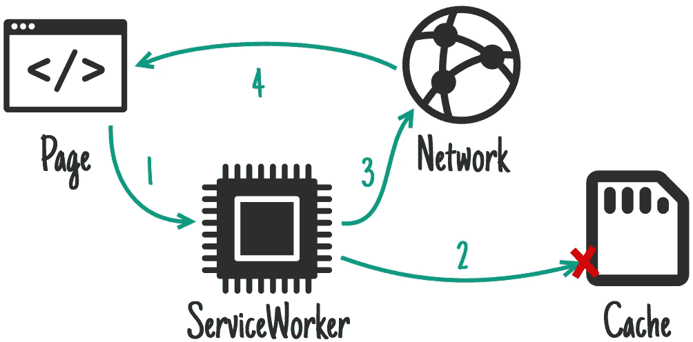
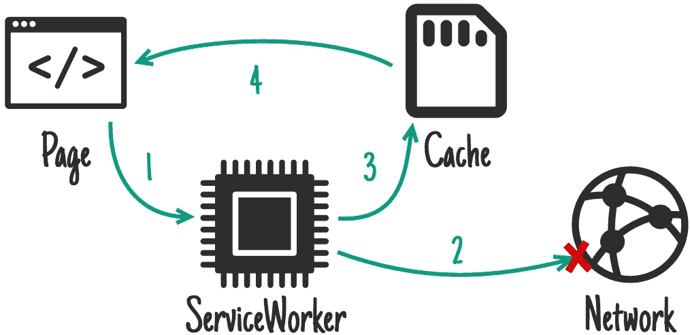
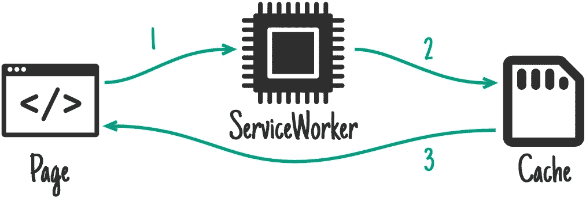
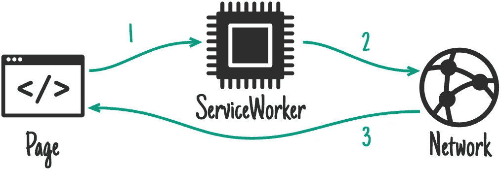
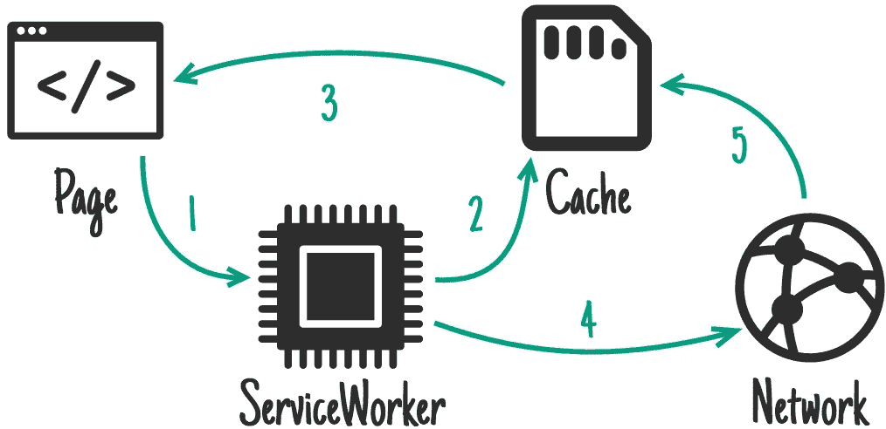

# 带有示例和使用案例的工具箱策略

> 原文：<https://betterprogramming.pub/workbox-strategies-with-examples-and-use-cases-ebb32f8cbe4d>

## 使用工具箱提高你的 PWA

[插图 unDraw](https://undraw.co/illustrations)

在网站上使用服务人员时，如果你已经熟悉 API 和服务人员线程内部的工作方式，你完全可以自己用普通的 JavaScript 编写所有代码。

然而，尽管普通的 JS 会给你更多的清晰度，仍然推荐你使用[工具箱](https://developers.google.com/web/tools/workbox)来代替，以避免错误并增加简单性*。*

[Workbox](https://developers.google.com/web/tools/workbox) 是一组 JavaScript 库，旨在使用服务工作者和渐进式 web 应用开发来简化高级缓存的实现**。**

Workbox 可以简化您的服务人员文件，通过使用无错误代码使其更具可读性，更易于更新。

在这篇短文中，我将为每个[工作箱策略](https://developers.google.com/web/tools/workbox/modules/workbox-strategies)列出一个用例示例，旨在启发您，以防您对这些相对较新的细微差别感到困惑，或者刚刚开始使用工作箱。

# 解释工具箱策略

工作盒策略被用作响应客户端 HTTP 请求的方式。例如，假设客户端请求一个 URL 为`/styles/main.css`的资源。指定的策略告诉服务人员如何响应这一请求。服务工作者应该首先在缓存中寻找`/styles/main.css`资源吗？还是来自网络？还是两者都有？

# 示例和使用案例

为了确保您知道哪种策略最适合您的情况，让我们来看看所有可用工具箱策略的一些用例。

## [先缓存](https://developers.google.com/web/tools/workbox/modules/workbox-strategies#cache_first_cache_falling_back_to_network)

首先尝试在缓存中查找资源

首先尝试在缓存中查找资源。如果没有，尝试从网络上获取。用例:版本不经常改变的资源，例如字体文件

## [网络第一](https://developers.google.com/web/tools/workbox/modules/workbox-strategies#network_first_network_falling_back_to_cache)

尝试先从网络上获取它

请先尝试从网络上获取它。如果找不到资源，尝试从缓存中获取它。用例:其最新版本很重要但仍然需要离线的资源，例如服务器端呈现的 HTML 资源

## [仅缓存](https://developers.google.com/web/tools/workbox/modules/workbox-strategies#cache_only)

尝试仅从缓存中获取资源

请尝试仅从缓存中获取资源。用例:当你已经为一个文件配置了预缓存，并且想只使用那个资源时，例如一个[默认离线页面](https://medium.com/better-programming/cache-handling-using-service-workers-and-the-cache-api-on-the-web-7c00c478d39b#7093)或者一个占位符后备图像

## [仅网络](https://developers.google.com/web/tools/workbox/modules/workbox-strategies#network_only)

尝试仅从网络获取资源

尝试仅从网络获取资源*。*用例:只在在线活动期间有意义的页面，例如，活动用户页面及其资源

## [重新验证时失效](https://developers.google.com/web/tools/workbox/modules/workbox-strategies#stale-while-revalidate)

[stale-while-revalidate](https://developers.google.com/web/tools/workbox/modules/workbox-strategies#stale-while-revalidate) 策略是最复杂的工具箱策略。

尝试从网络和缓存中获取资源。如果可用，从高速缓存响应，并退回到网络。用网络响应更新缓存。用例:资源的最新版本并不重要，但加载时间具有优先权，例如，用于快速初始页面渲染的 CSS 文件。

# 应用工具箱策略

策略应用于指定的 HTTP 路由。为此，Workbox 通过`registerRoute`函数提供了一个高层接口，该函数在运行时需要一个`RegExp`来匹配多条路径。

该功能允许[在添加基于所有匹配`RegExp`的路由 URL 的特定策略后，进行](https://developers.google.com/web/tools/workbox/guides/route-requests)路由缓存处理。

## [重新验证时失效](https://developers.google.com/web/tools/workbox/modules/workbox-strategies#stale-while-revalidate)

服务工作者 JavaScript 文件中包含的上述单行代码声明，以任何扩展名`js`、`css`、`webp`、`png`或`svg`结尾的每个请求都应该由`[StaleWhileRevalidate](https://developers.google.com/web/tools/workbox/modules/workbox-strategies#stale-while-revalidate)`策略处理。

如果没有指定策略，则使用默认策略，即先缓存。

## [网络第一](https://developers.google.com/web/tools/workbox/modules/workbox-strategies#network_first_network_falling_back_to_cache)

上面的路由注册对于服务器端呈现的应用程序来说很方便，在这些应用程序中，显示网站和数据库的最新版本很重要，但是在没有网络的情况下，您仍然希望至少向用户显示一些内容。