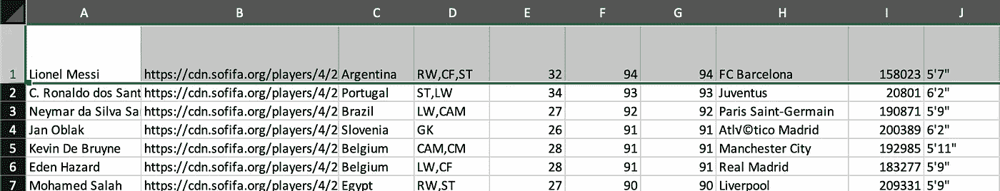
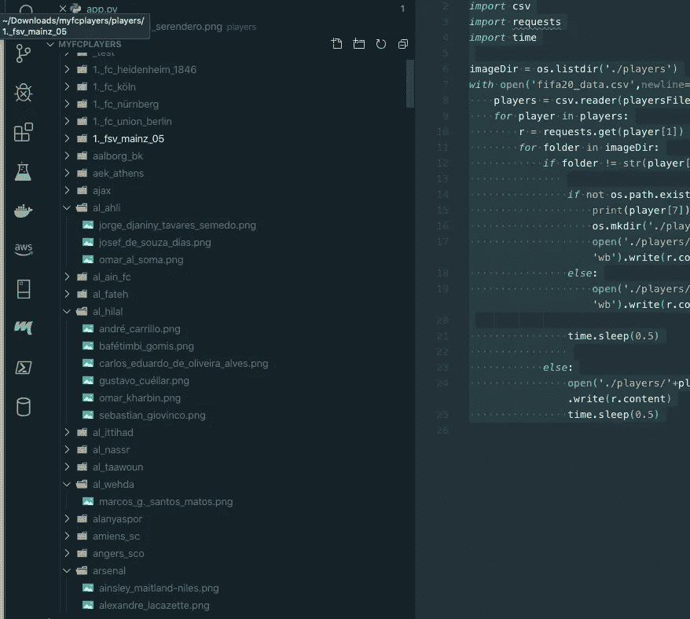

# 工作流自动化:如何使用 Python 下载和组织 18000 多幅图像

> 原文：<https://betterprogramming.pub/workflow-automation-how-to-download-and-organize-18000-images-using-python-c42206577a8e>

## 用 22 行代码节省几天甚至几周的工作量！


照片由 [Soragrit Wongsa](https://unsplash.com/@invictar1997?utm_source=medium&utm_medium=referral) 在 [Unsplash](https://unsplash.com?utm_source=medium&utm_medium=referral) 上拍摄

有了 22 行代码，几天，也许几周的工作可以减少到 30 分钟。

如今，人们比以往任何时候都更需要快速高效地完成任务。这就是自动化的用武之地。自动化在支持它的环境中是很棒的，但是其他人，比如“恐龙文化”，把它看作是懒惰的一种尝试。

无论哪种方式，在有大量“x”并且需要以某种方式操作的情况下，自动化都是有益的。

# 问题

我得到了一个包含 18000 多项足球运动员信息的数据集——运动员的姓名、年龄、体重、身高、原籍国、俱乐部等。

对于这个项目，我只需要球员的名字，俱乐部，和图像路径。



# 这个计划

我如何下载 18000 张图片，并根据他们的俱乐部将它们组织到一个文件夹中？

我想自动化这项任务，而不是浪费大量时间，所以我选择编写一个只有 22 行代码的 Python 脚本。此代码:

*   阅读 CSV
*   循环遍历每一行
*   在每一行中首先获取俱乐部名称。
*   检查“球员”文件夹以查看标记为文件夹的俱乐部是否存在。如果没有，它会创建一个以俱乐部命名的文件夹。
*   如果俱乐部文件夹存在，它会将球员添加到文件夹中。
*   下载玩家的图像，并用玩家的名字保存。

# 该过程

首先，创建一个虚拟环境来隔离项目。这个脚本中唯一使用的第三方模块是`Requests`。需要执行 GET 请求来下载球员图像。

要创建环境，请在终端中键入以下代码:

```
$ mkdir playerimages$ cd playerimages$ virtualenv -p python3 env$ source env/bin/activate$ (env) pip install requests$ touch app.py
```

确保将 CSV 添加到目录中。数据集可以在[这里](https://www.kaggle.com/karangadiya/fifa19)找到。一旦它被添加，它应该被标记为`fifaplayers.csv`。

## 导入模块

python 标准库附带了脚本执行任务所需的三个模块。首先是操作系统模块(os)。这个模块将允许目录遍历、创建和操作。下一个模块是逗号分隔值(CSV)。需要 CSV 来读取播放器数据集。

接下来是时间模块。用时间延迟来分隔批处理请求是一个很好的做法。如果脚本在没有合理时间延迟的情况下执行，它将在资源允许的情况下尽快完成。问题是，作为一个用户，你访问的服务会认为这是一种暴力攻击，导致你的 IP 地址被屏蔽，甚至更糟。一个架构良好的服务器可以在这种行为成为问题之前检测到它，但是在您决定这是您计划要做的之前，请查看服务关于访问数据的策略以及什么被认为是“数据抓取”

最后，导入`requests` 模块。`Requests`是需要下载的标准库未包含的四个模块之一。这个模块将被用来请求下载球员的头像。

## 任务

下面是对执行过程的解释，从第五行开始。

`os.listdir` **:** 列出一个目录内的目录。这里`os.listdir`被赋予一个`./players`参数，并被赋给`imageDir`变量。

```
imageDir = os.listdir(‘./players’)
```

要将播放器数据集与 CSV 模块一起使用，需要将其打开，然后赋给第六行中的变量(`playersFile`):

```
*with* open(‘fifaplayers.csv’,newline=’’) as playersFile:
```

在`with`执行块中，发生了很多事情。让我解释一下我在剧本中的意图，让它更有意义。

*   执行时，读取文档的第一行。
*   然后读取第 1 和第 7 个索引，这是球员的俱乐部。
*   向图像服务器发出请求，如果玩家俱乐部的目录不存在，则创建该目录。
*   该播放器被添加到目录中。
*   在将玩家添加到目录的过程中，玩家名称中存在的任何空格都被替换为下划线，小写，并作为 png 写入目录。这有助于提高可读性，并消除任何与间距有关的格式问题。
*   从 CSV 读取的每一行之间添加了 500 毫秒的时间延迟，以防止图像下载出现任何问题。

*注意:在第 14 行，当一个目录被创建时，它被记录到控制台。*

# 死刑

当执行开始时，将创建并填充目录。该过程可能需要 30 分钟，具体取决于时间延迟和资源。

要执行脚本，请键入:

```
$ (env) python app.py
```



脚本生成的文件夹和图像

在这一点上，可能需要几天甚至几周的事情在几分钟内就完成了。

这就是自动化的力量！

如果你想得到更多这样的帖子，请注册我的时事通讯以获得最新消息。[注册简讯](https://share.hsforms.com/1tVh1vq1ZSHy0JlsTnFBwwg4c0tk)