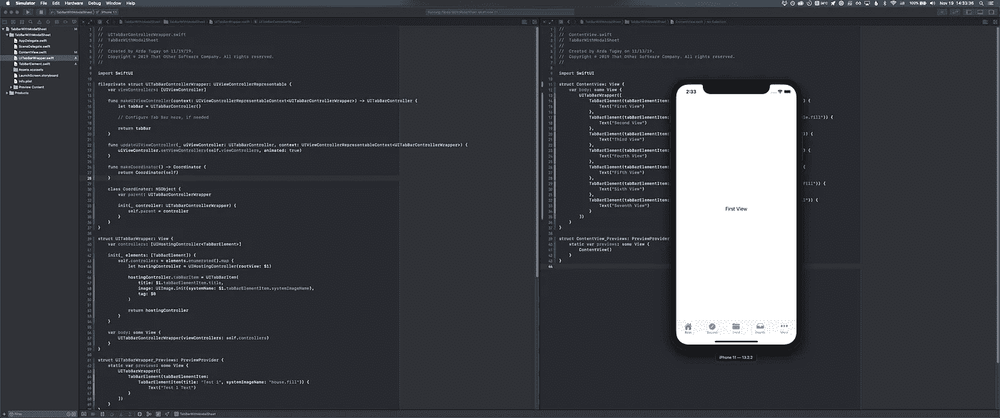
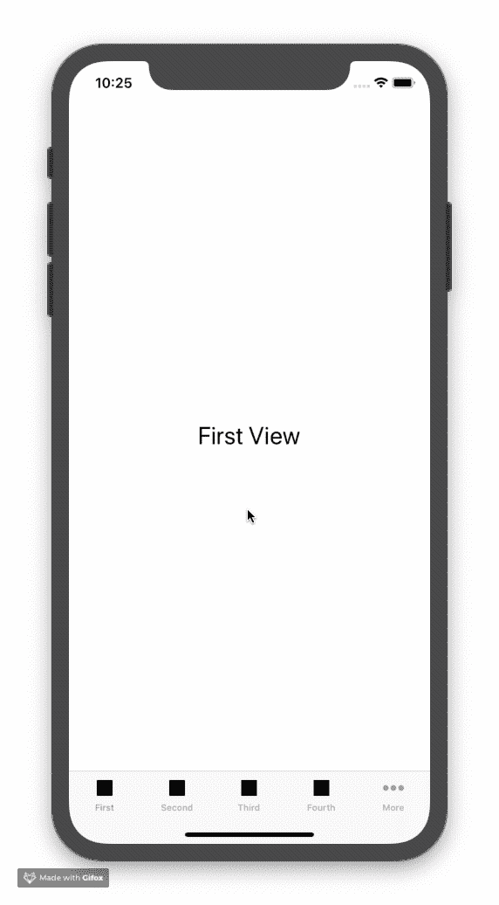
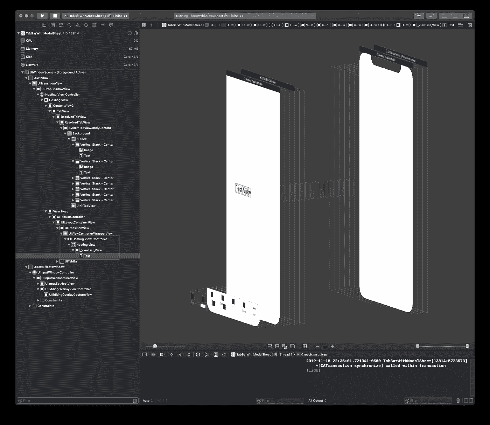
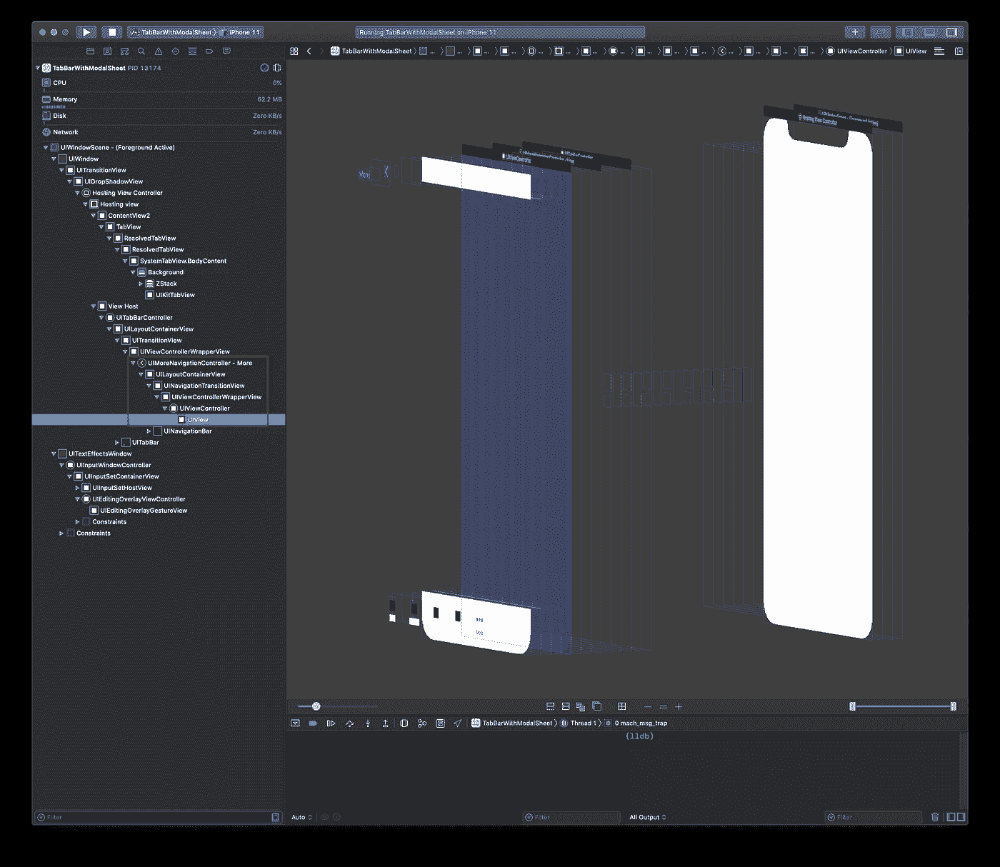
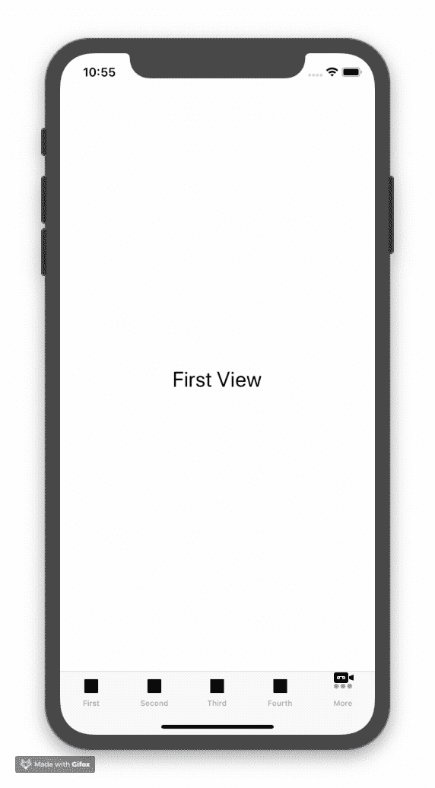
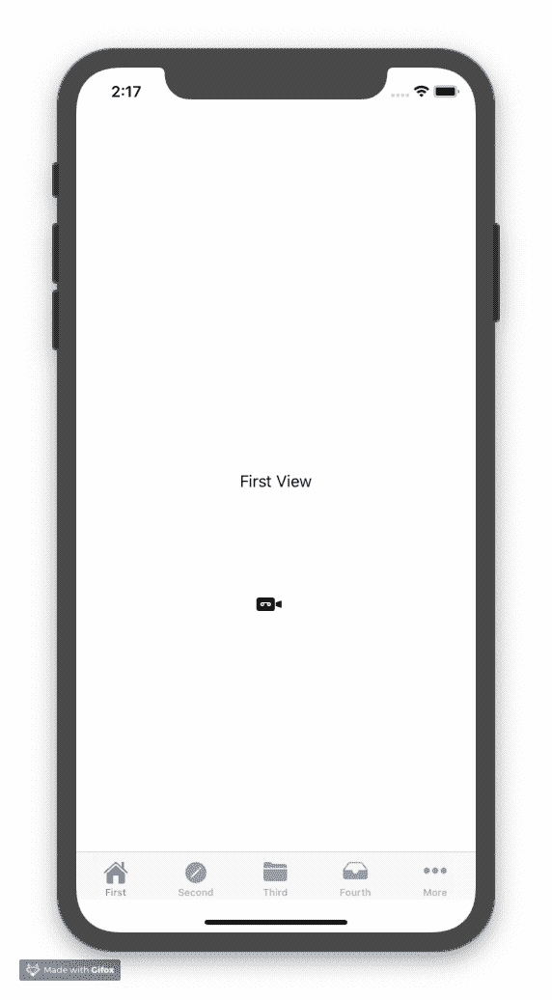

# 解决 SwiftUI 的 TabView 的不足

> 原文：<https://betterprogramming.pub/working-around-the-shortfalls-of-swiftuis-tabview-ac9aa2a9d894>

## 6-tab 问题，以及如何使用 UITabBarController 来解决它

*更新(2019–12–19):*[*有读者提到，对于“更多”页签*](https://medium.com/@thomasjsvos/hey-this-is-a-very-nice-workaround-but-i-still-have-some-issues-with-the-navigation-bar-6f900d90ef88) *，他们不能使用* `[*NavigationView*](https://medium.com/@thomasjsvos/hey-this-is-a-very-nice-workaround-but-i-still-have-some-issues-with-the-navigation-bar-6f900d90ef88)` [*。写完这篇文章不久，我就遇到了这个问题。可惜的是，没有办法使用* `*NavigationView*` *和你* ***拥有*** *才能使用* `*UITabBarController*` *的导航控制器配合这个方案。实际上，我已经受够了这一点，并决定在 SwiftUI 中实现一个完全模仿苹果标签栏功能的自定义标签栏。你可以在这里查看解释我如何做的文章*](https://medium.com/@thomasjsvos/hey-this-is-a-very-nice-workaround-but-i-still-have-some-issues-with-the-navigation-bar-6f900d90ef88) [*，*](https://medium.com/@ardactugay/diving-deep-into-swiftui-a-simple-custom-tab-bar-part-1-of-5-680d05d7f99b) *，但是这个解决方案要复杂得多。你仍然应该阅读这篇文章，因为我做了一些调试，得到了一些关于 SwiftUI 如何工作的有用信息！*

寻找解决方案！(图片由阿尔达·c·图盖提供)

在过去的五年里，我主要专注于后端开发，最近我决定尝试一下 iOS 应用程序开发。我以前在工作中尝试过它，以在移动开发者人手不足时为他们提供支持，但我从未花时间认真学习如何开发 iOS 应用程序。我认为这是最好的时机，SwiftUI 将于今年秋天发布。它吸引了我，特别是随着`Combine`框架的引入，因为我以前使用过反应式编程。

# 包含 6 个或更多选项卡的选项卡视图

我从 [WWDC 第 237 期](https://developer.apple.com/videos/play/wwdc2019/237/)开始了解`Views`是如何运作的，然后就一头扎进了一个项目。然而，我很快就被一堵墙的 bug 击中了，其中很多都在`TabView`。我开发的应用程序将有七个选项卡项目，我做了以下工作来实现这一点:

简单吧？我使用了[苹果文档](https://developer.apple.com/documentation/swiftui/tabview)中的简单概述。它看起来很棒，直到我试用它并注意到两个问题。

# 首要问题

轻按“更多”,然后轻按行，应该会用文本视图显示它们各自的视图，但不会。

当您有六个或更多的标签栏项目时，`TabView`会自动用更多的标签替换第五个标签，并在表格视图中将其余的标签栏项目显示为行。你会注意到，在点击更多之前，点击任何标签栏项目都会显示其相关视图。但是，点击任何一行都会导航到一个空视图。我认为这需要更多的调查，所以我决定在 Xcode 中使用调试器来调查视图层次结构。

## 当第一个标签激活时

SwiftUI 文本位于 UIHostingController 内部。SwiftUI 的 TabView 内部使用`UITabBarController`。

你可以在上面看到苹果使用了引擎盖下的`[UITabBarController](https://developer.apple.com/documentation/uikit/uitabbarcontroller)`！它们通过将 SwiftUI 视图封装在`[UIHostingController](https://developer.apple.com/documentation/swiftui/uihostingcontroller)`中来显示它。这感觉很熟悉；苹果在他们的 [SwiftUI 教程中就是这么做的，用于与 UIKit](https://developer.apple.com/tutorials/swiftui/interfacing-with-uikit) 接口。至少他们在身体力行！

这实际上是一个好消息，因为根据`[UITabBarController](https://developer.apple.com/documentation/uikit/uitabbarcontroller)`文档，它应该处理标签栏项目选择，并自动生成我们在上面的视频中看到的更多视图。太好了，但是为什么不管用？

## 当第六个标签激活时

我们的 SwiftUI 视图不再显示。它甚至没有被包在一个`UIHostingControlle` r 里面。

与上面的选项卡栏项目视图相比，您会注意到有所不同。有个`UIMoreNavigationController`，意料之中；在`[UITabBarController](https://developer.apple.com/documentation/uikit/uitabbarcontroller#1653016)`文档中,“更多导航控制器”部分解释了为什么会在这里。

但令人惊讶的是，我们的 SwiftUI 视图不再显示。事实上，一个`UIHostingController`甚至不存在。这感觉像是个 bug。似乎苹果忘记了处理使用`TabView`时可能出现六个或更多标签的情况。

# 第二个问题

还有另一个问题，在重新排列标签栏项目时出现，这是`TabView`的另一个内置功能(通过`UITabBarController`):

重新排列选项卡栏项目后，TabView 不考虑这些更改并自行重置。

这一次，重新排列的标签栏项目甚至不被尊重。`TabView`只是重置回原来的状态！我认为这可能是因为我没有明确地给每个标签栏项目分配`tag`值(我在使用`UITabBarController`和初始化单个`[UITabBarItems](https://developer.apple.com/documentation/uikit/uitabbaritem/1617056-init)`时已经这样做了)，但是在每个`tabItem`上使用`[tag(_:)](https://developer.apple.com/documentation/swiftui/tabview/3367703-tag)`也没有帮助。

此时，考虑到缺少`TabView`的文档，我放弃了尝试让`TabView`按照我想要的方式运行，决定直接使用`UITabBarController`并将其嵌入 SwiftUI。

# 将 UITabBarController 与 SwiftUI 一起使用

…以及在选项卡栏项目内容中嵌入 SwiftUI 视图。

让我们首先创建一个新的 SwiftUI 视图文件，将其命名为`UITabBarWrapper`。第一次创建时，它看起来像这样:

首先，让我们在这里为 UIKit `UITabBarController`添加一个包装器。它必须符合`[UIViewControllerRepresentable](https://developer.apple.com/documentation/swiftui/uiviewcontrollerrepresentable)`协议:

*   我们在这里使用`fileprivate`来保持`UITabBarControllerWrapper`专用于这个文件，因为它不会在其他地方使用。我们需要符合`UIViewControllerRepresentable`，因为我们想在 SwiftUI 中表示一个 UIKit 视图控制器。
*   来自`UIViewControllerRepresentable`的第一个必需的实例方法。这是我们创建`UITabBarController`并在返回之前对其进行配置的地方。
*   第二个必需的实例方法来自`UIViewControllerRepresentable`。SwiftUI 调用这个函数来通知 UIKit，SwiftUI 端有一个更新，UIKit 视图控制器需要更新。我们只需在这里为每个选项卡的内容设置视图控制器。需要时，您可以做任何需要做的额外工作来更新`UITabBarController`。
*   协调器与更新方法相反；当 UIKit 端发生变化时，它会向 SwiftUI 发送更新。在这种情况下，我只是包含了一个模板，但我们不会使用它。

在我们使用`UITabBarControllerWrapper`之前，我们需要定义一个新的 SwiftUI 视图，它将封装我们想要在每个选项卡中显示的内容。让我们从创建另一个名为`TabBarElement`的 SwiftUI 视图文件开始。它看起来会和我们创建`UITabBarWrapper`时一样。

首先，让我们给这个文件添加一个新的结构和协议:

*   这个结构将包含标签栏项目的标题和我们将为它使用的系统图像名称。我稍后会解释为什么我们要创建这个结构。
*   这个协议定义了一个标签栏项目应该包含什么，这样我们的`UITabBarWrapper`就知道在这个项目的标签栏上显示什么，以及它的内容将会是什么。

现在我们已经有了我们需要的一切，让我们在`TabBarElement`中使用它们:

*   我们有`TabBarElement`符合`TabBarElementView`，因为`TabBarElementView`符合`View`，并且它有我们将需要的附加属性。
*   我们用类型`[AnyView](https://developer.apple.com/documentation/swiftui/anyview)`定义了`TabBarElementView`协议所需的实例变量，这是一个类型擦除的`View`。我们需要使用`AnyView`来允许`TabBarElement`接受任何类型的视图，而不必担心指定泛型类型。当我们在`UITabBarWrapper`中使用`TabBarElement`时，您将会看到这是如何应用的。
*   `[@ViewBuilder](https://developer.apple.com/documentation/swiftui/viewbuilder)`是一个参数属性，允许从闭包构建视图。这是 Apple 为其所有 SwiftUI 视图所使用的，以便您可以使用类似 DSL 的语法来创建视图(如果您想了解更多关于该参数属性如何工作的信息，请查看[这篇伟大的文章，](https://blog.vihan.org/swift-function-builders/)因为关于该功能的官方文档仍然缺乏。还有一个很棒的 [GitHub 资源](https://github.com/carson-katri/awesome-function-builders)供所有类型的使用这个特性的库使用。
*   由于`content`的类型是`AnyView`，我们必须删除作为初始化器参数提供的`content`。
*   我们的`TabBarElement`视图的主体使用用户传递给它的`content`。您可以在预览结构中看到这样的示例。

现在我们准备完成`UITabBarWrapper`！

*   我们创建了一个变量来保存`UITabBarController`需要的所有控制器。注意，我们将类型定义为一个数组`UIHostingController<TabBarElement>`，但是我们的初始化器想要一个数组`TabBarElements`。这是有意的，允许我们的`UITabBarWrapper`用户完全在 SwiftUI 中工作，而不必担心 UIKit(即关注点分离)！
*   我们枚举元素，然后映射它们，本质上模拟了一个具有索引功能的*映射。`$0`成为索引，而`$1`是闭包中的`TabBarElement`元素。*
*   如果你查看`[UITabBarController](https://developer.apple.com/documentation/uikit/uitabbarcontroller)`文档，你必须定义`tabBarItem`。

选项卡栏项目通过其对应的视图控制器进行配置。要将一个选项卡栏项目与一个视图控制器相关联，创建一个新的`[UITabBarItem](https://developer.apple.com/documentation/uikit/uitabbaritem)`类实例，为视图控制器适当地配置它，并将其分配给视图控制器的`[tabBarItem](https://developer.apple.com/documentation/uikit/uiviewcontroller/1621175-tabbaritem)`属性。如果你没有为你的视图控制器提供一个定制的标签栏项目，视图控制器会创建一个默认项目，不包含图像和来自视图控制器的`[title](https://developer.apple.com/documentation/uikit/uiviewcontroller/1621364-title)`属性的文本。

`tabBarItem`实例方法实际上是在`[UIViewController](https://developer.apple.com/documentation/uikit/uiviewcontroller/1621175-tabbaritem)`上定义的，所以`UITabBarController`只是继承了它。

*   我们将元素的索引指定为标签栏项目的标签。如果你愿意，你可以自定义它！
*   最后，我们将所有控制器传递给符合`UIViewControllerRepresentable`的结构，它按照我们的要求初始化并更新我们的`UITabBarController`。

我们终于准备好使用我们的新`**UITabBarController**` **！**

我将把它放在我的`ContentView`基本视图中:

这是我运行它时的样子:

有用！在苹果修复这些错误并更新他们的文档以获得更多细节之前，我将使用原来的`UITabBarController`。

感谢阅读！我希望这能帮助任何有类似问题的人。