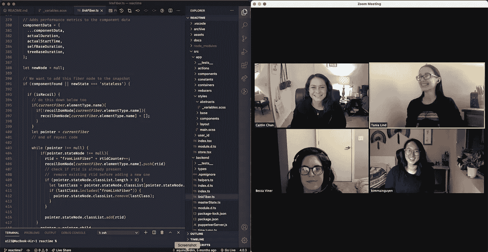

# 作为一个团队参与一个开源项目

> 原文：<https://betterprogramming.pub/working-on-an-open-source-as-a-team-50b61b85bb55>

## 反思我们对开源项目 Reactime 的贡献

哈维尔·阿莱格·巴罗斯在 [Unsplash](https://unsplash.com?utm_source=medium&utm_medium=referral) 上的照片。

现在我们的团队已经发布了[react ime](https://medium.com/better-programming/improving-and-optimizing-performance-of-react-apps-with-reactime-v7-0-737bdbdf1e0e)7.0 版本，我们有一些时间来反思我们为开源项目做出贡献的经验。尽管我们的团队跨越多个时区工作，并且只进行虚拟交流，但他们的工作效率令人难以置信。我们成功的团队动力最重要的方面非常简单:同理心和沟通。

更具体地说，这里是我们如何把这些付诸实践。

在开始一个项目之前，我们讨论了每个人的个人目标，并寻找了一个我们都充满热情并喜欢使用的应用程序。我们都喜欢使用 React 构建应用程序，并希望加深对 JavaScript 库的理解。对于我们来说，Reactime 是一个完美的开源项目。

我们的方法非常简单。在每个阶段，我们主要关注的是用户的体验，我们应用程序的用户，以及希望为我们的扩展做出贡献的开发者。我们希望改进扩展本身的性能，使开发人员更容易发现应用程序中的错误，并轻松识别性能瓶颈。

# **UX/UI**

在向应用程序添加任何额外功能之前，我们花了大量时间研究开发人员在构建 React 应用程序时面临的主要问题。我们希望确保我们对 Reactime 的贡献能够满足社区的需求。

在搜索了堆栈溢出、npm 包和 GitHub 问题后，我们终于找到了 Reactime 需要的缺失部分:一个允许开发人员可视化其应用程序每个组件的渲染频率的功能。

> “想想实际使用 React 和构建这些产品的人会有什么样的体验。”— [索菲·阿尔珀特](https://sophiebits.com/2018/05/29/react-podcast-inside-react.html)

开发人员使用 Reactime 的经验总是指导着我们在应用程序中所做的更改。考虑到这一点，我们统一了应用程序的风格，添加了一些对比色，使交互按钮流行起来，并增加了图形视觉效果。然而，我们并没有就此止步。

我们希望优化应用程序的性能，并为此重构了大部分代码。这在应用程序的性能和兼容性方面带来了令人印象深刻的变化。Reactime 现在不仅更快，而且还可以与 Next.js、Gatsby 和多页面应用程序一起工作。

# **开发者体验**

开发人员对应用程序的体验经常被忽视和忽略。对代码库或自述文件的小改进可以帮助开发人员更快地进入代码库。我们首先检查代码，添加注释，并进行重构，使其更容易理解。

阅读比你想象的更重要。如果你要投入到一个开源项目中，你会不想有一个清晰易懂的自述文件来帮助你马上开始编码吗？考虑到这一点，我们在开发者自述文件中添加了清晰的应用数据流图(这也有助于我们处理代码)。从理解在哪里可以找到合适的控制台的角度来看，使用 Reactime 不是很直观，尤其是当试图查看来自后端文件的控制台日志消息时。为了帮助未来的开发人员，我们添加了 gif 来指示在应用程序的各个部分中可以找到控制台日志消息的位置。

# **反应时间**

我们实际上试图用 Reactime 解决什么问题？当谈到 React 应用程序时，优化应用程序性能的最具挑战性的方面之一是状态管理调试。现在，处理 React 应用程序状态的方法有很多——Hooks、Context API、Redux 等等。

然而，并没有太多的工具可以完全兼容这些不同的状态处理方式。这就是 Reactime 变得方便的地方。这是一个 Chrome 扩展，集中了复杂的状态调试过程。这个开发工具提供了直观的 UX 和 UI，以及每个组件的性能指标。开发人员可以可视化他们的应用程序的组件层次结构，跳转到他们的应用程序状态历史的任何状态快照，并查看每个组件的呈现频率。

# **同理心创新**

在整个过程中，我们保持了一种不评判的环境，确保每个人都在同一页上，并花时间倾听对方，尤其是当我们有分歧时。换位思考和理解推动创新。毕竟，编程永远是关于人类体验的。应用程序让我们的生活变得更加轻松。为了解决这些问题，你必须理解人们正在经历的问题。开放、友善并与你的工程师同事建立牢固的关系将进一步推动变革和生产力，因为你们每个人都可以发挥互补的优势。

多元化也被证明可以推动创新，作为一个全女性团队，我们觉得我们为 Reactime 引入了一个独特的视角。