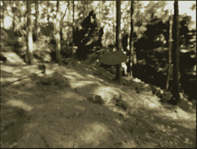
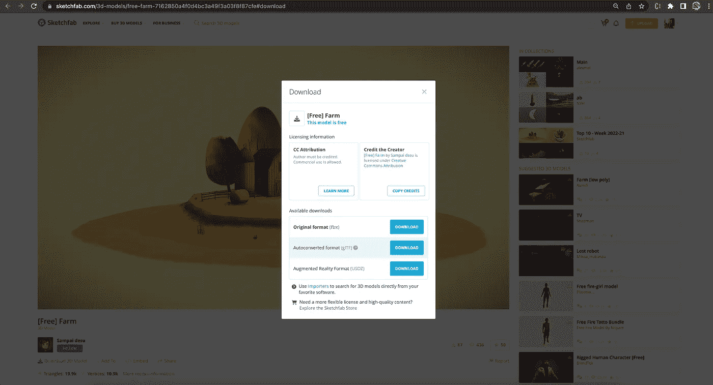
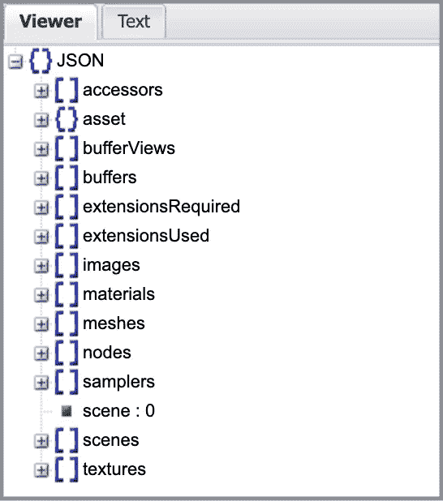
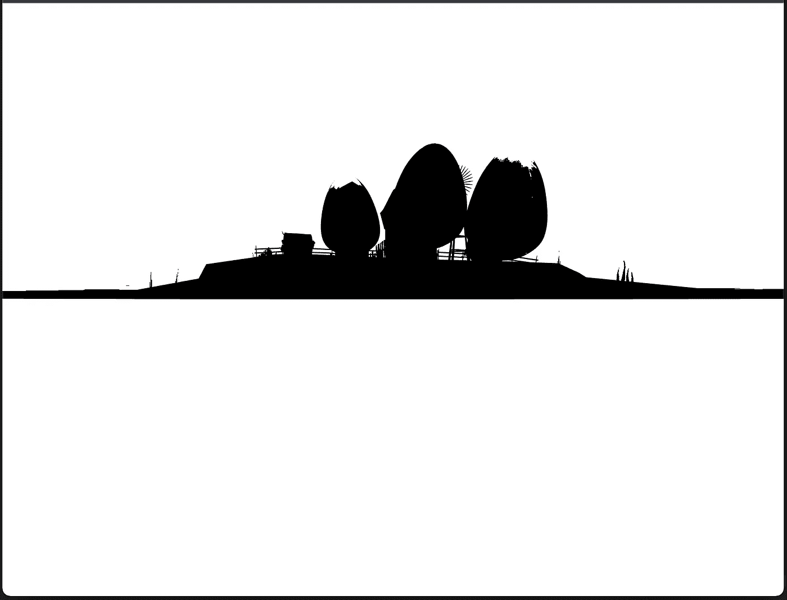
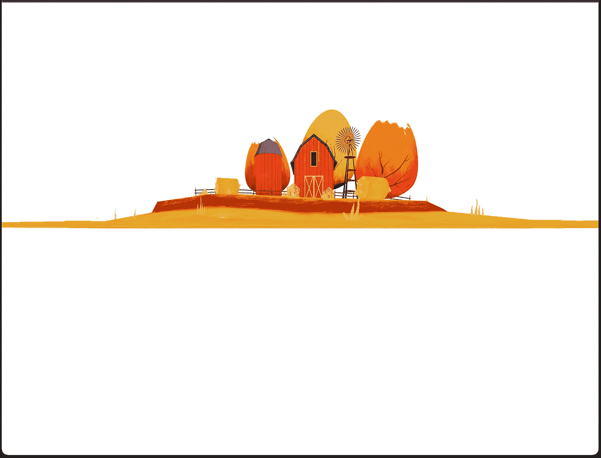
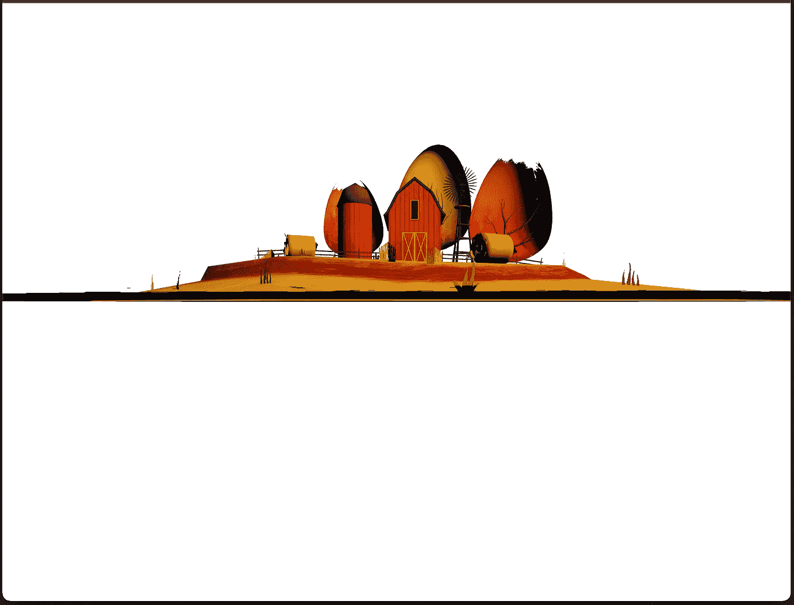
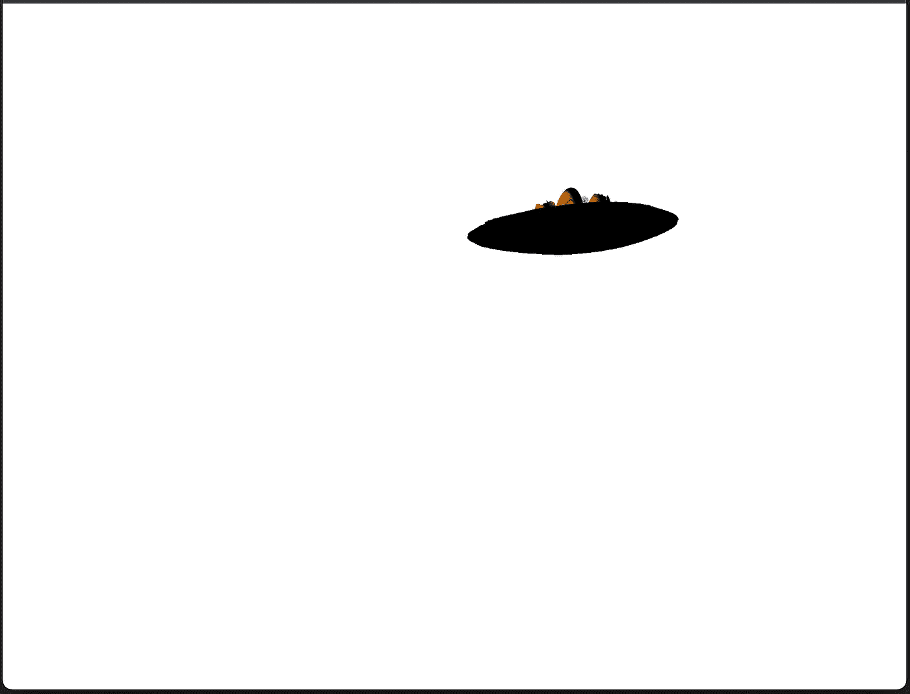
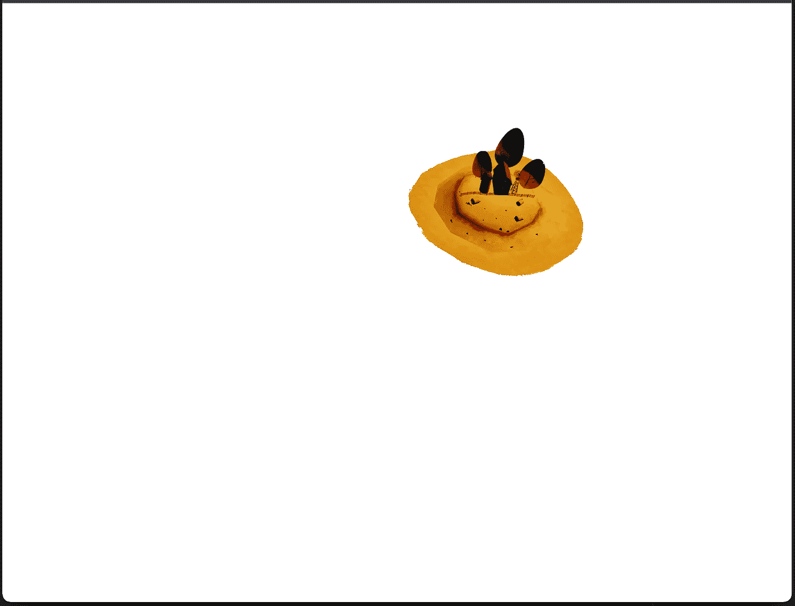
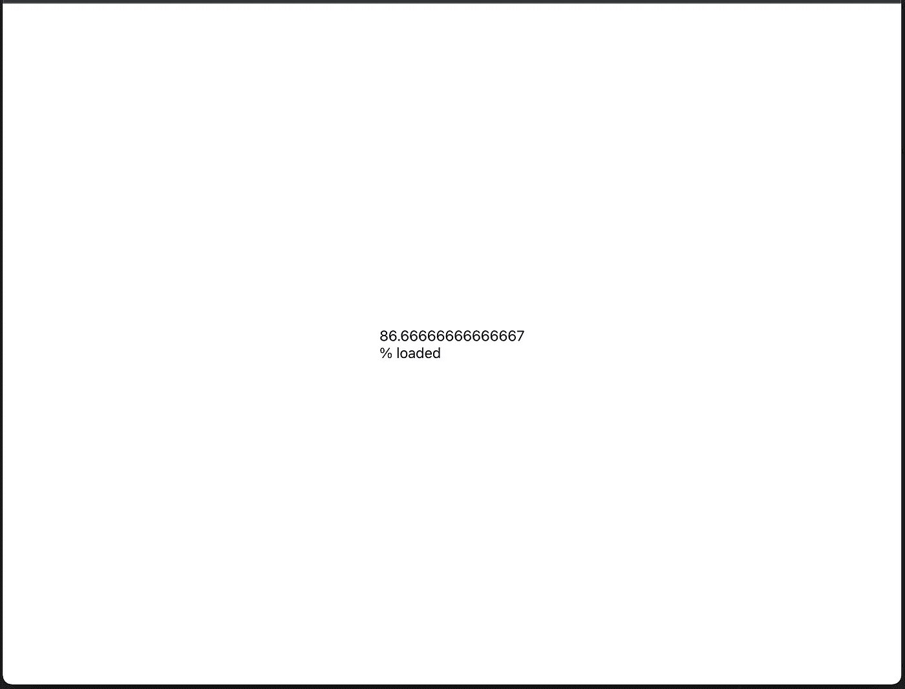

# 在 Three.js 中使用 3D 模型

> 原文：<https://betterprogramming.pub/working-with-3d-model-in-three-js-e228621141af>

## Create React App 工作环境中的 Exhibit three.js 代码



图片作者。桑帕伊·德苏的“[免费]农场”([https://skfb.ly/ouvNr](https://skfb.ly/ouvNr))是在知识共享署名([http://creativecommons.org/licenses/by/4.0/](http://creativecommons.org/licenses/by/4.0/))下获得许可的。

在上一篇文章中，我们已经解释了 three.js 是什么以及它在 React 中是如何工作的。让我们回顾一下主要概念。

*   [Three.js](https://github.com/mrdoob/three.js/) 是一个 3D JavaScript 库，在网页上呈现 3D 内容。它旨在创建一个易于使用、轻量级、跨浏览器、通用的 3D 库。
*   Three 的 API 在 Create React App 工作环境中运行良好。
*   [react-three-fiber](https://github.com/pmndrs/react-three-fiber) ( `@react-three/fiber`)是 three.js 的 react 渲染器，它允许我们使用 JSX 编写 three.js，更具声明性。React 包装器还在幕后处理很多事情，比如调整画布大小和处理卸载的对象。

我们画了一个在黑色背景中旋转的动画立方体。在本文中，我们将进一步在森林背景中绘制一个旋转农场，如标题图像所示。

# glTF 格式的 3D 模型文件

3D 模型有很多文件格式，比如`glTF`(图形语言传输格式)`FBX`(FilmBoX)*`OBJ`(或者。OBJ)。其中，`glTF`是最受欢迎的一个。*

*`glTF`，通常指`glTF 2.0`，以 JSON 格式存储 3D 模型信息。它是用于 3D 场景和模型的开放标准文件格式，支持 3D 模型几何图形、外观、场景图形层次和动画。它有两个文件扩展名，`.gltf` (JSON/ASCII 文件格式)和`.glb`(二进制文件格式)。*

*创建一个`.gltf`模型是另一个话题。这里，我们使用 three.js 来处理现有的`.gltf`文件。*

*[https://sketchfab.com/3d-models](https://sketchfab.com/3d-models)是一家购买 3D 模型的商店，那里有一些免费的模型。这是[获得免费农场的链接](https://sketchfab.com/3d-models/free-farm-7162850a4f0d4bc3a49f3a03f8f87cfe#download):*

**

*作者图片*

*下载完 zip 文件后，我们将它解压到我们从上一篇文章中 [Create React App](/an-in-depth-guide-for-create-react-app-5-cra-5-b94b03c233f2) 工作环境的`public`文件夹下。*

*`free_farm`文件夹有许多资产:*

*   *`license.txt`:是许可文件。*

*   *`scene.bin`:包含几何图形和动画数据以及其他基于缓冲区的数据的二进制文件。*
*   *`scene.gltf`:包含在 JSON 格式的`glTF`文件中的完整场景描述，包括节点层次、材质、相机，以及网格、动画和其他构造的描述符信息。*

**

*   *`textures`:这是一个包含图像文件的文件夹，具体来说就是自由农场中的 12 个`png`文件。*

# *显示三维模型*

*下面是渲染 3D 模型的`src/App.js`，`free_farm`:*

*在第 5–8 行，定义了组件`FreeFarm`。它从`@react-three/fiber`调用`useLoader`钩子。`public`文件夹中的`free_farm`被加载到常量`gltf`(第 6 行)。*

*Three 的图元通常是在运行时用一堆参数生成的 3D 形状。在第 7 行，用`gltf.scene`创建了一个`primitive`元素。道具(`args`)可以包括非原始值，如几何、材质、位置、比例等。*

*由于加载可能需要一些时间，`Suspense`用于显示一个空屏幕(`null`)作为后备(第 13 行)。3D 模型加载后，`FreeFarm`(第 14 行)将显示在`Canvas`(第 12-16 行)上，呈现三个组件。*

*执行`npm start`，我们在浏览器中看到自由农场:*

**

*图片由作者提供，其中 Sampai desu 的“[免费]农场”([https://skfb.ly/ouvNr](https://skfb.ly/ouvNr))根据知识共享署名([http://creativecommons.org/licenses/by/4.0/](http://creativecommons.org/licenses/by/4.0/))获得许可。*

*哦，这是一个基本的 3D 模型！*

*添加`ambientLight`(下面代码中的第 3 行)，这是一个无处不在的灯光(它不照射任何特定的地方，但会覆盖整个场景)。*

*借助光线，我们可以看到颜色和细节:*

**

*图片由作者提供，其中 Sampai desu 的“[免费]农场”([https://skfb.ly/ouvNr](https://skfb.ly/ouvNr))根据知识共享署名([http://creativecommons.org/licenses/by/4.0/](http://creativecommons.org/licenses/by/4.0/))获得许可。*

*将`ambientLight`改为`pointLight`(下面代码中的第 3 行)，是特定点上的灯，类似于灯。`pointLight`的颜色设置为`yellow`，放置在`[10, 10, 10]`。*

*你看出区别了吗？*

**

*图片由作者提供，其中 Sampai desu 的“[免费]农场”([https://skfb.ly/ouvNr](https://skfb.ly/ouvNr))根据知识共享署名([http://creativecommons.org/licenses/by/4.0/](http://creativecommons.org/licenses/by/4.0/))获得许可。*

*是的，它显示阴影和更多的细节。*

*让我们将自由农场移动到位置`[1, 1, 1]`，并将其缩放到 0.2(下面代码中的第 4 行)。*

*较小的自由农场被移动到视点的右上角。但是，它没有面对我们。*

**

*图片由作者提供，其中 Sampai desu 的“[免费]农场”([https://skfb.ly/ouvNr](https://skfb.ly/ouvNr))根据知识共享署名([http://creativecommons.org/licenses/by/4.0/](http://creativecommons.org/licenses/by/4.0/))获得许可。*

*让我们旋转一下(下面代码中的第 4 行)。*

*现在，自由农场面对着我们。*

**

*图片由作者提供，其中 Sampai desu 的“[免费]农场”([https://skfb.ly/ouvNr](https://skfb.ly/ouvNr))根据知识共享署名([http://creativecommons.org/licenses/by/4.0/](http://creativecommons.org/licenses/by/4.0/))获得许可。*

# *使用@react-three/drei 提供的帮助*

*`[@react-three/drei](https://github.com/pmndrs/drei)`是渲染 react-three-fiber 的有用助手集合。它使得使用多种类型的对象变得更加容易，例如相机、控件、图像、形状、3D 模型、环境等。*

*让我们来设置一下`@react-three/drei`:*

```
*% npm i @react-three/drei*
```

*`@react-three/drei`与`@react-three/fiber`和`three`一起成为`package.json`中`[dependencies](/package-jsons-dependencies-in-depth-a1f0637a3129)`的一部分。*

*有了帮助，我们可以锦上添花。*

## *添加加载的进度状态*

*我们显示了一个空屏幕(`null`)作为 3D 模型加载期间的备用屏幕。让用户盯着一个空屏幕看一会儿，未必是好的用户体验。*

*`useProgress`是显示进度状态的挂钩。*

*我们在`src/App.js`中添加了一个加载回退 UI:*

*在第 6–9 行，定义了加载 UI`Loader`。使用挂钩`useProgress`(第 7 行)显示装载进度状态，定义如下:*

*`Html`(第 8 行)是`@react-three/drei`元素，用于在场景中心显示进度文本。*

*在第 19 行，回退 UI 被定义为`<Loader />`。*

*在 3D 模型完全加载之前，进度状态会不断更新。这是其中一张快照:*

**

*作者图片*

## *用鼠标控制动作*

*动态观察控件允许相机围绕目标动态观察。在`Canvas`中增加一行代码(下面代码中的第 5 行)。*

*下面的视频显示，我们可以使用鼠标来控制自由农场的运动。*

*作者提供的视频，其中 Sampai desu 的“[免费]农场”([https://skfb.ly/ouvNr](https://skfb.ly/ouvNr))是在知识共享署名([http://creativecommons.org/licenses/by/4.0/](http://creativecommons.org/licenses/by/4.0/))下获得许可的。*

## *设置环境背景*

*到目前为止，我们已经将免费农场移动到白色背景。森林背景怎么样？*

*它是`Environment`元素的另一行代码(下面代码中的第 6 行)。*

*轨道控制在森林背景下看起来不是更酷吗？*

*作者提供的视频，其中 Sampai desu 的“[免费]农场”([https://skfb.ly/ouvNr](https://skfb.ly/ouvNr))在知识共享署名([http://creativecommons.org/licenses/by/4.0/](http://creativecommons.org/licenses/by/4.0/))下获得许可。*

*支持的预置类型有`sunset`、`dawn`、`night`、`warehouse`、`forest`、`apartment`、`studio`、`city`、`park`、`lobby`。*

## *设置带有旋转和位置的动画*

*动态观察控件围绕目标移动相机，目标本身也可以移动。*

*`useFrame`是为每一帧调用的钩子。*

*   *参数`state`包含所有三者的状态信息，包括`gl`(web GL)`camera``clock``scene`等。*
*   *参数`delta`是以秒为单位的时钟增量。它用于设置基于时间的动画。*
*   *`renderPriority`是完全关闭自动渲染的高级参数。*

*我们调用`useFrame`来激活自由农场。*

*在第 12 行，`farmRef`被定义为`primitive`元素(第 21 行)。`useFrame`(第 13-19 行)控制自由农场的旋转(第 15-16 行)和重新定位(第 13 行)。*

*随着变化，自由农场自己移动。另外，我们可以用鼠标移动摄像头。*

*作者的视频，其中桑帕伊·德苏的“[免费]农场”([https://skfb.ly/ouvNr](https://skfb.ly/ouvNr))是在知识共享署名([http://creativecommons.org/licenses/by/4.0/](http://creativecommons.org/licenses/by/4.0/))下获得许可的。*

# *结论*

*一步一步，我们在森林背景中展示了一个旋转农场，如标题图片所示。我们总共使用了 33 行代码，不包括 4 个空行。*

*是不是很酷？*

*感谢阅读。我希望这有所帮助。如果你有兴趣，可以在 three.js 中阅读关于[纹理的内容，或者查看](/working-with-texture-in-three-js-40ce5e8b96c4)[我的其他媒介文章](https://jenniferfubook.medium.com/jennifer-fus-web-development-publications-1a887e4454af)。*