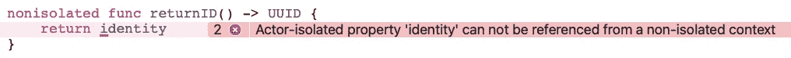

# 在 Swift 5.5 中使用参与者和并发性

> 原文：<https://betterprogramming.pub/working-with-actors-and-concurrency-in-swift-5-5-b013f78b6b2a>

## 看看苹果新的并发原语

图片来自 [commonswikimedia](https://commons.wikimedia.org/wiki/File:Silicon_Village_(9540184355).jpg) 公共领域

距离苹果公司宣布 M1 芯片让许多人大吃一惊已经过去一年多了。虽然当时大多数经验丰富的技术专家对性能改进的说法持保留态度，但毕竟大多数硬件制造商每年都提出同样的说法。

但是在今年夏天的 WWDC2021 上，另一口秘密的井出现了。在那次事件中，他们悄悄地对 swift 语言进行了一些改变游戏规则的修改。苹果公司利用硬件和软件团队之间的协同作用进行的变革；充分利用这些新的 M1 芯片。

秘密揭示了一个新的并发模型 Swift 5.5 中的语言特性。该模型旨在取代 swift 中用于管理并发性的现有结构，即 GCD。引入跨语言重大变化的并发编码能力的变化，你可以在这里找到[背后的技术细节](https://developer.apple.com/videos/play/wwdc2021/10254)。和我一起阅读这篇文章，了解更多信息——

并发编码很难，因为它有自己的词汇表，是一个真正的挑战。内核是指芯片上的 CPU，在这些内核上运行着线程。

现在，当你有不止一个线程时，你有时会发现自己在等待另一个线程，只要那个线程不在等待你，这就不是问题——死锁。有时，您在两个不同的线程上更新相同的资源，这是一种竞争情况。有时，您忙于多任务处理，以至于创建的线程比您拥有的内核还多，而且，您最终在这些线程之间切换的时间比您执行有用工作的时间还要多——线程爆炸或系统颠簸。

为了应对这些挑战，苹果已经与 iOS 和 OSX 建立了他们所谓的运行时合同，以便将应用程序中的上下文切换(众所周知)保持在绝对最低限度，并且在运行代码之前，在编译器级别处理死锁、竞争危险和线程爆炸等问题。

> 苹果在这里提到的一个非常重要的警告是，你不能混合 n-match 并发语言特性

不过，好吧——这一周你想的理论已经够多了，让我们来做点实际的吧。

# 竞争条件和死锁

一个**竞争条件**是当你有一个共享资源在你的代码中不止一个地方被更新时你得到的东西。这可能是一个很难找到并解决的问题。

修复有时同样具有挑战性，因为如果您没有正确编码，您可能会以一个不同但同样糟糕的问题——死锁而告终。代码中的线程可能会挂起您的应用程序。

但是在我们开始之前，这里有一个我所说的视觉展示。它显示了由两个进程更新的计数器的值——因此是一个共享资源——但是存在竞争危险，因为两个线程同时更新计数器。你可以从这个动画 GIF 中看到结果是什么——虽然计数器在增加——但它有一个小故障，一直在后退。

现在我应该承认，代码设计有一个小故障来解决这个问题——在商业代码中，它可能要微妙得多。我不想排队张贴，因为我想把重点放在新的语言功能上，苹果希望这将是解决方案。

# 解决方案:一个演员

Swift 5.5 中的 actor 是一种新类型，其中所有变量都受到保护，不会被外部访问。Swift 5.5 通过第二个关键字 await 控制对参与者上可写资源的访问。您可以在下面的代码中看到 SwiftUI 声明中的访问，使用独立的任务，在这些任务中有一个 await。

counter 方法更新其中的计数器值，并将新值保存到一个数组中。因为它所在的代码是一个“参与者”，编译器保证它的访问是独占的。

在 SwiftUI I access 中，该方法只能使用 await 关键字，简单地说，它锁定该方法，防止在代码中的其他地方调用，直到它返回。

我同时调用方法 increment 两次来强制发布，从 GIF 中可以看到，它的访问得到了很好的管理。当然，这并不是完整的代码——要得到它，你需要[进入 bitbucket](https://bitbucket.org/wizard1066/concurrentcode/src/master/) ,在那里你也可以找到 BarView 方法。

现在，作为一个参与者，来看看这段代码的可视化表示。您现在可以看到计数器在增加，没有毛刺。

更多——但是请等待，因为我们还没有完全完成，如果您开始与 actor 打交道，您很快就会发现访问 actor 外部的变量可能是一个挑战，即使您的变量是一个 let 语句，所以是只读的。

当然，不让您访问一个只读变量是不合理的，所以您可以这样做——但是您必须通过将方法标记为非隔离来在 actor 中明确这一要求/请求。我用 identity 方法添加了一个例子。

这样做可以免除指定 await 的要求；这种设计的美妙之处在于，如果你将变量改为 var，也就是可写的，编译器会报错，这样就省去了你在运行时查找错误的麻烦。潜在的运行风险正在形成。

# 新协议

为了帮助你设计不会遭受种族危险的代码，苹果还定义了一个新的协议，Sendable。因为 structs 和 now actors 都是值类型，所以它们符合 Sendable 协议，但是默认情况下类不符合。

因此，尽管编译器目前没有这样做，但 WWDC [演示中的演示者](https://developer.apple.com/videos/play/wwdc2021/10133)警告我们，未来 Swift 将阻止我们共享不符合`Sendable`协议的资源、方法&数据。毫无疑问，目标是让每个人都开始编写代码，编译器可以检查代码中没有竞争危险。

# 特殊演员

还有一件事，一个叫做`@MainActor`的特殊演员，你可能在最近的其他文章中看到过我使用它。这个构造与关键字`DispatchQueue.main.async` 相同——只是它确保异步代码在主线程上运行。当然，使用了新的语法——您还记得，与您通常可以逐段添加的其他新功能不同，并发不是一种共享功能。

说够了……我将在那时结束这篇已达到我的 1000 字限制的论文——但我还没有完成——实际上是我的一个提要，以了解更多关于 Swift 5.5 中添加的新的并发语言功能。