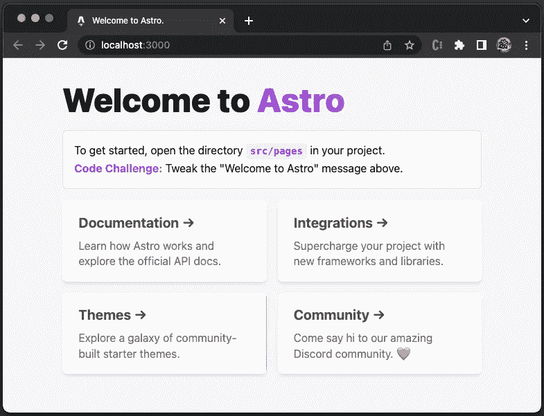
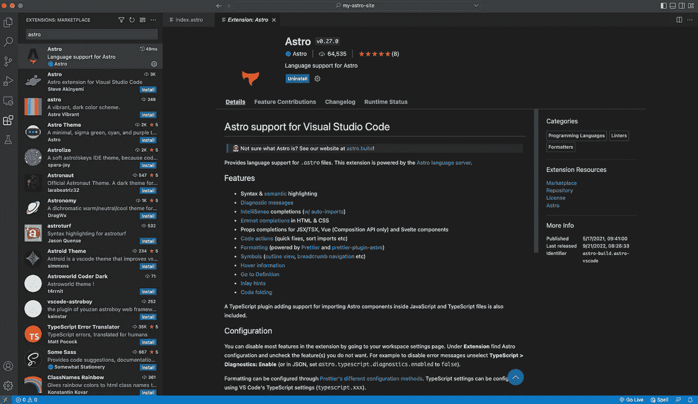
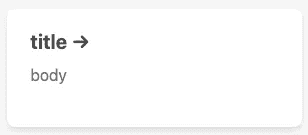
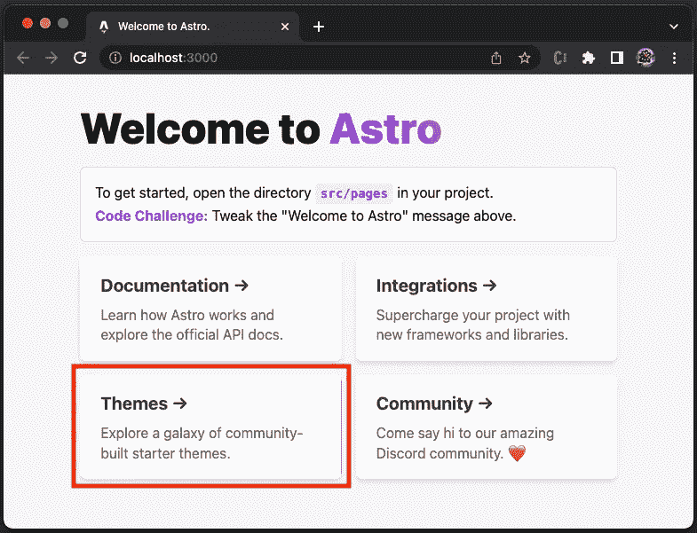

# 使用 Astro——超快速 Web 框架

> 原文：<https://betterprogramming.pub/working-with-astro-the-super-fast-web-framework-5dadd98f8e39>

## 提供最少的 JavaScript


Astro js 标志。作者图片

Astro 是一个一体化的网络框架，用于构建快速、专注于内容的网站。Astro 是为构建内容丰富的网站而设计的。这包括大多数营销、出版和文档网站、博客、作品集和一些电子商务网站。

与此同时，Astro 可能不是一些复杂应用程序的正确选择，如管理仪表板、收件箱、社交网络、待办事项列表等。

Astro 在客户端渲染上利用了[服务器端渲染](https://javascript.plainenglish.io/a-hands-on-guide-for-a-server-side-rendering-react-18-app-4e630aae274c)，它是一个多页面应用(MPA)框架。MPA 网站由多个用 HTML、CSS、JavaScript(或 TypeScript)编写的 HTML 页面组成。MPA 与单页应用程序(SPA)不同，后者使用客户端渲染，并直接在浏览器中动态渲染每条路线。

Astro 在快速初始加载和短时间交互(TTI)方面优于 SPA，TTI 衡量一个页面完全交互需要多长时间。

Astro 是 UI 不可知的。Astro 官方支持 react、Preact、Solid、Svelte、Vue 和 Lit。不同框架编写的代码可以混合在同一个页面上。

这听起来像是一个令人惊叹的 web 框架吗？

事不宜迟，让我们看看 Astro 是如何工作的。

# 安装并运行 Astro

Astro 需要 [Node.js](/5-major-features-of-node-js-18-5f4a164cc9fc) 版本“`^14.18.0 || >=16.12.0`”。运行以下命令安装 Astro:

```
% yarn create astro
yarn create v1.22.10
[1/4] 🔍  Resolving packages...
[2/4] 🚚  Fetching packages...
[3/4] 🔗  Linking dependencies...
[4/4] 🔨  Building fresh packages...
success Installed "create-astro@1.1.0" with binaries:
      - create-astro
[##################################################################################################################] 114/114
Welcome to Astro! (create-astro v1.1.0)
Lets walk through setting up your new Astro project.✔ Where would you like to create your new project? … ./my-astro-site
✔ Which template would you like to use? 
❯   Just the basics (recommended)
    Blog
    Portfolio
    Documentation Site
    Empty project
✔ Template copied!
✔ Would you like to install yarn dependencies? (recommended) … yes
✔ Packages installed!
✔ Would you like to initialize a new git repository? (optional) … no
ℹ Sounds good! You can come back and run git init later.
✔ How would you like to setup TypeScript?
    Relaxed
❯   Strict (recommended)
    Strictest
    I prefer not to use TypeScript
✔ TypeScript settings applied!
✔ Setup complete.
✔ Ready for liftoff!Next stepsYou can now cd into the my-astro-site project directory.
Run yarn dev to start the Astro dev server. CTRL-C to close.
Add frameworks like react and tailwind to your project using astro addStuck? Come join us at [https://astro.build/chat](https://astro.build/chat)
Good luck out there, astronaut.✨  Done in 88.00s.
```

项目创建在文件夹中，`my-astro-site`，`package.json`位于根目录。

在`package.json`中有两种类型的依赖关系:`[dependencies](/package-jsons-dependencies-in-depth-a1f0637a3129)` [和](/package-jsons-dependencies-in-depth-a1f0637a3129) `[devDependencies](/package-jsons-dependencies-in-depth-a1f0637a3129)`。这两个依赖项在 Astro 中的工作方式基本相同，因为在构建时都需要。建议将所有依赖项放在`dependencies`中启动，仅在特殊需要时使用`devDependencies`。

使用安装期间的`Just the basics`选项，只有一个依赖项`astro`(上面代码中的第 14 行)。

执行`yarn astro`，我们看到所有的 Astro 命令:

```
% yarn astro  
yarn run v1.22.17
$ astroastro  v1.5.2 Build faster websites.astro [command] [...flags]Commands 
              add  Add an integration.
            build  Build your project and write it to disk.
            check  Check your project for errors.
              dev  Start the development server.
             docs  Open documentation in your web browser.
          preview  Preview your build locally.
        telemetry  Configure telemetry settings.Global Flags 
  --config <path>  Specify your config file.
    --root <path>  Specify your project root folder.
        --verbose  Enable verbose logging.
         --silent  Disable all logging.
        --version  Show the version number and exit.
           --help  Show this help message.✨  Done in 1.21s.
```

在开发模式下启动 Astro:

```
% yarn dev
yarn run v1.22.17
$ astro dev
  🚀  astro  v1.5.0 started in 52ms

  ┃ Local    http://127.0.0.1:3000/
  ┃ Network  use --host to expose
```

默认网站在`http://localhost:3000/`可用。



作者图片

各大 ide 都有 Astro 插件。以下是`.astro`文件的 [VS 代码扩展](/10-useful-plugins-for-visual-studio-code-6ab62c0b14ee)，支持语法和语义高亮、诊断消息、快速修复、排序导入、代码格式化等。



作者图片

# Astro 源文件夹

安装完成后，文件夹`my-astro-site`如下所示:

```
my-astro-site
├── README.md
├── public
│   └── favicon.svg
├── src
│   ├── components
│   ├── layouts
│   ├── pages
│   └── env.d.ts
├── astro.config.mjs
├── package.json
├── tsconfig.json
└── .gitignore
```

*   `my-astro-site`:包含 Astro web 框架的目录。
*   `README.md`:描述项目结构和脚本。
*   `public`:静态资产的目录，包括`favicon.svg`。
*   `src/components`:Astro 组件推荐目录。
*   `src/layouts`:创建可重用页面模板的推荐目录。
*   `src/pages`:为 Astro 页面提供基于目录的路由。`src/pages`目录中的每个文件都成为网站的一个端点。
*   `src/env.d.ts`:它引用了 Astro 项目特有的 TypeScript 类型声明。
*   `astro.config.mjs`:Astro 配置文件。
*   `tsconfig.json`:TypeScript 配置文件。

# Astro 组件

组件是一个天文项目的基本构件。它们是没有客户端运行时的纯 HTML 模板组件。

Astro 组件语法是 HTML 的超集，类似于 JSX。每个 Astro 组件都有一个文件扩展名`.astro`，它们在构建过程中被呈现为 HTML。Astro 组件包括两个主要部分:组件脚本和组件模板。

组件脚本类似 React，用 JavaScript 或 TypeScript 编写。它可以导入其他 Astro 组件、框架组件和 JSON 数据，从 API 或数据库获取内容，并创建要在组件模板中引用的变量。

Astro 使用代码栅栏(`---`)来绑定组件脚本的开头和结尾。

组件模板在组件脚本的下面。它决定组件的 HTML 输出。它支持 JavaScript 表达式、导入组件和特殊的 Astro 指令。组件脚本中定义的数据和值可以在模板中使用，以生成动态创建的 HTML。

开箱后，文件夹`src/components`带有一个组件`Card.astro`。

```
components
└── Card.astro
```

`Card`是一个有道具的组件——`href`、`title`、`body`。当点击标题组件时，页面被重定向到`href`。



这里是`src/components/Card.astro`:

由第 1 行和第 9 行的代码栏界定，它定义了组件脚本。

*   在第 2–6 行，定义了接口`Props`。
*   在第 8 行，三个常量变量`href`、`title`和`body`从 props 中被析构。

从第 11 行到第 63 行，它定义了组件模板。

*   在第 11-21 行，JSX 模板由`href`、`title`和`body`的插值定义。
*   第 22–63 行定义了模板样式。
*   在第 28 行，使用 CSS 变量将卡片的`background-image`定义为渐变颜色。如果浏览器窗口足够宽，它会显示为四张卡片中每三张卡片的一个重音符号(见下图中的红框)。



作者图片

你可能想知道第四张卡上的红心是什么。这只是一个表情符号，❤️.

# 天文布局

布局是一个特殊的 Astro 组件，用于创建具有通用设置的可重用页面模板，如页眉和页脚。这些公共部分被实现为页面可以重用的布局组件。布局组件通常以扩展名`.astro`或`.md`命名。

开箱后，文件夹`src/layouts`带有一个组件`Layout.astro`。

```
layouts
└── Layout.astro
```

`Layout`是一个同时提供页面外壳(`<html>`、`<head>`和`<body>`元素)和`<slot />`的组件。`<slot />`用于指定一个子组件应该被注入到布局页面的什么地方。

这里是`src/layouts/Layout.astro`:

由第 1 行和第 7 行的代码栏界定，它定义了组件脚本。

*   在第 2–4 行，定义了接口`Props`。
*   在第 6 行，常量变量`title`从 props 中被析构。

从第 9 行到第 40 行，它定义了组件模板。

*   在第 11–17 行，定义了文档`<head>`元素。标题设置为`title`的插值(第 16 行)。
*   在第 19 行，一个`<slot />`被用来放置一个子组件。
*   第 20–38 行定义了模板样式。
*   在第 20 行，`is:global`是一个 Astro 指令，它将样式范围设置为全局。

上面的布局中没有可见的组件，除了`<slot />`。常见的布局部分是 head 元素和全局样式。

对于默认网站，`View Page Source`浏览器显示转换后的标题内容，其中标题设置为`Welcome to Astro.`(下面代码中的第 6 行)，以及全局样式(下面代码中的第 7–19 行)。

# 天文页面

页面是放置在`src/pages`目录中的文件。他们负责处理网站上每个页面的路由、数据加载和整体页面布局。路由基于索引文件或索引文件的目录名。支持的文件类型有:

*   `.astro`
*   `.md`
*   `.mdx`(安装了 MDX 集成)
*   `.html`
*   [ `.js` / `.ts` ](作为端点)

开箱后，文件夹`src/pages`带有一个组件`index.astro`。

```
pages
└── index.astro
```

`index.astro`定义了当 URL 为`/`时要显示的 UI。这里是`src/pages/index.astro`:

由第 1 行和第 4 行的代码栏界定，它定义了组件脚本。

*   在第 2 行，`Layout`被导入。
*   在第 3 行，`Card`被导入。

从第 6 行到第 82 行，它定义了组件模板。

*   在第 6 行，`Layout`被指定的标题调用，它的孩子(第 7-36 行)将被放入`Layout`的`<slot />`中。
*   在第 8 行，定义了`h1`标题`Welcome to Astro`。
*   第 9–13 行定义了指令段落。
*   在第 16–19 行，创建了标题为`Documentation`的`Card`。
*   在第 20–24 行，创建了标题为`Integrations`的`Card`。
*   在第 25–29 行，创建了标题为`Themes`的`Card`。
*   在第 30–34 行，创建了标题为`Community`的`Card`，其中正文包括表情符号❤️(第 33 行)。
*   在第 39–82 行，定义了模板样式。

# Astro 模板指令

模板指令是 Astro 组件模板(`.astro`文件)中一种特殊的 HTML 属性，有些也可以在`.mdx`文件中使用。它们用于控制一个元素或组件的行为，但是它们从不直接包含在最终的 HTML 输出中。

模板指令的名称中包含一个冒号(`:`)，格式为`X:Y`，并且它必须对编译器可见，也就是说，它没有隐藏在`<X {...attr}>`格式中。

大多数模板指令没有值，比如`<X client:load />`。但是有些模板指令采用自定义值，比如`<X class:list={['some-css-class']} />`。

# 通用指令

Astro 组件中使用通用指令:

*   `class:list={...}`:它接受一个类值数组，并将它们转换成一个类字符串。该列表由字符串、对象的所有真值键、扁平数组和扁平集组成。重复的值会自动删除。

*   `set:html={string}`:将一个 HTML 字符串注入到一个元素中，类似于设置`el.innerHTML`。Astro 不会自动转义该值。

*   `set:text={string}`:它将一个文本字符串注入到一个元素中。与`set:html`不同的是，`string`值由 Astro 自动转义。

# 客户指令

客户端指令控制组件如何在页面上被水合。默认情况下，客户端中的组件不会被水合。如果没有提供`client:*`指令，它的 HTML 将在没有 JavaScript 的情况下呈现在页面上。

*   `client:load`:页面加载时立即加载并融合组件 JavaScript。

```
<BuyButton client:load />
```

*   `client:idle`:当页面完成初始加载并且`requestIdleCallback`事件触发后，它加载并合并组件 JavaScript。

```
<ShowHideButton client:idle />
```

*   `client:visible`:一旦组件进入用户的视口，它就加载并合并组件 JavaScript。这在内部使用了一个`IntersectionObserver`来跟踪可见性。

```
<HeavyImageCarousel client:visible />
```

*   `client:media={string}`:一旦遇到特定的 CSS 媒体查询，它就加载并合并组件 JavaScript。

```
<SidebarToggle client:media="(max-width: 50em)" />
```

*   `client:only={string}`:跳过 HTML 服务器端渲染，只在客户端渲染。它的行为类似于`client:load`,在页面加载时立即加载、呈现和合并组件。

```
<SomeReactComponent client:only="react" />
```

# 脚本和样式指令

脚本和样式指令只能在 HTML `<script>`和`<style>`标签上使用，以控制客户端 JavaScript 和 CSS 在页面上的处理方式。

*   `is:global`:当包含组件时，它使`<style>`标签的内容在页面上全局应用。这将禁用 Astro 的 CSS 作用域系统，该系统将`<style>` CSS 规则作用于组件。

*   `is:inline`:它告诉 Astro 在最终的输出 HTML 中保持`<script>`或`<style>`标签不变。否则，Astro 将处理、优化和捆绑它在页面上看到的任何`<script>`和`<style>`标签。限制一些 Astro 特性，比如导入一个 npm 包或者使用一种编译成 CSS 的语言，比如 SASS。

*   `define:vars={...}`:可以将组件前端的服务器端变量传入客户端`<script>`或`<style>`标签。支持任何 JSON 可序列化的前台事务变量，包括通过`Astro.props`传递的`props`。值用`JSON.stringify()`序列化。

它显示以下文本:


作者图片

# 高级指令

`is:raw`是高级指令。它指示 Astro 编译器将该元素的任何子元素视为文本。

# 阿斯特罗群岛

[群岛建筑](https://jasonformat.com/islands-architecture/)最初是由 Etsy 的前端建筑师凯蒂·塞勒-米勒在 2019 年创造的，并在 2020 年由 Preact 的创造者杰森·米勒进一步扩展。Astro 采用了 islands 架构，这种架构鼓励在服务器呈现的网页中进行小规模、集中的交互。默认情况下，它向客户端发送纯 HTML，并为交互式小部件注入占位符。在静态内容的海洋中，每个页面都几乎没有互动的孤岛。它最大限度地减少了页面加载时间，并最大限度地减少了在客户端执行的工作。当出现错误时，它也会优雅地降级。

Astro 默认用零客户端 JavaScript 生成每个网站。它使用由 React、Preact、Svelte、Vue、SolidJS、AlpineJS、Lit 和 Astro 构建的前端 UI 组件。这些组件会提前自动呈现 HTML，并去掉所有 JavaScript。通过从页面中删除所有未使用的 JavaScript，默认情况下保持每个站点的速度。

# 结论

Astro 是一个一体化的 web 框架，用于构建快速、以内容为中心的网站。Astro 是为构建内容丰富的网站而设计的。这包括大多数营销网站、发布网站、文档网站、博客、作品集和一些电子商务网站。

Astro 在客户端渲染上利用了服务器端渲染，这是一个 MPA 框架。Astro 提供了快速的初始加载和较短的交互时间。

在某种程度上，Astro 类似于 Qwik，我们在之前的一篇文章中介绍了 Qwik。由于 Astro 专注于基于内容的网站，所以从目录结构到`package.json`都比 Qwik 简单。

Astro 采用的是岛式架构，这也是 [Fresh](/the-comprehensive-guide-on-fresh-a-new-web-framework-by-deno-b1ebc94007cb) 所采用的。

网站是从服务器端渲染开始的，然后 SPA，客户端渲染，流行了一段时间。现在，是时候重新审视 MPA 了。是不是很有意思？

感谢阅读。

```
**Want to Connect?**If you are interested, check out [my directory of web development articles](https://jenniferfubook.medium.com/jennifer-fus-web-development-publications-1a887e4454af).
```