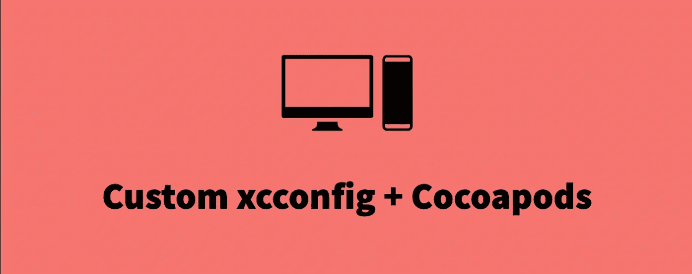
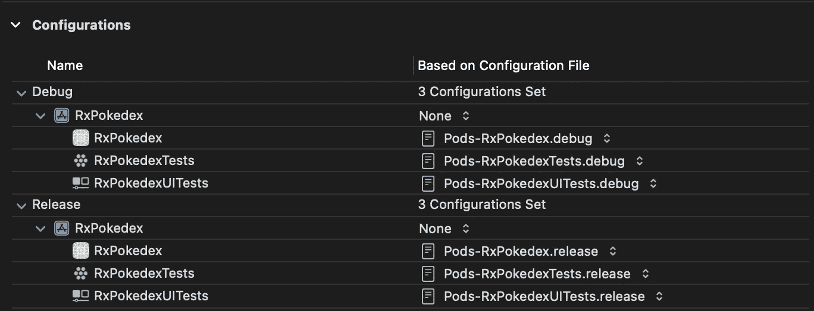
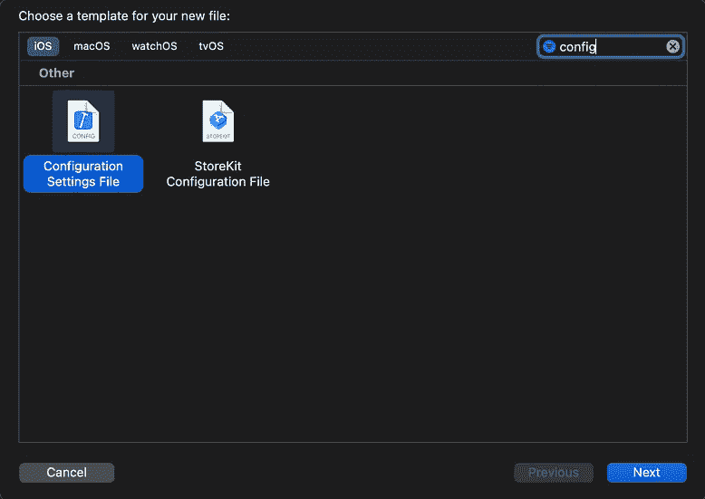
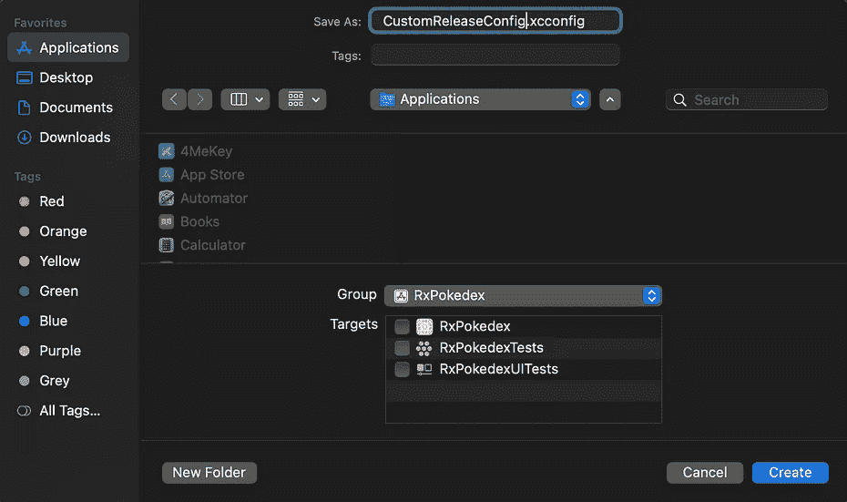
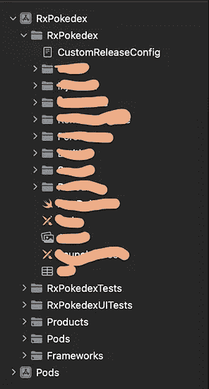
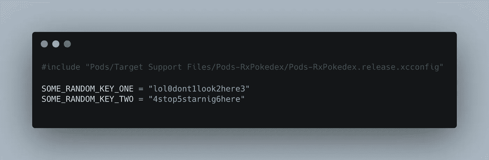
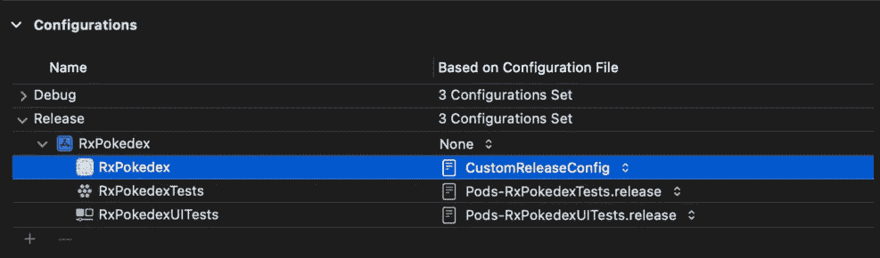

# 使用自定义“xcconfigs”和 Cocoapods

> 原文：<https://betterprogramming.pub/working-with-custom-xcconfigs-and-coccoapods-6b87ead94708>

## 在 iOS 的 pods 配置旁边保留一个自定义配置



你曾经想让你的定制和可可豆荚配置一起工作吗？一如既往！

让我帮你做。

开始之前，我们将确保您在正确的地方解决您的问题。请仔细阅读清单，以确保我们了解我们想要解决的问题。

## 清单

1.  您希望为您的项目引入定制配置
2.  您的项目中设置了可可豆荚
3.  您可以在您的发布配置集中看到类似这样的内容:



带 pod 的配置

## 附加信息

Cocoapods 根据项目配置自动生成配置文件，并自动将它们添加到目标中。
以前有一个选项`--no-integrate`可以避免将各自的`pod config`文件附加到我们现在已经不存在的配置集中。
如果我们想要的话，我们会将`:integrate_targets => false`作为选项添加到 Podfile 中的`install!`中。

好吧！当你在读这一部分的时候，我确信你很有可能专注于这篇文章，而上面列出的问题正是你想要解决的一系列问题。

让我们开始吧。

# 第一步。

我们将首先创建一个`**.xcconfig**`文件，然后将它添加到我们的项目文件夹中。



1.CMD + N，然后在筛选器字段上键入 Config ->创建。xcconfig 文件的名称->这是文件夹结构的样子

一旦设置完成。您只需打开您已经创建的自定义配置文件，在这种情况下，它将是`CustomReleaseConfig.xcconfig`

# 第二步

一旦第 1 步完成，我们将打开我们创建的`**.xcconfig**`文件，然后我们将包括 pod 配置文件。

输入以下标题:

```
#include "Pods/Target Support Files/Pods-ProjectName/Pods-Pods-ProjectName.debug.xcconfig"
```



附加信息:

如果您有另一组自定义配置文件，这些文件对于父配置来说是可选的，您可以像这样设置或标记它:

```
#include? "ChildConfig.xcconfig"
```

这将可选地包括包含本地覆盖的`**"ChildConfig.xcconfig"**`(如果存在的话)
以及从 Xcode 8 开始支持的`**#include?**`

# 第三步

一旦第 2 步完成，只需打开您的`**project info**` - > `**Configurations**`，将应用程序的配置更改为您创建的自定义配置。
这是它现在的样子:



将配置设置为自定义配置后

我希望这能解决您在配置 pods 的同时保留自定义配置的问题。