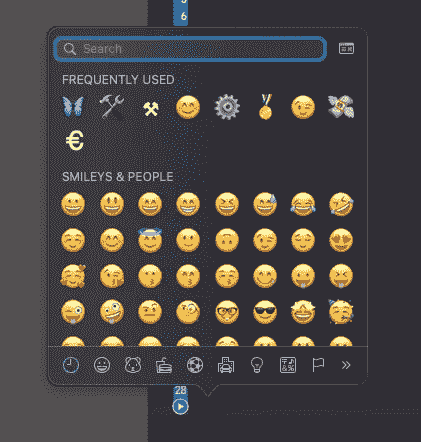
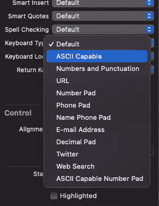
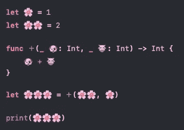

# 在 Swift 中使用表情符号

> 原文：<https://betterprogramming.pub/working-with-emoji-in-swift-f76118e6b6d6>

## 表情符号不仅仅是简单的字符串


照片由 [Gaby Prestes Nekrasova](https://www.instagram.com/gabypres2808/) 在 Instagram 上拍摄。

表情符号已经成为我们生活的一大部分。iPhones 和 iPads 有一个特殊的表情键盘(除非关闭)。我们在网站、手机和桌面应用程序中看到它们，当我们写文本和填写表格时，我们会输入它们。

我们如何控制它们？我们如何防止用户在`UITextField`中输入表情符号？我们如何解析来自服务器的 JSON 响应中的表情符号？大家都来讨论一下。

# 一点理论

表情符号是现代 Unicode 的一部分。电脑处理的是比特和字节，而不是微笑和其他小图片。文本中的字母、数字和特殊字符都用一个或多个字节进行编码。表情符号也是如此。它们只是象征。

Unicode 有三种标准变体。它们都在不断发展，新的符号不断出现，新的语言也不断出现。所以实际上不止有三个版本，但是对于我们开发人员来说，了解三个不同的标准很重要:

1.  UTF-8 (Unicode 转换格式 8 位):这种编码中的每个符号都表示为一个或多个字节。简单的拉丁字符、数字和其他一些符号只占用一个字节(八位)。如果第一位是 0，我们知道它是一个一字节的符号。如果它是一个俄罗斯、中国或阿拉伯符号或表情符号，它将从第 1 位开始，并有多个字节。
2.  UTF-16 (Unicode 转换格式 16 位):所有符号都被编码成两个或四个字节。两个字节有 65，536 种组合，包括几乎所有已知的字符。表情符号通常需要两个字节，但它们可以有修饰词(肤色或头发)。在这种情况下，它使用额外的空间。
3.  UTF-32 (Unicode 转换格式 32 位):理解编码最简单，但最不节省内存。每个符号正好占用四个字节。

自 2010 年 6.0 版本以来，表情符号就出现在 Unicode 中。所有现代的 iPhones 和 MAC 都支持更新的版本，所以通过在应用程序中添加表情符号，你可以确保用户会看到它们。

> "一个`NSString`对象编码一个 Unicode 兼容的文本字符串，表示为一系列 UTF 16 代码单元."— [苹果开发者](https://developer.apple.com/documentation/foundation/nsstring)

如你所见，表情符号可以包含在 Swift 的任何字符串中。

# macOS 中的表情符号

由于我们主要在 macOS 中编写 Swift 代码，让我们看看如何将表情符号添加到我们的代码中。

在任何具有文本编辑功能的 app 中，包括 Xcode，你都可以点击*编辑*菜单，然后是*表情符号&符号*。你会看到一个带有表情符号的面板。选择它们中的任何一个，它们都会出现在你的代码中。

另一种方法是使用热键⌃⌘Space (ctrl + cmd + space)。



macOS 中的表情符号

# 检测字符串中的表情符号

在我们继续之前，让我们为我们的项目添加几个扩展。他们将允许我们检查`String`是否有表情符号，是否只有表情符号，是否`Character`是表情符号，等等。

现在你可以查看`String`是否有表情符号:

```
"Alex 😊".containsEmoji // true"Alex 😊".containsOnlyEmoji // false
```

# 禁止 UITextField 中的表情符号

通常，我们不应该允许用户输入表情符号。例如，如果我们想知道他们的法定姓名或其他数据。

有两种方法可以做到这一点——更严格的方法和更宽松的方法。

更严格(但更容易)的方法是选择支持 *ASCII 的*键盘类型。它将移除 Unicode 集合的前 128 个符号之外的所有符号。如果你还记得 UTF-8 的细节，它有单字节，双字节和四字节的字符。该选项将只允许一个字节的字符(从位 0 开始)。



更改键盘类型

它对于输入用户名或密码很有用，但是名称和其他数据可能包含音调符号、非拉丁字符和其他字符。在这种情况下，我们使用第二种方法。它有几个步骤:

1.  将键盘类型设置为*默认*。
2.  设置代理。通常，是你的`UIViewController`。
3.  在委托中，重写方法`**func** textField(**_** textField: UITextField, shouldChangeCharactersIn range: NSRange, replacementString string: String) -> Bool`。
4.  获取更新的文本:

```
**if** **let** text = textField.text,
    **let** textRange = Range(range, in: text) {
    **let** updatedText = text.replacingCharacters(in: textRange, with: string)
}
```

5.检查`updatedText`是否没有表情符号，如果有则返回`false`。

看起来是这样的:

现在，当用户试图在文本字符串中插入表情符号时，不会有任何效果。如果您想让用户更清楚，请添加一个带有消息的提醒。

# 解码 API 响应中的表情符号

如果您在 Swift 中使用过 REST API，您可能会知道，有时您会得到一个没有表情符号的响应。在`Strings`和 JSON 兼容类型之间的转换，比如`Array`和`Dictionary`，也可能会丢失表情符号。

最安全的方法是从 API 中获取`Data`,并将其转换为您需要的类型:

```
**let** str = String(data: data, encoding: .utf8)
```

JSON 也一样。最好从数据中手动解码:

```
**let** json = **try**? JSONSerialization.jsonObject(with: data, options: .allowFragments)
```

让我们来看看这个流行库 [Alamofire](https://github.com/Alamofire/Alamofire) 的例子:

Alamofire 会定期更新，所以它可能会在`responseString`处理程序中返回表情符号。它可能已经完成了，但当我测试它时，我得到了没有任何表情符号的`String`作为回报。如果你使用另一个库，这个技巧也很方便。请记住，您总是从任何 web 请求接收一个字节的缓冲区。Swift 中最接近它的是一个`Data`物体。所有其他类型都是从它转换而来的。如果你想完全控制，你应该总是选择`Data`。

## 关于 MySQL 和其他 SQL 数据库的说明

这不完全是关于 Swift 的，但由于我们正在谈论 API 中的表情符号，我也会提到这一点。如果你计划在 SQL 数据库(如 MySQL)中使用表情符号，你应该做两件事:

1.  将整个数据库、表格或单独字段的字符集设置为`utf8mb4`。简单的`utf8`不会让你在字符串字段存储表情符号。
2.  在运行其他 SQL 请求之前运行`SET NAMES utf8mb4`。

# 表情符号变量

我会对苹果公司的幽默感给予一些肯定。你可以在函数或变量的名字中使用表情符号。

例如，这是一个有效的 Swift 代码:

永远不要在产品代码中这样做——打字、搜索或共享都非常不舒服。但是它可能是有用的，例如，教孩子。看起来很好笑，对吧？



带有表情符号的源代码

更常见的做法是在`Strings`中加入表情符号:

```
**let** errorText = "Sorry, something went wrong 😢"
```

# 结论

大多数情况下，应用程序应该允许用户输入表情符号。但是如果这不是你想要的行为，你总是可以增加限制的。如今，在用户界面中使用表情符号也变得越来越流行。

同时，除非真的有必要，否则不要在源代码中使用表情符号。Swift 允许这样做，但这不是一个好的做法。即使它是字符串常量的一部分，也最好放在一个单独的文件中。

下次见，编码快乐！