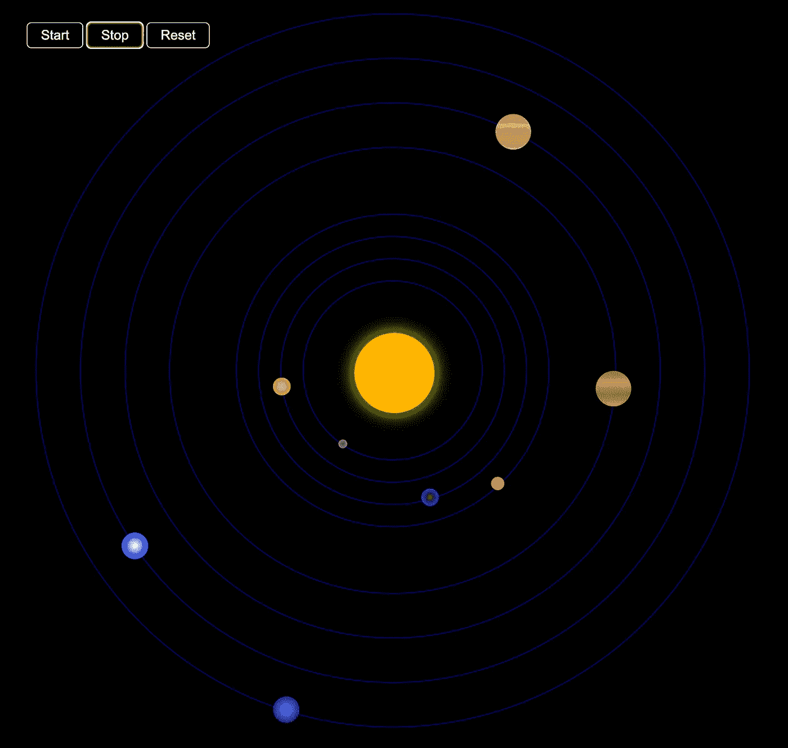

# 使用“requestAnimationFrame”处理 JavaScript 动画

> 原文：<https://betterprogramming.pub/working-with-javascript-animations-using-requestanimationframe-f07e0658908e>

## 为你的网站制作流畅的动画


照片由[塞巴斯蒂安·斯文森](https://unsplash.com/@sebastiansvenson?utm_source=unsplash&utm_medium=referral&utm_content=creditCopyText)在 [Unsplash](https://unsplash.com/@sebastiansvenson?utm_source=unsplash&utm_medium=referral&utm_content=creditCopyText) 上拍摄

在 JavaScript 中有几种已知的处理动画的方法。例如，您可以使用一个定时器函数— `setTimeout`或 setInterval，每隔几毫秒更新一次样式。

```
setInterval(() => {
  // animation code
}, time);
```

另一种方法是创建一个循环，在动画运行时尽可能频繁地改变样式。这两种方法背后的逻辑是给浏览器大量的动画帧，并希望它呈现平滑的运动。

这里的问题是，为了让动画流畅，浏览器绘制帧的速度往往要快于屏幕显示帧的速度(大多数计算机屏幕的刷新率为每秒 60 帧或 *FPS* ，最近一次才开始以更高的频率 120FTP 出现)。这导致不必要的计算。

使用`setInterval`或`setTimeout`的另一个问题是，即使用户看不到页面，动画也会继续运行。

事实上，每秒显示的帧数越少越好，但要保持这个数字不变。我们的眼睛察觉到频率的微小偏差，每秒丢几帧比丢几帧更伤眼睛。这就是内置 HTML5 `requestAnimationFrame` API 的用武之地。

# 关于 requestAnimationFrame

`requestAnimationFrame`是一个 API，它做的正是你所希望的:它把安排动画绘制的责任直接交给浏览器。

浏览器可以做得更好，因为它知道浏览器内部发生了什么。RequestAnimationFrame 是 W3C 对基于脚本的动画 API 的[时序控制的一部分。](https://github.com/w3c/web-performance/)

**语法:**

```
window.requestAnimationFrame(callback);
```

`callback`:在下次重画时更新动画时调用的函数。

# **优点**请求动画帧

*   当帧速率保持不变时，动画看起来更平滑。
*   处理器不会因渲染任务而过载，但可以在渲染动画的同时处理其他任务。一般而言，浏览器可以确定对于浏览器在播放动画的同时执行的任务而言最佳的每第二级的帧。
*   使用监视器上图像的刷新率，该参数决定监视器显示一个新帧需要多长时间。
*   如果当前浏览器选项卡不再是焦点，requestAnimationFrame 将停止执行动画操作。

# 你如何开始和停止动画

**requestAnimationFrame** 返回一个可以用来取消它的 ID。

## 浏览器支持

浏览器对`[*requestAnimationFrame*](https://caniuse.com/requestanimationframe)`的支持相当不错。在所有现代浏览器中受支持在以下版本的浏览器中提供全面支持:

*   Opera:从版本 15 开始无前缀
*   Chrome:从版本 24 开始就没有修正过
*   Safari:从版本 6.1 开始无前缀
*   Firefox:从 11 版开始带有前缀，从 23 版开始完整
*   Edge:从版本 12 开始
*   IE:从版本 10 开始

但是如果需要支持老版本的浏览器，可以用`[polyfill](https://gist.github.com/paulirish/1579671)`。当然，你不会在浏览器中看到新 API 的好处，但随着动画在其中工作，通过传统的定时器功能。

# 使用 requestAnimationFrame 的示例

既然你已经理解了`requestAnimationFrame`的好处，让我们来看看如何使用它。

作为一个例子，考虑太阳系的行星围绕太阳旋转的动画。我们将使用按钮开始、停止和重置我们的动画。



让我们从创建一个脚本开始，我们需要做的第一件事是为每个星球创建参数:

接下来，我们需要使用构造函数、计算新位置的方法和重置函数为每个行星创建一个对象:

接下来，我们需要创建我们的行星，并计算起始位置。

接下来，我们需要创建一个函数来动画我们的星球，如上所述，我们需要使用`requestAnimationFrame`递归调用动画函数。

最后，我们为启动、停止和重置动画的按钮创建事件处理程序。它不一定是按钮，你可以给任何东西添加处理程序

我们的脚本已经准备好了，包括 Html 和 CSS 的完整代码可以在 [Codepen](https://codepen.io/roman9131/pen/rNJoMrX) 上查看。

# 最终注释

我们已经讨论了`requestAnimationFrame`方法如何让开发者为他们的网站创建流畅的 JavaScript 动画变得非常容易。

通过将动画帧委托给浏览器，您可以利用一些优化，所有这些都可以减少资源的使用。如何在所有浏览器中成功地使用它。

感谢您阅读这篇文章。我希望这对你有帮助。