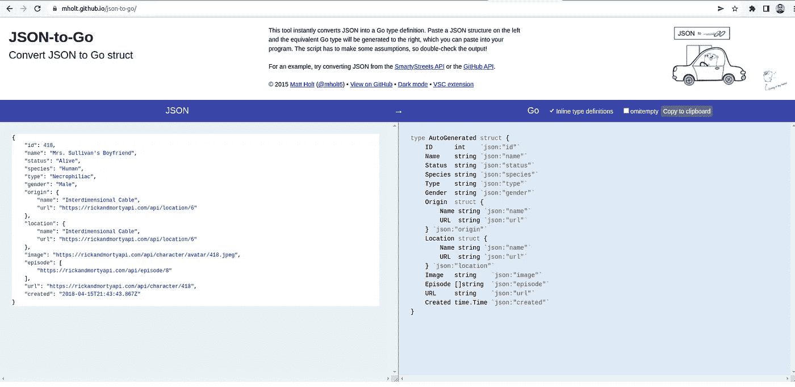
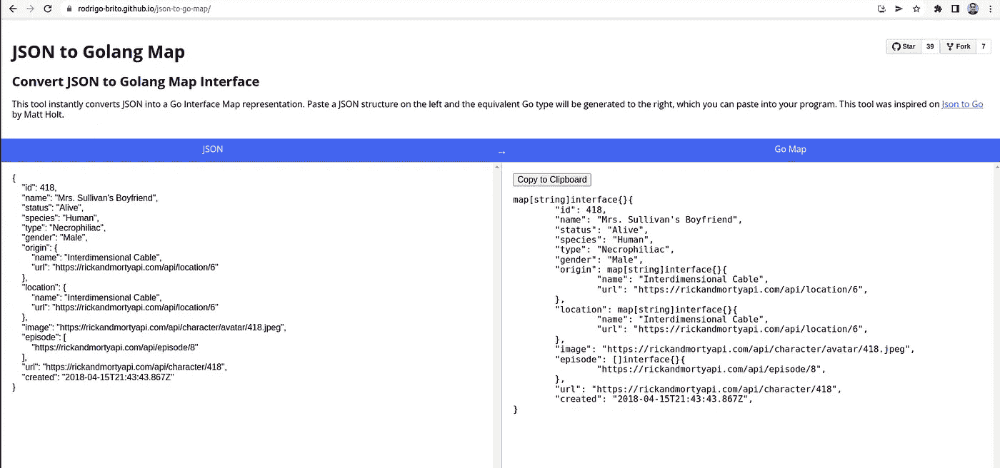

# 在 Golang 与 JSON 合作

> 原文：<https://betterprogramming.pub/working-with-json-in-golang-15e242a57b03>

## 用 Go 处理 JSON 数据

Golang 的最大卖点之一是让开发者能够轻松有效地构建高性能、可伸缩的 web 服务。

众所周知，在与面向用户的 web 服务通信时，JSON 是数据序列化的行业标准。幸运的是，Go 使您能够以一种非常直接和高效的方式使用 JSON。在本文中，我将:

*   演示如何使用内置于 Go 标准库中的 [JSON 模块](https://pkg.go.dev/encoding/json)
*   展示如何将 JSON 数据转换成 Go 对象，反之亦然
*   讨论一些可以加快 JSON 使用过程的简洁工具

Go 有非常强大的标准库。对于 JSON 数据的处理，我们不需要获取任何第三方库，因为内置的库包含了我们需要的所有内容。

让我们看一个代码片段，它使用 JSON 进行一些基本的操作:

这是一个非常基本的例子，在这个例子中，我们获取一部分 Go 结构(本例中是 books)并将其序列化为 JSON 格式，这样我们就可以通过网络将它发送给请求该数据的客户机。

您可能已经注意到的第一件事是我们定义 Book struct 的字段的方式。我们的 struct 的每个属性都定义了它在序列化为 JSON 时在反斜杠`(json:”title”)`中的显示方式。

这是 Go 的一个非常有用的特性，你可以通过将`title`改为`book_title`来轻松测试。当需要在 REST API 中更改 JSON 响应的格式时，这非常有用。

现在让我们看看我们实际转换数据的方式 Marshal 方法接受一个空接口(这意味着您可以传递您喜欢的任何 Go 数据结构),并尝试序列化数据。如果不能，您将得到一个错误。这就是为什么检查错误非常重要。如果序列化成功，它将返回准备通过网络传输的一部分字节。

让我们看一下相反的情况，正在接收一个 JSON 数据流，需要将其转换为 Go 数据结构，以便 Go 程序可以操作数据:

很明显，我们在这里几乎颠倒了这个过程，但是有一件重要的事情需要注意——当解组数据时，我们需要传递一个指向`Book`结构片的指针，而不是实际的片。这是因为与 Java 或 Python 不同，Go 是一种按值传递的语言。这意味着如果我们想修改一个变量的状态，我们需要使用它的指针，否则只会传递那个变量的一个副本，而初始变量的状态不变。

除了这些例子中使用的`json.Marshal/json.Unmarshal`方法，JSON 序列化的另一种方法是使用`json.Decoder/json.Encoder`。

主要的区别是这两个都希望从实现了`[io.Reader](https://pkg.go.dev/io#Reader)` 接口的 Go 结构中读取数据。传入 HTTP 请求的请求体就是其中之一。在不构建整个 HTTP 服务器的情况下，让我们看一下这种情况，我们接受一个 HTTP 客户端的请求，向我们的集合中添加一本新书:

因此，在实现 HTTP 请求处理程序时，使用`json.NewDecoder/json.NewEncoder`比使用`json.Marshal/json.UnMarshal`更有意义。

现在，使用这些简单的例子是一回事，但是在现实生活中，JSON 请求/响应通常是一个充满嵌套对象的大型结构，那该怎么办呢？除了定义 Go 结构很容易变得令人头疼之外，实现还是差不多的。手动写出几次结构后，我发现了一个非常有用的工具来自动完成这项工作。这里可以找到[。](https://mholt.github.io/json-to-go/)

让我们看一个来自 rick 和 morty API 的例子。您可以通过调用以下命令来查看 HTTP 响应:

[https://rickandmortyapi.com/api/character/418](https://rickandmortyapi.com/api/character/418)

当您将响应粘贴到 JSON-to-Go 工具中时，您会得到:

相当快速的转换！不需要手动输入结构，也不需要计算哪个嵌套的 JSON 对象需要转换成哪个 Go 结构。

等等，你说你并不真的需要 Go struct，而是更喜欢 Go map？不用担心，您可以在这里轻松地进行转换:

本文到此为止。希望你觉得有用。感谢阅读！