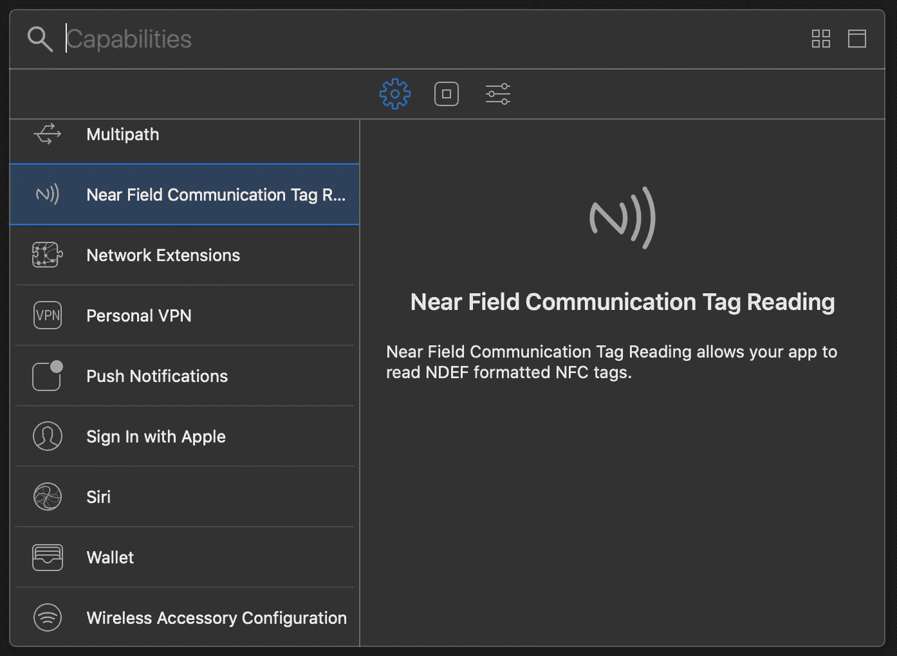
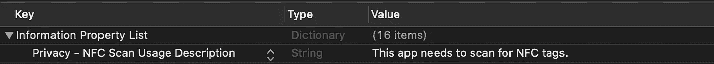
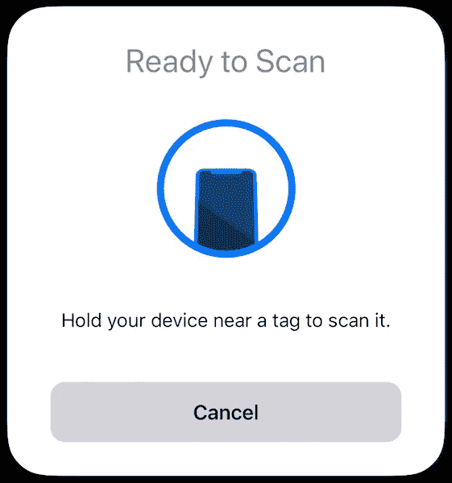
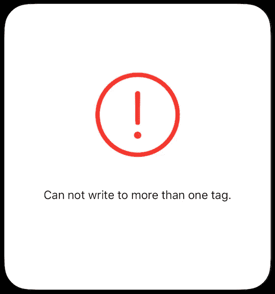
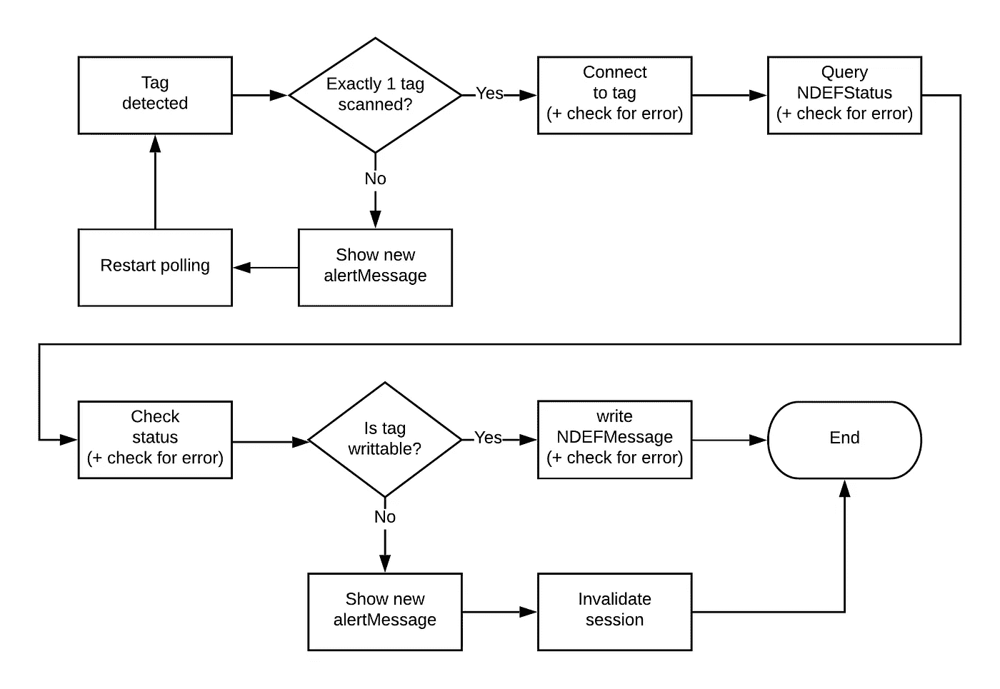

# 如何在 iOS 13 中让您的 Swift 应用程序与 NFC 标签配合使用

> 原文：<https://betterprogramming.pub/working-with-nfc-tags-in-ios-13-d08c7d183981>

## 在 Swift 中读写 NFC 标签

图片来自 [Unsplash](https://unsplash.com)

NFC 是一种易于使用的技术，具有多种应用。它是苹果和谷歌移动支付的基础，[任天堂](https://www.nintendo.com/amiibo/what-is-amiibo/)和[乐高](https://en.wikipedia.org/wiki/Lego_Dimensions)用它来增强游戏体验，NFC 标签甚至[被添加到衣服上](https://www.youtube.com/watch?time_continue=11&v=vCvqFf08Fhs&feature=emb_logo)。

在 iOS 13 中，苹果扩展了对 NFC 的支持。以前，应用程序只能从标签中读取，但现在，iOS 设备也可以向标签中写入。

在本教程中，我们将进一步了解如何使用苹果公司用于与 NFC 设备交互的框架`CoreNFC`，来读取和写入 NFC 标签。

# 项目设置

在我们开始扫描 NFC 标签之前，我们需要添加功能*近场通信标签读取*。这可以在*标签下的&功能*项目设置中完成。

为应用添加 NFC 功能。

接下来，我们需要给我们的`info.plist`文件添加一个`NFCReaderUsageDescription`，它告诉用户为什么应用程序需要使用 NFC。

info.plist 中 NFCReaderUsageDescription 的示例

现在一切都设置好了，我们可以开始编写代码了！

# 准备

在我们开始扫描标签之前，我们应该确保用户的设备能够这样做。我们可以这样检查`NFCReaderSession`的属性`readingAvailable`:

检查 NFC 扫描仪的可用性。

在这个例子中，如果不支持扫描 NFC 标签，我们什么也不做，但你可能应该在一个真正的应用程序中做更多的事情，例如，显示警告以通知用户。

# 从 NFC 标签读取数据

现在我们需要初始化、准备并开始一个新的`NFCNDEFReaderSession`。

哇，这个会话类有很多字母！当然，你一开始就认识到了 NFC，后来又认识到了`ReaderSession`，但是 NDEF 代表什么呢？

NDEF 是 *NFC 数据交换格式*，它定义了在 NFC 标签上存储数据以及从一个 NFC 设备向另一个设备发送数据的数据格式。如果你想进一步了解这种格式，你可以访问[这个网站](https://learn.adafruit.com/adafruit-pn532-rfid-nfc/ndef)。

但是不要担心，你不需要了解更多关于 NFC 标签的知识。

初始化 NFCNDEFReaderSession 以与 NFC 标签通信。

`// 1` —创建新的会话对象时，需要三个参数:`delegate`、`queue`和`invalidAfterFirstRead`。

第一个参数是实现`NFCNDEFReaderSessionDelegate`协议的对象。该协议定义了处理与读取会话相关的事件的方法，例如，查找标签或接收错误。我们将在几秒钟内对其进行仔细观察。

参数`queue`是一个调度队列，在调用代理时使用。如果您不想显式地使用一个现有的队列，您可以使用`nil`,并且为会话创建一个新的调度队列。

最后，`invalidAfterFirstRead`是一个布尔标志，在第一个标记被读取后，它会使会话无效。如果您只想扫描一个标签，则将其设置为`true`，如果您想继续扫描，则将其设置为`false`。

`// 2`—此外，我们设置属性`alertMessage`，这是每当我们开始扫描时显示给用户的文本。

`// 3`—最后一步是在会话中调用方法`begin`，设备将在附近寻找 NFC 标签。会话启动后，您可以看到以下警报:

提醒您的用户您正在扫描 NFC 标签。

现在我们知道了如何开始一个会话，让我们研究一下`NFCNDEFReaderSessionDelegate`来看看如何处理一个检测到的标签。

该协议定义了四种方法，其中三种可以在下面的代码中看到:

从 NFC 标签读取数据。

`// 1` —第一种方法是`readerSessionDidBecomeActive(_:)`。顾名思义，它在会话开始时被调用。此方法是可选的，可以省略。

`// 2`—从 NFC 标签读取数据的重要方法是`readerSession(_:didDetectNDEFs:)`。一旦发现带有 NDEF 消息的标签，读取器会话就调用该方法。

在这个例子中，我们遍历从标签接收到的每条消息。这些消息中的每一条都包含一个记录数组，我们也在这个数组上进行循环。我们从每个记录中访问标识符、类型和有效负载，将它们转换成字符串并打印到控制台。

**注意**:虽然这个方法是必需的，但是只有当可选方法`readerSession(_:didDetact:)`没有被委托实现的时候才会被调用！我们将在关于写入标签的章节中详细讨论这个方法。

`// 3`—最后一种方法是`readerSession(_:didInvalidateWithError:)`。

每当我们的会话变得不活动时，就会调用这个函数，例如，当我们将`invalidAfterFirstRead`设置为 true 并且已经扫描了一个标签时，会话就会超时，或者通过调用`.invalidate()`使会话失效。

在本例中，我们将错误打印到控制台。这种方法也是必需的。

# 将数据写入 NFC 标签

在我们继续之前，我们必须创建一个新的读取会话，它不会在检测到第一个标签后失效。因为我们需要初始化一个连接并将数据写入标签，这可能需要一些时间，所以我们将`invalidAfterFirstRead`设置为 false。

现在，我们可以通过使用之前没有使用的第四种方法`NFCNDEFReaderSessionDelegate`向 NFC 标签写入数据。

向 NFC 标签写入数据。

`// 1`—首先，我们检查是否检测到一个以上的标签。这是可能的，因为我们不再使会话无效。

我们可以在当前会话中使用方法`invalidate(errorMessage:)`来改变显示给用户的警告消息。使用此方法，将显示以下警报:

使用`invalidate(errorMessage:).`提醒用户出现错误

`// 2`—接下来，我们开始一个到扫描标签的新连接。由于此操作可能会失败，我们需要处理可能的错误。在本例中，我们在扫描警报上显示了一个新文本。

`// 3`—我们连接到标签后，需要查询它的 NDEF 状态，可以是`.notSupported`、`.readOnly`或`.readWrite`。

`// 4`—如果标签是可写的，我们可以给它写一条 NDEF 消息。我们将看看如何在几秒钟内创建这样的消息。一旦这个方法完成，我们可以检查写操作是否成功，并结束我们的会话。

如您所见，将数据写入标签需要很多步骤。这张图表直观地显示了正在发生的事情:

将数据写入 NFC 标签需要多个步骤。

我们写入标签的消息是一个`NFCNDEFMessage`，它只是一个简单的包装器，包装了一组`NFCNDEFPayload`实例。在下面的代码示例中，您可以看到如何创建这样的有效负载:

创建 NFCNDEFMessage 以写入 NFC 标签。

`// 1`—两个类方法`wellKnownTypeURIPayload(string:)`和`wellKnownTypeURIPayload(url:)`创建包含 URL 的有效负载。

`// 2`—`wellKnownTypeTextPayload(string:locale:)`我们可以创建一个包含简单字符串的有效载荷。

**注意**:由于接收到的有效载荷始终是`nil`，该功能目前似乎已被破坏。如果你想写文本到一个标签，你需要使用自定义初始化器。

`// 3`—此外，我们可以通过使用`NFCNDEFPayload`的初始化器创建一个定制的有效负载对象，并传递格式、类型、标识符和有效负载。

`// 4`—最后，我们可以创建一个包含有效负载实例的`NFCNDEFMessage`。

现在你知道了 iOS 13 中 NFC 标签入门的一切。您了解了如何读取数据以及如何创建消息并将其写入 NFC 标签。

# **资源**

 [## 构建 NFC 标签阅读器应用程序

### 该示例代码项目展示了如何在应用程序中使用核心 NFC 来读取第 1 类近场通信(NFC)标签…

developer.apple.com](https://developer.apple.com/documentation/corenfc/building_an_nfc_tag-reader_app)  [## Adafruit PN532 RFID/NFC 分线点和屏蔽

### 这不是一个完整的教程，只是在我们对 RFID/NFC 做更多研究时的一个快速入门指南。有很多…

learn.adafruit.com](https://learn.adafruit.com/adafruit-pn532-rfid-nfc/ndef)