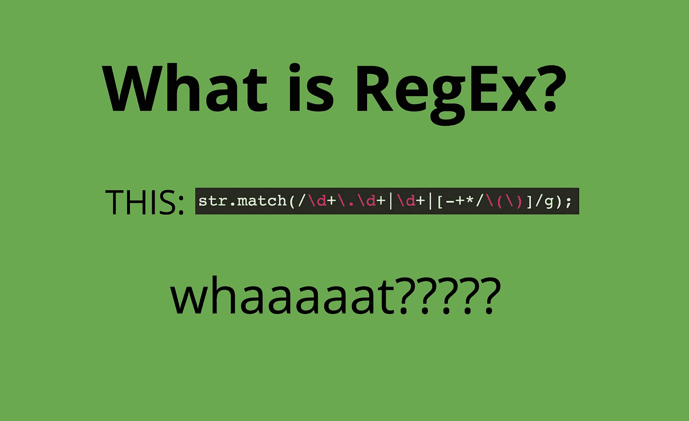

# 在 JavaScript 中使用正则表达式(RegEx)

> 原文：<https://betterprogramming.pub/working-with-regular-expressions-regex-in-javascript-6c7dd951574a>

## 用正则表达式匹配部分字符串



在编程语言中，正则表达式用于匹配字符串的各个部分。

# 正则表达式入门

比方说，如果你想在字符串`“God helps those who help themselves”`中找到单词`"help"`，你可以使用下面的正则表达式(RegEx): `/help/`。

JavaScript 使用`.test()`方法，该方法获取正则表达式并将其应用于一个字符串(放在括号内)。它`returns`或者`true`或者`false`，取决于图案是否匹配。

```
let str1 = "God helps those who help themselves";
let str2 = "You can't expect everyone to like you";
let testRegex = /help/;
testRegex.test(str1); //returns true
testRegex.test(str2); //returns false
```

在上面的例子中，我们使用文字正则表达式`/help/`在变量`str1`和`str2`中搜索单词 *help* 。

另一个文字正则表达式的例子是`/expect/`，它将从字符串中匹配单词*期望*。

我们可以使用 or 操作符寻找多个模式:`|`。

```
Example: if you wanted to match “hi”, “hello”, or “hola”, the RegEx would be: /hi|hello|hola/.
```

# **匹配方法**

JavaScript 中还有一个方法:`.match()`。它应用于字符串，并以正则表达式作为参数。`.match()`方法返回一个包含匹配正则表达式的数组。

```
Example: “Quick brown fox”.match(\brown\); \\returns [“brown”]
```

# **标志**

我们可以使用`-i`标志在匹配时忽略字母大小写。

“hello”和“Hello”都将匹配正则表达式`/hello/i`。

如果我们想要提取一个字符串中一个单词的每一个匹配，我们使用`-g (global)`标志。

```
Example: “hello, hello, hello”.match(\hello\g); //returns [“hello”,”hello”,”hello”]
```

我们还可以一起使用`-i`和`-g`标志来查找一个单词的所有出现，并忽略大小写。

# 百搭牌

通配符(`.`)匹配任何东西。

通配符`.`(又名`dot`或`period`)将匹配任何一个字符。

```
Example: if you want to match “huh”,”hut”,”hum”,”hug”, we can use the RegEx /hu./
```

# **人物类**

字符类允许您定义一组想要匹配的字符，方法是将它们放在方括号(`[`和`]`)内。

```
Example: “bag, big, bug, bog”.match(b[aiu]g); //returns [“bag”, “big”, “bug”, “bog”].
```

为了匹配一系列字符，比如小写字母 a 到 e，您可以使用`[a-e]`。

```
Example: “cat, bat, mat”.match(/[a-e]at/); //returns [“cat”, “bat”, null]
```

您也可以创建一组不想匹配的字符。

这些类型的字符集被称为*无效字符集*。要创建一个求反的字符集，您需要在左括号后和不想匹配的字符前放置一个脱字符(`^`)。

```
Example: /[^aeiou]/gi matches all the non-vowel characters.
```

注意，在字符集之外，脱字符(`^`)用于搜索字符串开头的模式。

此外，您可以使用正则表达式末尾的美元符号字符`$`来搜索字符串的结尾。

为了匹配一个字符至少出现一次，我们可以使用`+`，为了匹配出现零次或多次的字符，我们使用`*`。

```
Example: ‘gooooooooooal!’.match(/go*/); //returns [“goooooooooo”]
```

# **贪懒搭配**

在正则表达式中，贪婪匹配查找字符串中符合正则表达式模式的最长部分，并将其作为匹配返回。

另一种方法叫做*惰性匹配*，它寻找字符串中满足正则表达式模式的最小可能部分。

```
Example-1: "titanic".match(\t[a-z]*i\) returns \\ ["titani"]
Example-2: "titanic".match(/t[a-z]*?i/) 
returns \\ ["ti"] **here we have used ? to specify lazy match.**
```

# **特殊字符(\w，\W，\s，\d，\D)**

*   为了匹配 JavaScript 中的所有数字和字母，我们使用了相当于 RegEx `\[A-za-z0–9_]\`的 `\w`。
*   为了跳过所有的数字和字母，我们使用`\W`。
*   为了只匹配数字，我们使用`\d`。
*   为了不匹配数字，我们使用`\D`。
*   `\s`是匹配空格的正则表达式。
*   `\S`是一个转义空格的正则表达式。

# **范围**

为了匹配出现在某个范围内的字母，我们使用`{}`。

```
Example: "aaaaapple".test(\a{3,5}\); //returns true. 3 and 5 are the minimum and maximum number of times a should be present in the string.
```

就这样了，伙计们。我希望你觉得这很有趣。给我你的反馈！感谢阅读。