# 在 Three.js 中使用纹理

> 原文：<https://betterprogramming.pub/working-with-texture-in-three-js-40ce5e8b96c4>

## 在曲面上试验纹理

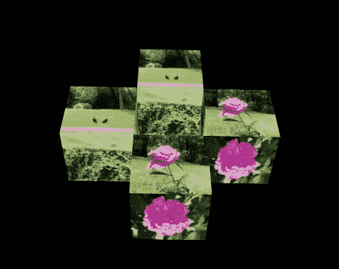

作者图片

我们已经写过 [three.js 基础](/working-with-three-js-the-popular-3d-javascript-library-bd2e9b03c95a)、 [3D 建模](/working-with-3d-model-in-three-js-e228621141af)，是时候检查一下纹理了。

在视觉艺术中，纹理是艺术作品的感知表面质量。它是 2D 和 3D 设计的一个元素，通过其感知的视觉和物理属性来区分。

在 [three.js](https://github.com/mrdoob/three.js/) 中，创建纹理是为了应用于表面，或者作为反射或折射贴图。纹理映射是一种在计算机生成的 2D 图形或 3D 模型上定义高频细节、表面纹理或颜色信息的方法。用最简单的术语来说，纹理映射意味着获取一幅图像并在一个表面上拉伸它。在本文中，我们将重点讨论如何进行纹理映射。

# 设置 Create React 应用程序工作环境

我们使用 [Create React App](/an-in-depth-guide-for-create-react-app-5-cra-5-b94b03c233f2) 作为基础来探索 three.js。

```
% npx create-react-app react-three
% cd react-three
```

设置几个包:

*   three.js ( `three`):是一个 3D JavaScript 库，在网页上渲染 3D 内容。它旨在创建一个易于使用、轻量级、跨浏览器、通用的 3D 库。
*   [react-three-fiber](https://github.com/pmndrs/react-three-fiber) ( `@react-three/fiber`):是 three.js 的 react 渲染器，它允许我们使用 JSX 编写 three.js，更具声明性。React 包装器还在幕后处理很多事情，比如调整画布大小和处理卸载的对象。
*   `[@react-three/drei](https://github.com/pmndrs/drei)`:这是一个渲染 react-three-fiber 的有用助手集合。它使得使用多种类型的对象变得更加容易，例如相机、控件、图像、形状、3D 模型、环境等。

```
% npm i three @react-three/fiber @react-three/drei
```

这些包裹在`package.json`变成了`[dependencies](/package-jsons-dependencies-in-depth-a1f0637a3129)`:

Create React 应用程序已经为 three.js 项目做好了准备。

# 给平面添加纹理

在几何学中，平面是向各个方向无限延伸的平面。在 three.js 中，`PlaneBufferGeometry`是定义了宽度和高度的平面。等价地，它是 react-three-fiber 中的`planeBufferGeometry`元素，以小写的 p 开头。

下面的`src/App.js`显示一架飞机:

我们已经[详细解释了](/working-with-three-js-the-popular-3d-javascript-library-bd2e9b03c95a)什么是 three.js 以及它在 React 中是如何工作的。网格是一种基于三角形多边形网格的对象。骨骼构成了三维物体的外形。它由几何体(形状)、材质(表面)和场景(位置)定义。

在上面的代码中，`Shape`组件(第 3-9 行)由一个`mesh`(第 5-8 行)定义，它包括一个宽度和高度定义为`[0.5, 0.5]`的平面。

`Shape`显示在`Canvas`上(第 13-18 行)，呈现三的组件。`Canvas`将`camera`的道具设置为`{ fov: 70, near: 0.01, far: 100, position: [0, 0, 2] }`(第 14 行)，并以`black`背景占据整个视口(第 15 行)。

执行`npm start`，我们看到一架飞机。默认情况下，`planeBufferGeometry`为白色。

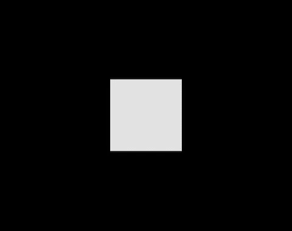

作者图片

纹理映射在曲面上拉伸图像。即，每个像素处的纹理由图像的映射像素定义，该像素被称为纹理元素。文本图像的轴也称为 UV 坐标，以区别于 XYZ 坐标的 3D 空间。所以纹理贴图也叫 UV 贴图。

下面的图像被用作我们的纹理。文件`flower.jpg`位于`public`文件夹下。

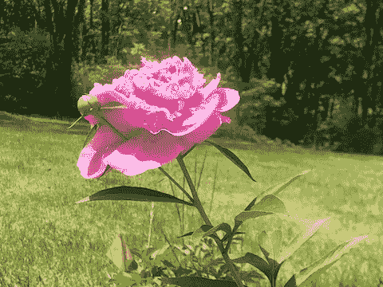

作者图片

`src/App.js`被修改为显示纹理:

由于加载文件可能需要一些时间，`flower.jpg`，`Suspense`用于显示一个空屏幕(`null`)作为后备(第 21 行)。参考[另一篇文章](https://medium.com/p/e228621141af)关于如何显示进度文本或其他用于后退的更好的用户界面。

在第 6 行，来自`@react-three/fiber`的`useLoader`钩子调用三的`TextureLoader`来加载图像到一个`colorMap`，它是一个`Texture`对象，有以下数据:

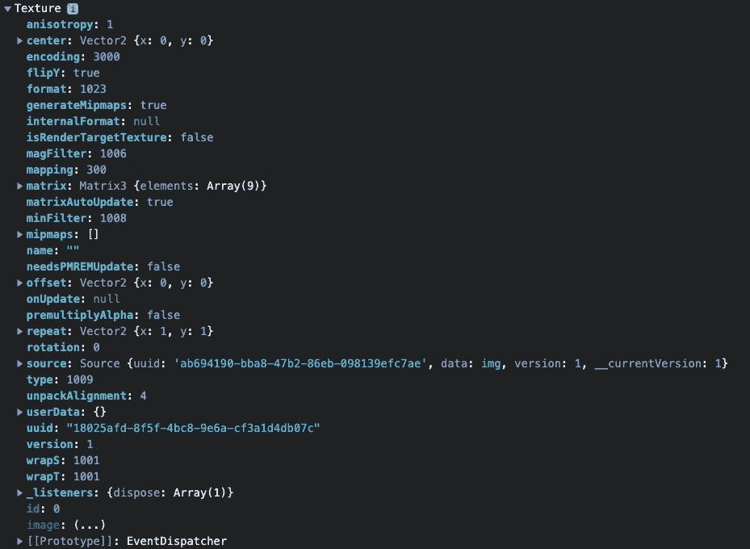

作者图片

材质使用多个贴图来描述对象的外观。`MeshBasicMaterial`是绘制几何图形的材料。这种材质不受灯光影响。在第 10 行，`meshBasicMaterial`将`map`道具设置为`colorMap`。`mesh`里面的纹理应用到平面上，我们看到的是有图像纹理的平面。

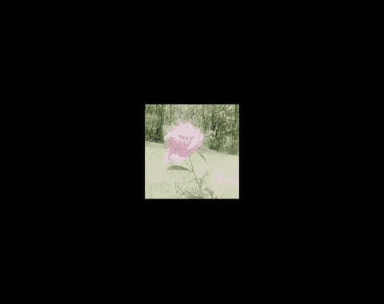

作者图片

UV 比率被箝位以适应方形，这是可以理解的。为什么纹理颜色看起来洗出来了？

就是因为`@react-three/fiber`的实施。如果代码是用`THREE.MeshBasicMaterial`写的，颜色和原来一样新鲜。

`meshBasicMaterial`中的每个纹理元素由三种成分决定:

*   从源(`flower.jpg`)到目的(`white`)的混合颜色
*   `transparent` ( `boolean`)和`opacity` ( `0.0 — 1.0`)的设定
*   其他道具

纹理颜色可以使用以下道具的自定义混合进行调整:

*   `blending`:在`THREE.NoBlending`、`THREE.NormalBlending`、`THREE.AdditiveBlending`、`THREE.SubtractiveBlending`、`THREE.MultiplyBlending`、`THREE.CustomBlending`中选择`THREE.CustomBlending`。
*   `blendEquation`:在`THREE.SubtractEquation`、`THREE.ReverseSubtractEquation`、`THREE.MinEquation`、`THREE.MaxEquation`选项中选择`THREE.AddEquation`(默认)。
*   `blendSrc`:在`THREE.ZeroFactor`、`THREE.OneFactor`、`THREE.SrcColorFactor`、`THREE.OneMinusSrcColorFactor`、`THREE.SrcAlphaFactor`、 `THREE.OneMinusSrcAlphaFactor`、`THREE.DstAlphaFactor`、 `THREE.OneMinusDstAlphaFactor`、`THREE.DstColorFactor`、 `THREE.OneMinusDstColorFactor`、`THREE.SrcAlphaSaturateFactor`中选择`THREE.SrcColorFactor`。
*   `blendDst`:从`THREE.ZeroFactor`、`THREE.OneFactor`、`THREE.SrcColorFactor`、`THREE.OneMinusSrcColorFactor`、`THREE.SrcAlphaFactor`、 `THREE.OneMinusSrcAlphaFactor`、`THREE.DstAlphaFactor`、 `THREE.OneMinusDstAlphaFactor`、`THREE.DstColorFactor`、 `THREE.OneMinusDstColorFactor`中选择`THREE.ZeroFactor`。

复杂的描述由下面的`meshBasicMaterial`元素完成。

你可能想知道如何做出这样的组合。

[本页面](https://threejs.org/examples/webgl_materials_blending_custom.html)帮助编写道具，其中列显示`blendSrc`选项，行显示`blendDst`选项，选择的`blendEquation`在右侧。

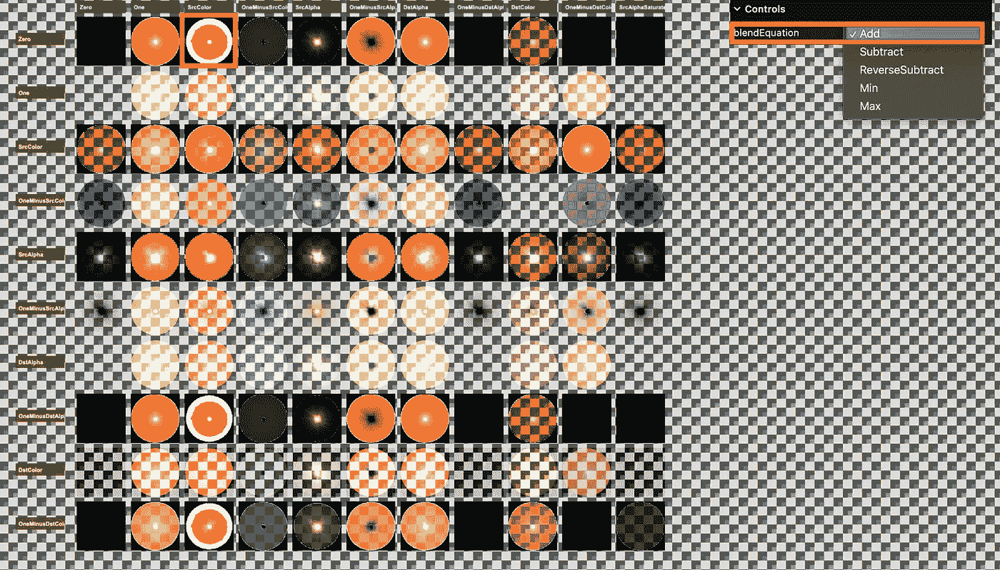

作者图片

执行`npm start`，我们看到一架颜色更鲜艳的飞机。

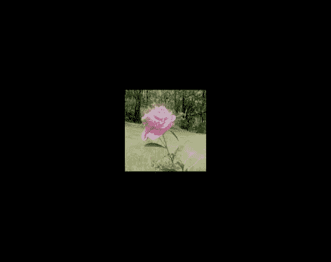

作者图片

还有一个替代方法，从`@react-three/drei`调用`useTexture`(下面代码中的第 6 行)。

通过`npm start`运行代码。

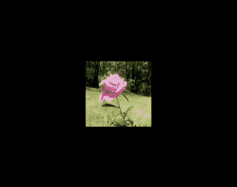

作者图片

现在颜色是不是太鲜艳了？

也许吧。但是我们继续用这种颜色。

# 给平面的两面添加纹理

让我们玩点自动旋转飞机的游戏。这可以通过将`@react-three/drei`中的`OrbitControls`添加到`Canvas`元素中来实现。

飞机以 5 的速度旋转(第 5 行)，这相当于以 60fps(帧每秒)的速度每轨道旋转 12 秒。如果显示器刷新率更高，它实际上旋转得更快。

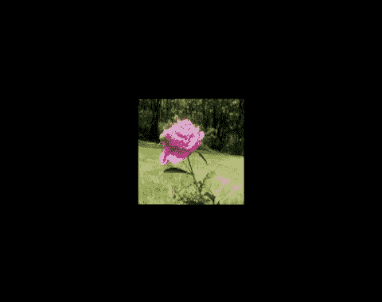

作者图片

Ops，飞机实际上有两面，纹理被添加到正面，而不是背面。

如果`meshBasicMaterial`配置了双面，这个问题可以解决(下面代码的第 11 行)。

通过`npm start`运行代码，我们可以看到两边都添加了纹理。

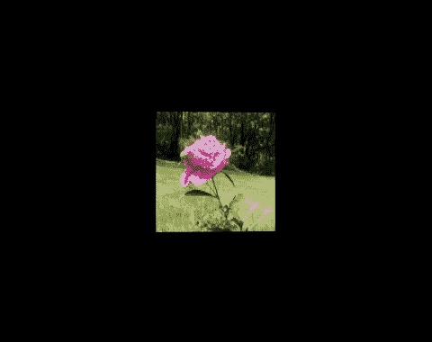

作者图片

# 向立方体添加纹理

我们已经看到了如何在平面上映射纹理。让我们试着给立方体添加纹理。

在第 9 行，使用了`boxBufferGeometry`，带有 3D 坐标。

执行`npm start`。


作者图片

它对每张脸都有相同的纹理。

这个`useText`钩子能够建立一个纹理数组。我们将六个图像文件放在 public 文件夹下，调用`useText` hook 上传六个图像。`Shape`组件修改如下:

在第 2–9 行，六幅图像被加载到`colorMap`，这是一个包含以下数据的`Texture`对象的数组:

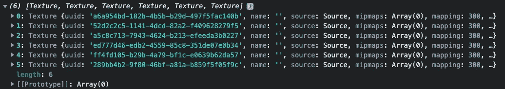

作者图片

在第 13–19 行，在`mesh`元素中创建了六个`meshBasicMaterial`元素。

第 16 行的道具配置每个图像如何映射到立方体的每个面。通过贴图，立方体的每个面都有独特的纹理。

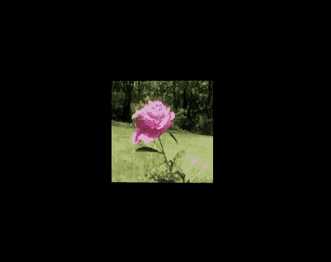

作者图片

从目前的角度，我们只能看到四张脸。

将摄像机降低一点到位置，`[0, -1, 1]`:

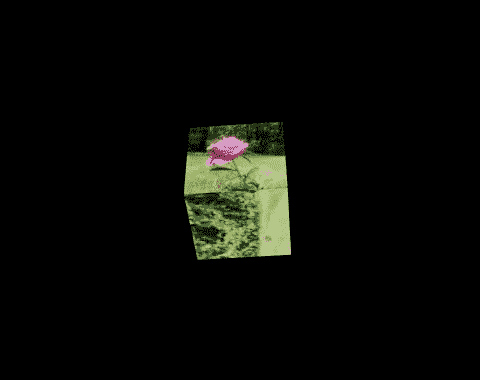

仍有一张脸不可见。

有许多方法可以解决这个问题。我们将绘制两个以不同顺序映射图像的立方体(`ascending`和`descending`)？

在第 5–26 行，`Shape`组件有两个道具:

*   `position`:指定立方体位置(第 15 行)。
*   `ascending`:指定纹理是否按升序映射(第 20 行)。

现在，我们可以看到六幅图像的纹理。

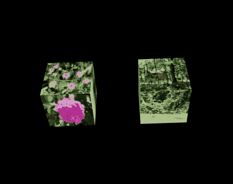

作者图片

有意思？

有了这些参数，我们可以再添加两个立方体(下面代码中的第 36 行和第 38 行)来绘制标题图像，四个带有纹理图像的旋转立方体。

# 结论

我们已经在平面或立方体的表面上实验了纹理。纹理图像被映射到表面上。

在下一篇文章中，我们将探索更多的 JavaScript 代码技术来操作 Three.js 中的纹理。

感谢阅读。我希望这有所帮助。如果你有兴趣，可以看看[我的其他媒体文章](https://jenniferfubook.medium.com/jennifer-fus-web-development-publications-1a887e4454af)。