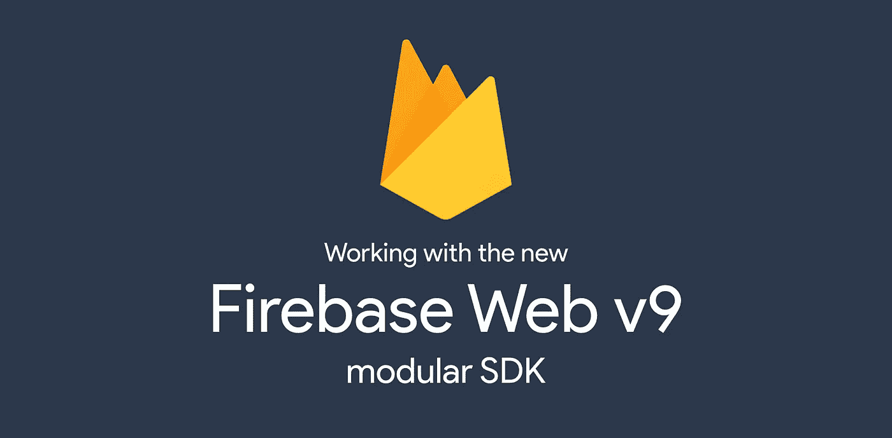
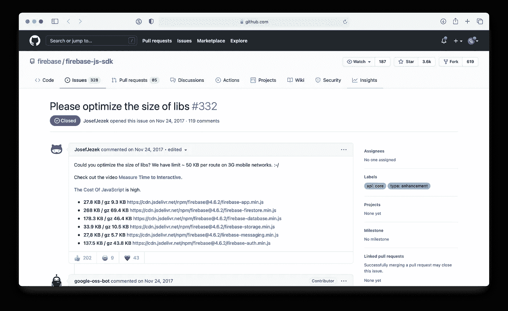

# 为什么新的 Firebase Web v9 模块化 SDK 是游戏规则的改变者

> 原文：<https://betterprogramming.pub/working-with-the-new-firebase-web-v9-modular-sdk-aad1c641640e>

## Firebase 的未来就在这里

## 减少基于 Firebase 的 web 应用程序不必要的膨胀



作者的形象设计；根据 [Firebase 品牌指南](https://firebase.google.com/brand-guidelines)使用 Firebase 标志

Firebase 是现代技术堆栈中最受欢迎的后端即服务选项之一。除了提供名为 Firestore 的 NoSQL 数据库解决方案，Firebase 平台还提供身份验证、文件存储、托管和分析解决方案。Firebase SDK 可用于许多平台，包括 mobile、Unity、Java、C++和 web。

然而，Firebase 在网络上的一个主要缺点是其庞大的规模。

根据 [BundlePhobia](https://bundlephobia.com/) ，一个用于确定 NPM 包大小的工具，firebase Web Javascript 包[在缩小& g-zipped](https://bundlephobia.com/package/firebase@8.9.0) 后重达 235.5kB。

对于一些网络连接较慢的用户来说，这可能会导致额外的 0.59 秒的加载时间。作为比较，`lodash`是另一个众所周知的沉重的 NPM 包，然而当缩小后& g-zipped 它只有[24.5 kb 重:是 Firebase 的十分之一。](https://bundlephobia.com/package/lodash@4.17.21)



作者截屏

这是 Firebase Web Javascript SDK 的一个已知问题，已经让许多开发人员远离该产品。特别是对于为可能无法访问快速互联网连接的最终用户构建产品的开发人员来说，加载像 Firebase 这样大的软件包根本不是他们的选择。

令人欣慰的是，Firebase 团队一直在努力工作，从头开始重新创建 Firebase Web SDK。2021 年 7 月 27 日，Firebase 官方博客账号[宣布了一个新的模块化 Javascript SDK](https://firebase.googleblog.com/2021/07/introducing-the-new-firebase-js-sdk.html) 的预发布，它可以“缩小 80%！”

Firebase Web v9 将彻底改变 Web 开发人员使用 Firebase 的方式。随着全面改进的模块化函数式编程风格的引入，以及 Firestore“lite”库的加入，Firebase web v9 支持的 Web 应用程序将运行得更快、加载速度更快，并显著增强用户和开发人员的体验。

说了这么多，让我们看看这个新的模块化 Firebase Web SDK 中引入的一些根本变化。

# **无副作用进口**

之前，Firebase Javascript SDK 整合了所谓的*副作用导入*。简而言之，当一个函数在其提供的范围之外修改状态时，就会产生副作用。

例如，如果函数`a`要修改一个全局变量`x`，那么函数`a`就会产生副作用。

副作用*导入*影响程序的状态、逻辑或功能，而不调用任何方法或引用任何从包中导出的变量。仅仅是程序中存在的包(通过 import 语句或 require 调用)就可以影响程序的功能。

旧的 Firebase Web SDK 严重依赖于副作用导入。对于您希望包含在应用中的每个附加 Firebase 功能(身份验证、Firestore、云存储、分析等)。)，您必须像这样导入一个额外的包:

```
// main firebase app import
import app from "firebase/app";// SIDE EFFECT PACKAGES
import "firebase/auth";
import "firebase/firestore";
import "firebase/storage";
```

如果您有使用旧的 Firebase Web SDK 的经验，您可能已经为导入 Firebase 包引入了延迟加载。

这种解决方案可以减少 web 应用程序的初始加载大小和时间，但是用户仍然不得不等待所有这些包的加载，然后应用程序才能完全发挥作用。

Firebase Web v9 改变了这一切。副作用包的概念在新的 Firebase Web SDK 中是不存在的，所有的包都是完全可动摇的。

这意味着只有你的应用程序需要的 Firebase 部分会被导入到客户端。这极大地减少了你的应用程序的最终包的大小，并将导致更快的加载时间。

# **原生 Javascript ES 模块**

在新的 Firebase Web SDK 中，由于模块化包的引入，您的应用程序所需的 Firebase 的每个独立功能都是单独导入的。

因为新的 SDK 内置于本地 Javascript ES 模块中，所以您可以直接只导入您的程序需要的特性:不多也不少。例如，假设您想要初始化 Firebase 应用程序，然后观察验证更改:

```
// imports with ES modules
import { initializeApp } from “firebase/app”;
import { getAuth, onAuthStateChanged } from “firebase/auth”;// initialize firebase app
initializeApp(firebaseConfig);// watch for auth changes
const auth = getAuth();
onAuthStateChanged(auth, (user) => {
  // deal with authentication changes
});
```

在使用 Firebase Web SDK 时，模块化包的引入反过来又导致了更具功能性的编程风格的引入。

# **函数式编程风格**

如果您曾经使用过函数式编程语言或库，那么作为开发人员，您会对函数式编程的优势非常熟悉。

遵循函数式编程风格的程序通常具有非常直观和非常易于测试的优点。虽然旧的 Firebase Web SDK 很难理解，但新的 Firebase Web SDK 同样直观或对初学者友好。

为了演示新的模块化 Firebase 包引入的函数式编程风格，让我们看一个在 Firestore 中更新文档的例子:

```
import { getStorage, ref, uploadBytes } from “firebase/storage”;// first, get a reference to the storage bucket for our app
const storage = getStorage();// then, make a reference to the file
const usersCollection = ref(storage, “files/example.png”);// finally, upload the file to the reference
uploadBytes(usersCollection, file);
```

正如您所看到的，在这个代码示例中有许多函数嵌套——一个函数的结果作为参数传递给另一个函数的*,后者的结果传递给另一个*函数的*参数，依此类推。这与旧的 Firebase Web SDK 使用的方法链接方法形成了鲜明的对比。*

总而言之，新的 Firebase SDK 函数式语言(如 F#或 Scala(或函数式库，如 Ramda 和 RxJS))使用的代码，而旧的 Firebase Web SDK 使用的代码类似于 Java 或 C++。

# **Firestore Lite**

Firestore 是一个非常强大和有用的数据库服务。它提供了许多功能，其中许多功能实际上并没有被所有使用 Firestore 的网络应用程序所利用。

许多开发人员只是将 Firestore 作为一个易于实现的 NoSQL 数据库，它可以处理在客户端和服务器端操作数据库的许多复杂问题。

在这种程度上，许多 web 应用程序不需要 Firestore 的实时更新功能，他们只需要访问一次性的文档和集合查询。

Firebase 团队认识到了这个有效的用例，并通过引入新的库 Firestore Lite 解决了这个问题。

Firestore Lite 库比旧的 Firestore v8 库轻 80%。除了实时更新之外，Firestore Lite 库中还提供了您喜爱并充分利用的所有 Firestore 功能。

这对于 Firebase Web 社区来说是一个巨大的胜利，因为您的应用程序现在可以更高的性能和更少的无用代码！

# **兼容性**

新的 Firebase Web v9 SDK 使得从 v8 SDK 逐步升级变得容易。firebase 包提供了一个`compat`库，使得从 v8 到 v9 的迁移变得简单和渐进。对于您的代码库中所有不准备完全切换到 Firebase Web v9 的地方，您可以利用`compat`库并逐步升级部分代码库，直到您不再需要使用`compat`库功能。

这样做的主要缺点是，在使用`compat`库时，您不会体验到新的 v9 SDK 的所有膨胀和减少加载时间的特性。`compat`库仍然依赖于副作用导入，所以你必须像处理 Firebase Web v8 SDK 一样处理这些副作用。

# **结论**

如果你曾经在网络上使用过 Firebase，Firebase 的未来应该会让你兴奋不已。

这个新的模块化 Firebase Web v9 SDK 的引入改变了在 Web 上使用 Firebase 开发的一切。

从使您的应用程序不那么臃肿到改善开发人员和最终用户的体验，新的 Firebase Web v9 模块化 SDK 消除了使用 Firebase 的最大缺点之一，并将彻底改变基于 Firebase 的 Web 应用程序的未来。

感谢阅读。