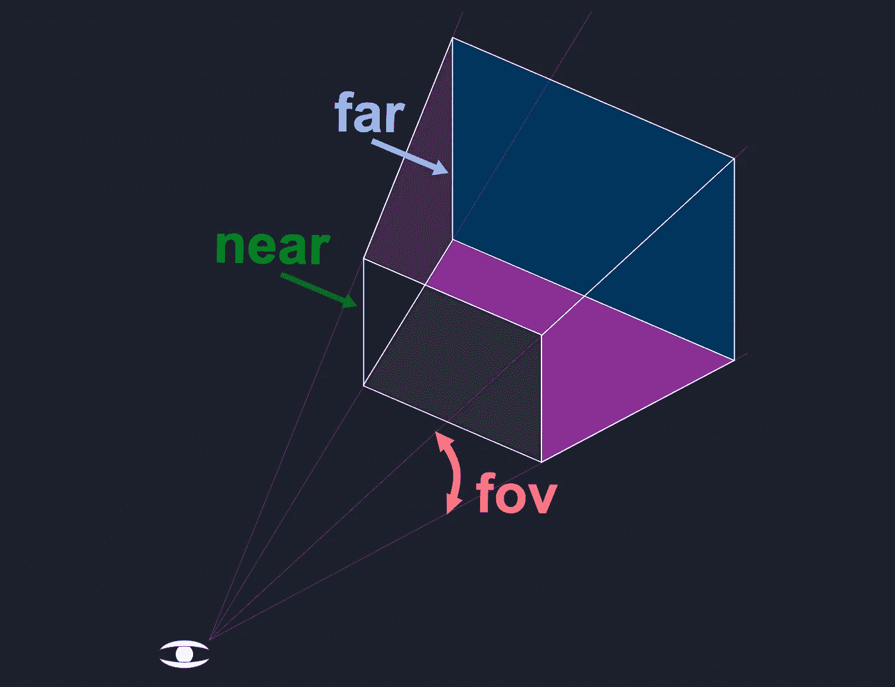
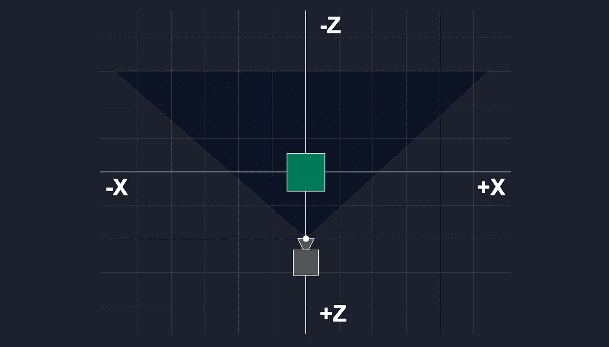
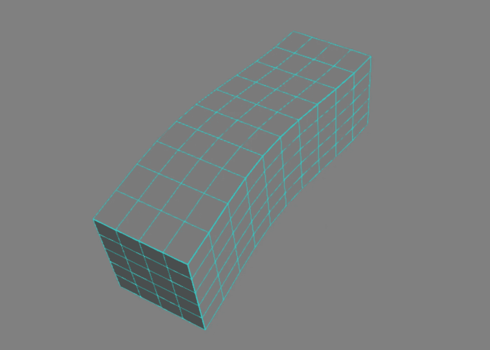
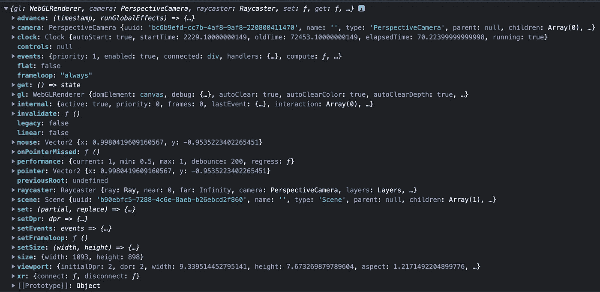
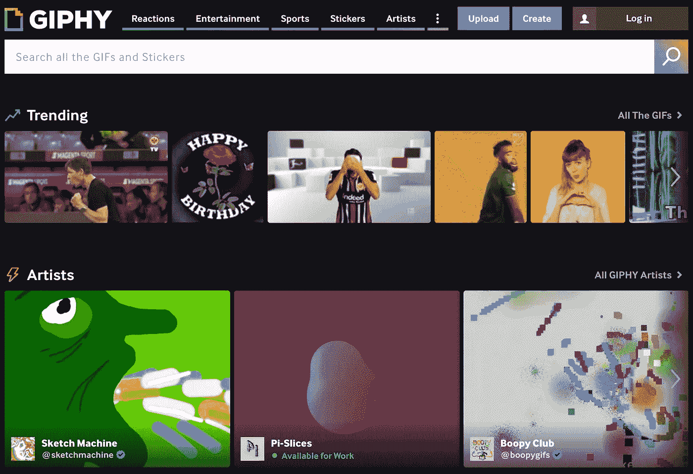

# 使用 Three.js:流行的 3D JavaScript 库

> 原文：<https://betterprogramming.pub/working-with-three-js-the-popular-3d-javascript-library-bd2e9b03c95a>

## 探索 Create React 应用程序工作环境中的 three.js


作者图片

[Three.js](https://github.com/mrdoob/three.js/) 是一个 3D JavaScript 库，在网页上渲染 3D 内容。这是一个开源项目，旨在创建一个易于使用、轻量级、跨浏览器、通用的 3D 库。

当前版本包括一个 [WebGL(网络图形库)](https://webglfundamentals.org/)渲染器和一个 JavaScript API，用于在任何兼容的网络浏览器中渲染交互式 2D 和 3D 图形，无需插件。现代浏览器广泛支持 WebGL。

WebGL 它是一个绘制点、线和三角形的低级 API。要用 WebGL 做任何有用的事情，需要相当多的代码，这就是 three.js 的用武之地。它处理高级功能，如场景、灯光、阴影、材质、纹理、3D 数学等。

Three.js 还支持其他渲染器，如 WebGPU、SVG 和 CSS3D。[官方举例](https://threejs.org/examples/)展示高级用法。

由于这是我们关于 three.js 的第一篇文章，我们将快速了解一下它是什么以及如何使用它。

# 官方动画立方体代码

上面的标题图像是由官方动画立方体代码渲染的，列在三人的`README`文件中。代码如下:

让我们解释一下它是如何工作的。

在官方代码行 1，`THREE`被导入。

```
import * as THREE from 'three';
```

在官方代码的第 4 行，一个`PerspectiveCamera`被实例化。

```
const camera = new THREE.PerspectiveCamera(70, window.innerWidth / window.innerHeight, 0.01, 10);
```

`PerspectiveCamera`构造函数有四个参数，如下所示:

在这个例子中，`fov`(视野)在垂直维度上被设置为 70 度，`aspect`被设置为 DOM `window`的纵横比(`window.innerWidth / window.innerHeight`)。`near`和`far`代表将要渲染的摄像机前面的空间。

`near`之前或`far`之后的任何内容都将被剪切。范围被设置为相机前面的`[0.01, 10]`。平截头体是一种三维形状，类似于顶端被切掉的金字塔。



《平截头体》，抄袭自[https://threejs.org/manual/#en/fundamentals](https://threejs.org/manual/#en/fundamentals)

在官方代码第 5 行，`camera.position`是 3D 矢量。

```
camera.position.z = 2;
```

摄像机位于`[0, 0, 2]`。`+Y`和`-Y`轴在绿色方块的中间。



摄像机位置，抄袭自[https://threejs.org/manual/#en/fundamentals](https://threejs.org/manual/#en/fundamentals)

这些是可用的摄像机类型:`ArrayCamera`、`Camera`、`CubeCamera`、`OrthographicCamera`、`PerspectiveCamera`和`StereoCamera`。

在官方代码第 7 行，实例化了一个场景。

```
const scene = new THREE.Scene();
```

场景是我们放置物体、灯光和摄像机的地方。这些是可用的场景类型:`Fog`、`FogExp2`和`Scene`。

在官方代码行 9，一个`BoxGeometry`被实例化。

```
const geometry = new THREE.BoxGeometry(0.2, 0.2, 0.2);
```

几何定义了物体的形状。`BoxGeometry`定义了箱体尺寸`width`、`height`和`depth`。在本例中，`width`、`height`和`depth`被设置为`0.2`。

构造函数也可以沿着每条边定义分段的面。默认情况下，每条边都有一个分段面。每一面的细节越多，需要分割的面就越多。下面是`4 x 5 x 10`的分割脸部示意图:



图像由[https://jsfiddle.net/prisoner849/8hqy99jj/](https://jsfiddle.net/prisoner849/8hqy99jj/)生成

这些是可用的几何图形类型:`BoxGeometry`、`CapsuleGeometry`、`CircleGeometry`、`ConeGeometry`、`CylinderGeometry`、`DodecahedronGeometry`、`EdgesGeometry`、`ExtrudeGeometry`、`IcosahedronGeometry`、`LatheGeometry`、`OctahedronGeometry`、`PlaneGeometry`、`PolyhedronGeometry`、`RingGeometry`、`ShapeGeometry`、`SphereGeometry`、`TetrahedronGeometry`、`TorusGeometry`、`TorusKnotGeometry`、`TubeGeometry`和`WireframeGeometry`。

在官方代码的第 10 行，一个`MeshNormalMaterial`用默认参数进行了实例化。

```
const material = new THREE.MeshNormalMaterial();
```

材质决定了物体的外观——光泽、平面、颜色、纹理等。—它采用以下参数:

`MeshNormalMaterial`有附加参数，如下所示:

这些是可用的物料类型:`ShadowMaterial`、`SpriteMaterial`、`RawShaderMaterial`、`ShaderMaterial`、`PointsMaterial`、`MeshPhysicalMaterial`、`MeshStandardMaterial`、`MeshPhongMaterial`、`MeshToonMaterial`、`MeshNormalMaterial`、`MeshLambertMaterial`、`MeshDepthMaterial`、`MeshDistanceMaterial`、`MeshBasicMaterial`、`MeshMatcapMaterial`、`LineDashedMaterial`、`LineBasicMaterial`和`Material`。

在官方代码行 12，用特定的`geometry`和`material`实例化一个`Mesh`。在下一行，它被添加到一个场景中。

```
const mesh = new THREE.Mesh(geometry, material);
scene.add(mesh);
```

网格是构成 3D 对象图形的骨架。它由几何体(形状)、材质(表面)和场景(位置)定义。

在官方代码行 15–18，一个 WebGL 渲染被实例化。它被设置为 DOM `window`大小，配置了一个动画循环，它的`domElement`被附加到 DOM `body`中。

```
const renderer = new THREE.WebGLRenderer({ antialias: true });
renderer.setSize(window.innerWidth, window.innerHeight);
renderer.setAnimationLoop(animation);
document.body.appendChild(renderer.domElement);
```

在官方代码行 21–26，定义了一个动画函数。

```
function animation(time) {  
  mesh.rotation.x = time / 2000;   
  mesh.rotation.y = time / 1000;   
  renderer.render(scene, camera);
}
```

参数`time`是从调用`renderer.setAnimationLoop(animation)`开始的时间。时间的单位是毫秒。由于每轴转一圈需要 2π，所以上述动画函数绕 x 轴转一圈大约需要 12.56 秒，绕 y 轴转一圈大约需要 6.28 秒。

`renderer.setAnimationLoop(animation)`是开始动画的请求。如果`animation`是`null`，它将停止任何已经在进行的动画。`setAnimationLoop`是`requestAnimationFrame`的替代。

`renderer.render(scene, camera)`重新渲染更新后的数据。

这就是 three.js 在 JavaScript 中的工作方式。

# 在 Create React App 中设置 Three.js

我们使用 [Create React App](/an-in-depth-guide-for-create-react-app-5-cra-5-b94b03c233f2) 来看看 three.js 在 React 中是如何工作的。以下命令创建一个 React 项目:

```
% npx create-react-app react-three
% cd react-three
```

设置`three.js`:

```
% npm i three
```

`three`成为`package.json`中`[dependencies](/package-jsons-dependencies-in-depth-a1f0637a3129)`的一部分:

它可以在 Create React 应用程序中使用。

用以下代码替换`src/App.js`:

它几乎与官方代码相同，除了几件事:

*   初始化代码被包装在`useEffect`(第 7–32 行)中，它被初始化一次(第 32 行`useEffect`的依赖列表被设置为空数组，`[]`)。
*   相反，`renderer.domElement`被附加到`document.body`，它被附加到`divRef.current`(第 34 行的`div`元素的可变引用对象)。

通过`npm start`执行代码，我们看到动画立方体在浏览器中旋转。

代码中有许多可以改进的地方:

*   我们不应该依赖于 DOM 窗口的大小，因为我们可以在一个组件上实现 three.js。
*   当浏览器调整大小时，应用程序不会调整大小。
*   与大多数 JavaScript 库不同，three.js 不会自动清理资源。它依靠浏览器在用户离开页面时进行清理。最佳实践是在不再使用对象时释放内存。

下面是改进后的`src/app.js`:

在第 59 行，`div`元素的`height`被设置为视窗高度的 100%。

在第 9–10 行，我们将`div`元素的`width`和`height`保存到变量中，以便在第 11 和 23 行重用。

在第 26 行，`divRef.current`被保存到`divCurrent`。这允许在第 27 行添加到`divCurrent`的子元素在第 52 行被移除。

在第 29 行，事件监听器用回调函数`handleResize`监听`resize`事件。

在第 32–39 行，`handleResize`函数检索新的`width`和`height`，并使用它们更新`render`和`camera`。在第 38 行，`renderer.render(scene, camera)`重新呈现更新后的数据。

在第 49–56 行，返回清理函数来停止动画，删除窗口监听器，并释放 three 的资源。

这是一个更高效的 three.js 代码。

# 在创建 React 应用程序时使用 React-Three-Fiber

[react-three-fiber](https://github.com/pmndrs/react-three-fiber) 是 three.js 的 react 渲染器，它允许我们使用 JSX 编写 three.js，这样更具有声明性。在 three.js 中起作用的一切都会毫无例外地在 react-three-fiber 中继续起作用。

没有额外的开销，因为 JSX 元素被转换为三的对象。例如，`<mesh />`转换为`new THREE.Mesh()`。

安装软件包，`@react-three/fiber`:

```
% npm i @react-three/fiber
```

`@react-three/fiber`成为`package.json`的另一个属地:

有了 react-three-fiber，`src/App.js`更凝聚，看起来更有反应。

在第 4–18 行，定义了`Box`组件。它为`mesh`元素定义了`meshRef`，该元素由钩子`useFrame`在第 6–11 行使用。

`useFrame`为每一帧调用。参数`state`包含所有三者的状态信息，包括`gl`(web GL)`camera`、`clock`、`scene`等。



作者图片

参数`delta`是以秒为单位的时钟增量。它用于在第 8–9 行设置动画。

`renderPriority`是完全关闭自动渲染的高级参数。

在 react-three-fiber 中，`mesh`与 object three 的对象一起，成为全局组件。我们创建了包含`boxGeometry`和`meshNormalMaterial`的`mesh`元素(第 13-16 行)。

`Box`元素放置在第 22-27 行定义的`Canvas`中。

`Canvas`是 three.js 的入口，呈现 three 的组件。画布的道具有`gl`(web GL)`camera``raycaster`等。

在第 23 行，`camera`的道具被定义为`{ fov: 70, near: 0.01, far: 100, position: [0, 0, 2] }`。

在第 24 行，`style`被定义为`{ height: '100vh', backgroundColor: ‘black’ }`。对于宽度，`Canvas`自动拉伸到 100%。

这种缩短的代码和其他代码一样好用。

你有没有注意到我们不叫`object.dispose()`？

React 知道对象的生命周期，react-three-fiber 将试图通过调用`object.dispose()`来释放资源，如果存在的话，在所有卸载的对象上。可以通过将`dispose={null}`放置在网格、材质等上，甚至是像组这样的父容器上来关闭 dispose 尝试。

# 结论

我们已经解释了三的官方动画立方体代码。它一直在 Create React App 工作环境内运行，带有`three`包，或者说`@react-three/fiber`包。

你的偏好是什么？

我们在[D3 文章](/5-steps-to-render-d3-js-with-react-functional-components-fcce6cec1411)中提到过，它是 React 和 D3 代码之间的平衡。同样是 React 和 three.js 代码的平衡。

感谢阅读。我希望这有所帮助。如果你有兴趣，可以在 three.js 中阅读关于[的 3D 模型，或者查看](/working-with-3d-model-in-three-js-e228621141af)[我的其他媒体文章](https://jenniferfubook.medium.com/jennifer-fus-web-development-publications-1a887e4454af)。

# 附录

我们已经用不同风格的代码编写了几次动画立方体程序。它在浏览器中不断旋转。

我们如何制作一个捕捉动作的动画 gif？

我们用视频捕捉动画，然后用[https://giphy.com/](https://giphy.com/)将短片转换成动画 gif。



作者图片