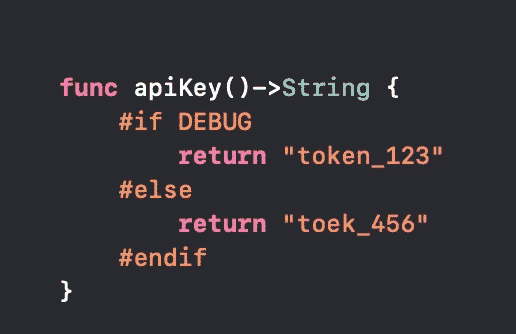
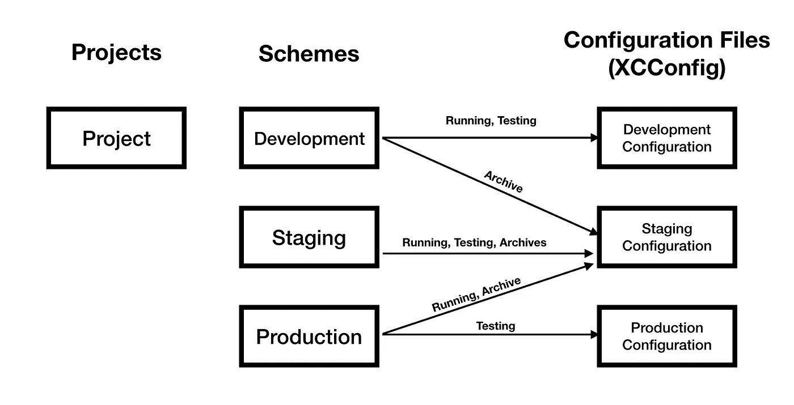
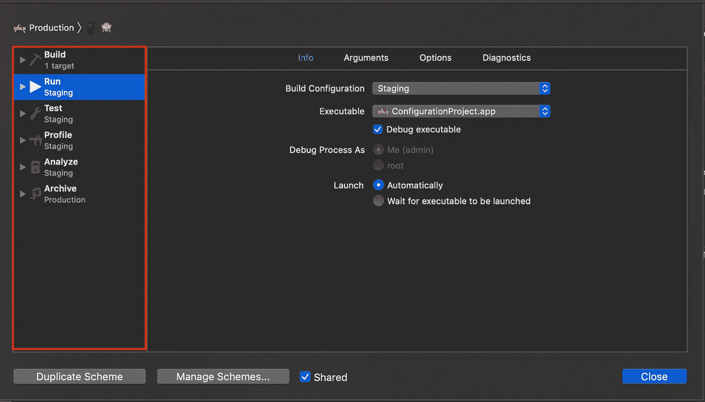
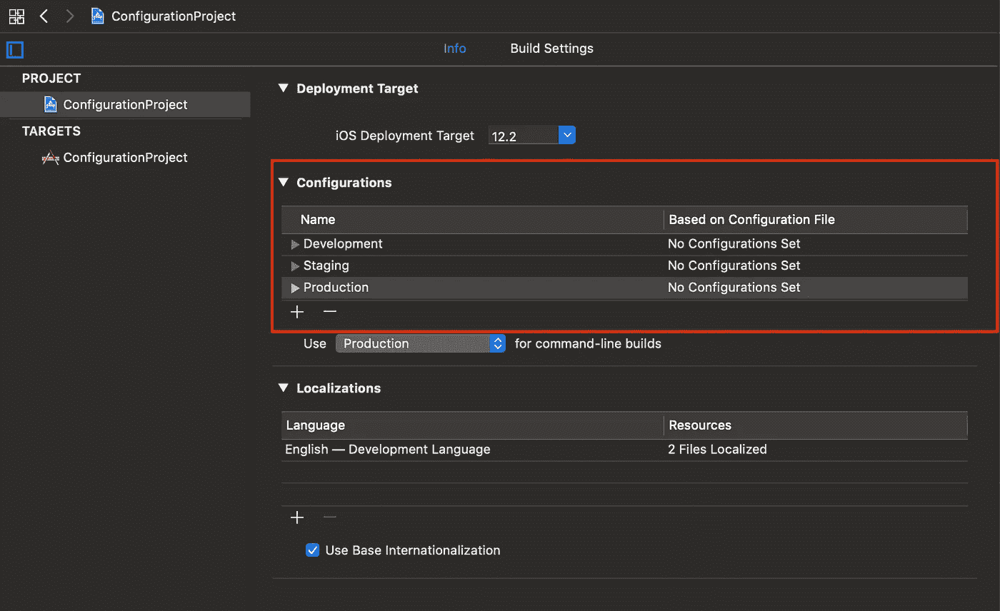
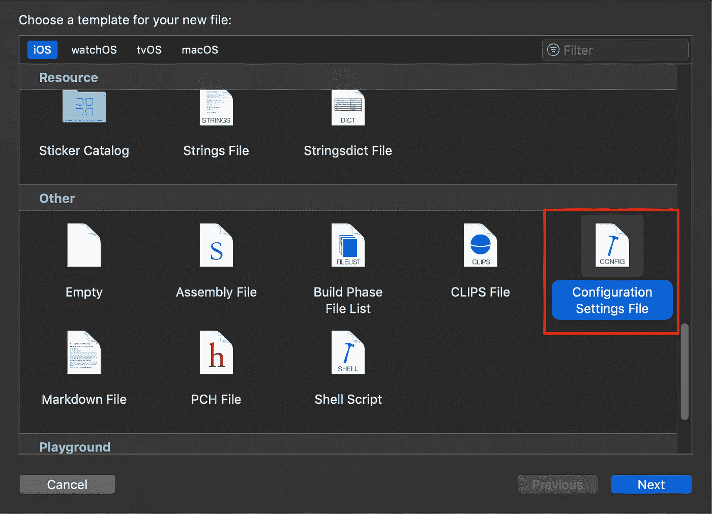
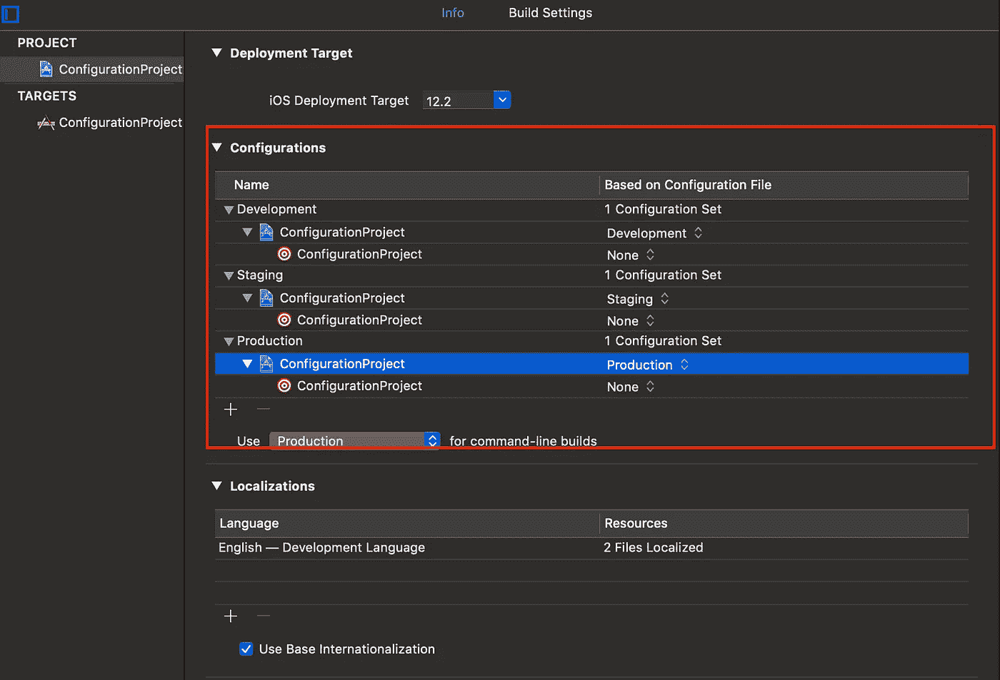
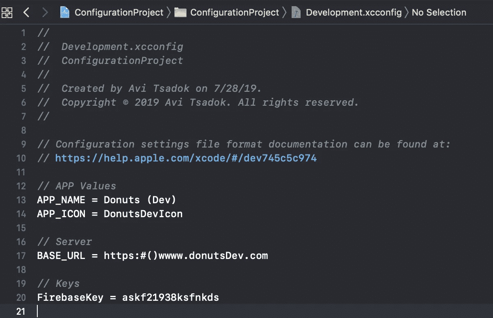
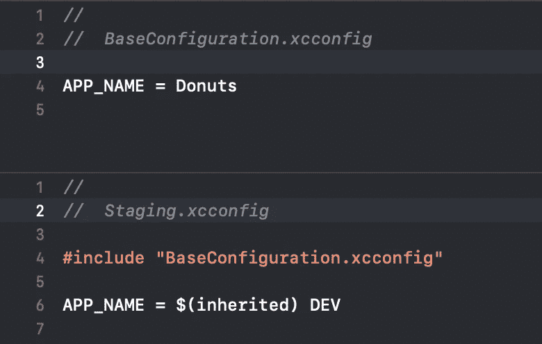
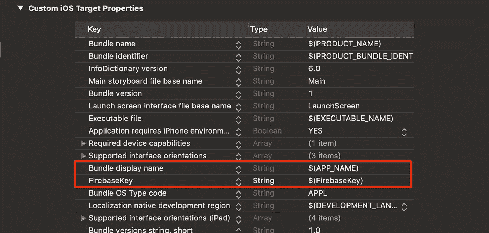

# 使用 Xcode 配置文件

> 原文：<https://betterprogramming.pub/working-with-xcode-configuration-files-398cfbe02b64>

## out with # if DEBUG in and in with xc config

# **老好人** `**#if DEBUG**` **花样**

我们都知道这种模式:

实际上，这很简单，效果也很好。但是它确实有缺陷——它不安全，因为它在你的存储库中包含了密码和密钥等秘密数据。当你需要区分不同的环境时，这就有点混乱了。此外，它不支持其他类型的值，如应用程序名称或图标。

幸运的是，我们有一个称为 XCConfig 的文件类型形式的优雅解决方案。

# **xc config 是什么？**

尽管名不副实，XCConfig (Xcode 配置文件)只是一个包含键和值对的文本文件。当将配置文件附加到生成配置时，它可以重写或修改生成中的某些变量，甚至可以添加新的变量。因此，这为在不同环境中配置应用程序提供了灵活性。

# **方案和配置**

在我们深入 XCConfig 之前，让我们澄清一下什么是方案和配置，以及它们如何与配置文件相关联。

默认情况下，为项目的每个目标创建方案，其中目标可以是可执行的，也可以是框架。

对于每个方案，您可以定义运行、存档或测试的配置。

## 那么什么是配置呢？

配置是附加到方案和操作的一组值。例如，您可以为不同的端点服务器定义不同的配置，并配置您的应用程序，使您的生产方案将您的项目归档到生产服务器，但测试将与开发服务器一起工作(这当然只是一个示例)。

# **创建 XCConfig 文件并将其附加到配置中**

在添加配置文件之前，我们需要为您的项目正确定义配置。通常，最佳实践是为开发过程中的每个阶段创建一个配置。例如->开发、试运行、测试和生产。

要创建一个新的配置，转到您的项目(不是您的主目标),在`Info`选项卡中，您会看到`Configurations`部分。默认情况下，您有`Debug`和`Release`配置，但是您可以编辑/删除/重命名它并创建您自己的配置。

现在您需要添加 XCConfig 文件。添加新的配置文件非常容易。只需添加一个新文件，然后选择`Configuration Settings File`。

回到`Configurations`部分——现在您可以为您定义的每个配置，甚至每个目标附加一个配置文件。

*注意:如果您使用 Cocoapods，您必须删除您的工作区和您的 Podfile.lock 文件，并再次运行 Poddfile install。*

# **向 XCConfig 文件添加值**

正如我之前提到的，使用 XCConfig 文件非常容易。XCConfig 文件只是一个包含键值行的文件。

关于它的几点说明:

*   Xcode 将“//”视为注释，即使它是 URL 的一部分，因此请考虑这一点。您可以通过用另一个符号代替“//”来解决这个问题，然后在代码中替换它。
*   配置文件中的每个值后来都被转换成一个字符串，所以不需要用引号括起来。

# **继承**

有时你想让不同的文件有一个缺省值，从一个基本文件(就像类一样)继承它们是一个解决方案。

好吧，你可以用#include 到其他 XCConfig 文件中。

例如，您可以为您的应用程序定义一个名称，除非另行定义，否则该名称将在您的所有配置中使用。

# **从代码**中访问数值

但是我们如何使用我们在配置文件中设置的值呢？最好的方法是设置`info.plist`中的值。从那里到代码的路径非常短。

变量格式为`$(<Variable name>)`。

如果您想从代码中读取它，

# **提高安全性的机会**

再看看你的`info.plist`。看看你的代码。你有没有看到什么秘密的钥匙在四处飘荡？

这是因为这些值位于一个专用文件中，您可以将其放在一个不同的、私有的、更安全的存储库中。

使用构建配置不仅方便，而且有机会使您的代码更加安全。

# **总结**

不再需要手动更改环境值，不再需要#if 调试，也不再需要在代码中传递密钥。XCConfig 是解决任何配置问题的一种非常容易和简单的方法。