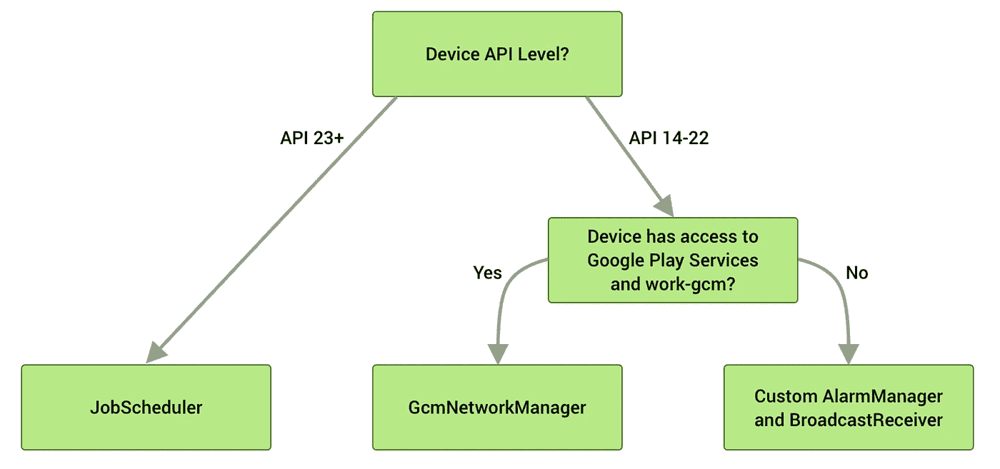
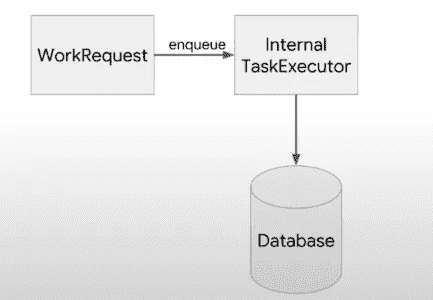
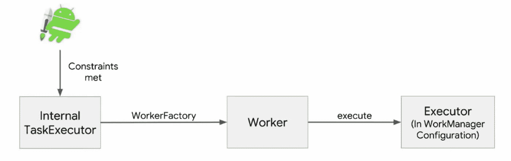
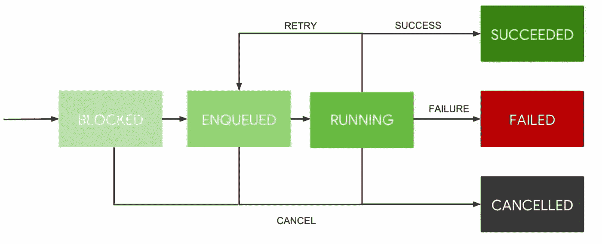

# 了解 Android 中的工作管理器

> 原文：<https://betterprogramming.pub/workmanager-a-onestop-solution-for-background-tasks-e597068617b0>

## 看看 Jetpack 为所有延期任务提供的一站式解决方案


帕特里克·托马索在 [Unsplash](https://unsplash.com?utm_source=medium&utm_medium=referral) 上的照片

# 介绍

作为应用程序开发的一部分，我们做后台任务，比如将本地数据库与服务器同步，从 API 预取一些数据，等等。

当我们说后台工作时，这意味着应用程序不是实时的，我们试图通过消耗 RAM、电池、电源等系统资源来做一些事情。在棉花糖发布之前，我们习惯于使用服务或意向服务来做这些事情。在牛轧糖之后，瞌睡诞生了。

Doze 模式基本上是一种在设备长时间处于空闲状态时，通过推迟 app 后台 CPU 和网络活动来延长电池寿命的状态。这里我们有一个维护窗口，在此期间应用程序可以完成未完成的工作。

随后，在奥利奥，后台服务运行被删除。为了限制后台服务，前台服务的概念应运而生。许多应用程序都在关注它。

多年来，我们一直使用服务、意向服务、作业调度器等来运行我们的后台任务。所以在经历了所有的困难时期之后，Android 团队想出了一个做后台工作的一站式解决方案。它只不过是工作管理器。

在这篇文章中，让我们看看工作管理器的基本知识，比如它是什么，我们如何使用它，它是如何工作的，我们如何跟踪我们工作的状态。

# 什么是工作管理器？

WorkManager 是 Android Jetpack 库的一部分，是一个架构组件，主要用于执行长期运行的后台任务。主要根据执行时间，后台任务可以分为三个阶段

*   马上
*   在准确的时间点
*   在未来的任何时间点(延迟任务)

我们可以使用前台服务或线程来执行即时请求，使用 AlarmManager 来执行特定的时间点任务。

WorkManager 可以在大多数情况下使用，如即时和延迟任务，因为它可以处理任务，并确保即使应用程序突然进入后台执行操作或设备重新启动，执行也能完成。

> 对于长时间运行的延迟任务，WorkManger 是推荐的解决方案，可以确保执行。

我们可以将 WorkManager 定义为管理可推迟后台任务的库。延迟任务是指不需要用户交互就可以在未来任何时间点运行的任务。

在引擎盖下，它使用了我们以前可能使用过的组件，但它以一种有效的方式实现了这些组件，如电池和功耗等。



来源:[安卓开发](https://developer.android.com/topic/libraries/architecture/workmanager?gclid=Cj0KCQjw9O6HBhCrARIsADx5qCQzJRPJaYl0XzFTSrVQPGfzblD0nhvYnS2Y9qxBIfiyZ9ar68QToecaAsiSEALw_wcB&gclsrc=aw.ds)

# 为什么我们需要工作管理器？

WorkManager 提供了处理后台任务的更好方法。

*   支持 API 14 之前提供向后兼容性的大多数版本
*   在有/没有 Google play 服务的设备上运行。
*   无需担心线程问题，因为 WorkManager 将确保在后台线程上执行。
*   容易安排，取消，重试和查询工作。它给了我们完全的控制权。
*   支持顺序和并行执行。在执行时，后面任务的输入可以是前面任务的输出。
*   保证任务执行。

下面就让我们来看看其中大部分的深入分析。

# 工作管理器基础

与工作经理打交道，我们需要了解一些事情。在大多数情况下，它类似于作业调度程序。

## **约束条件**

我们可能有一些预定义的条件，系统在开始工作之前应该满足这些条件，这些被称为约束。例如，如果与网络相关，任务可能需要网络连接，或者通过检查它是否在低电池电量的情况下运行繁重的任务，可以提高电池效率，等等。

基于需求，它可以是单个或多个约束。

## **工人**

使用`Worker`类定义需要执行的任务或工作。这是一个抽象类，所以我们需要对它进行子类化，并覆盖方法`doWork()` 来实现我们的实际工作。`Worker`类负责在`WorkManager`提供的后台线程上同步执行工作。让我们创建一个简单的工人类

来自工作线程的结果指定任务执行成功还是失败，需要重试。

*   `Result.success()`:返回一个 Result 实例，可以用来表示工作成功完成
*   `Result.failure()`:返回一个 Result 实例，可用于指示工作已完成，但出现永久性故障
*   `Result.retry()`:返回一个 Result 实例，该实例可用于指示工作遇到暂时失败，应该使用退避策略重试

## **工作请求**

它定义了工作应该如何以及何时执行。每个工作必须有一个工作请求来安排。我们有两种请求

*   `OneTimeWorkRequest` **:** 基本用于任务的一次性执行。对于非重复任务

*   `PeriodicWorkRequest` **:** 需要重复执行的任务。对于重复任务

## **工作经理**

一旦定义了工作请求，我们就可以使用工作管理器对其进行调度。我们调用`enqueue()` 来调度一个请求

```
WorkManager.getInstance(this).enqueue(uploadWorker)
```

## **工作状态**

一旦工作进入队列，我们唯一需要知道的就是工作的状态和输出。对于所有调度的工作请求，WorkManager 维护一个 LiveData，我们可以通过使用标签或 request-id 来获取它。标签是我们在用 WorkManger 将请求入队时提供的字符串

## **取消**

如果我们想要取消任何预定的工作，WorkManger 为我们提供了灵活性，可以通过使用工作请求的 id 或标记来实现。

## 延误的工作

我们可以使用`setInitialDelay()`延迟最初的工作执行:

## 重试和回退策略

当工人返回`Result.retry()`时，`WorkManger`将根据补偿标准重新安排工作。退避标准由两个属性定义

*   `BackoffDelay` 指定重试工作前等待的最小量。默认为 10 秒
*   `BackoffPolicy`定义随后重试尝试的补偿延迟应如何增加。工作管理器支持两种回退策略，`[LINEAR](https://developer.android.com/reference/androidx/work/BackoffPolicy#LINEAR)`和`[EXPONENTIAL](https://developer.android.com/reference/androidx/work/BackoffPolicy#EXPONENTIAL)`。默认情况下，退避策略是指数型的，但可以设置为线性。

## **链接**

我们可以通过 WorkManager 轻松地链接多个请求。假设我们有三个请求要在开始时并行执行，一旦前三个请求成功完成，就应该执行下一个请求，然后我们可以使用`begin`和`then`如下指定它们

> 注意:begin 和 then 方法采用`OneTimeWorkRequests` 和如果链中的任何工作失败或被取消，它的所有依赖工作都会继承该状态，并且永远不会运行。

现在让我们看看工作管理器是如何执行任务的

# 用 WorkManager 怎么保证工作？

当我们用 WorkManager 将一个工作排队时，一个内部 TaskExecutor 将我们的`WorkRequest`信息保存到 work manager 数据库中。



来源:[安卓开发峰会](https://www.youtube.com/watch?v=83a4rYXsDs0)

保存请求后，只要满足约束，内部 TaskExecutor 就使用`WorkerFactory`创建一个`Worker`。我们可以定制工人工厂。一旦创建了工作线程，它就会在一个执行器中执行



来源:[安卓开发者峰会](https://www.youtube.com/watch?v=83a4rYXsDs0)

我们甚至可以定制这个工作执行过程，我们将在接下来的帖子中看到。这样，我们的请求就能保证被执行。

# 一次性请求的生命周期



来源:[安卓开发者峰会](https://www.youtube.com/watch?v=83a4rYXsDs0)

正如我们所看到的，初始状态要么被阻塞，要么大部分被排队，这取决于工作管理器的状态。一旦开始执行工作线程，它就进入运行状态。从运行状态来看，它通常要么成功，要么失败。但是在某些情况下，我们可能希望根据需求重试或取消正在进行的请求。

## 周期性请求的生命周期


来源:[安卓开发者峰会](https://www.youtube.com/watch?v=83a4rYXsDs0)

在大多数情况下，它类似于一次性请求，但唯一的变化是，即使请求成功执行，它也会根据我们提供的间隔再次排队。

# 摘要

由于增加了后台限制，WorkManger 把我们从延迟的任务处理中解脱出来，保证了任务的执行。这可能看起来很复杂，但一旦开始，我们可以很容易地投入重复的工作。它为处理这些任务提供了一个简单的回调。

在接下来的文章中，我们将通过一个例子来看看 WorkManger 的实际应用。感谢阅读。

# 资源

*   [使用工作管理器](https://www.youtube.com/watch?v=83a4rYXsDs0)
*   [使用工作管理器安排任务](https://developer.android.com/topic/libraries/architecture/workmanager?gclid=Cj0KCQjw9O6HBhCrARIsADx5qCQzJRPJaYl0XzFTSrVQPGfzblD0nhvYnS2Y9qxBIfiyZ9ar68QToecaAsiSEALw_wcB&gclsrc=aw.ds)

# 更多 Android 文章

*   [Android 中一个视图的生命周期](https://proandroiddev.com/the-life-cycle-of-a-view-in-android-6a2c4665b95e)
*   [如何在您的 Android 应用中实现应用内购买](/how-to-implement-in-app-purchases-in-your-android-app-7cc1f80148a4)