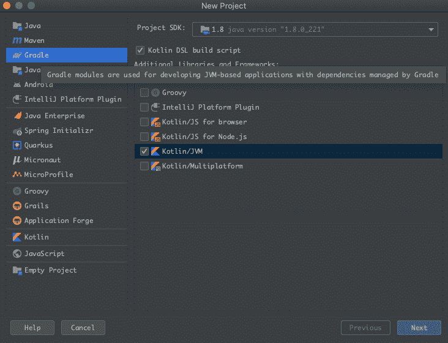
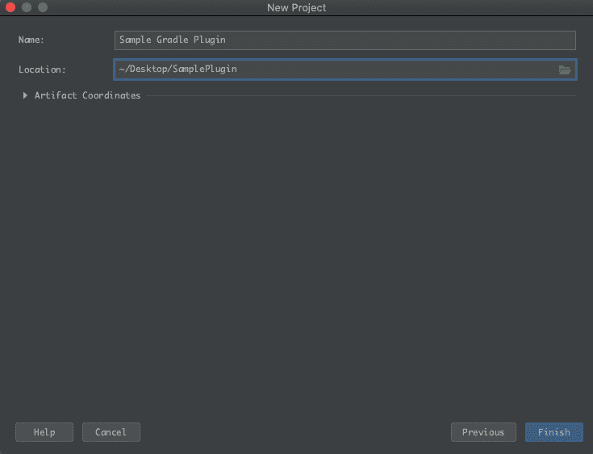
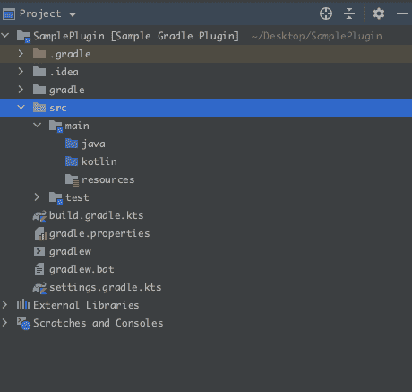
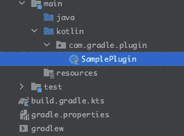
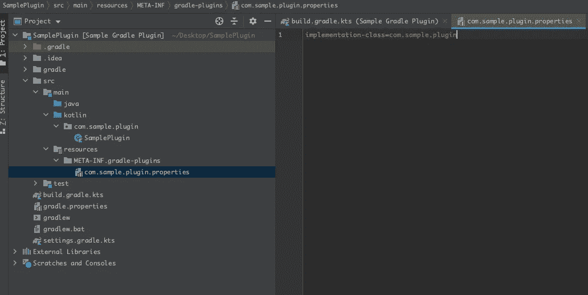
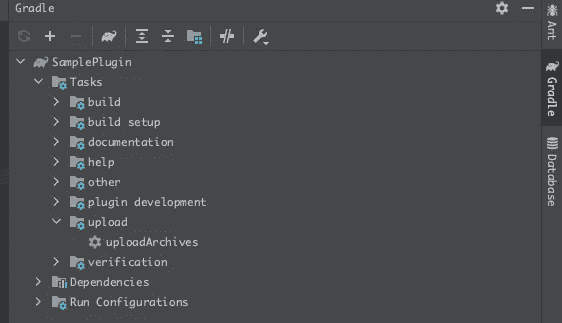
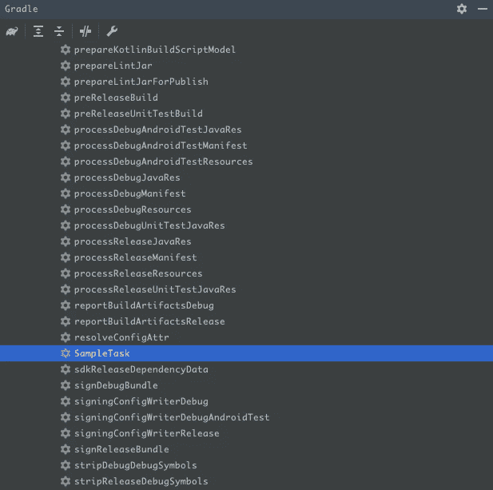
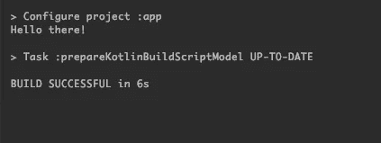

# 为你的 Android 应用编写一个定制的 Gradle 插件(第 1 部分)

> 原文：<https://betterprogramming.pub/write-a-custom-gradle-plugin-part-1-22b37c3b7326>

## 使用定制的 Gradle 插件增强您的应用


图片来源:[https://wallpaperaccess.com/](https://wallpaperaccess.com/)

一个 Gradle 插件可以非常强大，做很多事情。它可以执行自定义任务，保持应用程序的 Gradle 文件干净，还有很多更多。这个博客系列涵盖了如何用 Kotlin 编写一个简单的定制 Gradle 插件和单元测试。

# 先决条件

要开发一个定制的 Gradle 插件，你需要有 Java/Kotlin、Gradle 和 Android 应用程序开发的经验。

在这篇文章中，我将解释如何创建一个带有简单输出的 Gradle 插件。我将在本系列的后面添加更多的细节。

## 设置

以下是创建 Gradle 插件的步骤:

*   从这个[链接](https://www.jetbrains.com/idea/download/)下载并安装 IntelliJ IDE。
*   打开 IDE，从左侧面板点击 Gradle，选择 Kotlin/JVM 选项，如下所述。此外，如果您希望您的`build.gradle`文件在 Kotlin 中，请选择 **Kotlin DSL** 构建脚本。



创建一个 Gradle 项目

输入 Gradle 插件名称并指定项目目录，然后单击 Finish。



输入插件名称和位置

一旦 Gradle 下载完成，项目准备就绪，目录将如下所示:



项目目录结构

现在将依赖项添加到项目中。更新`build.gradle.kts`如下图:

## 现在我们已经准备好了设置。让我们开始写一些代码:



为插件创建一个包目录

让我们为插件创建一个包。这里我们用 Kotlin 写插件。所以我们将把这个包添加到 Kotlin 目录中。

创建一个扩展`Plugin<Project>`的类。这是插件的入口点。当我们从应用程序运行此插件时，将会打印以下消息:

在上面的代码中，我创建了一个名为`SampleTask`的任务，它将打印`Hello there!`

# 打包插件

有三种打包插件的方法。

*   构建脚本
*   `buildSrc` 项目
*   独立项目

在这个例子中，我们将为这个插件创建一个独立的项目。要了解更多其他方式，请参考下面的[链接](https://docs.gradle.org/current/userguide/custom_plugins.html#sec:packaging_a_plugin)。

# 连接插件

要运行这个插件，我们需要提供服务定位器，Gradle 将通过这个定位器找到它的 ID。

注意，这将与`build.gradle.kts` 同名。为此，在`build.gradle.kts`中添加以下代码行:



为 Gradle 插件添加服务定位器

这里我们将插件作为一个独立的项目使用。要将这个插件添加到项目中，我们必须将其导出为 jar。为此，我们将使用本地目录路径导出插件。为此，在`build.gradle.kts`中包含以下代码:

最终的`build.gradle.kts`会是这样的:

# 将插件导出为 Jar

要从插件源代码创建 jar，单击面板右侧，双击 uploadArchives。它将在给定的目录路径下导出插件。( *local_jar_path*



导出插件

# 将插件集成到应用程序中

将插件添加到根级(项目级)`build.gradle`。

将插件依赖关系添加到模块级(应用级)`build.gradle`:

# 我们完成了。让我们测试一下插件

一旦我们将插件集成到应用程序中，我们将能够在应用程序的 Gradle task 选项卡下看到任务:



应用程序中的自定义梯度任务

要运行该任务，我们只需双击该任务或使用 Gradle 命令:

```
./gradlew SampleTask
```

## **输出**



任务的输出。

在下一部分，我将更深入地讨论 Gradle 任务，以及如何为插件添加配置。

## 参考

 [## 开发定制的 Gradle 插件

### 除了作为独立项目编写的插件之外，Gradle 还允许你提供用任何一种语言编写的构建逻辑…

docs.gradle.org](https://docs.gradle.org/current/userguide/custom_plugins.html)