# 写一个基于数据的库来总结这里的东西

> 原文：<https://betterprogramming.pub/write-a-data-based-library-to-summarize-whats-around-here-9e8ad83fe198>

## 我如何用谷歌地图附近的 API 改善我的旅行冒险


新加坡老山街警察局。胡安·德迪奥斯·桑托斯摄

在我的旅行冒险中，我偶尔会停下来，看着地平线，发现自己在问:“这个地区是什么样的地方？”当然，你可以四处看看，可能会发现这里有一家餐馆，那里有一家咖啡馆，还有一家看起来每晚花费 500 多美元的酒店。但是这里到底有什么？我想知道！这个问题的后续是经典的“这个地区的平均价格范围是多少？”(一个背包客的最爱)。

我想在这里说明的一点是，我有问题，需要答案的问题，以及以数据形式出现的答案。你可能知道，谷歌地图就是提供这些答案的工具。但是我想在每次好奇虫咬我的时候打开地图应用吗？没有。我要不要在脑子里总结所有的数据来推断这里是什么样的地方？也没有。那么这里有什么选择呢？好吧，让我们做一个图书馆。

我照做了。我构建的库是一个包装器，包装了 Google Maps Nearby Places API，它检索特定区域内的位置并总结它们的某些属性。这个图书馆的名字是[地名汇总](https://github.com/juandes/places-summarized)，在这篇文章中，我想介绍它，并展示我在过去几个月里去过的一些地方的汇总。跟我来。


东京台场的日落。胡安·德·迪奥斯·桑多斯(【https://www.instagram.com/juandesr/】T4)的照片

# 谷歌地图应用编程接口附近的地方

在进入精彩部分之前，我想先介绍一下背景知识，说几句关于 Google Maps Places Nearby API 的话，这是 Places 总结背后的工具。附近的地方是 Google Maps API 的一个特性，它可以搜索一组给定坐标附近的地方。例如，假设你想知道你的家乡周围有什么(你可能已经记住了，但是，嘿，我说的是假设！).为此，你可以使用谷歌地图(但这有什么意思呢？)或获取 API 密钥，并使用您所在城镇的坐标和所需半径请求他们的服务。

对附近 API 的调用返回一个 JSON 字符串，其中包含给定坐标附近的位置及其属性。这些属性中的一些是`places_level`(地点价格水平)和`rating`。默认情况下，Google 根据重要性对位置附近的地方进行排名，因此实际上并不是所有的地方都被返回。如果您希望缩小结果范围，并按距离对网站进行排序，那么您必须使用一些可选参数，如`rankBy`(指定排名模式)和`type`(描述位置类型，如餐馆或购物中心)。

此外，这项服务并不完全免费。然而，谷歌地图每月提供 200 美元的信贷，对于这样的项目来说绰绰有余。

# 汇总的位置

汇总地点的目标是汇总附近地点返回的属性。这个库有一个`Client`对象和一个名为`places_summary`的方法，该方法将位置和半径作为参数，并返回一个包含汇总值的`Summary`。

在库的第一个版本中，摘要包括以下内容:

*   位置的数量
*   位置评级列表
*   一个地点拥有的评级数量列表
*   地点的价格水平列表。该值代表该位置的价格水平，范围为 1 到 4。
*   包含每个位置类型的计数的字典
*   所有地点的平均评分
*   所有地点的平均收视率
*   平均价格水平

除此之外，`Summary`有两种方法:

*   `ratings_by_type`:返回给定类型位置的等级
*   `average_rating_by_type`:计算给定类型位置的平均等级

默认情况下，Places Nearby call 最多返回 20 个位置，这有点令人失望。然而，返回的对象包含一个`pagetoken`值，一个可以用作`places_summary`的参数的字符串，通常放在附近。在这种情况下，它从先前的搜索中返回以下最多 20 个结果。`Summary`对象将这个`pagetoken`作为属性保存。我这样设计是因为`Client`有一个名为`get_more_results`的方法，它接受一个`Summary`并使用那个`pagetoken`来检索下一个位置。

下面是一个例子:

为了测试这个库，我创建了一个类似于`Client`的`FakeClient`类，但是除了它没有任何参数并且实际上不进行 API 调用。相反，它从作为库的一部分的本地文件中读取，这是来自我保存为 JSON 文件的 API 的响应；地点是悉尼谷歌办公室周围的区域。下面，你会发现一个`FakeClient`和回应的例子。

但是闲聊够了，让我们看看一些结果。


巴厘岛 Pigstone 海滩。胡安·德·迪奥斯·桑多斯([https://www.instagram.com/juandesr/](https://www.instagram.com/juandesr/))的照片

# 用例:总结我去过的一些地方

为了测试这个库(这也是我创建它的原因)，我编写了一个小脚本，使用这个库来总结和可视化我在旅行中访问过的一些地方的结果。具体来说，我正在绘制`rating`、`user_ratings_total`和`price_level`的直方图，以及显示位置类型百分比的条形图。

有问题的地方是新加坡的中心(1.2871404，103.844437)；藏谷，来自印尼巴厘岛的地区(-8.6465434，115.1367221)；东京新宿(35.6955425，139.7009607)；以及马来西亚吉隆坡的中国城(3.1453656，101.6986553)。

对于这些地方中的每一个，我使用 1000m 的半径和四次`get_more_results`。下面你会发现所有的图表。但首先，让我们看看代码的第一部分。

该脚本将 API 键、位置、半径和一个参数`get`(可怕的名称，我应该更改它)作为参数，该参数指定您想要调用`get_more_results`的次数。脚本做的第一件事是解析参数。然后，我们使用密钥声明客户机，并调用`client.places_summary`来获取摘要。接下来，我们迭代`get`次以获得更多结果。

注意，在这个循环中，我使用了一个 sleep 语句来暂停脚本五秒钟，因为否则，对 API 的调用就会失败；我相信这与我的客户/支付层有关，或者是一些奇怪的事情(如果有人知道，请告诉我)。

让我们看一下图表，从评分开始(图片的标题指定了位置)。

## 等级

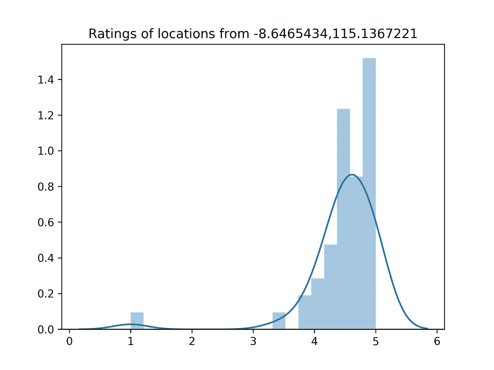

苍谷附近地区的收视率

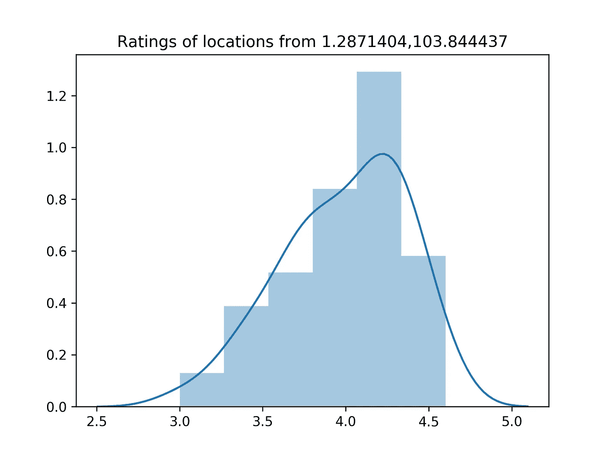

新加坡核心附近地区的评级

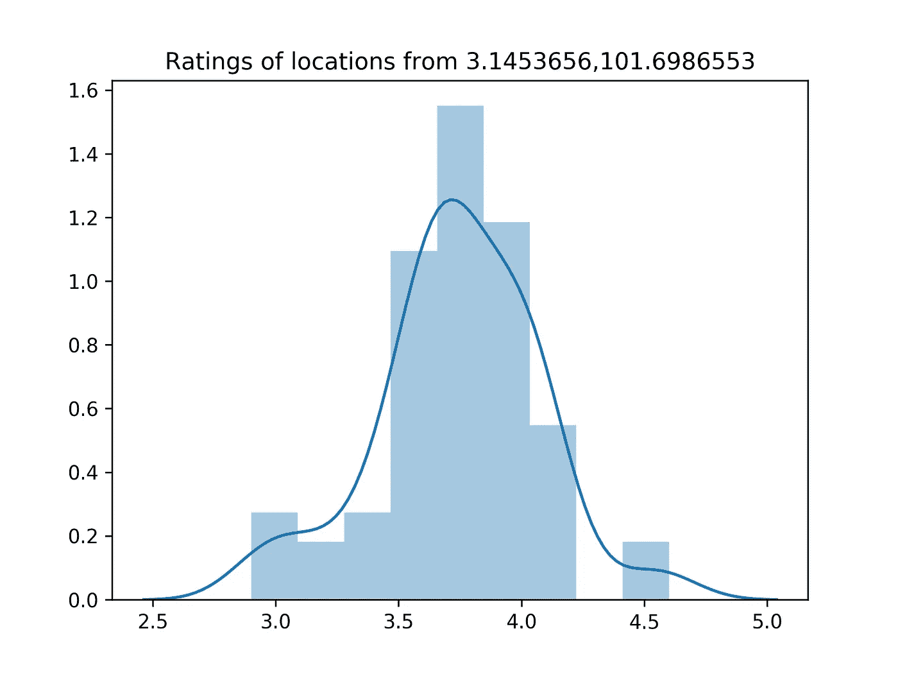

吉隆坡唐人街附近地区的收视率

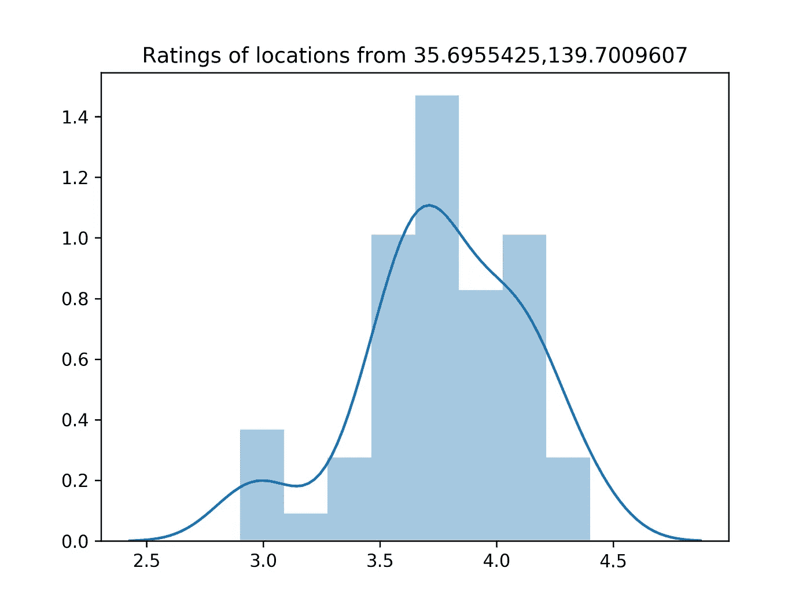

东京新宿附近地区的收视率

在所有这些地点中，平均评分最高的是仓谷。虽然这看起来很酷，但我并不感到惊讶，因为仓谷本质上是一个充满海滩、酒吧、餐馆、海滩和更多餐馆的旅游区。而且我也不知道很多给海滩差评的人(有就发截图给我)。

说到评分，我还想调查一个位置有多少评论。在下一节中，您将找到这些值。

## 每个地点的评论总数

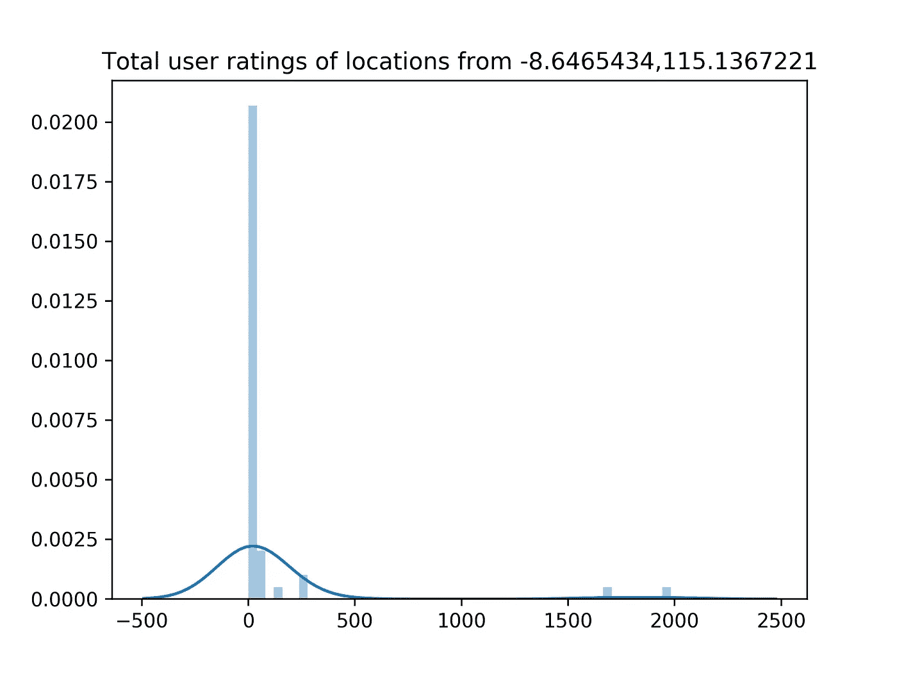

苍谷附近地方的总用户评分

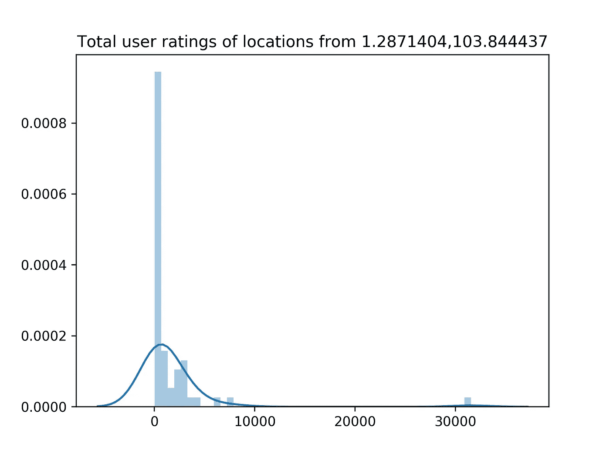

新加坡核心地区附近的总用户评分


吉隆坡中国城附近的用户总评分

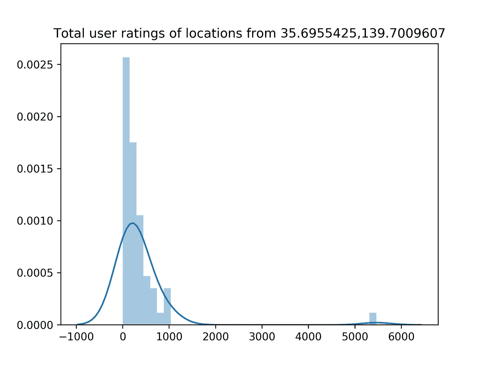

东京新宿附近地区的总用户评分

根据直方图及其在 x 轴早期的峰值，四个不同的位置有许多地方具有低数量的评论。在新加坡，图表在 2000 点左右下降，然后在下降前略有上升。然后，在最后，有一个地方有惊人的 30，000 条评论:那个地区是克拉克码头。总的来说，平均值为 1，630.62，但我们需要考虑到 30，000 的值会使平均值向该数字移动。对于未来，我应该用中间值来代替它。

关于其他地点，新宿的平均价格是 371.32，吉隆坡 538.810，仓谷 100.92。

但是这到底告诉我们什么呢？嗯，它当然说新加坡的人民和游客喜欢评价他们的地方。

为了创建直方图，我使用了以下代码:

```
sns.distplot(r['ratings']).set_title(
    'Ratings of locations from {}'.format(location))
plt.savefig('{}_{}.png'.format(location, 'ratings'),
            dpi=320, orientation='landscape')
plt.clf()
```

## 位置

来回答“这附近有什么样的地方？”我计算了每个地区位置类型的百分比。下面你会发现图表。

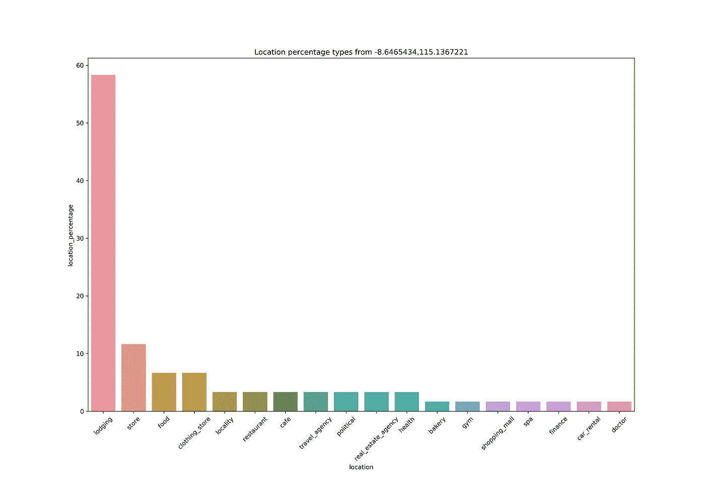

仓谷附近的地点类型

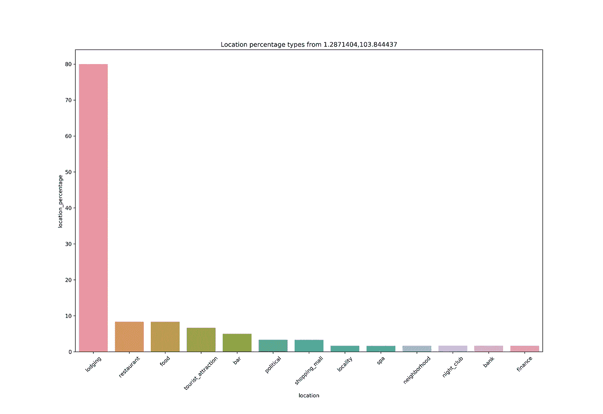

新加坡核心附近的地点类型

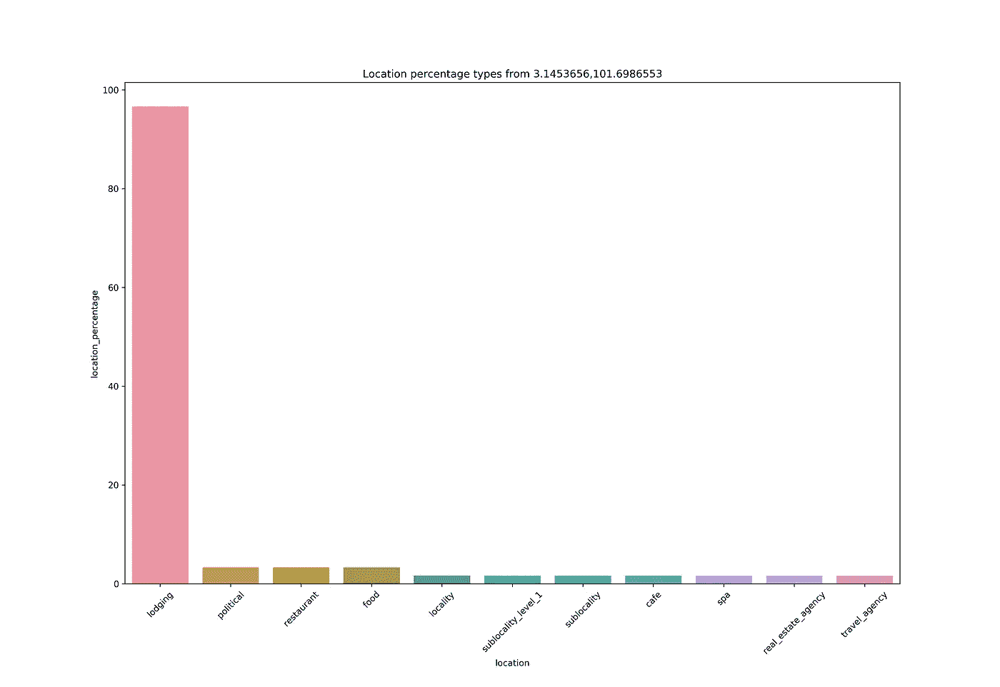

吉隆坡唐人街附近的地点类型

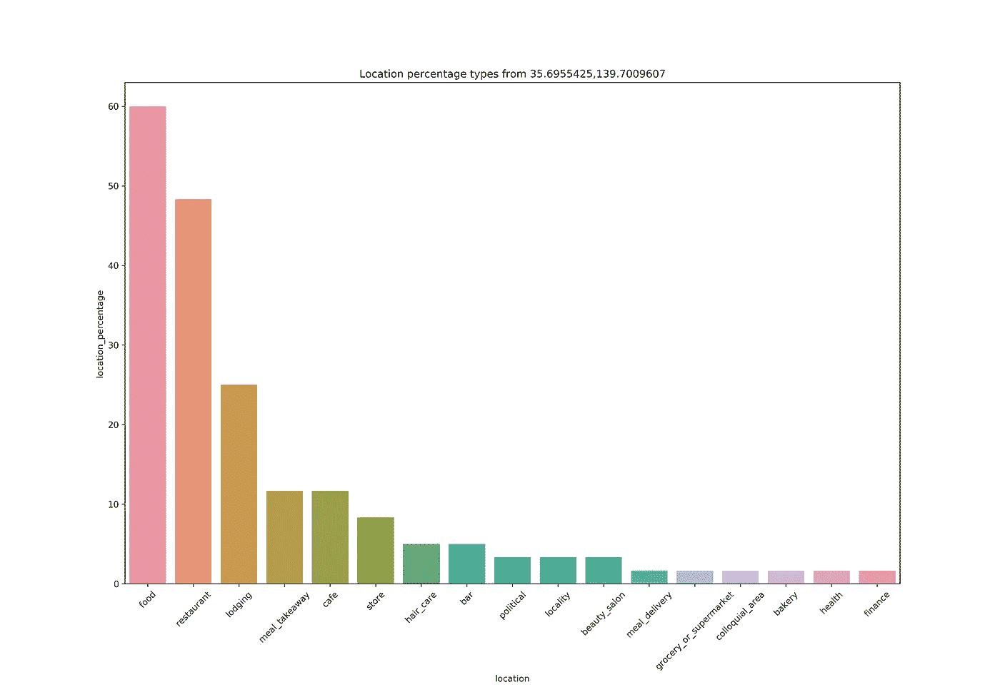

东京新宿附近的地点类型

住宿是这里的大赢家。在四个地点中的三个(除了新宿)，住宿类型*的地点是该地区最丰富的，其次是与食品相关的地点。在仓谷，一些地点包括购物、看医生、泡温泉和租车(你看到有多少辆摩托车了吗？！).从新加坡来看，顶级场所也是类似的，但随后酒吧和夜总会会随着情节起舞，而银行和金融网站也会打招呼。*

最后，有新宿地区，在我看来是四个地区中最独特的。首先，住宿不是最常见的地点——食物才是，大约有 30%的地点。日本食物如此出名和受欢迎是有原因的。

我之前没有提到的是，一个位置可以有多种类型。通常，当所讨论的位置有一个通用类型，如*食物*时，就会出现这种情况。在这种情况下，通用标签会附带一个粒度更细、更精确的标签。例如，在图中，你可以看到几个与食物有某种联系的类别，例如*外卖*、*咖啡馆*、*送餐*、*超市*和*面包店*。但是日本不仅仅是食物。他们也对时尚和发型感兴趣。看一下图表，你会发现*美容院*和*护发*。

下面是用于生成该图的代码。注意，首先我将`r[‘location_types’]`(字典)转换成熊猫数据帧。


吉隆坡塔。胡安·德·迪奥斯·桑多斯([https://www.instagram.com/juandesr/](https://www.instagram.com/juandesr/))的照片

## 价格水平

现在是最后一组图表，价格水平。在我的实验中，我发现并不是很多地方都有这样的价格水平。不过，这有点道理。这个属性最常见于*餐馆*类型的位置，这种地方人们会指定一个价格级别。

然而，正如我们刚刚看到的，除了新宿的数据外，餐馆只占不到 10%的位置。因此，价格水平的样本很小。例如，在新加坡的数据中只有三个价格水平，在仓谷有两个，在吉隆坡没有。另一方面，新宿的餐馆越来越多，所以它恢复了 30%的价格。不幸的是，由于缺乏数据，我将只绘制东京的价格水平。将来，我想在`Client`中添加通过`type`过滤的选项，这样我们就可以将它传递给 API 调用来检索特定类型的位置。现在，让我们看看数据。

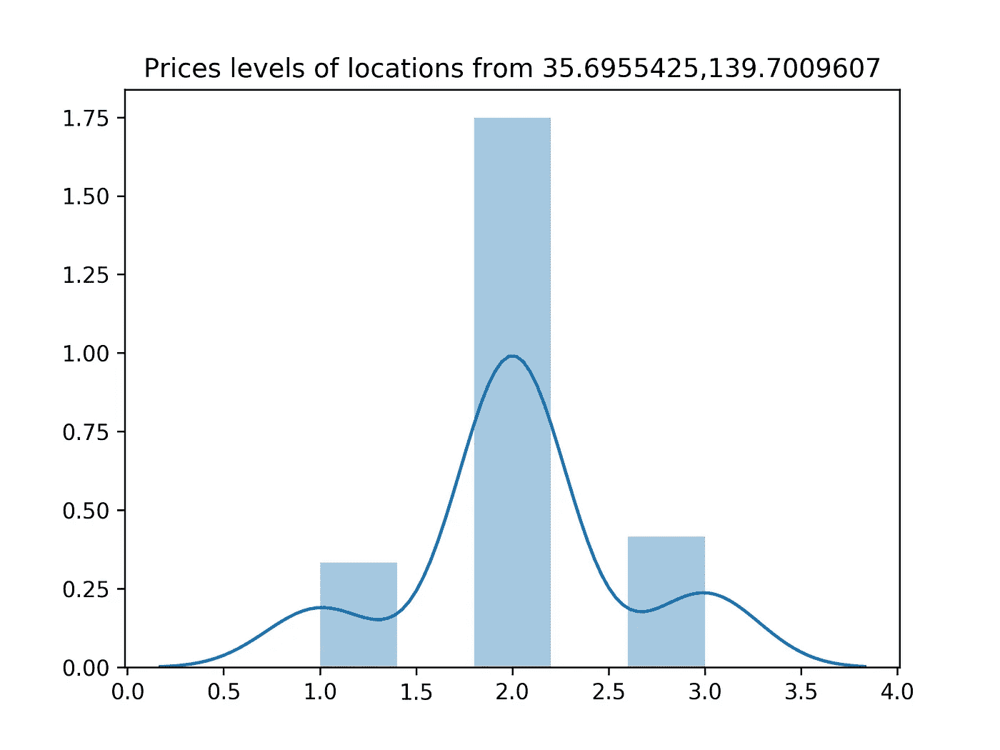

东京新宿地区的物价水平

不言自明，对吗？根据这个图表，这个地区的平均价格范围是“2”这如何准确地转化为实际的钱？这有点复杂，需要额外的数据。但是因为我们知道最高价格水平是“4”，我们可以解释和估计价格应该在 OK 范围内，在像东京这样的地方，价格应该在 10 到 20 美元左右。你同意吗？


东京新宿。胡安·德·迪奥斯·桑多斯([https://www.instagram.com/juandesr/](https://www.instagram.com/juandesr/))的照片

# 概述

有一个很小的机会，至少有一次你问，“这附近有什么样的地方？”我知道我有。为了回答这个问题，我创建了一个名为 Places Summarized 的小 Python 库，它使用 Google Maps Nearby API 来汇总给定位置附近的地点的属性。在本文中，我介绍并总结了这个库。我还展示了一个小的用例，用我在旅行中去过的一些地方作为例子。在这个实验中，我发现，根据评分，仓谷的大多数地方都很不错，如果你需要一个好的发型师，那么新宿就是合适的地方。

图书馆还没有在我想要的地方。首先，文档是薄弱的。然后是我之前提到的我想要添加的特性，例如，按类型过滤的机制。在此基础上，我想实现一个方法，将摘要写入 JSON 文件，另一个方法将其转换为 Pandas 数据帧。让我们看看进展如何。

现在，如果你不介意的话，我要出去找那些便宜的餐馆。再见！

你可以在这里找到图书馆:

[](https://github.com/juandes/places-summarized) [## juandes/places-汇总

### Places Summarized 是围绕 Google Maps 的 Places API 的一个包装器，它总结了附近位置的属性…

github.com](https://github.com/juandes/places-summarized) 

我在本文中使用的完整脚本如下:

[](https://github.com/juandes/wanderdata-scripts/blob/master/places-summarized/main.py) [## juandes/wander data-脚本

### 地方总结脚本

github.com](https://github.com/juandes/wanderdata-scripts/blob/master/places-summarized/main.py) 

感谢阅读！