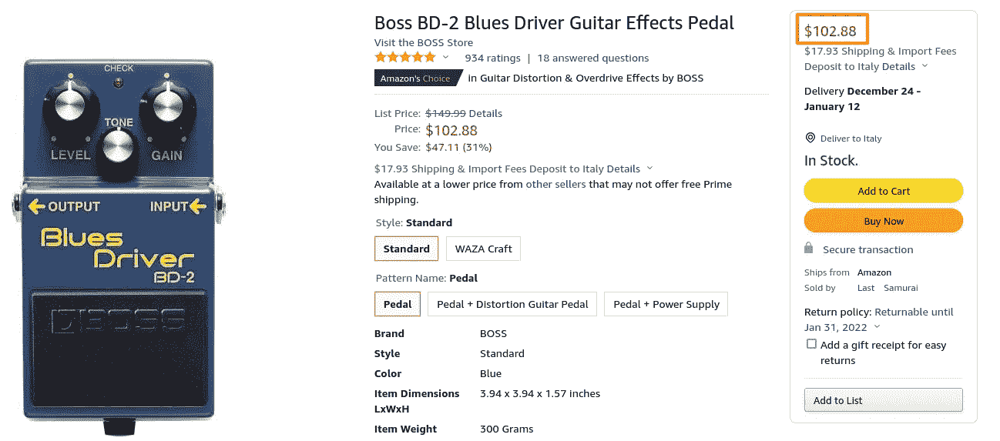

# 用 Node.js、Scrape-it 和 SQLite 编写一个简单的亚马逊价格刮刀

> 原文：<https://betterprogramming.pub/write-a-simple-amazon-price-scraper-with-node-scrape-it-and-sqlite-64e6a7667c91>

## 建立一个有效的网页刮刀


学分:pexels.com

假设你正在管理一家商店，或者你只是在监控亚马逊的商品列表，这样你就可以在每次价格变化时得到通知，这个快速教程正是为你准备的。

如今，用一堆代码编写一个简单而有效的 scraper 是极其容易的，我们来证明这一点。

开始吧！

# 快速启动

我们将使用 NodeJS 和 scrape-it 来编写一个能够获取 Amazon 价格的简单脚本，并使用 SQLite 来存储商品及其价格。我们使用 SQLite 是因为它简单，而且从根本上说，它只是一个普通的文件，放在磁盘上，不需要任何配置！和..你可以很容易地复制它或将数据导出为 CSV 格式。

开始之前:确保你的系统上安装了 [NodeJS](https://nodejs.dev/learn/how-to-install-nodejs) 和 [Yarn](https://classic.yarnpkg.com/lang/en/docs/install/#debian-stable) (NodeJS 包管理器)。

# 1.准备环境

让我们创建一个包含项目的文件夹，并安装我们的依赖项:

```
yarn init
yarn add scrape-it sqlite3
```

同样，让我们在系统中安装`sqlite3`来准备我们的数据库。对于 Linux / Mac:

```
sudo apt install sqlite3 // Ubuntu
sudo pacman -S sqlite3   // Arch Linux
brew install sqlite      // MacOS
```

如果你用的是 Windows，[遵循这个指南](https://www.configserverfirewall.com/windows-10/install-sqlite3-on-windows-10/)。

# 2.创建我们的数据库

让我们创建一个文件夹来保存数据库本身、它的模式和一个种子来存储一些用于测试的虚拟项目。

```
mkdir db
touch db/schema.sql
touch db/seed.sql
```

我们现在编辑`schema.sql`来定义我们的数据库模式:

```
CREATE TABLE items (
  id INTEGER PRIMARY KEY AUTOINCREMENT,
  name TEXT NOT NULL,
  asin TEXT NOT NULL,
  price INTEGER,
  created_at TIMESTAMP NOT NULL DEFAULT CURRENT_TIMESTAMP
);
```

在我的例子中，为了监控吉他踏板的价格，我想搜索 Amazon，所以我将在数据库中植入一些虚拟商品(您可以使用任何想要的商品):

```
INSERT INTO items (name, asin)
VALUES
('Boss BD-2', 'B0002CZV6E'),
('Ibanez TS-808', 'B000T4SI1K'),
('TC Flashback', 'JB02HXMRST4R')
```

`asin`基本上是亚马逊产品 id，你可以很容易地从一个亚马逊产品 url 获得它:

```
[https://www.amazon.com/TC-Electronic-Flashback-Delay-Effects/dp/**B06Y42MJ4N**](https://www.amazon.com/TC-Electronic-Flashback-Delay-Effects/dp/B06Y42MJ4N)
```

现在，让我们使用`sqlite3`包创建数据库:

```
cd db
sqlite3 database.sqlite < schema.sql
sqlite3 database.sqlite < seed.sql
```

就是这样！我们现在有一些样品产品可以玩:)

# 3.刮刀

现在，在你的项目根目录下创建一个文件`index.js`，启动你最喜欢的文本编辑器，让我们把一些代码放进去！

刮刀将执行以下步骤:

*   从我们的数据库中检索项目列表
*   对于每件商品，抓取相关的亚马逊页面(使用每件商品的 asin)
*   更新数据库中的商品价格

首先，我们声明依赖关系并实例化我们的数据库连接器:

```
const scrapeIt = require('scrape-it')
const sqlite3 = require('sqlite3').verbose()
const db = new sqlite3.Database('./db/database.sqlite')
```

我们不想在短时间内向 Amazon 发送太多的请求(礼貌一点)，所以我们添加一个等待函数，我们将在每次抓取操作后使用它:

```
const wait = (time) => new Promise(resolve => setTimeout(resolve, time))
```

这里我们有我们的刮擦函数:

```
// scrape Amazon by asin (product id)
const scrapeAmazon = (asin) => {
  const url = `[https://amazon.com/dp/${asin}`](https://amazon.com/dp/${asin}`)
  console.log('Scraping URL', url)
  return scrapeIt(url, {
    price: {
      selector: '#price_inside_buybox',
      convert: p => Math.round(parseInt(p.split('$')[1])) * 100
    }
  })
}
```

它只是接受 asin 并执行 scrape-it 功能，从页面中收集我们需要的信息。

具体来说，我们希望刮去出现在亚马逊产品页面右栏(红框)的价格:



要抓取的亚马逊页面示例(我们希望解析右上角的价格)

过程非常简单:

*   在浏览器上转到亚马逊产品页面 URL
*   打开开发工具
*   选择 HTML 价格元素
*   获取识别该元素所需的任何选择器/ id /类

在我们的例子中，id 就足够了(`#price_inside_busybox`)。

请记住，您可能需要检查 Amazon 是否不时更改元素 id。对此有更好的解决方案(比如在页面中寻找美元符号“$ ”),但是现在让我们保持简单。

我们还指定了一个`convert`函数来将价格解析为整数(以避免在数据库中存储浮点数)。

这就是了！此时，scrape-它将完成剩下的工作，输出在一个名为`price`:)的对象下找到的所有元素(在我们的例子中，只有一个)

此外，我们返回一个 scrap-it 承诺，以便我们可以方便地使用 async / await。

为了更新数据库中的价格，我们实现了以下函数:

```
// update pedal price
const updatePrice = (asin, price) => {
  console.log('Updating item:', asin, price)
  db.run(`
      UPDATE items SET price = '${price}'
      WHERE asin = '${asin}'
    `, (err) => {
    if (err) {
      console.log(err)
    }
  })
}
```

非常简单:我们只需使用`asin`来查找我们想要更新的条目，并对数据库执行更新。

最后，这是我们的主函数，它遍历数据库中的所有条目，并调用我们刚刚准备好的函数:

```
const scrape = async () => {
  db.all('SELECT * FROM items', [], async (err, items) => {
    console.log(items)
    for (const item of items) {
      const scraped = await scrapeAmazon(item.asin)
      if (scraped.response.statusCode === 200 && scraped.data.price) {
        updatePrice(item.asin, scraped.data.price)
      } else {
        console.log('Out of stock')
      }
      await wait(2000)
    }
  })
}scrape()
```

现在只需在你的终端上用`node index.js`运行它。

你可以在我的 [GitHub repo](https://github.com/Mikepicker/blog_basic_scraper) 上找到代码。

就是这样！

# 总结

无论您是需要一个简单明了的 web scraper，还是计划构建可扩展至数百万用户的下一代云抓取平台，这本小指南都应该为您可能想要实现的任何目标提供非常基本的构建模块。

实际上，这正是我用来为我的网站[rigfoot.com](http://rigfoot.com)寻找价格的方法

作为一个练习，你可以尝试添加一个新的抓取功能来抓取不同的网站，比如易贝或者托曼！

我真的希望它对你有用，我很乐意听到你对你想看到的特性的评论和建议。

谢谢！