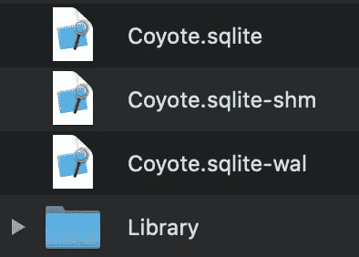

# 禁用预写日志记录(WAL)以强制提交核心数据

> 原文：<https://betterprogramming.pub/write-ahead-logging-wal-disabled-to-force-commits-in-core-data-d1a6bb359c0a>

## 解释核心数据的底层结构


Pawel Czerwinski 在 [Unsplash](http://unsplash.com) 上拍摄的照片

自 iOS 7 和 OS X Mavericks 以来，预写日志记录一直是核心数据 SQLite 存储的默认日志记录模式。核心数据中的日志记录最好解释为将数据事务保存到底层 SQLite 存储中的方式。与以前的默认“回滚”日志模式相比，WAL 模式在大多数情况下都要快得多，这也是核心数据能够并发的根本原因。

在 WAL 模式下，Core Data 保持主 SQLite 存储文件不变，并在 SQLite 存储的同一位置的`-wal`文件中跟踪数据事务。这意味着在某些情况下，SQLite 存储本身中的更改还不可见。因此，您可能希望将这些更改强制提交到 SQLite 存储中。在这篇博文中，我将给出一个例子，并解释如何做到这一点。

# 预写日志记录是如何工作的？

当你打开应用程序的目录找到你的核心数据文件`.sqlite`时，你可能一直想知道这些`.sqlite-wal`和`.sqlite-shm`文件意味着什么。自 iOS 7 和 OS X Mavericks 以来，这两个文件就存在于您的`.sqlite`文件旁边，它们是当前默认的核心数据预写日志记录模式的一部分。



预写日志记录(WAL)会产生多个数据库文件。

核心数据和 SQLite 中的日志模式通过在中间日志文件中写入新事务来防止数据丢失。在引入 WAL 之前，SQLite 使用传统的回滚日志，它通过在日志文件中保存原始未更改数据库内容的副本来工作。新的更改直接写入数据库文件，日志文件用于在崩溃时回滚更改。删除回滚日志时，会进行保存更改的最终提交。

沃尔的工作方式正好相反。原始内容保留在数据库文件中，新的更改添加到 WAL 文件中。提交最终数据更改实际上可以发生在这个 WAL 文件中，这意味着可以保存数据，而原始数据库保持不变。所谓的“检查点”最终会将所有事务从 WAL 文件转移到数据库中。

`.sqlite-shm`文件是作为多个 SQLite 数据库连接之间的共享内存而存在的，它被用作 WAL 文件的索引。

如果你想了解更多，可以阅读关于 WAL 模式的[深度解释](http://www.sqlite.org/draft/wal.html)。

# 打开 SQLite 数据库文件时，核心数据更改不可见

在某些情况下，您可能会发现自己打开一个 SQLite 数据库文件，并意识到某些更改丢失了。这可能是因为您移动了一个 SQLite 文件，而没有匹配的`-wal`和`-shm`文件。大多数数据库阅读器应用程序支持 WAL 模式，并自动显示尚未提交到 SQLite 商店的更改。

## 将更改强制提交到 SQLite 存储区的原因

我敢打赌，您一定想知道为什么要将更改强制提交到 SQLite 存储中。也可能是因为你已经有了一个理由，所以你才写了这篇文章，在这种情况下，我希望[听到更多的](https://twitter.com/twannl)。

WeTransfer 收集的[包含大量数据，使用核心数据作为其存储。随着时间的推移，我们不得不编写多个核心数据迁移，这在极少数情况下会失败，并出现如下错误:](https://collect.bywetransfer.com/)

> “添加日期”是必需的值。\ " UserInfo = { NSValidationErrorObject =<nsmanagedobject:>(entity:image content；id:</nsmanagedobject:>

在大多数情况下，您可以通过编写一个正确的迁移策略来解决这个问题，该策略在迁移过程中设置正确的值。然而，我们发现，在某些情况下，我们喜欢在迁移之前对本地存储进行预处理，以删除那些已知的无效案例，这些案例是过去的错误导致的。

编写预处理器就像使用源数据库创建一个持久容器来执行所需的事务一样简单。然而，根据我们的经验，我们发现这些更改对于核心数据迁移并不总是可见的，需要我们执行强制提交，以确保这些更改应用到 SQLite 数据库文件。

# 如何将更改强制提交到 SQLite 数据库中

强制提交，也称为检查点，意味着将存在于`-wal`文件中的事务合并到存储文件中。通过使用传统的回滚日志模式，我们可以强制核心数据对预写日志数据库执行检查点操作。

为此，我们可以通过将日志模式设置为`DELETE`来添加持久性存储:

```
private func forceWALCheckpointingForStore(at storeURL: URL, model: NSManagedObjectModel) throws {
    do {
        let persistentStoreCoordinator = NSPersistentStoreCoordinator(managedObjectModel: model)

        let options = [NSSQLitePragmasOption: ["journal_mode": "DELETE"]]
        let store = try persistentStoreCoordinator.addPersistentStore(ofType: NSSQLiteStoreType, configurationName: nil, at: storeURL, options: options)
        try persistentStoreCoordinator.remove(store)
    } catch let error {
        throw Error.forcedWALCheckFailed(error: error)
    }
}
```

该方法将源存储 URL 和数据库模型作为输入，足以强制将更改提交到本地数据库文件中。

# **在 NSPersistentContainer 中完全禁用 WAL 模式**

如果您喜欢将更改直接写入 SQLite 文件，您可以通过设置具有回滚日志记录模式的持久性容器，决定将更改直接提交到本地 SQLite 文件:

```
let persistentContainer = NSPersistentContainer(name: "Database_Name", managedObjectModel: model)
let storeDescription = NSPersistentStoreDescription(url: storeURL)
storeDescription.setValue("DELETE" as NSObject, forPragmaNamed: "journal_mode")
persistentContainer.persistentStoreDescriptions = [storeDescription]
```

# 使用 SQLite 调试验证配置的日志模式

虽然这一部分在我的详细的[核心数据调试帖子](https://www.avanderlee.com/debugging/core-data-debugging-xcode/)中有最好的解释，但我想强调一个启动论点。通过使用`-com.apple.CoreData.SQLDebug 4`作为启动时传递的参数，您将获得核心数据中发生的事务的详细信息。

在这些日志中，您会发现有关日志模式的以下信息:

```
CoreData: sql: pragma journal_mode=DELETE
```

# 当删除日志模式导致死锁时该怎么办

如果具有不同日志记录模式的持久性容器当前处于活动状态并且正在使用数据库文件，则会发生死锁。对于为什么会发生这种情况，我没有确切的解释，但这可能是由数据库文件上的一个活动锁引起的。因此，请确保仅在没有到数据库的活动连接时才强制提交。

# 结论

核心数据允许我们使用高级 API 将数据保存在 SQLite 存储中。读完这篇博文后，您有望了解更多关于底层结构的知识，它使用的是预写日志记录模式。强制提交允许您将更改写入 SQLite 文件，以确保本地数据库文件中确实存在更改。如果您想进一步提高您的 Swift 知识，请查看 [Swift 类别页面](https://www.avanderlee.com/category/swift/)。

谢谢！